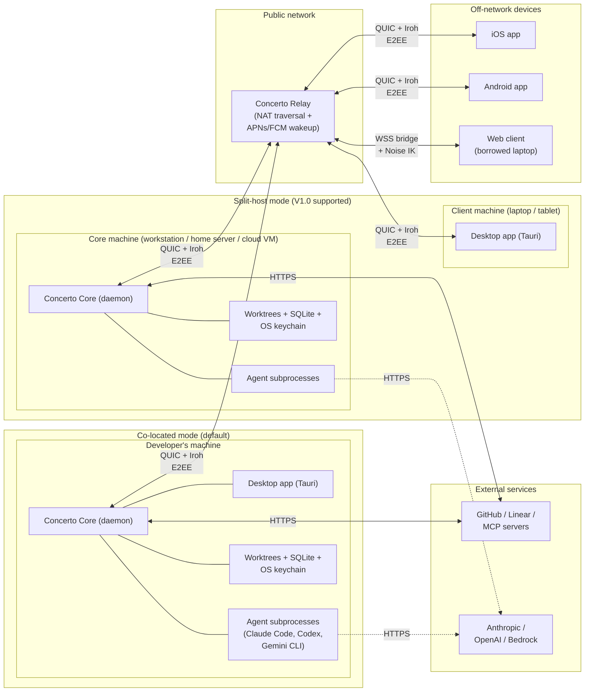
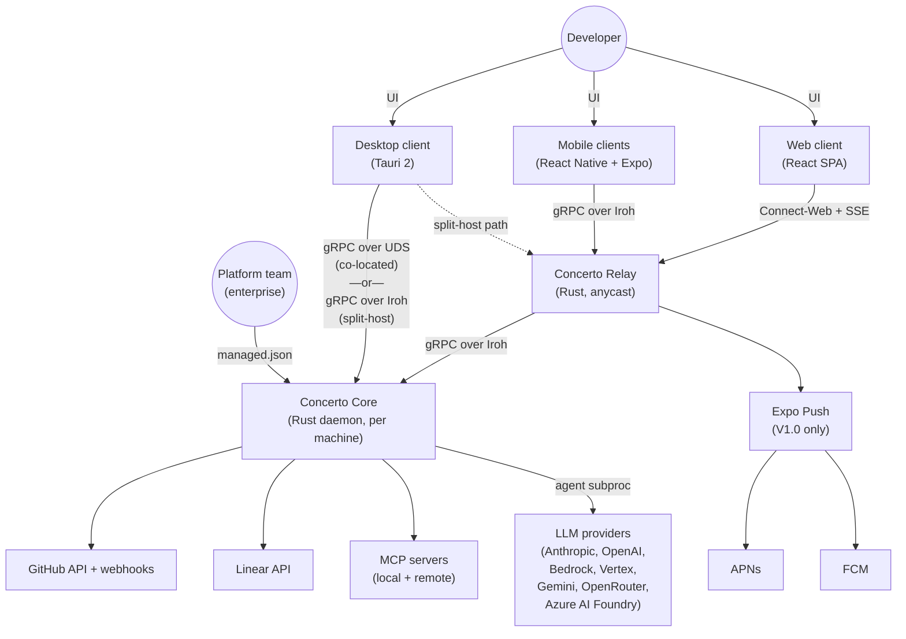
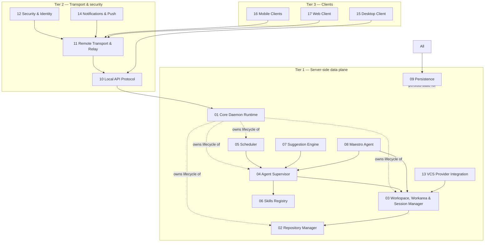
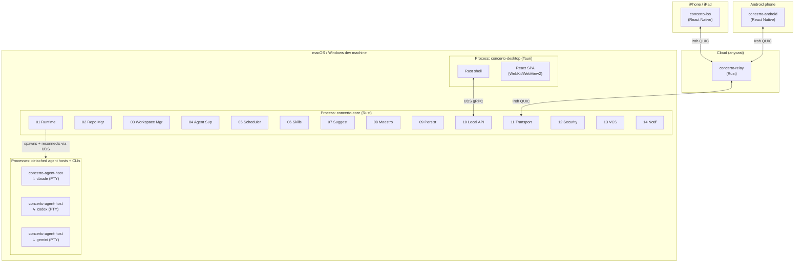
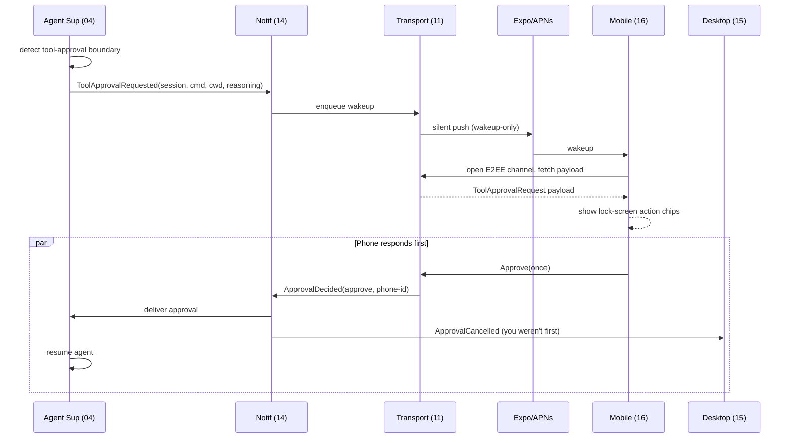
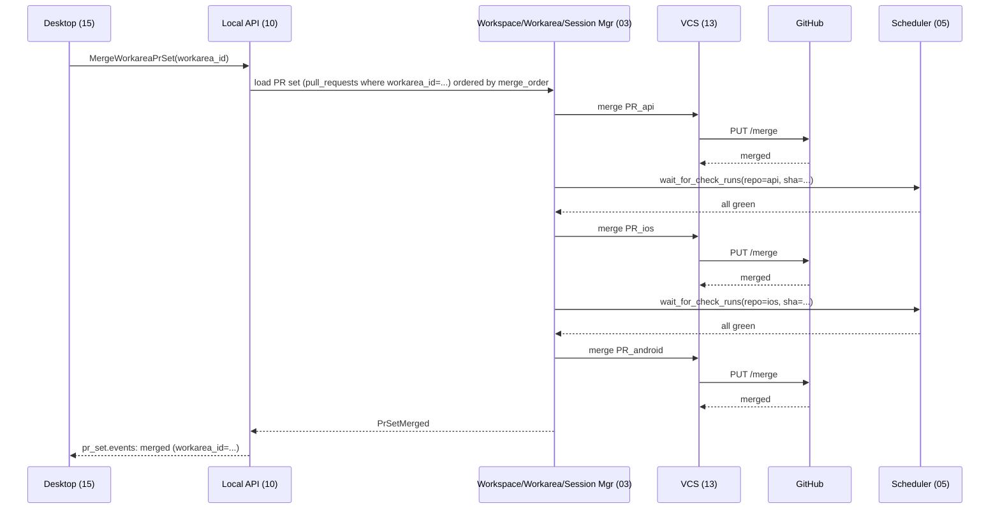
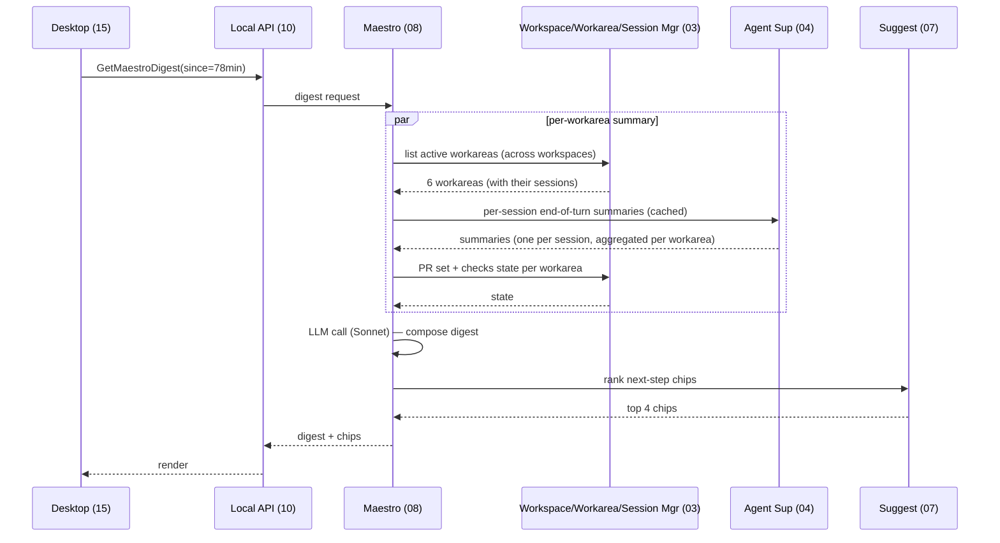
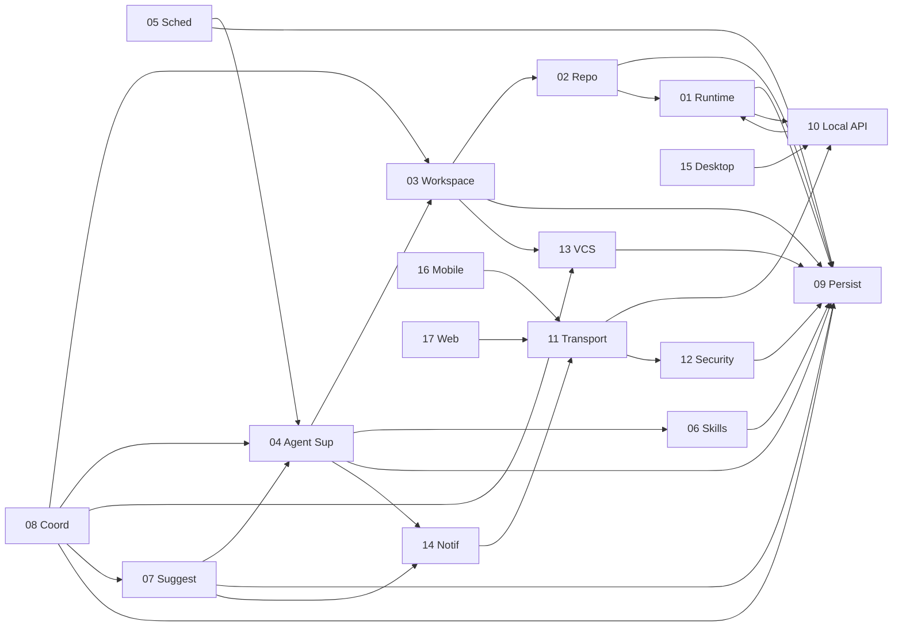

# Concerto — Architecture Overview

*Companion to `Concerto_PRD.md` and `Concerto_TechStack_Evaluation.md`. This document is the entry point for the design-doc set under `design/`. It establishes the system shape, locks the architectural bets that every sub-system inherits, and points to the per-sub-system docs that elaborate the rest.*

| Field | Value |
|---|---|
| Status | Draft for engineering review |
| Primary target | **V1.0 (public beta)** — see §10 for phase split |
| Owner | Amin Roudaki |
| Related docs | `Concerto_PRD.md`, `Concerto_TechStack_Evaluation.md`, `01..18_*.md` (all sibling docs in this folder) |

---

## 1. Purpose of this document

Three things:

1. **System at a glance.** A reader can finish this doc and explain the Concerto architecture to a peer in five minutes.
2. **Lock the cross-cutting decisions.** Language, transport, persistence, IPC, crypto, framework choices — anything that more than one sub-system depends on lives here, not in the sub-system docs. Sub-system docs treat these as fixed.
3. **Map the design-doc set.** §12 enumerates the 17 sub-system docs and what each owns. Anyone arriving at this repo can navigate from here.

What this document does *not* do:
- Repeat the PRD's product requirements. Read the PRD for "what" and "why."
- Re-litigate the TechStack evaluation. Read that doc for the option/trade-off survey.
- Specify internal sub-system architecture. That lives in `01..17`.

---

## 2. System at a glance

Concerto is a **local-first orchestration platform** for a concerted ensemble of AI coding agents. One canonical daemon (the **Core**) runs on a machine of the user's choosing — typically the developer's own machine (co-located mode), optionally a separate machine such as a workstation, home server, or cloud VM (split-host mode). Thin clients (**Desktop**, **iOS**, **Android**, **Web**) render the Core's state and dispatch commands. A **minimal relay** assists with NAT traversal and push wakeups but sees ciphertext only.

Two positioning pillars shape every decision in this document:

- **Your dev workflow follows you.** Lock-screen approvals from a phone on a train. Voice-driven session creation. Apple Watch glance. Concerto is built for asynchronous development that is not bound to a desk; the architecture treats Desktop, mobile, and web as equally first-class clients of the same Core.
- **One Core, every device.** The Core is the durable home of your work. Worktrees, agent processes, chat history, and pairings live there. A laptop, tablet, or phone is a viewport — close it and the Core keeps running; open another and pick up exactly where you left off.



Three architectural properties hold these pillars up:

- **The Core is the source of truth.** Closing every client must not affect what the Core is doing. Agents keep running. State survives. This is true whether the Core lives on the same machine as the Desktop client or on a separate one.
- **No third party reads code or prompts in flight.** The relay's data plane is encrypted end-to-end with keys it never sees (device pairing keys, not the relay's own).
- **No accounts.** Pairing is the identity model. The Core's Ed25519 keypair is the user's identity; client devices — including a remote Desktop — add their own keypairs via a one-shot QR scan.

**Two supported deployment topologies, single product.** Co-located is the default and what most users will install. Split-host is a first-class V1.0 option for users who want to run the Core on a more powerful machine, keep agent processes off their laptop, or share a single Core across multiple of their own devices. Both topologies use the same Core binary, the same gRPC schema, and the same client code; the difference is purely in which transport the Desktop binds to and how it authenticates (see §6.5).

---

## 3. System context

A C4-style context view of who talks to whom. Internal sub-systems are introduced in §4.



External dependencies — what we rely on outside our own code:

| External | Role | Failure mode |
|---|---|---|
| GitHub API + webhooks | PR state, CI checks, deployments, review threads | Degraded Checks tab; agent can still work |
| Linear / Jira | Issue source for workspace creation | Manual branch creation still works |
| MCP servers (local stdio + remote SSE) | Agent tools | Affected tool calls fail; agent continues |
| LLM provider APIs | Agent execution | Agent stalls; user gets a "provider unreachable" message |
| APNs / FCM (via Expo Push in V1.0) | Mobile wakeup | No push; mobile app must be foregrounded to see updates |
| Iroh n0 relays (V0.1) → self-hosted (V1.0) | NAT traversal assist + relayed fallback | Direct-connection-only fallback (works on ~70% of networks); enterprise self-host |

---

## 4. Component decomposition

Concerto is decomposed into **17 sub-systems**, grouped into four tiers. Each sub-system has its own doc under `design/`. Every box is a hard boundary: it has owned state, a defined interface, and can be replaced without rewriting its neighbors.



| # | Sub-system | One-liner | Doc |
|---|---|---|---|
| 01 | **Core Daemon Runtime** | Process lifecycle, single-instance guard, supervision tree, logging, OTLP, tray/menu-bar UI host | `01_Core_Daemon_Runtime.md` |
| 02 | **Repository Manager** | Clone, fetch, sparse-checkout, blobless/partial clones, sparse index, fsmonitor, maintenance | `02_Repository_Manager.md` |
| 03 | **Workspace, Workarea & Session Manager** | The 3-level hierarchy: workspaces (logical, 1..N repos) → workareas (worktrees + branch + composer name) → sessions (agent runs). `.context/`, files-to-copy, archive lifecycle, per-workarea PR sets, permission-mode inheritance | `03_Workspace_Session_Manager.md` |
| 04 | **Agent Supervisor** | Spawn Claude/Codex/Gemini in PTY, stream I/O, capture checkpoints, tool-approval flow, MCP config surfacing | `04_Agent_Supervisor.md` |
| 05 | **Scheduler** | `/loop` (session-scoped), persistent scheduled tasks, cron parsing, jitter, fan-out, cloud-task sync | `05_Scheduler.md` |
| 06 | **Skills Registry** | Discovery across personal/project/plugin/enterprise scopes, marketplace install, override flags, slash commands | `06_Skills_Registry.md` |
| 07 | **Suggestion Engine** | Rule engine over agent events, learned per-(project × trigger) chips, org-shared rules, push-action chips | `07_Suggestion_Engine.md` |
| 08 | **Maestro Agent** | Concerto chat LLM session, `@workspace` routing, digest generation, read-only workspace tools | `08_Maestro_Agent.md` |
| 09 | **Persistence** | SQLite schema, migrations, WAL config, on-disk worktrees, keychain integration, log/audit storage | `09_Persistence.md` |
| 10 | **Client API Protocol** | gRPC (Tonic) — transport-agnostic schema carried over UDS (co-located) or Iroh (split-host Desktop, Mobile, Web bridge); streaming subscriptions, schema versioning, code generation pipeline. Doc filename retains historical `Local_API_Protocol` name. | `10_Local_API_Protocol.md` |
| 11 | **Remote Transport & Relay** | Iroh peer-to-peer QUIC, relay protocol, mDNS LAN discovery, Connect-Web bridge for browsers, NAT-success telemetry | `11_Remote_Transport_Relay.md` |
| 12 | **Security & Identity** | Ed25519 device identity, QR pairing flow, Noise IK session keys, sandboxing, secrets store, audit log, managed settings | `12_Security_Identity.md` |
| 13 | **VCS Provider Integration** | GitHub API client, webhook receiver, PR/check/deploy aggregation, PR-set semantics, review-thread sync, gh-CLI fallback | `13_VCS_Provider_Integration.md` |
| 14 | **Notifications & Push** | APNs/FCM via Expo Push, wakeup-only payload, post-wakeup fetch over E2EE, multi-device approval fan-out, lock-screen action chips | `14_Notifications_Push.md` |
| 15 | **Desktop Client** | Tauri 2 shell, React SPA, three-panel layout, Monaco diff, xterm.js terminal, tray icon, auto-update | `15_Desktop_Client.md` |
| 16 | **Mobile Clients** | React Native + Expo, native push, voice input, touch-first diff, localhost preview tunnel, lock-screen action chips | `16_Mobile_Clients.md` |
| 17 | **Web Client** | Same React SPA on Vite, Connect-Web transport, ephemeral pairing in indexedDB, no persistent local state | `17_Web_Client.md` |
| 18 | **Distribution & Operations** | What's MIT vs. operated by Concerto Inc, repo-root files, contribution model, trademark, release signing, telemetry policy, enterprise-module seams | `18_Distribution_and_Operations.md` |

---

## 5. Process and deployment topology

Concerto ships **one product with two supported deployment topologies**. The processes are the same in both; only the wire between the Desktop and the Core changes.

### 5.1 Co-located topology (default)



### 5.2 Split-host topology (V1.0 supported)

```mermaid
flowchart TB
    subgraph ClientHost["Client machine (laptop / tablet)"]
        subgraph DTProcR["Process: concerto-desktop (Tauri)"]
            DTRustR["Rust shell"]
            DTReactR["React SPA<br/>(WebKit/WebView2)"]
        end
    end

    subgraph CoreHost["Core machine (workstation / home server / cloud VM)"]
        subgraph CoreProcR["Process: concerto-core (Rust)"]
            RuntimeR["01–14 sub-systems"]
        end
        subgraph AgentProcsR["Processes: detached agent hosts + CLIs"]
            HostR1["concerto-agent-host<br/>↳ claude (PTY)"]
            HostR2["concerto-agent-host<br/>↳ codex (PTY)"]
        end
        RuntimeR -. spawns + reconnects via UDS .-> AgentProcsR
    end

    subgraph CloudR["Cloud (anycast)"]
        RelayProcR["concerto-relay<br/>(Rust)"]
    end

    DTRustR <-->|Iroh QUIC<br/>(direct or relayed)| RelayProcR
    RelayProcR <-->|Iroh QUIC| RuntimeR
```

In split-host mode the Desktop's Rust shell binds to the same gRPC schema, but the transport is **Iroh QUIC** rather than UDS — identical to how Mobile (16) and Web (17) reach a remote Core. The Desktop pairs to the Core with the same QR-code ceremony a phone uses (12 §3.3). On the Core machine, nothing changes: it already listens on both UDS and Iroh.

**Variants of split-host that "just work" because they're all the same transport binding:**

| Variant | Where the Core runs | Typical user |
|---|---|---|
| Desktop on laptop, Core on home workstation | Same LAN; mDNS-discovered; relay rarely needed | Power user wanting agent compute off the laptop |
| Desktop on laptop, Core on cloud VM | Always-on; relay-traversed; SSH for ops | Developer who wants their dev env always running |
| Desktop on multiple personal machines, one Core | One Core paired with two or three Desktops | User who switches between work laptop and home desktop |

### 5.3 Process types

**Six process types** in the V1.0 deployment (same in both topologies; only their location differs):

1. **`concerto-core`** — one per user per Core machine. Long-lived. Restarted by launchd / systemd / Service Manager on crash. Owns all sub-systems 01–14. Single binary, no installer for runtime deps. In split-host mode this is the only Concerto process on the Core machine; agents and worktrees stay with it.
2. **`concerto-desktop`** — one per logged-in user when the UI is open. Tauri 2 process. In co-located mode, spawns the Core if it's not running. In split-host mode, never spawns Core (it's on another machine); instead reaches it over Iroh. Closing this does not stop the Core in either mode.
3. **`concerto-agent-host`** — one tiny helper process per active agent session. Spawned by the Core, then **detached** (`setsid` on Unix / `DETACHED_PROCESS` on Windows) so it survives Core restart. Owns the PTY master; the agent CLI is its child. Exposes a Unix domain socket / named pipe the Core connects to for I/O. Buffers a 1 MB ring of recent output for fast reconnect replay. The reason agents survive Core restarts (see §7.5 and `01 §6.3`).
4. **Agent CLIs (`claude` / `codex` / `gemini`)** — one process per active agent session, child of its `concerto-agent-host`. Inherits a sandboxed environment (see §7.2). The agent's own conversation state on disk (`~/.claude/projects/<id>/*.jsonl` etc.) is the cold-resume floor.
5. **Mobile apps** — one per device. Stateless. Re-pair only on revoke.
6. **`concerto-relay`** — one fleet behind anycast (Fly.io) for hosted; one per VPC for enterprise self-host. Stateless except current Core public endpoint per ID.

The web client doesn't get its own process — it's served by `concerto-core` (when on LAN) or via a WSS bridge through the relay (when remote).

---

## 6. Locked architectural decisions

These are the choices that propagate into every sub-system doc. Sub-system docs are not allowed to re-litigate them; they treat each as a fixed input. (Sub-system-internal decisions are listed as "Open" in their respective docs and are the subject of Hybrid (C) brainstorming.)

### 6.1 Language and runtime

| Decision | Choice | Why |
|---|---|---|
| Core language | **Rust** | Single static binary across 3 OSes; Iroh and Tauri are Rust-native; type system catches agent-supervision bugs. Compile-time tax accepted. |
| Async runtime | **Tokio** | No real alternative. Used by every other library in the stack. |
| Logging | **`tracing` + `tracing-subscriber`** | Rotating file + opt-in OTLP exporter. Off by default per local-first principle. |
| Build organization | **Cargo workspace** | Crates: `core`, `relay`, `cli`, `proto`, `transport`, `gix-wrap`, `keychain`, `pty-sup`, `desktop-shell`. |
| CI | **GitHub Actions, platform-matrix** | Mac/Win/Linux runners. iOS/Android via EAS Build (mobile). |

### 6.2 Storage

| Decision | Choice | Why |
|---|---|---|
| DB | **SQLite via `sqlx`** | Compile-time-checked queries; async; single file. |
| WAL | **WAL mode, single writer, multiple readers** | Standard SQLite-as-app-db playbook. |
| Worktrees | **`~/concerto/workspaces/<project>/<workspace>/`** (configurable) | Single root keeps all Concerto-managed worktrees grouped and easy to back up. |
| Secrets | **`keyring-rs` v4** | Keychain (macOS) / Credential Manager (Windows) / Secret Service (Linux). API tokens, pairing keys, push tokens. |
| Audit log | **JSON Lines on disk**, optional syslog forward | Append-only, human-readable, exportable. |

### 6.3 Git

| Decision | Choice | Why |
|---|---|---|
| Strategy | **Hybrid: `gix` hot path, `git2` gap-filler, shell-out for clone/sparse/blobless** | Each tool used where it's best; no single tool covers our needs cleanly. |
| Sparse | **Cone mode mandatory** (`core.sparseCheckoutCone=true`) + sparse index | The non-cone path has subtle correctness bugs; we don't expose it. |
| Performance | **fsmonitor + untracked cache + commit-graph + manyFiles** | Auto-applied per project; user doesn't see these knobs. |
| Maintenance | **`git maintenance start` per project** | Background pack health; weekly schedule. |

### 6.4 Agent integration

| Decision | Choice | Why |
|---|---|---|
| Primary mode | **Subprocess in PTY via `portable-pty`** | Works with user's existing Claude/Codex/Gemini auth; tracks upstream features; well-trodden path for CLI-backed orchestrators. |
| V1.5+ opt-in | **Anthropic Claude Agent SDK** (Node sidecar) | Cleaner tool-approval UX, structured streams. Licensing review required before ship. |
| Tool approval | **Intercept PTY output** + fan-out via Notifications (§14) | First device to approve wins; others get cancel event. |
| MCP | **Read agents' existing config** (`~/.claude/mcp.json`, `~/.codex/config.toml`, `.mcp.json`); surface in UI | Don't fragment the ecosystem. Ship our own server only for Concerto-specific tools (`concerto_link_pr`, etc.). |

### 6.5 Client API & transport selection

The Client API is **transport-agnostic**: one gRPC schema (10) carried over whichever wire fits the deployment. The Desktop picks its transport per paired Core, not at compile time.

| Decision | Choice | Why |
|---|---|---|
| Protocol | **gRPC (Tonic)** — same schema over every transport | Strong typing, codegen across all clients, bidirectional streaming first-class. |
| Co-located transport | **UDS / named pipe**, peer-UID auth | Fastest local wire; kernel attests to peer identity, so no pairing needed (12 §3.4). |
| Split-host transport (Desktop) | **Iroh QUIC** (direct hole-punch or relayed), device-cert auth via QR pairing | Same transport Mobile/Web already use; Desktop becomes a paired device class. |
| Web bridge | **Connect-Web** (buf.build/connect) | Browser gRPC with HTTP/SSE fallback; same `.proto` schema. |
| Streaming | **One stream per typed subject** (`workspace.events`, `workarea.events`, `session.events.<sid>`, `session.io.<sid>`, `diff.<workarea>.<repo>`, `checks.<workarea>.<repo>`, etc.) | Subscribers ack by offset; server-side ring buffer for reconnect replay. |

**Selection happens at pair time, not boot time.** A single Desktop install may hold pairings to several Cores (e.g., a local Core and a remote Core); the user picks the active one at launch or via Settings → Connected Core. See 15 §3.x for the first-launch picker.

### 6.6 Remote transport

| Decision | Choice | Why |
|---|---|---|
| P2P transport | **Iroh** (Rust-native QUIC + hole-punching + relay fallback) | Solves NAT traversal; same gRPC schema via `tonic-iroh-transport`; public-key addressing. |
| Crypto on top | **Noise IK via `snow`** (defense in depth atop Iroh's TLS) | Pairing key, not Iroh endpoint key, authenticates the session. |
| LAN discovery | **mDNS via `mdns-sd`** (`_concerto._tcp.local`) | Skip relay when on the same Wi-Fi. |
| Relay hosting | **Self-hosted Rust binary on Fly.io anycast**; Docker image for enterprise self-host | Avoids n0 dependency in production; small enough to operate. |
| Web client transport | **WSS bridge from Core via Connect-Web** (V1.0); Iroh-in-browser stretch (V1.5) | Browser Iroh is not mature enough for V1.0. |

### 6.7 Crypto

| Decision | Choice | Why |
|---|---|---|
| Device identity | **Ed25519** (one per Core, one per client device) | Public key is the device ID. No DNS, no CA. |
| Pairing | **QR code → short-lived token → device-cert exchange** | Copies Happy Coder's flow exactly. 60-second token expiry. |
| Session crypto | **Noise IK** (AES-256-GCM + BLAKE2b) | Audited pattern; same primitives WireGuard uses. |
| At-rest | **AES-256-GCM**, keys derived from keychain | For audit log, archived chats, cached secrets. |
| MLS | **Out of scope for V1.0** | Revisit only if group/team features land in V2. |

### 6.8 Desktop UI

| Decision | Choice | Why |
|---|---|---|
| Shell | **Tauri 2** | Small bundle (~15 MB), shared Rust types with Core, capability-based permissions. Mac (WebKit) + Windows (WebView2) only; no Linux desktop build (Linux users use the Web client; Linux is still supported as a Core host). |
| Transport | **UDS for same-machine Core (peer-UID auth); Iroh QUIC for remote Core (device-cert auth, QR pairing)** | Selected per paired Core, not globally. One Tauri shell binary supports both. See 15 §3.2 and §3.x for the picker UX. |
| Framework | **React + TypeScript** | Same tree shared with web client. |
| Build | **Vite** | Default for new React in 2026. |
| State | **Zustand** for cross-cutting (current workspace, sidebar); useState for local | Redux is overkill — Core holds canonical state. |
| Components | **shadcn/ui + Tailwind** (Radix-based) | Owned components, accessible by default. |
| Diff | **Monaco Editor** (read-only with custom decoration layer) | VS Code's diff UX is familiar; performant on large diffs. |
| Terminal | **xterm.js + `react-xtermjs`** | Standard for browser-based terminals. |
| Auto-update | **`tauri-plugin-updater`** (full-binary download) | Bundles small enough that differential updates don't matter yet. |

### 6.9 Mobile (V1.0)

| Decision | Choice | Why |
|---|---|---|
| Stack | **React Native + Expo** | ~70–80% code share with web client; existence proof in Happy Coder; fastest path to ship. |
| Push | **Expo Push** wrapping APNs/FCM | Saves weeks of credential ops; Expo sees wakeup metadata only. Direct APNs/FCM available as V1.5 swap for enterprise. |
| Voice | **`expo-speech` + native fallback** | On-device transcription where possible. |
| Diff renderer | **Custom RN component** parsing unified diff server-side | Don't try to embed Monaco. |
| Build | **EAS Build + EAS Submit** | Cloud builds; no Mac in CI for iOS. |
| Native escape hatch (V1.5) | **SwiftUI + Compose + KMP** revisit | If RN performance bottlenecks emerge in beta. |

### 6.10 Phasing of agent SDK / mobile native

Both deferred to **V1.5**. V1.0 ships subprocess agents and React Native mobile. The architecture intentionally allows both swaps without rewriting sub-systems:
- Agent SDK swap is contained to `04_Agent_Supervisor.md` (adds an alternate backend behind the same internal interface).
- Native mobile swap shares the gRPC `.proto` schema; the client surface (`16_Mobile_Clients.md`) re-implements the View tier only.

### 6.11 Licensing and distribution posture

Concerto ships under **MIT** for the entire monorepo: Core daemon, relay binary, desktop client, mobile client source, web client, CLI, protobuf schemas, and the `concerto-agent-host` helper. The same binaries are used by self-hosters and by the company-operated hosted offering — there is no "open-source edition" vs. "commercial edition" code fork. The business sits in the *operation* of the hosted relay fleet, the published App Store / Play Store builds, the update-signing keys, and (later) the enterprise SKU's extension modules — not in any of the source code. The full posture (what's open vs. operated, contribution model, trademark) is in `18_Distribution_and_Operations.md`; this section locks the choices that propagate into every sub-system.

| Decision | Choice | Why |
|---|---|---|
| Source license | **MIT** for the whole monorepo | Maximally permissive; matches local-first / no-accounts ethos; preserves all monetization paths (hosted SaaS, enterprise SKU, future relicense, acqui-hire) without closing any door today. |
| Permitted dependencies | **MIT, Apache-2.0, BSD-2/3, ISC, 0BSD only.** No GPL/LGPL/AGPL/SSPL/BSL transitive deps. | Keeps every distribution path (App Store, enterprise self-host, future relicense) legally clean. Enforced in CI via `cargo deny` + equivalent on JS/Swift/Kotlin. |
| Apache-2.0 attribution | Aggregate `NOTICE` + generated `THIRD_PARTY_LICENSES.md` at repo root, regenerated each CI run | Apache-2.0's only real obligation; cheap to satisfy if automated from day one. |
| Contribution agreement | **DCO sign-off** (Linux model: `git commit -s`); no CLA | Maximum community trust; the hosted-relay + enterprise-SKU plan does not require unilateral relicense rights. A future BSL flip would require contributor consent — by design. |
| Trademark | **"Concerto" registered**, *not* granted by MIT license | Code is reusable; the name and brand identity are the company's. Forks must rename (Linux Foundation / Mozilla model). |
| Hosted vs self-hosted parity | **Same binary in both modes.** Hosted = Concerto Inc operates the relay/push/App-Store builds. | Every feature usable by a self-hoster. No "phone-home" license checks. No account requirement. |
| No closed feature in the OSS daemon | The Core never refuses to start, never gates features on a license server, never collects telemetry by default | Local-first credibility is load-bearing; one closed gate would undo the entire security pitch. |
| Future enterprise modules | Reserved to ship under **BSL or FSL** as separate crates loaded as plugins | Lets us monetize org-CA / SIEM / SSO if we choose, without ever relicensing the MIT codebase. Existing MIT code stays MIT in perpetuity. |
| Telemetry | **Opt-in only.** OTLP exporter off by default; no analytics in any client unless explicitly enabled. | Per §7.4 Observability. Removes a class of liability for buyers and for users. |

**What this means for every sub-system doc:**

- Treat "what runs where" as a question with three answers: *open-source code* (this monorepo), *Concerto Inc operated infrastructure* (hosted relay, push, App Store, update signing, future marketplace), or *enterprise extension module* (BSL plugin loaded at runtime). Sub-system docs should call out each seam explicitly so the boundary stays clean.
- Treat dependency choice as licensing-load-bearing: if a sub-system reaches for a GPL/AGPL/SSPL library, find a replacement. Re-licensing a transitive dep is harder than picking a different one upfront.
- Treat extension points (audit-log subscribers, identity issuers, push backends, VCS providers, skill registry sources, suggestion rule sources) as the seams where future paid modules plug in. Designing them as traits today costs ~2 days; rebuilding them as traits when an enterprise customer asks costs weeks.
- Treat the published App Store and Play Store builds as a Concerto-Inc-operated artifact distinct from the source: self-hosters can build their own from source and sideload (Android) or TestFlight (iOS), but they cannot publish under the "Concerto" name.

---

## 7. Cross-cutting concerns

These concerns touch every sub-system and are owned at the architecture level, not per sub-system.

### 7.1 Identity and authorization

- **No accounts, no email, no third-party SSO.** The Core's Ed25519 keypair is the user's identity.
- **Client devices** add their own Ed25519 keypairs via QR-code pairing. The Core issues a signed device certificate. **A Desktop running in split-host mode is a paired device class** — it pairs the same way a phone does (12 §3.3).
- **All remote API calls are authenticated by the device certificate.** Same-machine UDS connections are an exception: the kernel attests to the peer's UID, and a Desktop running as the Core's owning user gets admin access without a cert (12 §3.4). This fast path applies only to co-located mode.
- **Authorization** is binary in V1.0 (a paired device has full access). V2.0 introduces read-only spectate roles (§19 of PRD).
- **Org-managed CA** (V2.0) allows enterprises to control which devices can pair without losing E2EE properties — see PRD §23.4.

### 7.2 Security and sandboxing

- Agent processes run under the user's UID, in the workspace's worktree, with environment limited to what the project declares.
- **Filesystem allow-list:** worktree root + `.context/` + project-declared additional paths. Writes outside trigger a tool-approval prompt.
- **Filesystem deny-list (hard floor):** `~/.ssh`, `~/.aws`, `~/.gnupg`, `~/.kube`, `~/.netrc`, `~/.docker/config.json` always require explicit approval regardless of permission mode.
- **Permission modes** (`04 §3.10`): four-level taxonomy `strict` → `normal` → `auto` → `yolo`, set per-workspace and per-schedule, capped by `managed.json.maxPermissionMode`. The default is `normal` (reads auto, writes/shell confirm). `yolo` auto-approves everything but **still confirms destructive commands** unless the orthogonal `bypass_destructive_guard` flag is also set (requires `"I understand the risks"` typed confirmation; org-blockable). Every mode change and every yolo action is audited.
- **Destructive command intercept** (`12 §3.6`): a pattern set (`rm -rf`, `force push`, `DROP TABLE`, `kubectl delete`, etc.) gated by an explicit approval with red urgent styling. Independent of permission mode. Only bypassed via `bypass_destructive_guard`.
- **Optional Docker isolation** (V1.0, opt-in per project): agent runs in a container mounting only the worktree. Heavier, but recoverable; pairs naturally with `yolo + bypass_destructive_guard` for "let it rip in a sandbox" workflows.
- **No third party in the data path.** The relay sees ciphertext only; Apple/Google see wakeup metadata only.
- **Secrets never leave the Core machine.** Provider API tokens are injected into agent process env; the Core mediates all provider calls indirectly via the agent.
- **Audit log** (`09_Persistence`) captures every state-changing event with a device-cert attribution, including all permission-mode changes and yolo-mode actions.

Full threat model in `12_Security_Identity.md`.

### 7.3 Error handling philosophy

| Principle | Application |
|---|---|
| **Typed errors at module boundaries** | Each sub-system exposes a Rust `Result<T, Error>` with a `thiserror`-based enum. Errors carry a stable wire code (string) for protocol use. |
| **The dashboard never lies** (PRD §4.7) | Status events come from running processes, not cached state. When in doubt, re-derive from authoritative source (filesystem, git, agent pid). |
| **Crash isolation between agents** | A panicking agent supervisor never brings down the Core. Each agent is a Tokio task with `catch_unwind` + restart policy. |
| **Graceful degradation** | If Iroh fails → relay fallback. If relay fails → LAN only. If GitHub unreachable → cached PR state with "stale" badge. If LLM unreachable → agent shows error message; no retry storm. |
| **No silent data loss** | Every destructive op (archive, revert-to-checkpoint, sparse-cone shrink) writes an audit-log entry first. |

### 7.4 Observability

- **Local logs:** `tracing` events to a rotating file at `~/concerto/logs/core-YYYY-MM-DD.log`. Span fields include workspace ID, agent session ID, device cert ID.
- **OpenTelemetry exporter:** opt-in only; off by default. Endpoint configurable in `managed.json` for enterprise SIEM integration.
- **In-app diagnostics panel:** Settings → Diagnostics shows Core uptime, supervised agent count, open subscriptions, transport state, last 100 audit events.
- **No analytics that leave the machine** unless the user explicitly opts in.

### 7.5 Persistence boundaries — where each kind of state lives

| State | Storage | Backed up? | Encrypted at rest? |
|---|---|---|---|
| Projects, workspaces, sessions, chat history, checkpoints, todos, schedules, settings, learning counters | **SQLite** (`~/concerto/concerto.db`) | Manual export; included in `concerto backup` CLI | No (filesystem ACL only) |
| Worktrees | **On-disk** under workspace root | No (it's git; remote is the backup) | No |
| API tokens, GitHub PATs, push credentials, pairing keys | **OS keychain** | No (re-pair on machine swap) | Yes (OS-managed) |
| Live agent stdout/stderr | **Per-session log file** + ring buffer in RAM | Last N days retained on disk; older pruned | No |
| Audit log | **JSON Lines** at `~/concerto/audit/` | Optional syslog forward | Optional AES-GCM at-rest |
| Push notification bodies | **Never persisted** beyond wakeup-to-delivery window | — | E2EE in transit |

Full schema in `09_Persistence.md`.

### 7.6 Versioning and migration

- **gRPC proto schema** versions via field numbers (never reused). The Core advertises its schema version on connect; clients negotiate down.
- **SQLite schema** migrations are forward-only, ordered, idempotent. Run on Core startup. A failed migration aborts startup with a clear error and does not corrupt data.
- **Settings files** (`concerto.json`, `managed.json`, `suggestions.toml`) carry a `version` field; the Core upgrades on read, writes back the new version.

### 7.7 Performance budgets

Inherited from PRD §22.3 and used as design constraints throughout:

| Metric | Target | Where enforced |
|---|---|---|
| p50 workspace creation on 40 GB monorepo (sparse + blobless) | < 30 s | `02_Repository_Manager.md` |
| p50 round-trip mobile → Core for a chat message | < 250 ms (healthy LTE) | `11_Remote_Transport_Relay.md` |
| p50 round-trip Desktop → Core (split-host) for a chat message | < 100 ms (LAN, direct Iroh); < 250 ms (WAN, direct or relayed) | `11_Remote_Transport_Relay.md`, `15_Desktop_Client.md` |
| `session.io` streaming throughput Desktop ← Core (split-host) | > 5 MB/s sustained on LAN; > 1 MB/s WAN | `11_Remote_Transport_Relay.md` |
| p50 Concerto chat digest after > 30 min absence | < 5 s | `08_Maestro_Agent.md` |
| Core daemon crash-free session % | > 99.9% | `01_Core_Daemon_Runtime.md` |
| % remote connections that go direct (not relayed) | > 70% | `11_Remote_Transport_Relay.md` |
| Time-to-revoke a stolen device | < 60 s | `12_Security_Identity.md` |
| `gix status` on 2M-file repo with sparse cone | < 100 ms | `02_Repository_Manager.md` |
| Core memory idle, 0 active agents | < 100 MB | `01_Core_Daemon_Runtime.md` |
| Core memory at 8 active agents | < 600 MB (excl. agent processes) | `01_Core_Daemon_Runtime.md` |
| Desktop client cold start | < 2 s | `15_Desktop_Client.md` |

---

## 8. Key data flows

Four canonical scenarios that touch most of the system. Each sub-system doc references one or more of these for its specific role.

### 8.1 Create workspace + first workarea from a Linear issue

User: "Spin up a workspace for ENG-4827" (from Concerto chat or +New Workspace).

```mermaid
sequenceDiagram
    actor User
    participant DT as Desktop (15)
    participant API as Local API (10)
    participant Coord as Maestro (08)
    participant VCS as VCS (13)
    participant Wk as Workspace/Workarea/Session Mgr (03)
    participant Repo as Repo Mgr (02)
    participant Sup as Agent Sup (04)
    participant DB as Persist (09)

    User->>DT: "/new ENG-4827"
    DT->>API: SendToMaestro("/new ENG-4827")
    API->>Coord: route to maestro
    Coord->>VCS: fetch Linear issue body
    VCS-->>Coord: issue title + description
    Coord->>Coord: detect multi-repo intent; plan-mode cone suggestion per repo
    Coord->>API: propose workspace + first workarea (cones per repo)
    API-->>DT: ConfirmationRequired(plan)
    User->>DT: Approve
    DT->>API: CreateWorkspace(name, repos)
    API->>Wk: create_workspace
    Wk->>DB: persist workspaces + workspace_repos rows (no disk yet)
    Wk-->>API: workspace_id
    API->>Wk: create_workarea(workspace_id, cones)
    par per repo in workspace
        Wk->>Repo: ensure cloned (blobless if first time)
        Repo->>Repo: git worktree add at <workarea_root>/<repo_name>
        Repo->>Repo: sparse set (per repo's cones)
    end
    Wk->>DB: persist workareas + workarea_repos rows
    Wk->>Sup: create_session(workarea_id, Claude, plan mode) (injects Concerto preamble)
    Sup-->>API: SessionStarted event
    API-->>DT: stream workspace.events + workarea.events + session.events
```

### 8.2 Tool approval from a phone (lock-screen)

Agent in `bach` workspace requests permission to run `rm -rf node_modules`. User is on the train.



### 8.3 Multi-repo workarea — coordinated merge of its PR set

User clicks "Merge workarea PR set" on a workarea with 3 repos.



If any step fails post-merge canary, `Wk` invokes Coordinated Revert (parallel reverts via VCS).

### 8.4 Pairing a Desktop with a remote Core (split-host first launch)

User has installed `concerto-core` on a workstation or cloud VM and is launching the Desktop app on their laptop for the first time.

```mermaid
sequenceDiagram
    actor User
    participant DTShell as Desktop shell (15)
    participant DTReact as Desktop renderer
    participant CoreUI as Core (tray) on remote machine
    participant Core as Core identity (12)
    participant Trans as Transport (11)

    DTShell->>DTShell: probe local UDS — not found
    DTShell->>DTShell: check stored pairings — none
    DTShell->>DTReact: show Connect-to-Core picker
    DTReact->>User: "Start a local Core" | "Pair with a remote Core"
    User->>DTReact: choose "Pair with a remote Core"
    User->>CoreUI: on the Core machine, run `concerto pair`<br/>(or tray → Pair new device)
    CoreUI->>Core: generate pairing_token (60s TTL)
    Core->>CoreUI: print QR + plain-text token fallback
    User->>DTReact: scan QR (webcam) or paste token
    DTReact->>DTShell: pairing payload {core_pubkey, pairing_token, iroh_endpoint_id, relay_hint}
    DTShell->>DTShell: generate Ed25519 keypair for this Desktop
    DTShell->>Trans: open Noise XX pairing channel via Iroh (relay-assisted)
    Trans->>Core: PairingRequest{device_pubkey, device_name=hostname, sig}
    Core->>Core: verify sig, invalidate token, issue DeviceCert
    Core-->>DTShell: SignedDeviceCert
    DTShell->>DTShell: persist {core_pubkey, iroh_endpoint_id, device_cert, device_privkey} in OS keychain
    DTShell->>Trans: open API channel (Iroh QUIC), present device cert
    Trans-->>DTShell: ServerCapabilities, ready
    DTShell->>DTReact: connected; render main UI
```

After pairing, every subsequent launch of the Desktop reuses the stored pairing and goes straight to the API channel — no QR scan unless the user adds another Core. The same plain-text token fallback is provided for headless Core machines where displaying a QR is awkward.

### 8.5 Returning from a meeting — Concerto chat digest

User has been away 78 minutes. Reopens desktop app.



---

## 9. Inter-sub-system dependency graph



Read this as "X depends on Y" (X needs Y to be present). No cycles. The runtime (01) is at the bottom of the call graph (everything is hosted by it); persistence (09) is the leaf node everyone writes to.

---

## 10. Phase targeting summary

A compact map of which sub-systems exist (and at what fidelity) in each release.

| Sub-system | V0.1 (alpha, Mac) | V1.0 (beta, full) | V2.0 (enterprise + cloud) |
|---|---|---|---|
| 01 Core Daemon Runtime | Mac launchd only | + Windows Service + systemd + **split-host single-user mode** (one Core, one user, multiple paired Desktops/devices) + deployment recipe for cloud VM Cores | + multi-tenant remote-host mode (single Core, many engineers) |
| 02 Repository Manager | Full clone only | + blobless + sparse + sparse index | + learning-mode cone suggestions |
| 03 Workspace, Workarea & Session Manager | Single-repo workspaces, single workarea, single session | + multi-repo workspaces + parallel workareas + multi-session per workarea + per-workarea PR sets | + workspace export/import + per-repo branch override |
| 04 Agent Supervisor | Claude + Codex subprocess | + Gemini + MCP surfacing + multi-agent tabs | + Claude Agent SDK opt-in mode |
| 05 Scheduler | /loop only | + persistent scheduled tasks + cloud-task sync | + cron schedules for non-AI jobs (optional) |
| 06 Skills Registry | Discovery + per-project toggle | + marketplace install + sandbox test | + enterprise-managed allow/deny lists |
| 07 Suggestion Engine | Rule engine only | + per-user learning + push-action chips | + org-shared rules + ranked-by-LLM mode |
| 08 Maestro Agent | (not in V0.1) | Full Concerto chat with 15-tool set | + MCP-augmented context (Slack, Linear, etc.) + Apple Watch voice |
| 09 Persistence | SQLite + worktrees + keychain | + audit log + multi-device key store | + SIEM forwarding + at-rest encryption for audit |
| 10 Local API Protocol | gRPC over UDS | + Connect-Web bridge + streaming reconnect + **Desktop ↔ Iroh transport (parity with UDS)** + `Files.Upload`/`Files.Download` RPCs for split-host file transfer | + protocol version negotiation policies for org |
| 11 Remote Transport & Relay | (not in V0.1) | Iroh + Noise IK + self-hosted relay | + multi-tenant relay + bandwidth quotas |
| 12 Security & Identity | Local-only auth | + QR pairing + device certs + audit | + org-managed CA + device-management policy hooks |
| 13 VCS Provider Integration | gh CLI shell-out | + GitHub API + webhooks + PR sets | + GitLab + Bitbucket |
| 14 Notifications & Push | (not in V0.1) | Expo Push + multi-device fan-out | + direct APNs/FCM swap + Apple Watch |
| 15 Desktop Client | macOS Tauri | + Windows + auto-update + **first-class split-host mode (transport picker, multi-Core pairings, switch active Core)**. No Linux desktop build — Linux users use the Web client (17). | + plugin surface for org extensions |
| 16 Mobile Clients | (not in V0.1) | iOS + Android via RN/Expo | + native (SwiftUI + Compose) opt-in; Apple Watch |
| 17 Web Client | (not in V0.1) | React SPA via WSS bridge | + Iroh-in-browser direct transport |

---

## 11. Architectural prototype spikes — committed for V0.1 week 1–2

These four spikes validate the locked decisions before V1.0 implementation commits to them. **All four are committed to run** in the first two weeks of V0.1. Each is a 2–5 day measurement; some can parallelize since they touch different surfaces.

| Spike | What it measures | Default (proceed if confirmed) | Fallback if spike fails | Effort |
|---|---|---|---|---|
| **Iroh NAT success rate** | % direct vs relayed on 10 real network environments (home / corp / coffee / hotspot / hostile-NAT) | Iroh as the sole non-browser transport | Add tsnet Go sidecar for stubborn networks; surface "relayed" indicator | ~3–5 days |
| **RN diff viewer perf** | Scroll FPS + pinch-zoom on a 1000-line diff on iPhone 13+ / Pixel 6+ | React Native custom diff component | Drop in native SwiftUI + Compose diff component only (rest of app stays RN) | ~3–4 days |
| **gix vs shell-out latency** | `gix status` vs `git status` shell-out on a 2M-file repo with 100k-file sparse cone (target: gix < 100 ms) | Hybrid routing in `02 §3.1` — gix for hot path | Shift more operations to shell-out | ~2 days |
| **Tonic over Iroh** | p50 latency + throughput on real coffee-shop Wi-Fi + LTE, streaming 10 MB of agent stdout to a phone (targets: < 200 ms p50, > 1 MB/s) | Tonic over Iroh as the wire | Custom QUIC streaming protocol (lose codegen) | ~3–4 days |

Combined effort: ~12 engineer-days, parallelizable to about a week of calendar time with 2–3 engineers.

The Core Daemon Runtime doc (`01`) and the Remote Transport doc (`11`) include the prototype harnesses for these spikes. After the spike block, each result is recorded in the doc body of the affected sub-system and the relevant fallback section is either removed (default confirmed) or activated (fallback adopted).

---

## 12. Document map

Reading order for an engineer new to the project:

1. **Start here.** `Concerto_PRD.md` (product), this doc (architecture).
2. **Pick your tier:**
   - **Working server-side?** Read 01, then 09, then your component's doc.
   - **Working on transport/security?** Read 12, 11, 10 in that order.
   - **Working client-side?** Read 10 (the protocol you consume), then 15/16/17.
3. **Then read adjacent sub-systems** — your doc's "Dependencies" section lists them.

### 12.1 Index

| Doc | Owns | Key collaborators |
|---|---|---|
| `01_Core_Daemon_Runtime.md` | Process lifecycle, supervision, OTLP, single-instance, tray host | 09, 10 |
| `02_Repository_Manager.md` | Clone strategies, sparse, fsmonitor, maintenance | 03, 09 |
| `03_Workspace_Session_Manager.md` | Workspaces, workareas, sessions; worktrees per (workarea, repo); per-workarea PR sets; permission-mode inheritance | 02, 04, 13, 09 |
| `04_Agent_Supervisor.md` | PTY supervision, agent I/O, checkpoints, tool approvals, MCP surfacing | 03, 06, 14, 09 |
| `05_Scheduler.md` | /loop, scheduled tasks, cron, cloud sync | 04, 09 |
| `06_Skills_Registry.md` | Skill discovery, marketplaces, overrides, slash commands | 04, 09 |
| `07_Suggestion_Engine.md` | Rule engine, learning, org rules, push chips | 04, 14, 09 |
| `08_Maestro_Agent.md` | Concerto chat LLM session, routing, digests, tools | 03, 04, 07, 13, 09 |
| `09_Persistence.md` | SQLite schema, migrations, secrets, audit log | (all) |
| `10_Local_API_Protocol.md` | Client API: gRPC schema (transport-agnostic), codegen, streaming subjects; UDS for co-located, Iroh for split-host & mobile | 01, 11 |
| `11_Remote_Transport_Relay.md` | Iroh, mDNS, relay binary, Connect-Web bridge | 10, 12, 14 |
| `12_Security_Identity.md` | Ed25519 keys, pairing, Noise IK, sandboxing, audit | 09, 11 |
| `13_VCS_Provider_Integration.md` | GitHub API, webhooks, PR sets, checks, deploy state | 03, 09 |
| `14_Notifications_Push.md` | Expo Push, wakeup, multi-device fan-out, lock-screen chips | 11, 16 |
| `15_Desktop_Client.md` | Tauri shell, React SPA, Monaco, xterm.js, tray | 10 |
| `16_Mobile_Clients.md` | RN/Expo, push, voice, touch diff, localhost preview | 11, 14 |
| `17_Web_Client.md` | React SPA on Vite, Connect-Web, ephemeral pairing | 11 |
| `18_Distribution_and_Operations.md` | Open-source posture, what Concerto Inc operates, contribution model, trademark, release signing, telemetry, enterprise-module seams | (all) |

---

## 13. Glossary

Defined terms inherited from PRD §24. Two architecture-level additions:

| Term | Meaning |
|---|---|
| **Sub-system** | One of the 17 components in §4. Each owns state, exposes an interface, and is replaceable without rewriting neighbors. |
| **Locked decision** | An architectural choice listed in §6. Sub-system docs treat these as fixed. To change one, update this doc and re-review all sub-systems that depend on it. |
| **Spike** | A 2–5 day prototype that resolves an open architectural question before the corresponding sub-system commits to its design (§11). |

---

*End of architecture overview. Continue to `01_Core_Daemon_Runtime.md` for the first sub-system, or jump to any doc in §12.1.*
