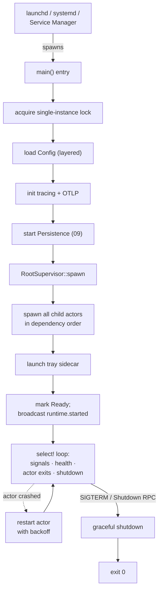
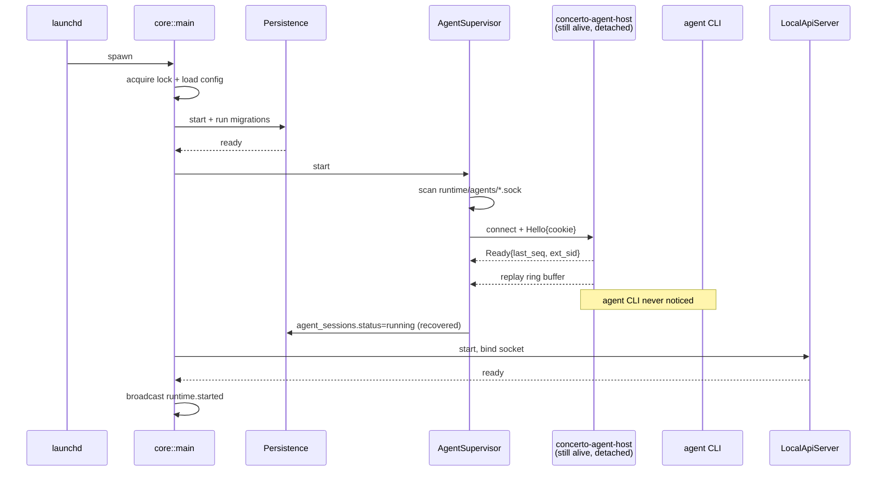
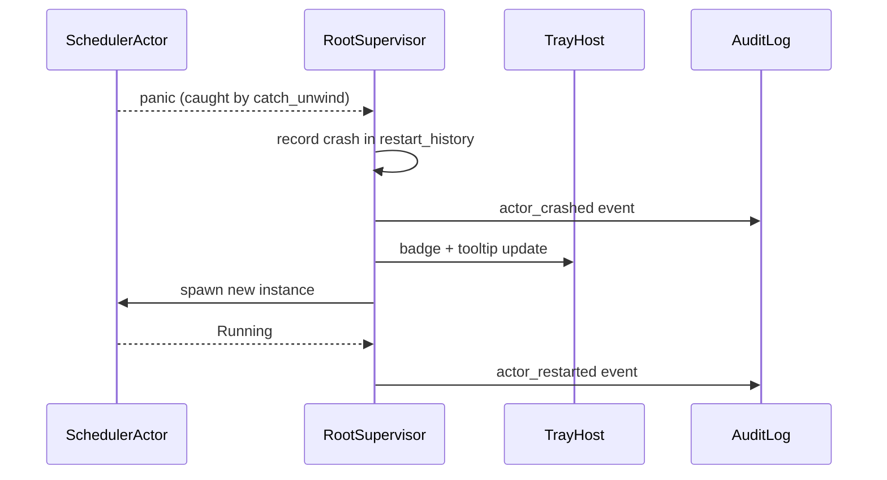
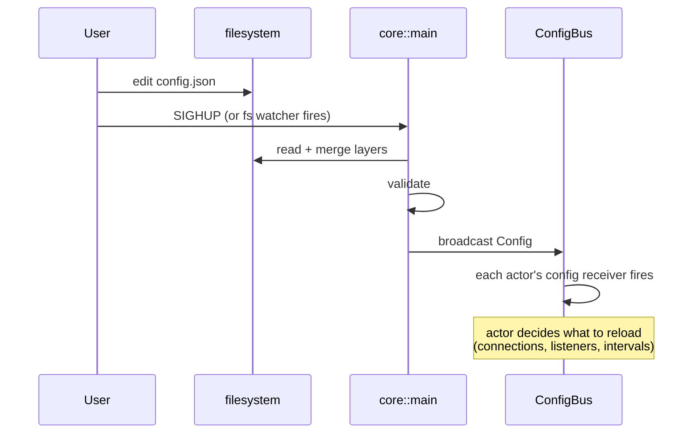

# 01 — Core Daemon Runtime

*Sub-system design doc. Inherits locked decisions from `00_Architecture_Overview.md`. See §6 of that doc for language, persistence, IPC, transport, and crypto choices that this doc treats as fixed.*

---

## 1. Purpose & scope

The Core Daemon Runtime is **the host process** for every server-side sub-system (02–14). It is the only persistent OS-level process Concerto installs (other than child agent PTYs and the optional desktop UI). It owns:

- **Process lifecycle.** Daemonization, single-instance guard, OS-integration (launchd / systemd / Service Manager), graceful shutdown, crash-and-restart.
- **Supervision tree.** A typed tokio-task hierarchy that hosts every other sub-system as a supervised actor. Crash isolation between sub-systems.
- **Runtime configuration.** `~/.concerto/config.json`, `managed.json`, environment overrides; reload-on-SIGHUP semantics.
- **Tray / menu-bar UI host.** A minimal always-on UI surface separate from the Desktop client (PRD §8.6).
- **Logging & OTLP plumbing.** `tracing` subscriber config, log rotation, opt-in OpenTelemetry exporter.
- **Health & diagnostics.** Internal `/healthz`-equivalent, in-app diagnostics panel feed, watchdog.

It explicitly does **not** own: any business logic (workspaces, agents, git, persistence). Those live in 02–14 and are hosted as supervised children.

**Non-negotiables locked in `00 §6.11`** that this sub-system enforces by absence:

- **No license check.** The Core has no code path that contacts a license server, validates an entitlement, or refuses to start based on a paid status. The MIT binary always runs.
- **No phone-home.** No analytics SDK, no crash reporter, no usage tracking. The opt-in OTLP exporter (`§3.6`) is the only egress and is off by default.
- **No account requirement.** Pairing (`12 §3.3`) is the identity model; the Core never asks for an email, never validates against Concerto Inc's servers, never gates features on cloud auth.

These are properties of the *absence* of code paths, not features that get added. Code review should reject any PR that introduces them.

---

## 2. Phase scope

| Phase | What ships |
|---|---|
| **V0.1** | macOS only. `launchd` LaunchAgent. Single-instance via lockfile. Basic supervision tree. Tracing to rotating file. No OTLP. Tray UI minimal. |
| **V1.0** | + Windows Service + systemd user unit. + watchdog (auto-restart Core on unresponsive supervision tree). + diagnostics panel data source. + OTLP exporter (opt-in). + auto-update of Core binary. |
| **V2.0** | + remote-host mode (one Core serving N engineers in a VPC, multi-tenant). + dynamic sub-system reload (hot-swap agent supervisor binary without dropping agents). |

---

## 3. Key design decisions (sub-system-internal)

### 3.1 Daemonization strategy: rely on OS integration, not double-fork

**Choice:** The Core does **not** daemonize itself in the classical Unix sense. It expects to be started by launchd / systemd / Windows Service Manager and runs as a foreground child. Stdout/stderr go to the OS's log capture.

**Alternatives considered:**
- (A) Classic `fork(); setsid(); fork();` daemonization. Avoided because launchd / systemd actively dislike services that daemonize themselves (lose process tracking).
- (B) `daemonize` crate. Same problem as (A); also Windows has no equivalent.

**Recommendation:** OS integration only. This locks us to one start mode per platform, but it's the correct one per platform.

### 3.2 Supervision tree shape: typed actor pattern over tokio tasks

**Choice:** Each sub-system is hosted as one or more `tokio::task` instances, supervised by a thin "actor" wrapper that owns:
- Restart policy (exponential backoff, max N restarts in T seconds before giving up).
- Last-N-second crash history.
- A "stop" channel for graceful shutdown.
- A `catch_unwind` boundary so a panicked sub-system doesn't propagate.

Top-level shape:

```
RootSupervisor
├── PersistenceActor               (09)
├── RepositoryManagerActor         (02)
├── WorkspaceSessionManagerActor   (03)
├── AgentSupervisorActor           (04)  — supervises per-agent PTY tasks
├── SchedulerActor                 (05)
├── SkillsRegistryActor            (06)
├── SuggestionEngineActor          (07)
├── MaestroAgentActor          (08)
├── VcsProviderActor               (13)
├── NotificationActor              (14)
├── LocalApiServerActor            (10)
├── RemoteTransportActor           (11)
├── SecurityActor                  (12)
├── TrayHostActor                  (tray UI)
└── WatchdogActor                  (V1.0+)
```

**Alternatives considered:**
- (A) Bastion / actix-based actor framework. Heavyweight; brings its own opinions about messaging and supervision. Avoided to keep the dependency surface small.
- (B) Implicit hierarchy via `tokio::spawn` everywhere with no formal supervisor. Avoided because crash-restart semantics become ad-hoc.

**Recommendation:** Roll-our-own thin actor wrapper. ~300 lines of code, no external dependency, full control.

### 3.3 Single-instance guard: advisory lock on a PID file

**Choice:** On startup, the Core acquires an exclusive `flock` (Unix) / `LockFileEx` (Windows) on `~/.concerto/core.pid`. If the lock is held, the existing PID is read, validated (process exists, command-line matches), and the new invocation exits with status 0 (so launchd doesn't keep restarting).

**Alternatives considered:**
- (A) Named system mutex (Windows). Avoided because the same Core binary runs on Unix.
- (B) Port-based guard (try to bind to the API UDS; if EADDRINUSE, another instance is running). Avoided because UDS bind doesn't atomically convey "by whom" — racy.

**Recommendation:** `fs2`-style cross-platform advisory file lock + PID file with command-line check.

### 3.4 Configuration model: layered, JSON, hot-reload via SIGHUP / equivalent

**Choice:** Three layers, merged at read time:
1. **`managed.json`** at `~/.concerto/managed.json` (lowest precedence at the top — wait, highest precedence; see below).
2. **`config.json`** at `~/.concerto/config.json` (user).
3. **Environment overrides** (`CONCERTO_*`).

Precedence: `managed > env > config > defaults`. `managed.json` is the only file the user cannot override; everything in it is locked.

Hot reload: on Unix, SIGHUP triggers re-read. On Windows, a debounced filesystem watcher on the config dir. Reload events are propagated to actors via a typed `ConfigChanged` event.

### 3.5 Tray / menu-bar UI host: sidecar Tauri process, not in-Core

**Choice:** The tray UI is a tiny separate Tauri app (`concerto-tray`), launched by the Core on startup. It communicates with the Core over the standard local gRPC API. This keeps the Core headless (per PRD §8.1.1) and avoids pulling a UI runtime into the daemon process.

**Alternatives considered:**
- (A) Embed `tao` / `winit` directly in the Core for a native tray icon. Avoided because the Core would now carry a windowing runtime, increasing footprint and link complexity on Linux.
- (B) Make tray part of the main Desktop client. Avoided because the tray must be present even when the Desktop window is closed.

**Recommendation:** Sidecar process. The Core supervises it; if it crashes, restart it (low rate-limit).

### 3.6 OpenTelemetry exporter: opt-in, off by default

**Choice:** `tracing-subscriber` always writes to the rotating file. The OTLP layer is constructed only when `config.json` sets `telemetry.otlp_endpoint`. Span attributes are scrubbed of secrets via a `tracing-filter` layer (PII redaction allow-list).

---

## 4. Data model

The Runtime owns very little persistent data. Most of what it holds is in-memory process state.

### 4.1 On-disk

| Path | Content | Lifetime |
|---|---|---|
| `~/.concerto/core.pid` | PID + start-time epoch + binary version | Process lifetime |
| `~/.concerto/core.sock` (Unix) / `\\.\pipe\concerto-core` (Windows) | The local gRPC endpoint | Process lifetime |
| `~/.concerto/config.json` | User config (layered, see §3.4) | Persistent |
| `~/.concerto/managed.json` | Org-managed overrides | Persistent (org-managed) |
| `~/concerto/logs/core-YYYY-MM-DD.log` | Rotating tracing logs | 14 days retention default |
| `~/concerto/audit/audit-YYYY-MM-DD.jsonl` | Append-only audit log | Configurable retention (default 90 days) |

### 4.2 In-memory state

```rust
struct CoreRuntime {
    config: Arc<RwLock<Config>>,
    actors: HashMap<ActorId, ActorHandle>,
    started_at: Instant,
    shutdown: CancellationToken,
    metrics: RuntimeMetrics,
}

struct ActorHandle {
    name: &'static str,
    join_handle: JoinHandle<()>,
    stop_tx: oneshot::Sender<()>,
    restart_history: ArrayVec<Instant, 16>,  // last 16 restart times
    state: ActorState,                       // Starting | Running | Restarting | Failed
}

struct RuntimeMetrics {
    started_at: Instant,
    last_config_reload: Option<Instant>,
    actor_restarts_total: HashMap<&'static str, u64>,
    api_request_count: AtomicU64,
    /// Sampled every 10s from /proc/self/status (Linux), task_info (macOS),
    /// or GetProcessMemoryInfo (Windows). Surfaced in Diagnostics; emits
    /// runtime.memory_warning when RSS crosses configured thresholds.
    /// Observability only — no automatic mitigation in V1.0.
    process_rss_bytes: AtomicU64,
    process_rss_peak_bytes: AtomicU64,
}
```

---

## 5. Interfaces

### 5.1 To Local API (10) — runtime introspection RPCs

```proto
service RuntimeAdmin {
  rpc GetStatus(google.protobuf.Empty) returns (RuntimeStatus);
  rpc ReloadConfig(google.protobuf.Empty) returns (google.protobuf.Empty);
  rpc Shutdown(ShutdownRequest) returns (google.protobuf.Empty);
}

message RuntimeStatus {
  string version = 1;
  google.protobuf.Timestamp started_at = 2;
  uint64 uptime_seconds = 3;
  repeated ActorStatus actors = 4;
  ConfigStatus config = 5;
}
```

### 5.2 To other sub-systems — actor host API (internal Rust trait)

```rust
#[async_trait]
trait Actor: Send + 'static {
    const NAME: &'static str;
    type Config: DeserializeOwned + Clone + Send + Sync;

    async fn run(self, ctx: ActorContext<Self::Config>) -> Result<()>;
}

struct ActorContext<C> {
    config: Arc<RwLock<C>>,
    config_changes: broadcast::Receiver<C>,
    shutdown: CancellationToken,
    metrics: RuntimeMetrics,
    db: PersistenceHandle,        // 09
    notify: NotificationHandle,    // 14
}
```

Sub-system docs implement `Actor` and are spawned by the runtime.

### 5.3 Emits events

| Event | Subject | When |
|---|---|---|
| `runtime.started` | broadcast | After all actors are Running |
| `runtime.actor_crashed` | broadcast | An actor panicked or returned Err |
| `runtime.actor_restarted` | broadcast | Restart succeeded |
| `runtime.shutdown_requested` | broadcast | SIGTERM received or `Shutdown` RPC called |
| `runtime.config_reloaded` | broadcast | Successful config reload |
| `runtime.memory_warning` | broadcast | Process RSS crossed a configured threshold (observability only; no automatic mitigation in V1.0) |

---

## 6. Internal architecture



### 6.1 Startup sequence (dependency-ordered)

1. Acquire single-instance lock.
2. Load config (layered).
3. Initialize tracing + OTLP.
4. Start **PersistenceActor (09)** — must be up before anyone else.
5. Run pending SQLite migrations (block until complete).
6. Start **SecurityActor (12)** — loads Ed25519 identity from keychain.
7. In parallel, start:
   - **RepositoryManagerActor (02)**, **WorkspaceSessionManagerActor (03)** (depends on 02), **AgentSupervisorActor (04)** (depends on 03, 06), **VcsProviderActor (13)**, **SkillsRegistryActor (06)**.
   - **NotificationActor (14)**, **RemoteTransportActor (11)** (depends on 12), **LocalApiServerActor (10)**.
   - **SchedulerActor (05)** (depends on 04), **SuggestionEngineActor (07)** (depends on 04), **MaestroAgentActor (08)** (depends on 03, 04).
8. Adopt orphaned agent PTYs (see §6.3).
9. Launch tray sidecar.
10. Broadcast `runtime.started`.

### 6.2 Crash-restart policy

Per actor:

| Restarts in last 60s | Action |
|---|---|
| ≤ 3 | Restart immediately, log warn |
| 4–10 | Restart with exponential backoff (1s, 2s, 4s, 8s, 16s, 32s) |
| > 10 | Mark actor `Failed`, emit `runtime.actor_crashed_terminal`, alert via tray + audit log. Core continues running (other actors unaffected) but the dead actor stays dead until config reload or Core restart. |

The watchdog actor (V1.0+) monitors heartbeats from each actor. An actor that hasn't heartbeated in > 60s is considered hung; the watchdog requests a graceful restart (or panic-and-restart if graceful fails).

### 6.3 Agent host adoption on restart

Agent CLIs (`claude`, `codex`, `gemini`) are **not** direct children of the Core. They live as grandchildren under a small helper process — `concerto-agent-host` — that is spawned by the Core and then immediately detached:

- **Unix:** `setsid()` after spawn — the host becomes a session leader, reparents to init when Core dies. No SIGHUP propagates to it.
- **Windows:** `CreateProcess` with `CREATE_NEW_PROCESS_GROUP | DETACHED_PROCESS` — equivalent effect.

The host owns the PTY master. The agent CLI is the host's child. The Core talks to the host over a Unix domain socket at `~/concerto/runtime/agents/<sid>.sock` (named pipe `\\.\pipe\concerto-agent-<sid>` on Windows).

When the Core restarts (clean or crashed), the **AgentSupervisorActor** runs the **host adoption** routine:

1. Scan `~/concerto/runtime/agents/*.sock` for live sockets.
2. For each socket: connect; perform a typed `Hello { core_version, expected_cookie }` handshake.
3. The host verifies the cookie (prevents a malicious local process from impersonating Core), responds with `Ready { agent_sid, last_seq, agent_external_session_id }`.
4. The Core resumes I/O forwarding. The host's 1 MB ring buffer replays any output the previous Core hadn't yet acknowledged.
5. The agent CLI never noticed Core was gone. Typical reconnect gap: < 2 seconds.

If a host can't be reached or the cookie mismatches, the Core treats that session as orphaned and transitions it to `crashed` in the DB. The agent's own conversation state on disk (Claude Code's `~/.claude/projects/<id>/<session>.jsonl`, Codex's equivalent) still exists — the user can trigger a **cold resume** from the UI, which spawns a new agent host with `--resume <external_session_id>` and recovers conversation history. See `04_Agent_Supervisor.md` §3.9 for the host process design and §6.4 for the cold-resume flow.

This is what makes the PRD §4.7 promise — "closing every client should not affect what the Core is doing" — concrete, and extends it to "restarting the Core should not affect what the agents are doing."

### 6.4 Graceful shutdown sequence

1. Broadcast `runtime.shutdown_requested` (subscribers can persist work-in-progress).
2. Stop accepting new API connections (LocalApiServerActor closes the socket).
3. Wait for in-flight RPCs to drain (timeout: 5s).
4. Stop actors in **reverse dependency order**.
5. Each actor gets up to 10s to drain. Hard-stop after.
6. Final flush of tracing + OTLP.
7. Release single-instance lock; exit.

Critical invariant: **agent PTYs are not stopped** on Core shutdown. They keep running. On next start, they're adopted (§6.3).

---

## 7. Sequence diagrams — hot paths

### 7.1 Cold start with surviving agent host



### 7.2 Actor crash and restart



### 7.3 Config hot-reload



---

## 8. Error handling & failure modes

| Failure | Detection | Response |
|---|---|---|
| Single-instance lock held by alive Core | `flock` returns EAGAIN | Exit 0, log info |
| Single-instance lock held by dead PID | PID doesn't exist | Break lock, take over |
| Config file malformed | Serde parse error on startup | Block startup with clear error to OS log + tray (if tray already up); fall back to previous good config on reload |
| Migration fails | `sqlx::migrate` returns Err | Abort startup, do **not** corrupt data; alert via OS log; user can roll back binary |
| Actor panics | `catch_unwind` boundary | Restart per §6.2 |
| Actor hangs | Watchdog (V1.0+) | Graceful restart, then panic-and-restart |
| OOM | OS kills Core | launchd / systemd restart; orphan adoption recovers state |
| Disk full | I/O errors propagate from PersistenceActor | Core continues; reads still work; writes return errors to RPC; tray shows "disk full" badge |
| Keychain access denied | `keyring-rs` returns AccessDenied | Block startup with platform-specific instructions (e.g., "Allow Concerto in System Settings → Keychain") |

---

## 9. Dependencies on other sub-systems

| Sub-system | How |
|---|---|
| **09 Persistence** | Started first; all actors get a `PersistenceHandle` |
| **10 Local API** | Hosts the `RuntimeAdmin` service |
| **All others** | Hosted as supervised actors |

No upward dependencies. Sub-system 01 is at the root of the call graph.

---

## 10. Testing strategy

| Layer | What | How |
|---|---|---|
| Unit | Restart policy, lock-file parsing, config merge | Standard `cargo test` |
| Integration | Spawn Core in subprocess, drive via gRPC | `concerto-core-test` harness |
| Crash injection | Force a panic in each actor; assert restart | Test-only `inject_panic` actor command |
| Orphan adoption | Start agent, kill Core, restart Core, assert agent resumes | End-to-end test with real `claude` subprocess (or a stub) |
| Platform | launchd, systemd, Service Manager integration | Per-platform CI matrix; smoke test boots Core via OS-native start path |
| Performance | Idle memory, startup latency | `criterion` benches; latency budget < 2s cold start to `runtime.started` |

---

## 11. Open questions / deferred

*All items resolved. See **§12 Resolved decisions log** below.*

---

## 12. Resolved decisions log

| # | Question | Decision | Where in doc |
|---|---|---|---|
| R-1 | Watchdog in-process or sidecar? | **In-process** — the watchdog is ~100 LoC; the scenario where it itself hangs is vanishingly rare. Sidecar revisited only if real-world data shows otherwise. | §6.2 |
| R-2 | Tray sidecar IPC protocol? | **Shared gRPC** with a limited capability scope. Avoids maintaining two protocols; streaming events are free. | §3.5, §3.7 |
| R-3 | Orphan PTY adoption mechanism | **Superseded by `04 §3.9`** — `concerto-agent-host` design moots the original fd-passing-vs-named-pipes choice. Adoption is via socket reconnect with cookie verification. | §6.3 |
| R-4 | Hot-reload of Core binary | **Deferred to V2.0.** Restart-the-Core is acceptable — agent hosts (`04 §3.9`) survive the restart and reconnect in < 2 seconds. Hot self-replacement (`execve` or blue-green) only worth implementing for remote-host mode. | §6.4 |
| R-5 | Per-actor memory budget / OOM protection | **Process-level observability only** — sample RSS every 10s, surface in Diagnostics, emit `runtime.memory_warning` on threshold crossing. No automatic mitigation in V1.0. Per-actor caps deferred — Tokio doesn't expose per-task memory natively, and we don't yet have evidence a leak is likely. | §4.2 `RuntimeMetrics`, §5.3 events |
| R-6 | Audit log: SQLite or JSONL? | **Locked in `09 §3.5`** as JSONL on disk with fsync-batched writes. Cross-doc consistency only. | (in 09) |

---

*End of `01_Core_Daemon_Runtime.md`. Dependencies elaborated in `09_Persistence.md`, `10_Local_API_Protocol.md`. See `00_Architecture_Overview.md` §6 for locked decisions referenced here.*
