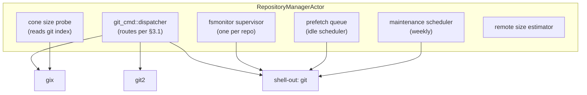
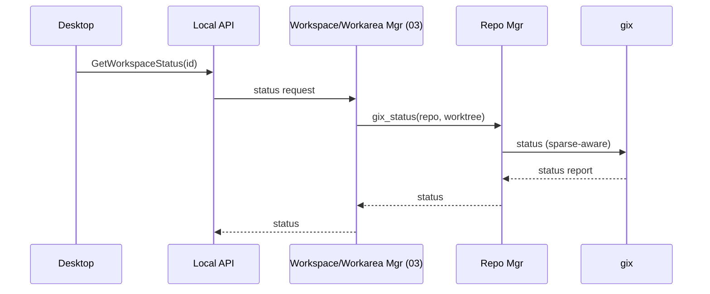
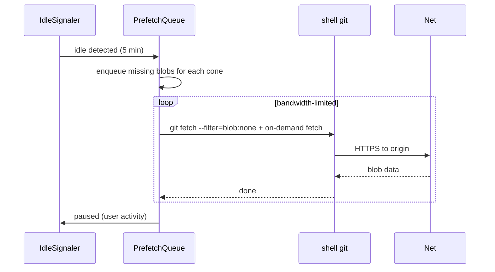

# 02 — Repository Manager

*Sub-system design doc. Inherits locked decisions from `00_Architecture_Overview.md` §6.3 (hybrid `gix` + `git2` + shell-out, cone-mode-only sparse, fsmonitor + maintenance auto-applied).*

---

## 1. Purpose & scope

The Repository Manager owns the **git-as-a-resource** layer. It deals with whole repositories (one per `repositories` row in §4.1 of `09_Persistence.md`), not individual worktrees (those belong to workareas in Workspace, Workarea & Session Manager, doc 03).

It owns:

- **Clone strategies** — full, blobless, treeless. First-time and reconfiguration.
- **Sparse checkout configuration** — at the repository level (defaults) and per-worktree (set by 03).
- **Sparse-index lifecycle** — always-on when sparse is on.
- **Blob pre-fetch** — eager (for current HEAD or cone), and idle background.
- **Filesystem monitor (fsmonitor) daemon lifecycle** — start, stop, supervise.
- **Git maintenance** — `git maintenance start`, weekly schedule.
- **Fetch / refresh** — periodic and on-demand.
- **Repository-level git config** — applies the locked performance settings (`core.fsmonitor`, `core.untrackedCache`, `feature.manyFiles`, `core.commitGraph`).

It does **not** own: branches (03), worktrees (03), commit operations (04 via the agent), push (13 via VCS).

---

## 2. Phase scope

| Phase | What ships |
|---|---|
| **V0.1** | Full clone only. Auto-applies `core.fsmonitor`, `core.untrackedCache`. No sparse, no blobless. Fetch on demand. |
| **V1.0** | + blobless / treeless clones. + sparse + cone + sparse-index. + plan-mode cone suggestion hook (delegates to Maestro 08). + idle blob pre-fetch. + repo size detection → recommend strategy. + fsmonitor supervision. + maintenance schedule. + per-repo bandwidth limits. |
| **V2.0** | + sparse-cone learning mode (observes which files the agent touches; proposes cone refinements). + multi-machine object-database sharing (advanced; for remote-host topology). |

---

## 3. Key design decisions (sub-system-internal)

### 3.1 Git command dispatcher: routing per operation

The locked decision (00 §6.3) is a hybrid stack. Routing table:

| Operation | Tool | Reason |
|---|---|---|
| Initial clone (any strategy) | **`git` shell-out** | Sparse + blobless + depth flags work cleanly; cutting-edge git features supported |
| `git sparse-checkout init/set/add/reapply` | **`git` shell-out** | Same — sparse-cone behavior is git's authoritative |
| `git maintenance start` and the maintenance cron | **`git` shell-out** | This is literally configuring git's own maintenance daemon |
| `git fetch` (incremental) | **`gix`** when available, **`git` shell-out** as fallback | gix has good fetch support; falls back if a code path isn't implemented |
| `git status` | **`gix`** | Hottest path; sparse-aware; fast |
| `git log` (range walks) | **`gix`** | Streaming, fast |
| `git diff` (tree → tree, tree → index) | **`gix`** | Used by Workspace Mgr (03) and the Diff viewer |
| `git rev-parse` and ref lookups | **`gix`** | Trivial, fast |
| `git worktree add/remove/list` | **`git` shell-out** | Worktree subcommand has subtle behavior; just use git |
| Merge, rebase, cherry-pick | **`git` shell-out** | Used rarely from Core; never on a hot path |
| Blob fetch on demand (partial clone) | Implicit; **`git` shell-out** for `git cat-file --batch` and similar | Triggered automatically by git when a missing blob is read |

The `git_cmd::*` module wraps each tool with a uniform `Result<T, RepoError>` interface. Callers in other sub-systems pick a function name, not a tool.

### 3.2 Cone selection at workarea creation: ergonomics

Sparse cones are per **(workarea, repo)** — each repo in each workarea has its own cone set. This means:
- Different workareas of the same workspace can use different cones for the same repo (rare but supported).
- Cones are stored in `workarea_repos.sparse_cones_json` (09 §4.1).

**Default cones inheritance:** A new workarea inherits the **workspace's** per-repo cone defaults (from `workspace_repos.cone_defaults_json` in `settings_json`, if present); workspace defaults inherit from the **repository's** `cone_defaults_json` (09 §4.1). User can override per-(workarea, repo) at create time.

**Plan-mode suggestion:** When workarea creation comes from an issue (Linear, GitHub), the Repo Mgr exposes a `suggest_cones(repo, issue_text)` interface per repo. This delegates to the Maestro Agent (08) — *not* implemented here. The Repo Mgr just publishes the interface.

**File-count and size telemetry:** For each cone the user considers, the Repo Mgr computes (file count, disk size) from the git index. This drives the cone-picker UI in 15.

### 3.3 Pre-fetch policy

When sparse + blobless are both on, the repo has commit/tree objects but lazy blobs. The pre-fetch policy decides which blobs to materialize ahead of agent need.

**Three triggers:**

1. **At worktree create** — fetch all blobs for files inside the new (workarea, repo)'s cone @ HEAD. (Settable: "Pre-fetch blobs for the workarea's sparse cone".)
2. **Eagerly on HEAD update** — fetch all blobs touched by the new commits in each (workarea, repo)'s cone. Default ON.
3. **Idle background** — when the machine is on AC + Wi-Fi + idle for longer than the configured idle threshold, walk each (workarea, repo)'s cone and fetch any missing blobs. Default ON; respects bandwidth limits.

**Idle threshold** is configurable in Settings → Performance, default **5 minutes**. The idle signal comes from the Local API (no foreground client activity in the configured window). Power users tuning for aggressive pre-fetch can drop to 2 min; users sensitive to background activity can raise it.

Pre-fetch is rate-limited and pausable. The Tray surfaces "syncing" status when active.

### 3.4 Fsmonitor lifecycle

`git`'s built-in fsmonitor daemon (`git fsmonitor--daemon start`) needs to be running per repo. The Repo Mgr:

1. On project init, sets `core.fsmonitor = true` and starts the daemon.
2. Tracks the daemon PID in `repositories.fs_monitor_pid`.
3. On Core start, checks if daemons are alive; restarts if not.
4. On Core graceful shutdown: leaves daemons running (they're independent).

### 3.5 Repo-size auto-recommendation

On project add, the Repo Mgr does a `git ls-remote --heads` and an estimated-size probe (HEAD of default branch + `git rev-list --objects --count`). Heuristic:

- `< 1 GB` → recommend Full clone
- `1–10 GB` → recommend Blobless, full files on disk
- `> 10 GB` → recommend Blobless + Sparse (with cone picker)

The user sees the recommendation in the New Project dialog (15) and can override.

---

## 4. Data model

The Repo Mgr writes/reads `repositories` (defined in 09 §4.1). It also maintains some on-disk state under each repo:

```
~/concerto/repos/<repository_id>/
├── git/                       # the bare-ish .git dir; one per repository
│   ├── objects/               # shared across worktrees
│   ├── refs/
│   ├── config
│   ├── fsmonitor.pid
│   └── concerto-state.json    # last-fetched-at, prefetch queue cursor
├── worktrees/                 # symlinked from each (workarea, repo) site
│   └── <workarea_id>__<repo_name>/   # → ~/concerto/workspaces/<workspace>/<workarea>/<repo>/
│   └── ...
```

The `concerto-state.json` is durable repo-scoped state that doesn't belong in SQLite (it's repo-local; if you copy the repo, it travels with it).

```json
{
    "last_fetch_at": 1716800000,
    "last_maintenance_at": 1716700000,
    "prefetch_cursor": "<commit-sha>",
    "size_bytes": 42000000000,
    "object_count": 18000000
}
```

---

## 5. Interfaces

### 5.1 Public Rust API (consumed by 03, 04, 13)

```rust
pub struct RepoManagerHandle { /* opaque */ }

impl RepoManagerHandle {
    pub async fn add_project_repository(
        &self,
        project_id: ProjectId,
        url: GitUrl,
        strategy: CloneStrategy,
    ) -> Result<RepositoryId>;

    pub async fn clone(&self, repo: RepositoryId, progress: ProgressTx) -> Result<()>;

    pub async fn fetch(&self, repo: RepositoryId) -> Result<FetchReport>;

    pub async fn set_workarea_repo_cones(&self, workarea: WorkareaId, repo: RepositoryId, cones: Vec<ConePath>) -> Result<()>;

    pub async fn list_branches(&self, repo: RepositoryId) -> Result<Vec<BranchRef>>;

    pub async fn list_paths_in_cone(
        &self,
        repo: RepositoryId,
        cones: &[ConePath],
    ) -> Result<ConeStats>;     // file count, disk size estimate

    pub async fn diff_to_main(&self, repo: RepositoryId, branch: &str) -> Result<DiffSummary>;

    pub async fn prewarm_blobs(
        &self,
        repo: RepositoryId,
        cones: &[ConePath],
        commit: &str,
    ) -> Result<PrewarmHandle>;  // cancellable

    pub async fn enable_fsmonitor(&self, repo: RepositoryId) -> Result<()>;

    pub async fn run_maintenance(&self, repo: RepositoryId) -> Result<()>;
}
```

### 5.2 gRPC surface (via Local API, doc 10)

```proto
service Repositories {
  rpc AddRepository(AddRepoRequest) returns (Repository);
  rpc Clone(CloneRequest) returns (stream CloneProgress);  // streaming progress
  rpc Fetch(FetchRequest) returns (FetchReport);
  rpc EstimateConeSize(EstimateRequest) returns (ConeStats);
  rpc PrewarmBlobs(PrewarmRequest) returns (stream PrewarmProgress);
}
```

### 5.3 Emits events

| Event | Stream | When |
|---|---|---|
| `repo.fetch_completed` | broadcast | After successful fetch |
| `repo.clone_progress` | per-clone | During clone (bytes received, objects counted) |
| `repo.prefetch_started/finished` | broadcast | Idle prefetch start/stop |
| `repo.size_warning` | broadcast | A repo crossed a size threshold; recommend sparse |
| `repo.fsmonitor_restarted` | broadcast | The fsmonitor daemon needed a restart |

---

## 6. Internal architecture



### 6.1 Concurrency model

- **One write per repository at a time.** A `Mutex<()>` per `repository_id` guards mutating operations (clone, fetch, sparse change, maintenance). Reads (status, diff, log) run concurrently.
- **Pre-fetch is global-rate-limited** to N concurrent operations across all repos (default 2) and a per-repo bandwidth cap.
- **Clone uses streaming progress.** The dispatcher pipes `git`'s stderr through a parser that emits `CloneProgress` events.

### 6.2 Repository directory shape

Repositories are **shared across workareas** that include them. All worktrees of the same repo (one per workarea that uses it) point at the same `.git` dir. The Repo Mgr maintains the canonical `.git`; Workspace Mgr (03) calls `git worktree add` to create entries that share the object database.

This is essential for the sparse + blobless story: a 40 GB repo's `.git/objects` is one tree on disk, shared by N workareas with potentially different cones. Each cone materializes only its blobs.

### 6.3 Idle pre-fetch scheduler

A loop that:

1. Checks: AC powered? On Wi-Fi (not metered)? Idle for longer than `settings.prefetch.idle_threshold_seconds` (default 300)?
2. For each repo with sparse + blobless: walk cones; for each missing blob in cones @ current HEAD of the repo's tracked branches; enqueue.
3. Drain enqueue with bandwidth limit. Cancellable if user activity resumes.

The idle signal comes from the Local API (heartbeats from connected clients).

---

## 7. Sequence diagrams — hot paths

### 7.1 First-time clone of a 40 GB monorepo (sparse + blobless)

```mermaid
sequenceDiagram
    participant User
    participant DT as Desktop (15)
    participant API as Local API (10)
    participant RepoMgr as Repo Mgr
    participant Sh as shell git
    participant DB as Persistence (09)
    User->>DT: Add Project (URL)
    DT->>API: AddRepository
    API->>RepoMgr: add_project_repository
    RepoMgr->>RepoMgr: estimate size (ls-remote)
    RepoMgr-->>API: SizeReport (recommend blobless+sparse)
    API-->>DT: confirmation w/ recommendation
    User->>DT: pick cones
    DT->>API: Clone(strategy=blobless+sparse, cones=[…])
    API->>RepoMgr: clone(repo, progress)
    RepoMgr->>Sh: git clone --filter=blob:none --sparse --no-checkout
    Sh-->>RepoMgr: progress stream
    RepoMgr-->>API: CloneProgress
    Sh-->>RepoMgr: clone done
    RepoMgr->>Sh: git sparse-checkout init --cone; set ...
    RepoMgr->>Sh: git checkout
    RepoMgr->>Sh: git config core.fsmonitor true; ... feature.manyFiles true
    RepoMgr->>RepoMgr: enable_fsmonitor
    RepoMgr->>DB: persist Repository row
    RepoMgr-->>API: ok
    API-->>DT: ready
```

### 7.2 `git status` on hot path (sparse + sparse-index)



Target: < 100 ms on a 2M-file repo with a 100k-file sparse cone.

### 7.3 Idle pre-fetch



---

## 8. Error handling & failure modes

| Failure | Detection | Response |
|---|---|---|
| Clone interrupted mid-flight | exit code from `git clone` non-zero | Leave partial dir; expose a `Resume` action that runs `git fetch` to complete |
| Blob fetch failure (offline, sparse) | git reports missing blob to agent | Surface as a tool error; UI suggests "go online and retry" |
| Sparse-cone path doesn't exist in repo | `git sparse-checkout set` warns | Reject the path with a clear error in the cone-picker UI |
| Fsmonitor daemon crash | Liveness check on `fs_monitor_pid` | Restart it (rate-limited); if 3 restarts in 60s, disable fsmonitor for that repo and warn |
| Maintenance failure | Exit code | Log; retry next scheduled window |
| Disk full during clone | I/O error | Abort clone cleanly (delete partial); surface to user with required disk estimate |
| Submodule encountered | `gix` doesn't fully support | Default: ignore submodules; surface a warning. V1.5+: full submodule support |
| LFS pointer | Encountered during checkout | Trigger `git lfs pull` if LFS installed; otherwise pass through pointer and warn |
| Non-cone-mode sparse config (pre-existing repo) | Reading `core.sparseCheckoutCone` returns false | Force-set to true on add, document in audit log |

---

## 9. Dependencies on other sub-systems

| Sub-system | How |
|---|---|
| **09 Persistence** | Reads/writes `repositories` table; writes audit events |
| **01 Runtime** | Hosted as actor |
| **08 Maestro** (V1.0+) | For `suggest_cones` plan-mode call |

Consumers of Repo Mgr:
- **03 Workspace/Workarea Mgr** — calls into Repo Mgr for clone, fetch, per-(workarea, repo) sparse setup, diff
- **04 Agent Supervisor** — reads HEAD ref, status (rare; mostly via 03)
- **13 VCS Provider** — reads remote URL to call GitHub APIs

---

## 10. Testing strategy

| Layer | What | How |
|---|---|---|
| Unit | Command dispatcher routes correctly per operation | Stub each backend, assert which one is invoked |
| Unit | Cone-stats computation | Fixture: small repo with known structure |
| Integration | Full clone + sparse + blobless against a real remote | Use a self-hosted gitea / a public sample repo (e.g., `git/git` for size) |
| Integration | Fsmonitor lifecycle | Start, check pid, kill externally, assert restart |
| Performance | `gix status` latency on monorepo fixture (synthetic 2M-file repo) | Custom fixture; criterion bench |
| Failure | Clone interrupted at every 10% checkpoint | Inject SIGTERM at progress thresholds |
| Cross-platform | Sparse, fsmonitor, maintenance on Mac/Win/Linux | Platform-matrix CI |

---

## 11. Open questions / deferred

*All items resolved. See **§12 Resolved decisions log** below.*

## 12. Resolved decisions log

| # | Question | Decision | Where in doc |
|---|---|---|---|
| R-1 | Expose `treeless` clone in the UI? | **Hide for V1.0** — available only via `concerto.json` for advanced users. Promote to UI in V1.5 if data shows demand. The trade-off (no offline log walks) is hard to communicate to most users. | §3.1 routing table |
| R-2 | Default bandwidth limits | **Wi-Fi unlimited, metered off** — OS reports metered status; we respect it. User can cap manually in Settings. | §3.3 pre-fetch policy |
| R-3 | Idle threshold for background pre-fetch | **Configurable, default 5 min** — exposed in Settings → Performance. Power users can dial down (2 min more aggressive) or up (15 min conservative). | §3.3, §6.3 |
| R-4 | LFS support level | **V1.0 best-effort** — invoke `git lfs pull` if `git lfs` is installed; LFS pointers pass through otherwise. Don't bundle LFS ourselves. Surface LFS-tracked paths in the UI. Promote to first-class V1.5 if beta data demands. | §3.1 routing, §8 failure modes |
| R-5 | Submodules support level | **V1.0 read-only** — visible as nested entries, cloned but not recursively updated. User manages with `git submodule` manually. Full support V1.5. | §8 failure modes |
| R-6 | Multi-machine shared object DB (NFS `.git`) | **V2.0 only** for remote-host topology. Single-host operation in V1.0. | (deferred) |
| R-7 | gix unimplemented call handling | **Auto-fallback in the dispatcher** — gix → git2 → shell-out. Three implementations stay aligned per operation via CI tests. | §3.1, §6.1 |
| R-8 | Cone-learning mode | **V2.0** — wait for V1.0 telemetry on whether users need this before designing. Depends on `04` instrumentation. | (deferred) |

---

*End of `02_Repository_Manager.md`. Worktrees and branches are owned by `03_Workspace_Session_Manager.md`. GitHub integration by `13_VCS_Provider_Integration.md`.*
