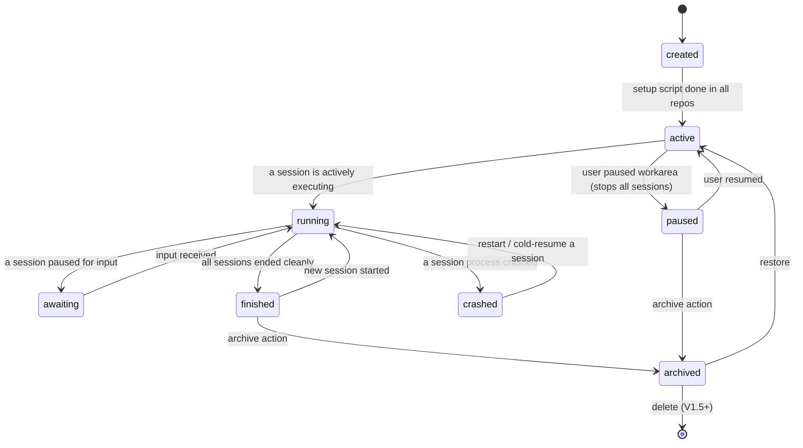
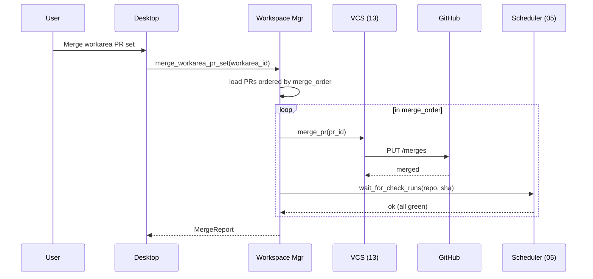
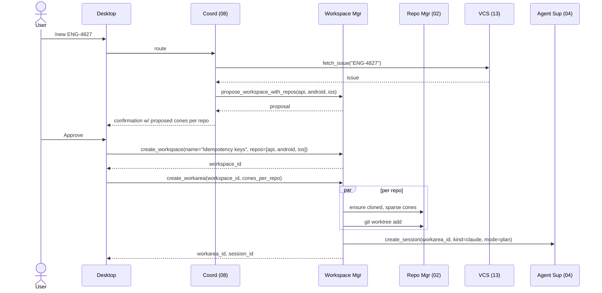
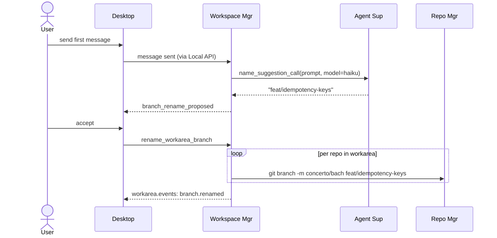
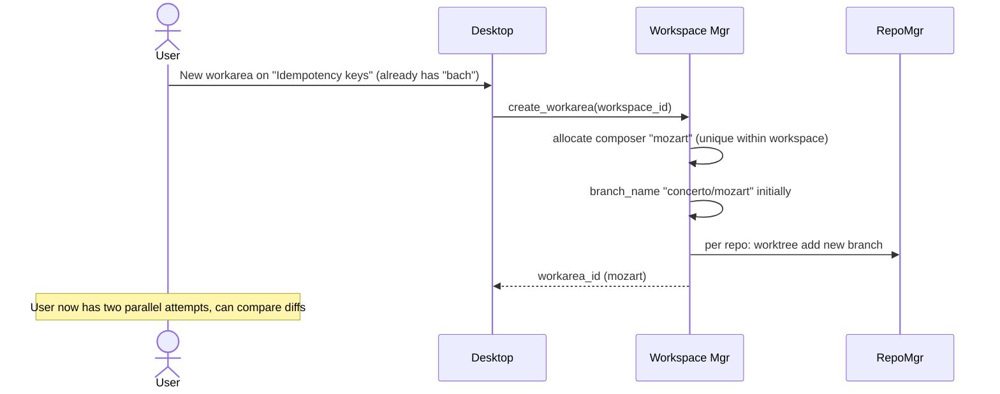

# 03 — Workspace, Workarea & Session Manager

*Sub-system design doc. Inherits locked decisions from `00_Architecture_Overview.md`. Schema reference: `09_Persistence.md` §4.1. Git operations delegate to `02_Repository_Manager.md`. PR/VCS operations delegate to `13_VCS_Provider_Integration.md`. Agent processes managed by `04_Agent_Supervisor.md`.*

---

## 1. Purpose & scope

This sub-system owns the **three-level hierarchy** that organizes user work in Concerto:

```
Project
  └── Workspace            (logical workstream; 1..N repos)
        └── Workarea       (worktree + branch; "bach", "mozart")
              └── Session  (an agent run — Claude / Codex / Gemini)
```

- **Workspace** — a unit of work the user is doing. Defines which repos are involved. No on-disk artifact of its own; it is a logical container.
- **Workarea** — a specific attempt at the workspace's task. Has a composer name, a branch name applied across all the workspace's repos, and worktrees on disk. Many workareas per workspace are supported (parallel approaches).
- **Session** — a specific agent run on a workarea. One LLM context, one chat thread. Multiple sessions per workarea (multi-agent: Claude alongside Codex) are supported.

It owns:

- **Lifecycle** at all three levels: create, archive, restore, pause, resume.
- **Worktree management** — `git worktree add/remove` per (workarea, repo), branch creation, composer-name allocation.
- **`.context/` directory** per workarea — gitignored scratch space the agent and Concerto share.
- **Files-to-copy** — apply repo-configured gitignored copies (e.g., `.env`) into each repo's worktree on workarea create.
- **Setup / run / archive scripts** — invoke at the right lifecycle points; capture exit codes.
- **Branch-name management** — workarea's `branch_name` applied across repos; rename hook after first message.
- **Per-workarea PR set** — implicit set of PRs (one per repo with commits in this workarea). Merge ordering, coordinated merge/revert.
- **Workarea status FSM** — `created | active | running | awaiting | finished | paused | crashed | archived`.
- **Permission-mode inheritance** — `project → workspace → workarea → session`.

It does **not** own: agent execution (04 owns sessions as agent processes), git internals (02), GitHub API (13), the diff rendering (clients do that using diff data 02 + 13 produce).

---

## 2. Phase scope

| Phase | What ships |
|---|---|
| **V0.1** | Single-repo workspaces only (each workspace has exactly one repo). Workarea + session lifecycle. Composers naming. Files-to-copy. Setup / run / archive scripts. Archive/restore. |
| **V1.0** | + multi-repo workspaces (1..N repos per workspace). + multiple workareas per workspace (parallel attempts). + multiple sessions per workarea (multi-agent). + per-workarea PR set + coordinated merge. + branch-rename hook (calls 08). + per-workarea `exclude_from_maestro` toggle. |
| **V2.0** | + per-repo branch override (workarea can use different branch names per repo for advanced cases). + workarea export/import (move between machines). |

---

## 3. Key design decisions (sub-system-internal)

### 3.1 Workarea status as an explicit FSM

**Choice:** Each workarea has a typed state. Workspace and session have lifecycle too, but the **workarea is the central FSM** because it owns the worktrees and most state transitions.



A workarea's effective status is derived from the union of its sessions' states (e.g., one session `awaiting` → workarea `awaiting`).

Workspace status is simpler: `active | archived`. A workspace archives when all its workareas are archived (or via explicit "archive workspace" which archives all workareas first).

### 3.2 Workspace creation: declare the repos, don't materialize anything yet

**Choice:** Creating a workspace is a **logical** operation:

1. Pick name + slug (e.g., "Idempotency keys" → `idempotency-keys`).
2. Pick which repos from the project belong (1..N — single-repo workspaces are workspaces with `len(workspace_repos) == 1`).
3. Set permission-mode defaults if user wants (else inherit from project).
4. Persist `workspaces` + `workspace_repos` rows.

**No worktree on disk yet.** The first workarea materializes the worktrees.

### 3.3 Workarea creation: this is where disk actually gets written

**Choice:** Creating a workarea:

1. Allocate composer name (unique within workspace).
2. Compute `branch_name` (initially `concerto/<composer>` placeholder; renamed via §3.6).
3. Create `worktree_root` directory at `<workspace.slug>/<composer>/`.
4. For each repo in `workspace_repos`:
   - Repo Mgr (02): ensure the repo's `.git` is cloned (with the project's clone_strategy).
   - Create the workarea-side worktree: `git worktree add <worktree_root>/<repo.name> -b <branch_name>`.
   - Set sparse cones if `workarea_repos.sparse_cones_json` is non-empty (inherits from `workspace_repos` defaults, which inherit from `repositories.cone_defaults_json`).
   - Apply files-to-copy patterns from the project's settings.
5. Create `.context/` skeleton (`PROMPT.md`, `todos.md`, `scratch/`) at the workarea root.
6. Persist `workareas` + `workarea_repos` rows.
7. Run setup script if configured — once per workarea, with `CONCERTO_WORKAREA_ROOT` env var pointing at the workarea root (so the setup script can iterate repos with `for d in */; do (cd "$d" && <setup>); done`).
8. Transition `created → active`.
9. If requested, start a default session (e.g., Claude in plan mode).

### 3.4 Session creation: one agent on one workarea

**Choice:** Creating a session:

1. Pick agent kind + version + model + permission mode (per-session, inherits from workarea).
2. Spawn agent via 04 (which uses `concerto-agent-host` per `04 §3.9`).
3. Agent's working directory: workarea root (`worktree_root`), **not** any individual repo's worktree.
4. Agent gets the Concerto preamble system prompt (per `04 §3.10`) which describes the multi-repo layout.
5. Persist `sessions` row + a fresh `chats` row.
6. Stream the agent's events back via `session.events.<sid>`.

Multiple sessions on the same workarea are fine. They share files (the worktrees) but have independent chat threads. A per-workarea edit mutex (`04 §3.5`) serializes file writes across sessions on the same workarea.

### 3.5 Composers naming pool

**Choice:** A fixed list of ~500 composer names. Each `workareas.composer_name` is unique **within the workspace** (different workspaces can each have their own "bach"). When the pool is exhausted within one workspace, append `-2`, `-3`, etc.

The list ships with the binary; user can override per project via `concerto.json` (`naming_pool: [...]`).

Workspaces themselves get **user-supplied names**, not composers (e.g., "Idempotency keys for payments").

### 3.6 Branch-rename suggestion

**Choice:** When the first user message arrives in any session of a workarea, the workarea fires a one-shot LLM call (via 04's name-suggestion mode) that proposes a branch name based on the prompt. The user confirms or edits.

On confirm, **every repo's worktree in this workarea is renamed**: `git branch -m <old> <new>` per repo. The `workareas.branch_name` field updates. If a repo's branch already exists on remote with a different name, the rename is skipped for that repo and the user is warned.

### 3.7 Archive semantics — at each level

**Choice:** Archive is soft and lives at all three levels.

**Archive a session:** stop the agent (clean shutdown). Chat history remains. Audit log records. The workarea continues with its other sessions.

**Archive a workarea:**
1. Stop all sessions in the workarea (each cleanly).
2. Run the repo's `scripts.archive` script per repo (e.g., `docker compose down`). Errors logged.
3. Optionally remove the worktree from disk per repo (configurable; default keep so restore is fast).
4. Set `workareas.archived_at`.
5. Chat history retained.

**Archive a workspace:** archives all its workareas first (cascading). Sets `workspaces.archived_at`.

Restore reverses (1) and (3) but does not silently reuse old permission modes — restored workareas revert to the workspace's current default (per `03 §3.10` — security stance against silently resuming `yolo`).

### 3.8 Permission mode hierarchy

**Choice:** Permission mode (`04 §3.10`) inherits along the hierarchy. Effective mode is the first non-NULL value in this lookup order:

1. `sessions.permission_mode` (set at session start; can be changed mid-session per session)
2. `workareas.permission_mode` (set when workarea is created; can be changed)
3. `workspaces.permission_mode` (workspace default; can be changed)
4. `projects.settings_json.default_permission_mode`
5. Global default: `normal`

Same chain for `bypass_destructive_guard`.

Per the security-policy clamps in `12 §3.8`, `managed.json.maxPermissionMode` caps the entire chain.

**Entry ceremony for elevation** is enforced at any level: typing `"I understand"` for yolo; `"I understand the risks"` for bypass. The audit log records which level was changed and by which device.

### 3.9 Per-workarea PR set (implicit)

**Choice:** A workarea's PR set is **all rows in `pull_requests` with `workarea_id = <this workarea>`**. No separate join table.

When the user clicks "Create PR" on a repo within the workarea, VCS (13) creates that PR and adds it to the workarea's set. When the user clicks "Create PRs for all repos with commits," VCS iterates and creates each.

The merge plan is the ordered list of (repo, PR) tuples derived from `pull_requests.merge_order` for the workarea. Coordinated merge invokes each in order, waits for checks (via Scheduler 05 §3.9), and surfaces failures.

Coordinated revert: each member in reverse merge_order via `git revert` PRs (or hard-reset where user opts in).

### 3.10 Files-to-copy (with optional symlink mode)

**Choice:** Patterns from project settings (`projects.settings_json.files_to_copy_rules`, optionally overridden by a checked-in `.worktreeinclude` file at the project's reference repo root — see §3.13) are matched against the project's reference worktree (the user can designate one repo's main worktree as the "reference," default: first listed repo) and **either copied or symlinked** into each repo's worktree in the new workarea at workarea-create time.

Each rule has a `mode`:

| `mode` | Behavior | When to use |
|---|---|---|
| `copy` *(default)* | One-shot copy at workarea create. Not synced afterward. | `.env` files the user wants to diverge per workarea; `.vscode/settings.json` workareas may locally tweak. |
| `symlink` | Relative symlink from the workarea path to the reference worktree's source. Updates to the source propagate live. On Windows, falls back to a directory junction for directories and a hardlink for files; on filesystems without symlink support, falls back to `copy` with a one-time per-workarea warning. | Heavy shared assets (prebuilt CLI binaries, shared `.cargo/config.toml`, large generated caches) where divergence is undesirable. |
| `exclude` | Skip — gitignore-style negation, applied after include rules in declaration order. | Surgical exclusions inside a broader glob match. |

**`.worktreeinclude` syntax** (checked-in, team-shared; precedence over local DB rules):

```
# Comments allowed
.env*                            # default mode = copy (no annotation)
.env.local                    !  # trailing `!` = symlink
.vscode/                         # copy (directory)
node_modules-cache/           !  # symlink (directory)
!.env.production                 # leading `!` = exclude (gitignore-style)
```

**Schema-equivalent JSON** (used when only DB-stored rules apply):

```json
"files_to_copy_rules": [
  { "pattern": ".env*",            "mode": "copy"    },
  { "pattern": ".env.local",       "mode": "symlink" },
  { "pattern": ".vscode/",         "mode": "copy"    },
  { "pattern": ".env.production",  "mode": "exclude" }
]
```

Resolution order: includes apply in declaration order; `exclude` rules win over earlier includes (gitignore semantics). When two rules touch the same destination path, the **last matching rule wins** — so a later `.env.local !` symlink rule overrides an earlier `.env* copy`.

If the same pattern matches in multiple source repos (rare), copies/symlinks happen per repo (each repo's `.env` goes into that repo's worktree).

**Symlink safety.** Symlinks are created with paths relative to the workarea worktree so workareas remain movable. If the source file is deleted post-link, the broken link surfaces a per-workarea warning chip ("symlink to `<path>` is broken") but does not block the workarea. Symlinks never traverse outside the project root — paths that would escape are rejected with an error at workarea create.

### 3.11 Workarea-level vs session-level scopes — what lives where

| Scope | What lives there |
|---|---|
| **Workspace** | repos in the workstream; default permission mode; logical name |
| **Workarea** | worktrees on disk; branch name; PR set; todos; .context/; setup/run/archive scripts running state; sparse cones per repo |
| **Session** | agent process; chat history; checkpoints (refs); tool approvals; per-session permission overrides |

A workarea outlives any single session (sessions come and go). A workspace outlives any single workarea (workareas come and go).

### 3.13 Project / Repository Settings — precedence and override semantics

**The problem.** A team wants `scripts.setup` checked in so every developer runs the same setup; a single developer wants to override it for a one-off local quirk; the org wants to disable `yolo` mode regardless of project. Concerto's answer is a three-layer precedence stack.

**Three places where settings can live:**

| Layer | Where | Scope | Travels with |
|---|---|---|---|
| **Checked-in** | `<project_root>/.concerto/project_settings.json` plus per-repo `<repo_root>/.concerto/action_prefs.toml` and `<repo_root>/.worktreeinclude` | Project / repo | The git history (team-shared) |
| **Local DB** | `projects.settings_json` / `repositories.action_prefs_json` rows in SQLite | Project / repo | The user's machine only |
| **Managed** | `~/.concerto/managed.json` | All projects on the machine | The org via MDM |

**Precedence (highest wins):**

```
managed.json  >  checked-in files  >  local DB rows  >  global defaults
```

When a higher layer sets a field, the matching control in Settings → Project is rendered **read-only with a small lock icon** and a tooltip naming the source (`"Locked by .concerto/project_settings.json"` / `"Locked by org policy"`). The user can still see the effective value.

**Per-field, not per-file.** A project may have `scripts` checked in but `files_to_copy_rules` only locally — only `scripts` is locked. Each field is resolved independently.

**Live reload.** The Core watches the checked-in files via `notify`-rs and re-resolves within ~500ms of save. Removing a field from a higher layer (deleting the line) immediately re-enables the corresponding control without a restart.

**Personal-script escape hatch.** A field listed in the per-machine `~/.concerto/concerto.json[project_id].opt_out_of_checked_in_fields` is ignored even if checked in. Used rarely (e.g., a developer with a different local shell who can't run the team's setup script). The opt-out is surfaced in Settings → Project → Overrides with a "your machine only — not shared with team" banner. Expressed as positive opt-out rather than implicit fallthrough, so the divergence is always visible.

**Audit.** Resolved-effective values are logged once per Core start: `ProjectSettingsResolved{project_id, field, value_source}` per field. Useful when "why does this work on my machine but not yours" investigations begin.

**File schemas.**

`project_settings.json` (checked-in; superset of the local-DB row):

```jsonc
{
  "$schema": "https://concerto.build/schemas/project_settings.json",
  "scripts": { "setup": "...", "setup_workarea": "...", "run": "...", "archive": "..." },
  "run_script_mode": "concurrent",
  "enterprise_data_privacy": false,
  "default_permission_mode": "normal",
  "default_deliberation_mode": "normal",      // see 04 §3.12
  "default_reasoning_level": "medium",        // see 04 §3.12
  "files_to_copy_rules": [ /* §3.10 */ ],
  "writable_paths_outside_worktree": [ ... ]
}
```

`.worktreeinclude` — checked-in; targeted; see §3.10.

Per-repo `.concerto/action_prefs.toml` — checked-in; see `04 §3.13`.

The published JSON schema (`https://concerto.build/schemas/project_settings.json`) drives editor autocomplete in VS Code / JetBrains.

### 3.14 Exclude from Maestro — per workarea

**Choice:** The `exclude_from_maestro` toggle (per `08 §3.3`) lives on the **workarea**, not the workspace. A user can have multiple workareas in one workspace, some of which are sensitive (e.g., investigating a security incident in `mozart` workarea) and should not be summarized to the Concerto chat, while the others (`bach`) participate normally.

The flag is stored in `workareas.settings_json.exclude_from_maestro`.

---

## 4. Data model

Primary tables (defined in `09_Persistence.md §4.1, §4.2, §4.5`):

- `workspaces`, `workspace_repos`
- `workareas`, `workarea_repos`
- `sessions`, `chats`, `chat_messages`
- `checkpoints` (per (workarea, repo))
- `tool_approvals` (per session)
- `todos` (per workarea)
- `pull_requests` (per (workarea, repo))

### 4.1 In-memory derived state

For active workareas, a `WorkareaContext` lives in memory:

```rust
pub struct WorkareaContext {
    pub id: WorkareaId,
    pub workspace_id: WorkspaceId,
    pub composer_name: String,
    pub branch_name: String,
    pub worktree_root: PathBuf,
    pub status: Status,

    // The repos this workarea has worktrees for, with their per-repo state
    pub repos: Vec<WorkareaRepoContext>,

    // Active sessions (0..N)
    pub sessions: Vec<SessionId>,
    pub last_diff_hash_per_repo: HashMap<RepositoryId, String>,

    // Run-script state per repo (some projects run a dev server per repo)
    pub run_script_procs: HashMap<RepositoryId, Pid>,
    pub allocated_run_ports: HashMap<RepositoryId, u16>,

    /// Effective permission mode after inheritance from workspace + project.
    pub permission_mode: PermissionMode,
    pub bypass_destructive_guard: bool,
}

pub struct WorkareaRepoContext {
    pub repository_id: RepositoryId,
    pub repo_name: String,                     // for path & UI display
    pub worktree_path: PathBuf,                // <worktree_root>/<repo_name>/
    pub branch: String,                        // usually == workarea.branch_name; may differ if overridden
    pub sparse_cones: Vec<ConePath>,
}
```

### 4.2 The `.context/` directory

```
<worktree_root>/.context/
├── PROMPT.md          # workarea-level instructions for all sessions
├── concerto.log       # tail of last 1000 lines of session log
├── todos.md           # mirrored from todos table for agent read/edit
├── checkpoints/       # checkpoint metadata; refs are in repo .git
└── scratch/           # agent-writable scratch (gitignored)
```

Gitignored across all repos in the workarea — the manager adds `.context/` to each repo's `.git/info/exclude` on workarea create.

---

## 5. Interfaces

### 5.1 Public Rust API (consumed by 04, 05, 08, 10)

```rust
pub struct WorkspaceManagerHandle { /* opaque */ }

impl WorkspaceManagerHandle {
    // Workspaces (logical)
    pub async fn create_workspace(&self, req: CreateWorkspace) -> Result<WorkspaceId>;
    pub async fn list_workspaces(&self, project: ProjectId) -> Result<Vec<WorkspaceSummary>>;
    pub async fn get_workspace(&self, id: WorkspaceId) -> Result<Workspace>;
    pub async fn update_workspace_repos(&self, id: WorkspaceId, repos: Vec<RepositoryId>) -> Result<()>;
    pub async fn archive_workspace(&self, id: WorkspaceId) -> Result<()>;
    pub async fn restore_workspace(&self, id: WorkspaceId) -> Result<()>;

    // Workareas (on-disk attempts)
    pub async fn create_workarea(&self, req: CreateWorkarea) -> Result<WorkareaId>;
    pub async fn list_workareas(&self, workspace: WorkspaceId) -> Result<Vec<WorkareaSummary>>;
    pub async fn get_workarea(&self, id: WorkareaId) -> Result<WorkareaContext>;
    pub async fn pause_workarea(&self, id: WorkareaId) -> Result<()>;
    pub async fn resume_workarea(&self, id: WorkareaId) -> Result<()>;
    pub async fn archive_workarea(&self, id: WorkareaId, opts: ArchiveOpts) -> Result<()>;
    pub async fn restore_workarea(&self, id: WorkareaId) -> Result<()>;
    pub async fn set_workarea_cones(&self, id: WorkareaId, repo: RepositoryId, cones: Vec<ConePath>) -> Result<()>;
    pub async fn rename_workarea_branch(&self, id: WorkareaId, new: &str) -> Result<()>;
    pub async fn suggest_workarea_branch_name(&self, id: WorkareaId) -> Result<String>;

    // Sessions (agent runs on a workarea)
    pub async fn create_session(&self, req: CreateSession) -> Result<SessionId>;
    pub async fn list_sessions(&self, workarea: WorkareaId) -> Result<Vec<SessionSummary>>;
    pub async fn stop_session(&self, id: SessionId, reason: StopReason) -> Result<()>;

    // Run scripts (per-repo dev servers within a workarea)
    pub async fn run_dev_server(&self, workarea: WorkareaId, repo: RepositoryId) -> Result<Pid>;
    pub async fn stop_dev_server(&self, workarea: WorkareaId, repo: RepositoryId) -> Result<()>;

    // PR set (implicit per workarea)
    pub async fn create_pr_for_repo(&self, workarea: WorkareaId, repo: RepositoryId) -> Result<PullRequestId>;
    pub async fn list_prs_in_workarea(&self, workarea: WorkareaId) -> Result<Vec<PullRequest>>;
    pub async fn get_merge_plan(&self, workarea: WorkareaId) -> Result<MergePlan>;
    pub async fn merge_workarea_pr_set(&self, workarea: WorkareaId) -> Result<MergeReport>;
    pub async fn revert_workarea_pr_set(&self, workarea: WorkareaId) -> Result<RevertReport>;

    // FSM transition (called by 04 mostly)
    pub async fn transition_workarea(&self, id: WorkareaId, new: Status) -> Result<()>;
}
```

### 5.2 gRPC surface

Three services mirror the API (defined in `10 §5.1`): `Workspaces`, `Workareas`, `Sessions`.

### 5.3 Streams emitted

| Stream | Subject | When |
|---|---|---|
| `workspace.events` | broadcast | Workspace created / archived / repos updated |
| `workarea.events` | filter `workarea_id` | Status changes, diff dirty, run-script state, branch rename, PR set changes |
| `session.events` | filter `session_id` | Per-session events from agent (forwarded from 04) |
| `diff.<workarea_id>.<repo_id>` | required filters | Per-repo file changes within a workarea |
| `checks.<workarea_id>.<repo_id>` | required filters | Per-repo CI / PR / deploy state changes |

The diff and checks streams are **per (workarea, repo)** because the UI's per-repo tabs (your Q5) subscribe at this granularity.

---

## 6. Internal architecture

```mermaid
flowchart TB
    subgraph WSM["WorkspaceManagerActor"]
        LifecycleW["Workspace lifecycle"]
        LifecycleA["Workarea lifecycle FSM<br/>(per workarea)"]
        LifecycleS["Session lifecycle<br/>(delegates to 04)"]
        SessionMgr["Session manager"]
        ScriptRunner["Setup / Run / Archive<br/>script runner per (workarea, repo)"]
        PortAllocator["Port allocator<br/>(CONCERTO_PORT per repo dev server)"]
        FCopy["Files-to-copy resolver"]
        BranchRename["Branch-rename hook<br/>(applies across repos in workarea)"]
        PrSet["PR set planner<br/>(per workarea)"]
        InheritResolver["Permission-mode<br/>inheritance resolver"]
        Tx["Transition log<br/>(audit + events)"]
    end
    LifecycleA -->|git worktree add per repo| RepoMgr["02 Repo Mgr"]
    LifecycleS -->|spawn session| AgentSup["04 Agent Sup"]
    LifecycleS -->|stop session| AgentSup
    LifecycleA -->|persist| Persist["09 Persistence"]
    PrSet -->|merge| VCS["13 VCS"]
    BranchRename -->|name-LLM call| AgentSup
```



### 6.1 Workspace creation in detail (multi-repo)

```
1. Validate request: project exists; repos all belong to project; slug valid + unique
2. Persist workspaces row (no on-disk action yet)
3. Persist workspace_repos rows for each chosen repo
4. Emit workspace.events: created
```

No worktrees yet. The user can review the workspace, edit the repo list, change permission defaults, then proceed to create the first workarea.

### 6.2 Workarea creation in detail (the heavy step)

```
1. Validate request: workspace exists; chosen sparse cones (per repo) valid
2. Allocate composer_name (unique within workspace)
3. Initial branch_name = "concerto/<composer>" (placeholder; rename hook applies after first message)
4. Create worktree_root directory: ~/concerto/workspaces/<slug>/<composer>/
5. For each repo in workspace_repos:
     a. Repo Mgr: ensure repo's .git is cloned (sparse + blobless per project settings)
     b. Repo Mgr: git worktree add <worktree_root>/<repo.name> -b <branch_name>
     c. Repo Mgr: apply sparse cones if any
     d. Files-to-copy resolver: apply patterns into this repo's worktree
     e. Persist workarea_repos row
6. Create .context/ skeleton
7. Persist workareas row
8. Run setup script (per-(workarea, repo) if scripts.setup configured per repo; or workarea-level if a `scripts.setup_workarea` is defined)
9. Transition created → active
10. If requested, start a default session (04 spawn agent)
11. Emit workarea.events: created
```

### 6.3 Multi-session on a workarea

Multiple sessions can coexist:
- Each session is independently spawned (potentially different agent kind / model / permission mode).
- Each has its own chat thread.
- All sessions share the workarea's worktrees and `.context/`.
- The per-workarea edit mutex (`04 §3.5`) serializes writes — if Claude is mid-edit, Codex's write blocks (10s timeout) and is reported.

### 6.4 Coordinated workarea PR-set merge



A failure mid-loop pauses the plan; the user sees "Step N of M failed — auto-revert?" UI on the workarea's PR set view.

### 6.5 Crash adoption on Core restart

On boot, the Workspace Mgr:

1. Loads workareas where `status NOT IN ('archived')`.
2. For each: probe the `worktree_root` path. If missing or partial, transition to `crashed`.
3. Reconcile sessions: for each `sessions` row in non-terminal state, check whether 04 successfully hot-resumed (per `04 §6.4`). If yes, the workarea stays at its prior state. If sessions cold-resumed or failed, FSM updates.
4. Dev-server processes are not auto-resumed (the user can restart from UI per `03 §6.5`).

---

## 7. Sequence diagrams — hot paths

### 7.1 Create workspace + first workarea from a Linear issue



### 7.2 Branch rename after first message (cross-repo apply)



### 7.3 Two workareas on same workspace (parallel approaches)



### 7.4 Add a second session to an existing workarea (multi-agent)

```mermaid
sequenceDiagram
    actor User
    participant DT as Desktop
    participant WSM as Workspace Mgr
    participant Sup as Agent Sup
    User->>DT: "+ Codex session" tab in bach workarea
    DT->>WSM: create_session(workarea_id, kind=codex)
    WSM->>Sup: start_agent (Concerto preamble + workarea root cwd)
    Sup-->>WSM: session_id
    WSM-->>DT: rendered as new session tab
    Note over Sup: Codex runs alongside Claude on the same files;<br/>per-workarea edit mutex serializes writes
```

---

## 8. Error handling & failure modes

| Failure | Detection | Response |
|---|---|---|
| Workarea composer-name conflict | Unique constraint | Auto-suffix with `-N`; persist + warn |
| Setup script fails (per repo) | ScriptRunner | Mark workarea active anyway; surface per-repo errors; "Re-run setup for `<repo>`" chip |
| `git worktree add` fails for one of N repos | Per-repo error | Mark workarea `partial`; the user can retry the failing repo or abandon the workarea |
| Run-script port collision | bind() fails | Allocate next port; persist |
| Branch already exists on remote with different content | Repo Mgr error | Rename target to `<branch>-N`; warn |
| Files-to-copy source missing | File system check | Skip for soft-existence patterns (`.env*`); error for explicit paths |
| Merge step fails (CI red post-merge) | VCS reports | Pause merge plan; "auto-revert?" prompt |
| Archive script hangs (any repo) | Timeout 60s | Kill; mark archive `partial`; user finishes manually |
| Worktree manually modified outside Concerto | Probe detects drift | Don't auto-fix; "drift detected" banner; user resyncs |
| Workarea has 0 repos (workspace had its repos removed) | At create | Reject create |
| Two workareas on same branch name within a workspace | Unique constraint on `(workspace_id, branch_name)`? No — different workareas can attempt the same branch on different repos. The conflict surfaces per-repo at `git worktree add` time. | Per-repo handling above |
| User archives workspace with running workareas | Cascading | Confirm with user: "Archive workspace and all N workareas?" |
| Cross-repo write conflict in one session | Per-workarea mutex timeout | Reject second concurrent write; clear error to that session |

---

## 9. Dependencies on other sub-systems

| Sub-system | How |
|---|---|
| **02 Repo Mgr** | All git operations: clone, worktree add/remove, branch ops, sparse, status, diff per (workarea, repo) |
| **04 Agent Supervisor** | Start/stop sessions; receive `session.events` to drive workarea FSM transitions |
| **05 Scheduler** | Wait for `check_runs` between merge steps |
| **09 Persistence** | All durable state |
| **13 VCS Provider** | PR creation/merge/revert (per (workarea, repo)); fetching issue text |
| **08 Maestro** | Branch-name suggestion; multi-repo session proposals from issue text |

Consumers:
- **04 Agent Supervisor** — gets workarea context (path, .context location, repo list) for the Concerto preamble
- **10 Local API** — gRPC handlers call into WSM
- **15 Desktop / 16 Mobile / 17 Web** — render the 3-level tree + per-workarea / per-repo panels

---

## 10. Testing strategy

| Layer | What | How |
|---|---|---|
| Unit | Workarea FSM transitions — every (state, event) → (new state, side-effects) | Table-driven tests |
| Unit | Composers allocator (per workspace) | Property test |
| Unit | Files-to-copy resolver | Fixture filesystem |
| Unit | Permission-mode inheritance chain | Table-driven |
| Integration | Multi-repo workspace + workarea create end-to-end | E2E with stubbed agent |
| Integration | Two workareas on one workspace; verify isolation (different branches, different worktrees) | E2E |
| Integration | Two sessions on one workarea; assert per-workarea edit mutex serializes writes | E2E |
| Integration | Workarea PR-set coordinated merge with stub VCS | Verify ordering + failure handling |
| Crash | Kill Core mid-workarea-create; restart; assert recovery is clean | Inject SIGKILL at every step |
| Cross-platform | Worktree paths with spaces, unicode, long paths (Windows) | Per-platform fixture |

---

## 11. Open questions / deferred

*All items resolved. See **§12 Resolved decisions log** below.*

## 12. Resolved decisions log

| # | Question | Decision | Where in doc |
|---|---|---|---|
| R-1 | Per-repo branch override | **V2.0.** Schema field `workarea_repos.branch_override` already exists; UI hidden in V1.0. Every repo in a workarea uses the same `branch_name`. | §3 (4.1 schema); UI gated |
| R-2 | Sparse cones inheritance chain | **Three-layer:** `repositories.cone_defaults_json` → `workspace_repos.cone_defaults_json` (in `settings_json`) → `workarea_repos.sparse_cones_json`. Workspace defaults are optional. | §3.3, §4 |
| R-3 | Workspace export/import | **V2.0.** Tarball + manifest format TBD. `concerto backup` is the V1.0 substitute for personal-machine migration. | (deferred) |
| R-4 | Keep `.context/` after workarea archive | **Keep.** Disk is cheap; restore is lossless. Hard-delete only via V1.5+ explicit "delete" action. | §3.7 |
| R-5 | "Branch already merged remotely" on workarea archive | **V1.0 nothing automatic; V1.5 prompt** to delete remote merged branches. | §3.7 |
| R-6 | "Merge anyway despite CI red" override | **Allowed with typed warning + audit-log entry.** `managed.json` can lock it out. | §3.9 |
| R-7 | Cap on concurrent sessions per workarea | **No hard cap.** UI shows first 4 tabs + overflow. (Already confirmed earlier.) | §3.4, §3.5 in 04 |
| R-8 | Setup script: per repo or per workarea | **Both supported.** `scripts.setup` per repo + optional `scripts.setup_workarea` for one-shot workarea-root commands (env `CONCERTO_WORKAREA_ROOT`). | §3.3, §6.2 |
| R-9 | Pause semantics for a workarea | **Hard pause** — stops all sessions, retains state. Resume = cold-resume sessions per `04 §3.10`. | §3.1 |
| R-10 | Cross-workarea search/comparison | **V1.5.** Useful for "which approach did I prefer?" Hold for comparison UX to mature. | (deferred) |

---

*End of `03_Workspace_Session_Manager.md`. Agent lifecycle and the Concerto preamble: `04_Agent_Supervisor.md`. PR mechanics: `13_VCS_Provider_Integration.md`. UI panel layout (per-repo tabs within a workarea): `15_Desktop_Client.md` and `16_Mobile_Clients.md`.*
