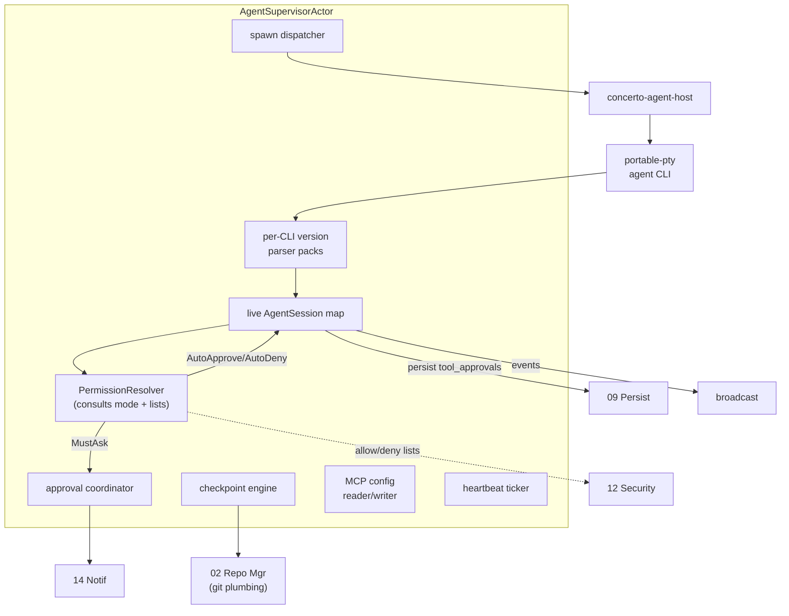
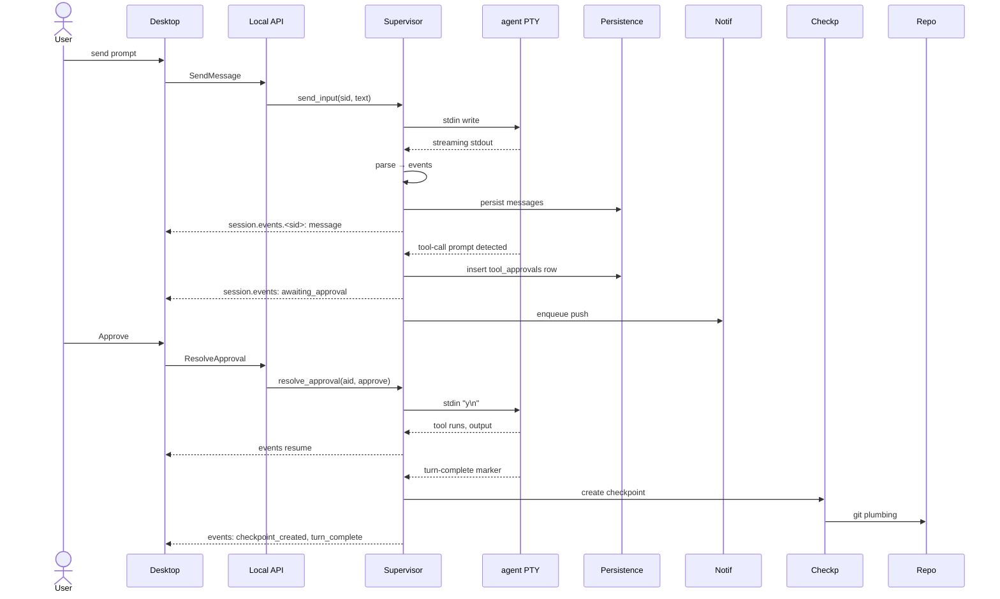
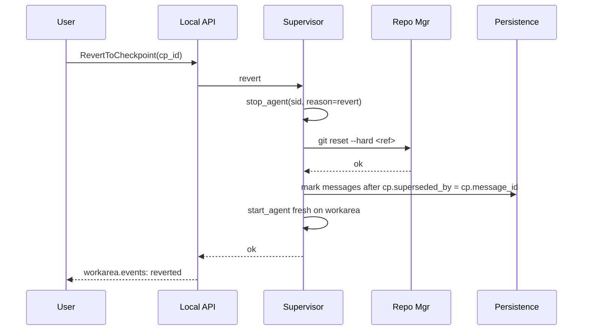
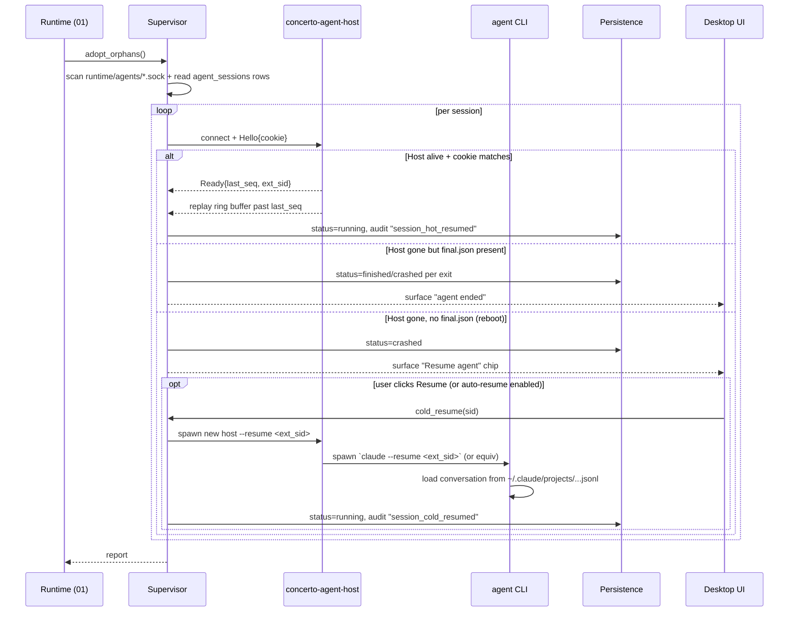

# 04 — Agent Supervisor

*Sub-system design doc. Inherits locked decisions from `00_Architecture_Overview.md` §6.4 (subprocess CLI in PTY via `portable-pty`, intercept-based tool approvals, MCP-config surfacing, V1.5 SDK opt-in). Schema reference: `09_Persistence.md` §4.2.*

---

## 1. Purpose & scope

The Agent Supervisor is the **interface between Concerto's structured world and the unstructured world of CLI agents** (Claude Code, Codex, Gemini CLI). It is the only sub-system that touches an LLM directly. Every behavior visible in the UI ("status: awaiting input", "context window 62%", "tool approval requested") originates here.

It owns:

- **Agent process lifecycle.** Spawn `claude`, `codex`, `gemini` in a PTY on a **workarea** (per the 3-level model in `03`). Each spawned agent is a **session**. Capture stdout/stderr. Send stdin. Track exit. Restart on crash.
- **PTY supervision.** Pidfile + cookie for orphan adoption (see `01_Core_Daemon_Runtime.md` §6.3). Resize on terminal resize. Cleanly close on shutdown.
- **Output parsing.** Convert agent CLI output into typed events (`message`, `tool_call`, `tool_result`, `checkpoint`, `awaiting_approval`, `context_pct`, `error`).
- **Tool approval flow.** Detect when an agent paused for approval; raise to UI (and/or push notification via 14); inject decision back into the agent's input.
- **Checkpoints.** Create a git ref per (workarea, repo) pointing at the current worktree state between turns. Revert on user request.
- **Multi-session per workarea.** Claude and Codex (and Gemini) side by side on the same workarea, sharing the same worktrees + `.context/` but with independent chat threads.
- **MCP config surfacing.** Read agents' MCP configs, expose to UI, write project-level `.mcp.json` per repo.
- **Concerto preamble.** Inject a system-prompt addendum at session start that introduces Concerto, describes the workarea's multi-repo layout, and points at each repo's `CLAUDE.md` / `AGENTS.md`.
- **Agent state inspection.** Current model, mode, context-window usage, last activity.
- **V1.5+: Claude Agent SDK opt-in backend.**

It does **not** own: prompt composition (clients send prompts via 10), workspace / workarea lifecycle (03), the LLM's content (it's opaque from our perspective).

---

## 2. Phase scope

| Phase | What ships |
|---|---|
| **V0.1** | Claude + Codex via PTY. Stdout parsing per CLI version. Tool approvals via intercept. Checkpoints per (workarea, repo). Single session per workarea. MCP config read-only surfacing. Concerto preamble. |
| **V1.0** | + Gemini CLI. + multi-session per workarea (Claude + Codex on the same workarea). + push-driven tool approval (multi-device fan-out via 14). + structured-output mode where agents support it (Claude Code's `--output-format=json` / SSE streams). + MCP project-level config writing. + context-window telemetry → Suggestion Engine (07). + agent name-suggestion mode (one-shot, called by 03 for branch rename). + session deliberation controls (Plan / Fast Mode / reasoning level + Codex personalities, §3.12). + per-action repository preferences (§3.13). |
| **V1.5** | + Claude Agent SDK backend (Node sidecar). Selectable per session. Cleaner tool-approval round-trip without screen-scraping. + Anthropic licensing review completed. |
| **V2.0** | + cone-learning hooks (record file reads/writes; emit to 02). + per-agent sandboxing escalation (Docker isolation per agent). + voice conversation mode TTS streaming. |

---

## 3. Key design decisions (sub-system-internal)

### 3.1 PTY library

**Locked in 00 §6.4:** `portable-pty` (the wezterm one). Battle-tested. Supports ConPTY on Windows 10/11.

**Subprocess backend is primary forever.** The Claude Agent SDK backend (V1.5+ opt-in, `§2` phase scope) is an alternate path for users who want richer structured streams, **not** a successor. Reasons this is load-bearing for the licensing posture (`00 §6.11`):

- The subprocess path uses the user's own existing Claude/Codex/Gemini auth and binary — Concerto is just orchestration. No Anthropic / OpenAI / Google SDK is required to run Concerto.
- The Agent SDK is Anthropic-controlled. Bundling it as the default backend would introduce an implicit dependency on Anthropic's continued goodwill that contradicts the local-first / no-third-party principles.
- Self-hosters and users on non-Anthropic models (Codex, Gemini, future providers) must always have a working path. Subprocess is that floor.

The `AgentBackend` trait (resolved decision R-3 in `§12`) is the seam; the trait is in the MIT crate, both impls are MIT, and the user selects per session. The V1.5 SDK backend never replaces subprocess in any phase.

### 3.2 Output parsing strategy: prefer structured, fall back to regex

**Choice:** Two parser modes per agent backend.

- **Structured mode** — when the CLI supports `--output-format=json` (or equivalent JSON-Lines / SSE), use it. Parsing reduces to deserializing one event at a time. Used for Claude Code (when invoked with the structured flag) and Codex when available.
- **Terminal mode** — when only the terminal-rendered output is available, parse it via per-CLI-version regex packs. Each pack is a versioned module (`parsers/claude_code/v2_3.rs`, etc.). Detection: probe the CLI version on spawn (`claude --version`); load the matching pack.

If a CLI version is unrecognized, the supervisor falls back to a "best effort" pack with a clear warning emitted to the audit log. The user gets a banner on the affected session in the workarea UI.

**Why both:** Structured mode is correct but not all CLIs support it for all features (e.g., Codex's tool-approval prompts may still be terminal-only in early V1.0). Terminal mode is the floor.

### 3.3 Tool approval flow: intercept + consult mode + inject

**Choice:** When the parser detects "agent is asking permission to run X," the supervisor consults the active permission mode (§3.10) before raising the request to the user.

```
parser detects approval boundary
  → PermissionResolver::resolve(session, tool_call)
      → returns Decision::AutoApprove (inject "y" immediately)
                Decision::AutoApproveOnce
                Decision::MustAsk      (continue to step 1 below)
                Decision::AutoDeny     (inject "n", surface a denial event)
```

For `MustAsk` decisions:

1. Pause reading the agent's output (pause-able mpsc).
2. Persist a `tool_approvals` row (09 §4.2) with the current `permission_mode` snapshotted.
3. Emit `session.events.<sid>: awaiting_approval` with the tool call structured.
4. Notify via 14 (push) if at least one client isn't actively viewing this workarea.
5. Wait on a `oneshot::Receiver<Decision>`.
6. On decision arrival (from any client), inject the appropriate response (`y\n`, `n\n`, choice number) into stdin per parser pack's prompt syntax.
7. Resume reading.

For `AutoApprove` / `AutoApproveOnce` decisions, the supervisor still **persists a `tool_approvals` row** marked `decided_by_device_id = NULL` and `decision = auto_<mode>`. This preserves a complete audit trail of what ran in auto modes. The user can review at any time in Settings → Audit.

The decision is recorded with the device cert ID that decided (or `auto_<mode>` if PermissionResolver decided automatically).

### 3.4 Checkpoints: per (workarea, repo) git refs

**Choice:** After every "agent turn" (detected via "turn complete" parser event), the supervisor walks each **repo in the workarea** that the agent touched in that turn and:

1. Creates a commit on top of that repo's current branch in a detached state (per-repo).
2. Updates `refs/concerto/checkpoints/<workarea_id>/<repository_id>/<n>` to that commit.
3. Persists one `checkpoints` row per repo, all referencing the same `chat_message_id` (the message that closed the turn).

A turn that touches three repos produces three checkpoint rows. The branch's own `HEAD` is **not** moved — the user's commits are still atop each branch. Checkpoint refs are invisible to git porcelain unless you ask.

Revert:

1. User picks a prior checkpoint set via the chat-message hover UI.
2. The supervisor stops every session in the workarea.
3. For each repo with a checkpoint in this set: `git reset --hard <ref>` on that repo's branch.
4. All chat messages after the checkpoints' shared `chat_message_id` are soft-deleted (set `superseded_by`).
5. Restart the session(s) (or wait for user).

### 3.5 Multi-session per workarea: shared worktrees, distinct chat threads

**Choice:** Multiple `sessions` rows can point at the same **workarea**. The supervisor allows it; the UI shows them as session tabs (e.g., "Claude", "Codex", "Gemini"). They share:

- All the workarea's repo worktrees.
- The workarea's `.context/` directory.

They have independent:

- Chat threads (each session has its own `chats` row).
- Agent process (each session has its own `concerto-agent-host`).
- Context windows.
- Permission-mode overrides (each session inherits from the workarea but can be set lower).

**Concurrency:** at most one session writes files at a time within a workarea. The supervisor enforces a **per-workarea** `Mutex<()>` around active edits. The other session's writes block (with a clear timeout — default 10s) and surface a "blocked on <other session>" indicator.

Reads (status, diff, git log) are concurrent.

### 3.6 MCP integration: read, surface, write project-level

**Choice:** MCP servers are configured at four scopes (PRD §11): personal (`~/.claude/mcp.json`), project (per-repo `.mcp.json`), plugin, enterprise. Concerto:

- **Reads** all four scopes via the same logic Claude Code uses (publicly documented config locations). In multi-repo workareas, project-scope is read from **each** repo's `.mcp.json` and merged for the session.
- **Surfaces** them in the UI (Settings → MCP) grouped by repo when in a multi-repo workarea.
- **Writes** project-level `.mcp.json` from the UI (per repo; the user picks which repo's `.mcp.json` to edit). Personal is the user's home; plugin and enterprise are managed externally.
- **Does not implement the MCP wire protocol** — that's between the agent and the MCP server. We just configure.

We also ship one MCP server of our own (`concerto-mcp`) implementing the Concerto-specific tools (workarea introspection, PR linkage, todos, scratch). **It runs in-process inside the Core** — no separate executable. The Core speaks MCP over stdio to the agent CLI via a pipe owned by `concerto-agent-host`. Same pattern as `concerto-maestro-mcp` (08 §3.2): one binary, two distinct tool surfaces, two distinct roles. No extraction, no install step. See `§3.11` for the tool surface.

### 3.7 Restart policy

If an agent process exits non-zero:

- If it produced output before exit: treat as crash. Restart up to 3 times in 60s; then mark crashed.
- If it produced no output: treat as startup failure. Don't restart automatically; surface error to user with the agent's stderr.

If an agent exits zero (clean): transition to `finished`. Don't restart.

### 3.8 Context window telemetry

**Choice:** Parse the agent's reported usage (Claude Code prints it on certain turns; Codex on others). When usage crosses configurable thresholds (50%, 80%), emit a typed event that 07 (Suggestion Engine) listens for.

If the agent doesn't emit usage, the supervisor estimates from message lengths via a rough tokenizer. Surface as an estimate (with a small "estimated" badge) until the agent reports authoritatively.

### 3.9 Agent host process: surviving Core restart

**The problem.** Agent CLIs are interactive PTY processes. If they were direct children of the Core, a Core restart would close the PTY master fd, the slave end would send SIGHUP to the agent, and the agent would die mid-conversation. That violates PRD §4.7 ("the dashboard never lies") and the explicit promise in `00 §2` that closing every client (or restarting the Core) does not interrupt agent work.

**The solution.** Each agent runs under a tiny per-session helper process — **`concerto-agent-host`** (~500 LoC Rust binary, shipped as part of the Concerto distribution). The host is spawned by the Core's Agent Supervisor, then immediately detached so it survives Core restart.

```
Core (restartable)
   ↕  UDS / named pipe (the bridge)
concerto-agent-host (detached, owns PTY master, buffers output)
   ↓  PTY
agent CLI (claude / codex / gemini)
```

**Detachment.**
- **Unix:** `setsid()` immediately after fork — the host becomes a session leader, reparented to init when Core exits. PIDs aren't reused fast enough to matter.
- **Windows:** `CreateProcess` with `CREATE_NEW_PROCESS_GROUP | DETACHED_PROCESS`.

**Bridge protocol** (host ↔ Core, length-prefixed CBOR frames over UDS / named pipe):

```rust
enum HostFrame {
    Hello { core_version: String, expected_cookie: [u8; 32] },
    Ready { agent_kind: AgentKind, version: String, external_session_id: Option<String>, last_seq: u64 },
    StdinBytes { seq: u64, data: Vec<u8> },
    StdoutBytes { seq: u64, data: Vec<u8> },
    Resize { rows: u16, cols: u16 },
    AgentExited { code: Option<i32>, signal: Option<i32> },
    Ack { seq: u64 },
    Ping, Pong,
}
```

**Ring buffer.** The host keeps the last 1 MB of stdout in memory plus an `Ack`-based watermark of what the connected Core last acknowledged. On reconnect, anything past the watermark is replayed first.

**Cookie.** A 32-byte random value generated at host spawn, stored in `agent_sessions.pty_cookie` (09 §4.2). Both sides verify it on `Hello` — prevents a local process from impersonating a restarted Core.

**Lifetime.** The host exits when its agent CLI exits. On exit, it writes `~/concerto/runtime/agents/<sid>.final.json` (exit code, last 100 lines, external session ID) so the Core can render a meaningful "agent ended" UI on next start even if the host is gone by then.

**Two layers of session continuity** that this design provides:

| Layer | Trigger | Mechanism | User experience |
|---|---|---|---|
| **Hot resume** | Core restart while host is alive | Reconnect to socket, replay buffer | No agent disruption; brief reconnect spinner in UI (< 2s) |
| **Cold resume** | Host died too (OS reboot, host crash, OOM kill) | Spawn a new host with `--resume <external_session_id>`; the agent CLI loads its own conversation JSONL from disk | "Resumed from <timestamp>" banner; conversation history intact; tool-state may need user re-approval |

Cold resume relies on the agent CLI's own session persistence:
- Claude Code: `~/.claude/projects/<project-hash>/<session-id>.jsonl` + `claude --resume <session-id>`.
- Codex: equivalent session directory + `--resume`.
- Gemini CLI: equivalent.

The Core records `external_session_id` per `sessions` row as soon as the parser extracts it from the agent's first output. Without that ID, cold resume falls back to "start fresh on this workarea" and the user keeps the diff but loses the conversation context.

**What this does not protect against.**

| Scenario | What happens |
|---|---|
| Machine reboot | Both Core and host die. Cold resume on next Core start. |
| User deletes `~/.claude/projects/.../session.jsonl` | Cold resume can't recover the conversation. We never delete this. |
| Agent CLI itself crashes mid-turn | Host detects exit; emits `Crashed` event; Core decides per restart policy (§3.7). User can cold-resume. |
| Two Cores try to attach to one host | Cookie mismatch on second `Hello`; second connection rejected. Single-instance guard (`01 §3.3`) prevents this anyway. |

### 3.10 Permission modes

**The problem.** Requiring approval on every tool call is correct-by-default but exhausting on long autonomous runs. Claude Code's `--dangerously-skip-permissions` is the opposite extreme. The right answer is a **spectrum** the user picks per workarea, with safe defaults and explicit ceremony to opt into more permissive modes.

**The four modes:**

| Mode | Tool calls inside workarea allow-list | Tool calls outside allow-list | Destructive commands | UI cue |
|---|---|---|---|---|
| **`strict`** | Confirm each | Confirm | Confirm (red styling) | Normal chrome + "Strict" chip |
| **`normal`** *(default)* | Reads/lists/info auto; writes/shell/network confirm | Confirm | Confirm (red styling) | Normal chrome |
| **`auto`** | All auto-approved | Confirm | Confirm (red styling) | **Amber banner**: "Auto mode — workarea edits auto-approved" |
| **`yolo`** | All auto-approved | Auto-approved | **Still confirm** unless `bypass_destructive_guard = true` is set (separate orthogonal opt-in) | **Red banner**: "YOLO mode active" + a per-session ticker showing time-in-yolo and action count |

**The default is `normal`.** New users, new workareas, new workspaces, new projects: all `normal`.

**Tool classification — how PermissionResolver decides** (in `strict`/`normal`):

| Tool category | `strict` | `normal` |
|---|---|---|
| Read file, list directory, get diff, glob, grep | Ask | Auto |
| Get URL, fetch documentation | Ask | Auto |
| Write file (inside workarea — any repo or `.context/`) | Ask | Ask |
| Run shell command (any) | Ask | Ask |
| Network mutating call (POST/PUT/DELETE to external) | Ask | Ask |
| Anything outside workarea allow-list | Ask | Ask |
| MCP tool (project-trusted server) | Ask | Auto (if marked safe) / Ask (if mutating) |
| MCP tool (untrusted server) | Ask | Ask |

The classification table ships in `tool-classifications.toml` per agent-kind, version-pinned alongside the parser packs.

**Entry ceremony:**

- Switching `normal → auto`: one tap, persisted to `workareas.permission_mode` (or `sessions.permission_mode` if per-session). Audit event `PermissionModeChanged{from, to, scope, by_device}`.
- Switching `normal/auto → yolo`: the UI requires typing the literal string `"I understand"` (matching the Claude Code pattern). On confirm, persisted; audit event `EnteredYoloMode{by_device}` plus continuous `YoloModeAction{tool, args_summary}` events for every action while in yolo.
- Setting `bypass_destructive_guard = true`: requires typing the longer string `"I understand the risks"`. Audit event `BypassDestructiveGuardEnabled{by_device}`. Persists across sessions until explicitly disabled.

**Persistence model (Claude Code-style):**

Modes **persist** across:
- Session restarts within the same workarea (read from `workareas.permission_mode` / `sessions.permission_mode`).
- Core restarts.
- Cold resume from `external_session_id`.

Modes **do not** persist across:
- Workarea archive/restore — restoring a workarea resets `permission_mode` to the workspace default. (Conservative; user opted into yolo for a specific run, not for the eternal future.)

There is no time-box. If the user puts a workarea in `yolo`, it stays there until they change it back. The red banner is the visibility guarantee.

**Override precedence (high → low):**

1. **`managed.json`** — `max_permission_mode` caps what the user can pick. If `max_permission_mode = "auto"`, the user cannot select `yolo`; the option is grayed out with the org policy explanation. `allow_yolo = false` and `allow_bypass_destructive_guard = false` lock those out completely. See `12 §3.8`.
2. **Schedule-level** (05) — each scheduled task carries its own `permission_mode` independent of the workarea setting.
3. **Session-level** — `sessions.permission_mode` set per session.
4. **Workarea-level** — `workareas.permission_mode`. Inherits from workspace if NULL.
5. **Workspace-level** — `workspaces.permission_mode`. Inherits from project if NULL.
6. **Project-level** — `projects.settings_json.default_permission_mode`.
7. **Global default** — `normal`.

**Always-on guarantees regardless of mode:**

- **Filesystem deny-list** (`12 §3.5`) — `~/.ssh`, `~/.aws`, `~/.gnupg`, `~/.kube`, etc. — is enforced even in `yolo + bypass_destructive_guard`. The supervisor never injects auto-approve for a write into a denied path. This is the only hard floor.
- **Tool-approval row persisted** for every tool call, even auto-approved ones — so retrospective audit is always possible.
- **UI banner is non-dismissible** while `auto` or `yolo` is active. A small "Return to normal" button is always present.

**Implementation:**

```rust
pub enum PermissionMode { Strict, Normal, Auto, Yolo }

pub struct PermissionResolver {
    mode: PermissionMode,
    bypass_destructive: bool,
    allow_list: AllowList,            // from 12
    deny_list: DenyList,              // from 12
    tool_classes: ToolClassifications,
}

impl PermissionResolver {
    pub fn resolve(&self, tool: &ToolCall) -> Decision {
        // 1. Hard floor: deny-list always blocks
        if self.deny_list.matches(tool) { return Decision::AutoDeny; }

        // 2. Destructive command pattern check
        if is_destructive(tool) {
            return if self.bypass_destructive { Decision::AutoApprove }
                   else { Decision::MustAsk };
        }

        // 3. Mode-based decision
        match self.mode {
            PermissionMode::Strict => Decision::MustAsk,
            PermissionMode::Normal => match self.classify(tool) {
                ToolClass::ReadOnly => Decision::AutoApprove,
                _ => Decision::MustAsk,
            },
            PermissionMode::Auto => {
                if self.allow_list.contains(tool.target_path()) { Decision::AutoApprove }
                else { Decision::MustAsk }
            },
            PermissionMode::Yolo => Decision::AutoApprove,
        }
    }
}
```

The PermissionResolver is constructed per session from the effective inheritance chain (`session → workarea → workspace → project → managed`). If the user changes mode mid-session at any layer, the running session's resolver is updated atomically via a config event.

### 3.11 Concerto preamble: system prompt prepended to every session

**The problem.** The agent CLI doesn't know about Concerto, doesn't know the workarea contains multiple repos, doesn't know about per-repo conventions or about the `.context/` scratch directory. Without a preamble, the agent treats its CWD as just a directory.

**The solution.** At session start, the supervisor computes a Concerto preamble from the workarea's state and injects it into the agent's initial context. The injection mechanism is per-agent:

- **Claude Code:** Prepend to the working directory's `CLAUDE.md` via a generated `<workarea>/CLAUDE.md` file (or use `--system-prompt` if the version supports it). The workarea's `CLAUDE.md` is gitignored (it's per-workarea, not per-repo).
- **Codex:** Inject via Codex's system-prompt parameter at spawn.
- **Gemini CLI:** Equivalent mechanism per Gemini's API.

**Preamble template** (computed per session, prepended to whatever the agent's normal init does):

```
You are an AI coding agent running inside Concerto, an orchestrator for parallel
AI coding work. You are in a "workarea" that contains one or more repository
worktrees.

Workspace: "{workspace.name}"
Workarea: "{workarea.composer_name}" on branch "{workarea.branch_name}"
Repositories in this workarea:
  - {repo-1.name}/   ({repo-1.full_name})
  - {repo-2.name}/   ({repo-2.full_name})
  ...

Your working directory is the workarea root (the parent of the repo folders).
Each repo is a complete git worktree on the workarea branch. You can cd into any
repo to run git commands or edit code. Cross-repo edits in one turn are
expected for multi-repo features.

Per-repo guidance to read on first interaction with a repo:
  - {repo-1.name}/CLAUDE.md   (if present) — repo-specific conventions
  - {repo-1.name}/AGENTS.md   (if present)
  - {repo-1.name}/README.md   for general orientation
  - {repo-2.name}/CLAUDE.md   ...
  - {repo-2.name}/AGENTS.md   ...

Concerto-specific notes:
  - You can edit files across multiple repos in one turn; commits in each repo
    create separate PRs (one per repo) that ship together when the user merges
    the workarea's PR set.
  - The `.context/` directory at the workarea root is yours for scratch notes,
    todos, and intermediate files. It is gitignored.
  - You have access to the `concerto-mcp` server for workarea introspection
    and PR linkage (see tools list below).
  - Other sessions ({other_session_kinds_csv}) may be running concurrently on
    this workarea. Writes are serialized by Concerto — if a write seems to
    hang, another session is mid-edit; retry will succeed.

Active permission mode: {permission_mode}.
{if bypass_destructive_guard: "Destructive-command guard is OFF for this workarea — be especially careful."}

Available `concerto-mcp` tools:
  concerto_workarea_info()         → details about this workarea and its repos
  concerto_repo_path(repo_name)    → absolute path to a repo
  concerto_link_pr(repo, pr_num)   → declare PR linkage for this workarea
  concerto_todos_read() / _write() → workarea todos (mirrored to UI)
  concerto_scratch_read(name) / _write(name, content)
```

**Refreshing the preamble.** When the workarea changes shape (a repo is added, the branch is renamed, the permission mode changes), the next session start uses the new preamble. The supervisor does **not** rewrite the preamble inside a running session — that risks confusing the agent's context. Instead, the user can restart the session to pick up changes (one-click "Restart session" in the UI).

**Customization.** The preamble template lives in `~/.concerto/preamble.template.md` and is editable. Default template is shipped in the binary. The user (or org via managed settings) can override.

**Privacy and managed settings.** When `managed.json.preamble_template_path` is set, that template wins. Useful for orgs that want to inject compliance notes ("don't include personally identifying information in commits", etc.).

### 3.12 Session deliberation controls — Plan / Fast Mode + reasoning level + personality

**The problem.** Permission modes (§3.10) say *how much we trust the agent to act* — orthogonal to *how hard the agent should think*. The deliberation axis splits into two surfaces (Plan/Fast and a reasoning slider), and on Codex a third (personalities). All three are session-scoped: a user might want a Fast-mode session for a typo fix and a max-reasoning session for an architecture decision on the same workarea in the same hour.

**The three controls:**

| Control | Values | Effect |
|---|---|---|
| **Deliberation mode** | `plan` / `normal` / `fast` | `plan` — agent must produce a plan before any code edit (the same boundary `03 §3.8` already references; the agent's existing `ExitPlanMode` tool ends it). `normal` — default behavior. `fast` — agent skips extended thinking where the backend supports it (Claude `--no-extended-thinking`, Codex equivalent). Mode changes mid-session emit `DeliberationModeChanged` and take effect on the next turn. |
| **Reasoning level** | `minimal` / `low` / `medium` / `high` (model-dependent) | Maps to the agent's exposed reasoning-effort knob: Claude `thinking.budget_tokens`, Codex `reasoning_effort`, Gemini equivalent. The UI shows only the levels the active model supports; unsupported levels are greyed out with a tooltip. Default = `medium`. |
| **Personality** *(Codex V1.0; Gemini/Claude when upstream exposes equivalents)* | `default` / `friendly` / `direct` / `socratic` / `<custom>` | Passed as Codex's `--personality <name>` (or its system-prompt-seed equivalent). Custom personalities live in `~/.concerto/personalities/<name>.md` (org-shareable via `managed.json.personality_path`). Unknown personality on Claude/Gemini → silently ignored with a one-time toast. |

These three controls are **independent of permission mode**: a `yolo` user wanting Fast Mode is paying for a quick autonomous run; a `strict` user wanting `high` reasoning is paying for careful deliberation with hand-checked edits. The UI renders them as separate chips in the session header (see `15 §3.16`).

**Persistence.** All three live on the `sessions` row and snapshot at session start; mid-session changes apply to the next turn:

```sql
ALTER TABLE sessions ADD COLUMN deliberation_mode TEXT NOT NULL DEFAULT 'normal';  -- plan|normal|fast
ALTER TABLE sessions ADD COLUMN reasoning_level   TEXT NOT NULL DEFAULT 'medium';  -- minimal|low|medium|high
ALTER TABLE sessions ADD COLUMN personality       TEXT;                             -- nullable
```

**Inheritance chain** (high → low — same shape as the permission-mode chain in §3.10):

1. **Schedule-level** — `schedule_runs.deliberation_mode` / `.reasoning_level` / `.personality` (05).
2. **Session-level** — explicit user choice.
3. **Workarea-level** — `workareas.settings_json.default_deliberation_mode` / `.default_reasoning_level` / `.default_personality`.
4. **Workspace-level** — same fields on `workspaces.settings_json`.
5. **Project-level** — same fields on `projects.settings_json` (`03 §3.13` precedence).
6. **Global default** — `normal` / `medium` / `default`.

**Capping via `managed.json`.** Same pattern as `max_permission_mode`: `managed.json` can cap `max_reasoning_level` (e.g., to `medium` for cost reasons), pin `allowed_personalities`, and force `default_deliberation_mode = plan` for new sessions.

**Backend translation.** Each parser pack ships a translation table from Concerto's three controls to its CLI's flag set. Unknown combinations (e.g., `fast` + `high` reasoning on a model that hardcodes them together) emit a `DeliberationOverrideIgnored{reason}` event so the UI can surface "your model coerced reasoning to medium when Fast Mode is on."

**Audit.** Every change emits `DeliberationModeChanged{from,to,by_device}` / `ReasoningLevelChanged{from,to,by_device}` / `PersonalityChanged{from,to,by_device}` to the audit log. These compose with the per-action injection in §3.13 — a "PR Create" action running on a `fast + high` session records both.

### 3.13 Per-action repository preferences — inject-on-trigger

**The problem.** A team wants "always quote the contributing guide when opening a PR," "always run `cargo fmt --check` before declaring a fix done," "always add an XL label to refactor PRs." Sticking these in `AGENTS.md` or `CLAUDE.md` makes them apply to every turn (token overhead, distraction from the current task). The right shape is **action-scoped** preferences that travel only when that action runs. Concerto exposes this as a generalized pattern across its full action surface.

**The actions:**

| Action | Trigger | Where injected |
|---|---|---|
| `code_review` | User clicks "Review" on a diff (`15 §3.5`) | System-message addendum to the one-shot review prompt |
| `pr_create` | User clicks "Create PR" (`13`) | Prepended to the PR-body generation prompt |
| `error_fix` | User clicks "Fix errors" (`15 §3.15`) | Added to the fix-errors session preamble |
| `conflict_resolve` | Agent invoked to resolve a merge conflict (`03 §3.9` coordinated merge) | Added to the conflict-resolution turn |
| `branch_rename` | One-shot agent call for branch-name suggestion (§2 V1.0) | Added to the rename prompt |
| `commit_message` | User clicks "Commit" with agent-drafted message | Added to the commit-message prompt |
| `digest_summary` | Maestro generates a workspace digest (`08 §3.6`) | Added to the digest LLM call's system prompt for this project's workareas |

**Where they live.** On the `repositories` row (so the prefs travel with the repo, not the user's personal store):

```sql
ALTER TABLE repositories ADD COLUMN action_prefs_json TEXT NOT NULL DEFAULT '{}';
-- {
--   "code_review":      "Quote CONTRIBUTING.md sections 2 and 4 when relevant.",
--   "pr_create":        "Use the team's PR template at .github/pr-template.md. CC @platform-team for infra changes.",
--   "error_fix":        "Run `cargo fmt --check` and `cargo clippy -- -D warnings` before reporting fixed.",
--   "conflict_resolve": "Prefer ours for lockfiles; prefer theirs for migration timestamps.",
--   "branch_rename":    "kebab-case with the Linear ticket prefix when one exists.",
--   "commit_message":   "Conventional Commits required; scope = top-level dir.",
--   "digest_summary":   "Group changes by service; flag auth-related diffs explicitly."
-- }
```

**Checked-in override.** A repo's `.concerto/action_prefs.toml` (when present) overrides the DB-stored prefs — same precedence stack as `03 §3.13`. This is the team-shareable surface:

```toml
code_review = """
Quote CONTRIBUTING.md sections 2 and 4 when relevant.
"""
pr_create = """
Use the team's PR template at .github/pr-template.md.
CC @platform-team for infra changes.
"""
```

**Injection mechanism.** Action prefs are **not** part of the Concerto preamble (§3.11) — they are per-action, not per-session. The Agent Supervisor exposes a helper consumed by every call site:

```rust
pub fn compose_action_prompt(
    action: ActionKind,
    repo_id: RepositoryId,
    base_prompt: &str,
) -> String;
```

The 13 PR-create flow, 08 digest generation, 15 Review action, and `error_fix` orchestration (`15 §3.15`) all route through this helper. Concerto records `ActionPrefInjected{action, repo_id, pref_hash, tokens_added}` per call for diagnostics; when a pref grows long enough to dominate the prompt, the audit reveals it before the user notices.

**Multi-repo workareas.** When an action runs against multiple repos in one workarea (e.g., "Create PRs for all dirty repos"), each repo's prefs are injected into its own LLM call; prefs do not bleed across repos.

**Empty by default.** New repos ship with an empty `action_prefs_json`. The UI surfaces the seven fields in Repository Settings → Actions; each is a free-text textarea with a character budget hint (default 500 chars; soft warn at 1000). `managed.json` may pin or cap any field via `action_prefs_pinned[<repo_url>][<action>]`.

---

## 4. Data model

Primary tables (09 §4.2):

- `agent_sessions`
- `checkpoints`
- `tool_approvals`

Plus per-session log files at `~/concerto/agents/<session_id>/stdout.log` and `stderr.log` (capped at 100 MB; older rotated and gzipped).

### 4.1 In-memory state

```rust
pub struct Session {
    pub id: SessionId,
    pub workarea_id: WorkareaId,
    pub kind: AgentKind,                       // claude | codex | gemini | maestro
    pub version: String,                       // CLI version string
    pub parser_mode: ParserMode,               // Structured | Terminal(VersionPack)

    // Host-bridge connection (replaces direct PTY ownership).
    pub host_pid: Pid,
    pub host_socket: PathBuf,
    pub host_cookie: [u8; 32],
    pub bridge: HostBridge,                    // wraps the UDS / named pipe + ack tracker

    pub stdin_tx: mpsc::Sender<Vec<u8>>,
    pub events_tx: broadcast::Sender<AgentEvent>,
    pub stdout_log: AppendLog,
    pub state: SessionState,                   // starting | running | awaiting | finished | crashed
    pub awaiting_approval: Option<ApprovalCtx>,
    pub context_pct: Option<u8>,
    pub last_heartbeat: Instant,
    pub turn_counter: u32,

    /// The agent CLI's own session identifier, extracted by the parser
    /// from the agent's first banner. Required for cold resume after
    /// host death. NULL until the parser sees it.
    pub external_session_id: Option<String>,

    /// Permission mode active for this session. Snapshotted on start
    /// and on every change so tool_approvals rows can record what was
    /// in effect when each tool was decided. See §3.10.
    pub permission_mode: PermissionMode,
    pub bypass_destructive_guard: bool,
    pub permission_resolver: PermissionResolver,

    /// The Concerto preamble that was injected at session start.
    /// Retained for audit (so we can show what the agent was told).
    pub preamble_snapshot: String,
}

pub struct ApprovalCtx {
    pub approval_id: ApprovalId,
    pub waiter: oneshot::Receiver<Decision>,
    pub requested_at: Instant,
}
```

### 4.2 Event types emitted on `session.events.<sid>`

```rust
pub enum AgentEvent {
    Started { model: String, mode: String },
    Message { role: MsgRole, content: Value, message_id: ChatMessageId },
    ToolCall { name: String, args: Value, call_id: String },
    ToolResult { call_id: String, result: Value },
    AwaitingApproval { approval_id: ApprovalId, tool: String, payload: Value },
    ApprovalResolved { approval_id: ApprovalId, decision: Decision },
    CheckpointCreated { checkpoint_id: CheckpointId, git_ref: String },
    ContextUsage { pct: u8, tokens: u32 },
    TurnComplete { reason: TurnEndReason },
    Error { kind: ErrorKind, detail: String },
    Crashed { exit_code: Option<i32>, signal: Option<i32> },
}
```

---

## 5. Interfaces

### 5.1 Public Rust API

```rust
pub struct AgentSupervisorHandle { /* opaque */ }

impl AgentSupervisorHandle {
    pub async fn start_agent(&self, req: StartAgent) -> Result<AgentSessionId>;
    pub async fn send_input(&self, sid: AgentSessionId, text: &str) -> Result<()>;
    pub async fn stop_agent(&self, sid: AgentSessionId, reason: StopReason) -> Result<()>;
    pub async fn restart_agent(&self, sid: AgentSessionId) -> Result<()>;
    pub async fn resolve_approval(&self, aid: ApprovalId, dec: Decision, by: DeviceId) -> Result<()>;
    pub async fn revert_to_checkpoint(&self, cp: CheckpointId) -> Result<()>;
    pub async fn list_mcp_servers(&self, scope: McpScope) -> Result<Vec<McpServer>>;
    pub async fn upsert_project_mcp(&self, project: ProjectId, server: McpServer) -> Result<()>;
    pub async fn subscribe_events(&self, sid: AgentSessionId) -> broadcast::Receiver<AgentEvent>;
}
```

### 5.2 gRPC surface

```proto
service Agents {
  rpc StartAgent(StartAgentRequest) returns (AgentSession);
  rpc SendMessage(SendMessageRequest) returns (google.protobuf.Empty);
  rpc StopAgent(StopAgentRequest) returns (google.protobuf.Empty);
  rpc ResolveApproval(ResolveApprovalRequest) returns (google.protobuf.Empty);
  rpc RevertToCheckpoint(RevertRequest) returns (google.protobuf.Empty);
  rpc SubscribeAgentEvents(SubscribeRequest) returns (stream AgentEvent);

  rpc ListMcpServers(McpScopeRequest) returns (ListMcpResponse);
  rpc UpsertProjectMcp(McpServerSpec) returns (google.protobuf.Empty);
}
```

### 5.3 Streams emitted

| Stream | Subject | When |
|---|---|---|
| `session.events.<sid>` | per session | Every SessionEvent above |
| `session.io.<sid>` | per session | Raw stdout/stderr bytes (for terminal tab) |
| `agent.heartbeat` | broadcast | Per session, every 10s while alive |

---

## 6. Internal architecture



### 6.1 Spawn sequence

1. Resolve agent binary path (config + PATH lookup with sanity check).
2. Probe `--version`; load matching parser pack.
3. Generate 32-byte cookie; allocate socket path `~/concerto/runtime/agents/<sid>.sock`.
4. Compute the Concerto preamble from workarea state (`§3.11`) and write `<workarea_root>/CLAUDE.md` (or wire via `--system-prompt` per agent kind).
5. Persist `sessions` row (status=`starting`, host_pid=NULL, cookie set, external_session_id=NULL).
6. Spawn `concerto-agent-host` with args (`--agent-kind`, `--bin-path`, `--cwd <workarea_root>`, `--socket`, `--cookie`, `--resume <id>` if cold-resuming) and the agent's env (`CONCERTO_WORKAREA_ID`, `CONCERTO_WORKAREA_ROOT`, `CONCERTO_WORKSPACE_ID`, `CONCERTO_SESSION_ID`, provider tokens). The host call returns the host's pid immediately; the host self-detaches before opening its socket.
7. The host: `setsid()`/detach → open PTY (`portable-pty`) at the workarea root → spawn agent CLI as child → bind socket and listen.
8. Core connects to the socket; sends `Hello`. Host responds `Ready`. The bidirectional bridge starts.
9. Update `sessions` row with host_pid; transition to `running` when the first parser event arrives (or to `awaiting` on first prompt).
10. As soon as the parser extracts the agent's external session ID (typically the first turn's banner), persist it to `sessions.external_session_id`. This unlocks cold resume.

**Working directory is always the workarea root** — never an individual repo's worktree. The Concerto preamble tells the agent to `cd` into a specific repo for git operations.

### 6.2 Output pipeline

```
PTY master fd
  → bytes mpsc (with backpressure to prevent runaway memory)
  → AppendLog (per-session stdout.log)
  → ANSI strip for parsing (terminal mode only)
  → Parser pack
  → events broadcast
```

The terminal tab subscribes to the raw bytes stream (pre-strip). The chat UI subscribes to the typed events stream.

### 6.3 Approval injection

When an approval resolution arrives, the supervisor must inject the response. Each parser pack knows its CLI's prompt syntax (`y/n`, numeric choice, etc.) and translates `Decision` → bytes.

For structured-mode agents that take approvals via an out-of-band JSON channel, this becomes a clean write to a JSON-RPC pipe.

### 6.4 Host adoption and cold resume on Core restart

On Core restart (clean or crashed), the runtime calls `AgentSupervisor::adopt_orphans()`. This has two layers:

**Layer 1 — Hot reconnect (preferred).**

1. Scan `~/concerto/runtime/agents/*.sock`.
2. For each socket: open a connection; send `Hello { core_version, expected_cookie: <from agent_sessions.pty_cookie> }`.
3. The host validates cookie + responds with `Ready { last_seq, external_session_id }`.
4. Host immediately replays buffered output past `last_seq` ack'd by previous Core.
5. The bridge resumes. Update `agent_sessions.status = running` if it was `running`, write an audit-log entry "session_hot_resumed".

**Layer 2 — Cold resume (when hot fails).**

For each `sessions` row with `status IN ('running','awaiting','starting')` that had no live host socket OR whose `Hello` failed (cookie mismatch, host responded with error):

1. Check for the host's `final.json` (last exit info). If present, treat as a normal "agent ended" — surface to UI; do not auto-restart.
2. Otherwise (host vanished without writing exit info — process killed, machine reboot): mark `status = crashed`. Do NOT auto-spawn a new agent.
3. UI shows the workarea with a "Resume agent" chip. The chip's action:
   - If `external_session_id` is set, spawn a new agent host with `--resume <external_session_id>`. The agent CLI loads its conversation JSONL and continues.
   - If `external_session_id` is NULL (rare — only if the agent crashed before its first banner), spawn a fresh agent; show a one-time banner explaining the conversation history is lost but the diff and todos are intact.
4. Write an audit-log entry `session_cold_resumed` or `session_started_fresh`.

The reason cold resume is **not automatic**: a user may have closed their machine deliberately. Resuming an agent (which spends tokens, makes tool calls) without consent is a footgun. Users have repeatedly asked for this conservative behavior.

A user setting under Repository Settings → Agents — "Auto-resume agents on Core start" — opts into automatic cold resume per project. Off by default.

### 6.5 Multi-device approval coordination

When the supervisor raises `AwaitingApproval`, it tells `14 Notifications`:

- Send push (wakeup) to every paired device except the one that's actively viewing this workarea.
- Each lock-screen action ("Approve", "Approve once", "Deny") is a one-tap path to `resolve_approval`.
- The supervisor accepts the first decision; subsequent calls return `AlreadyResolved`. Other devices get an `ApprovalResolved` event to dismiss the prompt.

---

## 7. Sequence diagrams — hot paths

### 7.1 Agent turn — message → tool → approval → continue



### 7.2 Revert to checkpoint



### 7.3 Host adoption + cold-resume fallback on Core restart



---

## 8. Error handling & failure modes

| Failure | Detection | Response |
|---|---|---|
| Agent binary not found | Spawn EACCES / ENOENT | Surface to user with installation hint per agent kind |
| Agent crashes (panic, exit non-zero) | Reader exits with EOF | Persist event, follow restart policy (§3.7) |
| Parser falls behind (output rate > parse rate) | mpsc lag metric | Drop bytes from log? No — write raw to log, parse async; visible lag is acceptable up to ~2s |
| Parser desyncs (regex pack version mismatch) | Heuristic: no events for 60s while bytes arrive AND CLI version unrecognized | Switch to "best effort" pack; warn banner with "report parser issue" link |
| Approval pending indefinitely | (no watchdog) | **By design.** Approvals hang until the user decides; no auto-deny. The session stays `awaiting`; the user can stop it manually. Audit captures request-time and decision-time. |
| Multiple devices approve simultaneously | First-write-wins via DB | Losers get `ApprovalAlreadyResolved` error; UI dismisses |
| Checkpoint creation fails | Repo Mgr error | Continue without checkpoint; warn user; subsequent revert is not possible from this turn |
| MCP server config invalid JSON | Read error | Skip that scope; warn; UI shows which scope has the issue |
| Agent claims context_pct > 100 (bug) | Validation | Clamp to 100; log |
| Two sessions on same workarea both try to commit | Per-workarea edit mutex timeout | Reject second commit with clear error; user picks which session wins |

---

## 9. Dependencies on other sub-systems

| Sub-system | How |
|---|---|
| **03 Workspace/Workarea/Session Mgr** | Workarea context (worktree root, repos list, branch name, .context location); workarea FSM transitions driven by AgentEvents |
| **06 Skills Registry** | Lists active skills the agent has access to (for UI; agent reads from filesystem itself) |
| **09 Persistence** | All durable state + secrets for provider tokens |
| **14 Notifications** | Push wakeup on AwaitingApproval and other notify-worthy events |
| **02 Repo Mgr** | Git plumbing for checkpoints + reverts |

Consumers:
- **05 Scheduler** — starts agents from schedules
- **07 Suggestion Engine** — listens to session.events + workarea.events to drive chips
- **08 Maestro** — reads workarea / session end-of-turn summaries

---

## 10. Testing strategy

| Layer | What | How |
|---|---|---|
| Unit | Parser packs per CLI version | Golden-file tests: real CLI output → expected events |
| Unit | Approval injection — every CLI prompt syntax variant | Table-driven |
| Integration | Start a real `claude` binary, send a prompt, capture full event stream | CI installs claude-code in PATH |
| Integration | Tool approval round-trip from a mocked client device | End-to-end via gRPC |
| Crash | Kill agent mid-turn; assert clean transition to crashed | Inject SIGKILL |
| Orphan adoption | Kill Core, leave agent alive, restart Core, assert resume | Multi-process test harness |
| Performance | Throughput on a 1MB/s output burst | Bench: agent emits stdout fast; supervisor maintains < 200ms parse latency |
| Multi-platform | ConPTY on Windows, openpty on Mac, openpty on Linux | Per-platform CI |
| Version drift | Run against current and N-1 CLI version | Pin in CI |

---

## 11. Open questions / deferred

*All items resolved. See **§12 Resolved decisions log** below.*

## 12. Resolved decisions log

| # | Question | Decision | Where in doc |
|---|---|---|---|
| R-1 | Parser breakage detection on CLI version drift | **Heuristic banner.** No events for **60s** while bytes arrive AND CLI version unrecognized → fall back to "best effort" pack; banner with "report parser issue" link. (60s vs 30s reduces false positives on long-thinking turns.) | §8 failure modes |
| R-2 | Capture screenshot/transcript on agent crash | **No.** Last 200 lines of stdout already captured in per-session log. No remote crash reports (local-first principle). | §6.2 |
| R-3 | V1.5 SDK backend interface shape | **Same trait as PTY backend** (`AgentBackend`). Selectable per session. Falls back to PTY if SDK auth not configured. Two backends maintained in parallel. | §2 phase scope; deferred V1.5 |
| R-4 | Voice conversation TTS interleaving (V2.0) | **Client-side TTS.** Supervisor streams structured events; each client picks its own TTS (iOS Speech, Android SpeechRecognizer, Web Speech). | (V2.0) |
| R-5 | Concurrent edits across multi-session on workarea | **Serial mutex on writes (10s timeout).** Per-workarea, blocks the slower session. V2.0 may explore per-file mutex if beta data shows real contention. | §3.5 |
| R-6 | Structured-mode parsing as default for Claude Code | **Terminal parser is default for V0.1; auto-switch to structured-mode mid-V1.0** once the upstream contract is stable. User can opt in earlier. | §3.2 |
| R-7 | Approval timeout: auto-deny vs hang forever | **Hang forever.** Approvals stay `awaiting` indefinitely; no auto-deny. User can stop the session manually. Audit captures request-time and decision-time. | §3.3, §8 failure modes |
| R-8 | MCP install UX | **Owned by `06 Skills Registry`**; doc 04 only consumes the config. | §3.6 |
| R-9 | `concerto-mcp` installation flow | **Pure in-process MCP** — no separate executable, no extraction. Core speaks MCP over stdio to the agent CLI via a pipe owned by `concerto-agent-host`. Same pattern as `concerto-maestro-mcp` (08 §3.2). | §3.6 |
| R-10 | Streaming partial messages (typewriter effect) | **Yes on desktop/web; off by default on mobile** (saves bandwidth via the lite-mode mechanism in `16 §3.10`). `Message` events carry partial content; UI assembles incrementally. | §4.2 events, §10 client design |

---

*End of `04_Agent_Supervisor.md`. Tool approvals route through `14_Notifications_Push.md`. Skills surfaced here are owned by `06_Skills_Registry.md`. The V1.5 SDK backend pulls in Anthropic's licensing review.*
