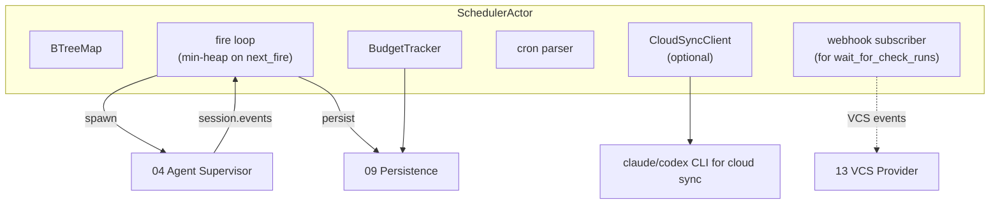
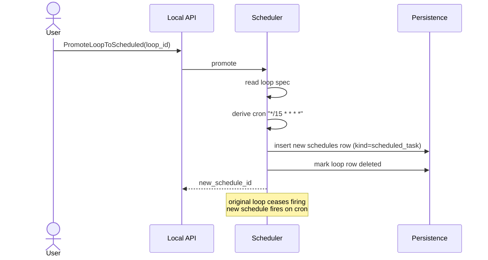
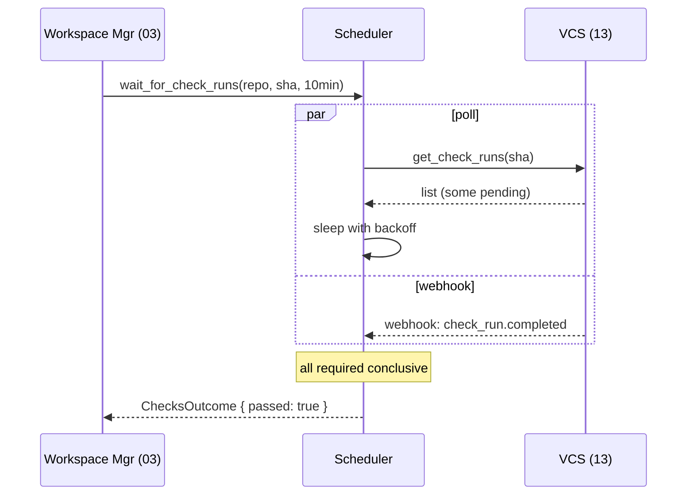

# 05 — Scheduler

*Sub-system design doc. Inherits locked decisions from `00_Architecture_Overview.md`. Schema reference: `09_Persistence.md` §4.3. Schedules dispatch agents via `04_Agent_Supervisor.md` and persist runs to 09.*

---

## 1. Purpose & scope

The Scheduler owns **two distinct recurrence concepts** that Claude Code itself surfaces today (PRD §12):

- **`/loop`** — session-scoped recurring tasks. Tied to an active agent session. Expires after 3 days or when the workspace's agent ends. Lightweight — these are "while I'm working, every 15 minutes check X."
- **Scheduled tasks** — persistent recurring tasks. Survive Core restarts, session close, machine reboot. Each run typically spawns a fresh agent. Heavier — these are "every day at 8:30 do the morning briefing."

It also owns:
- **Cron expression parsing + next-fire computation.**
- **Jittered firing** — avoid thundering herd when many schedules share a cron line.
- **Per-schedule run history** — what fired, how long, tokens consumed, success or failure.
- **Cost guardrails** — per-schedule daily budget caps, per-account sub-budgets.
- **Cloud-schedule sync** — when the user is on Claude Pro/Max with cloud scheduled tasks enabled, register the schedule both locally and in the cloud (PRD §12.7).
- **Promotion** — a `/loop` that has proven useful can be promoted to a persistent scheduled task (one-click in UI).
- **"Wait for check runs"** primitive — used by Workspace Mgr (03) during coordinated PR-set merges.
- **Failure policies** — retry, retry exponential, notify, ignore.

It does **not** own: agent execution (delegates to 04), prompt composition (the schedule stores the prompt text the user wrote).

---

## 2. Phase scope

| Phase | What ships |
|---|---|
| **V0.1** | `/loop` only (session-scoped). Cron parsing for intervals. Run history. No persistent scheduled tasks yet. |
| **V1.0** | + persistent scheduled tasks. + cloud-task sync (where provider supports it). + budget guardrails. + jittered firing. + promote loop → scheduled. + worktree mode (latest vs fresh). + "wait for check runs" primitive consumed by 03. + 6 starter templates from PRD §12.4. |
| **V2.0** | + optional integration with non-AI cron (system cron, GitHub Actions schedules) for a unified view. + multi-tenant scheduling for remote-host Core (per-engineer schedules on a shared box). + smart-suppression (skip a scheduled run if a prior run is still in flight beyond N minutes). |

---

## 3. Key design decisions (sub-system-internal)

### 3.1 Two backends, one front: `Schedule` is the unified record

**Choice:** A single `schedules` table (09 §4.3) covers both `/loop` and persistent scheduled tasks. The `kind` column discriminates. UI surfaces them as one Workflow Explorer with two sections (PRD §12.1).

This means cron parsing, history, budgets, and promotion are implemented once. Different `kind` values just have different lifetime semantics:

| Field | `kind=loop` | `kind=scheduled_task` |
|---|---|---|
| `workarea_id` | required (the `/loop` is bound to a workarea) | optional (or fresh workarea spun up per run) |
| `interval_seconds` | required | not used |
| `cron_expr` | not used | optional (free-form recurring) |
| `expires_at` | required (~ 3 days) | not used |
| Lifetime on Core restart | persisted but may not auto-resume | always resumes |
| Lifetime on workspace end | deleted | unaffected |

### 3.2 Cron parsing: cron-parser crate, 5-field standard + extensions

**Choice:** Use the well-maintained `cron` crate (Rust) for 5-field cron expressions. We support the standard cron syntax plus a few extensions used in the UI:

- `@daily 08:30` → `30 8 * * *`
- `@weekdays 17:30` → `30 17 * * 1-5`
- `@hourly` → `0 * * * *`
- `@every 15m` → handled as interval, not cron, internally.

The UI never asks the user to type cron directly — it has a wizard (PRD §12.2) that emits the right pattern. The cron-expression field is read-only in the UI but editable for power users.

### 3.3 Jitter: random offset within a 60-second window

**Choice:** Every schedule with a cron expression fires at `cron.next_fire() + random(0..=60)` seconds. Why: avoid all "daily 08:30" schedules across multiple users hitting the same downstream APIs simultaneously. The jitter is recorded per run for audit-correlation.

For sub-minute intervals (e.g. `/loop 30s`), no jitter — predictability matters more.

### 3.4 Run dispatch: pre-spawn the agent, never block

**Choice:** When a schedule fires, the Scheduler:

1. Computes the working context (`workarea_id` if pinned to one, else create a fresh workarea per run under the schedule's project).
2. Asks Agent Supervisor (04) to start a session on that workarea with the schedule's prompt + permission_mode + model + bypass_destructive_guard.
3. Records the spawn in `schedule_runs` (linking to the new `session_id`).
4. Subscribes to `session.events.<sid>` to track completion.
5. On terminal event (turn_complete or crashed), updates `schedule_runs` with status + token counts.

The Scheduler does not block on agent completion. A long-running scheduled task is fine; the next firing of the same schedule is suppressed if the previous run is still in flight (configurable).

### 3.5 Worktree mode: latest vs fresh

PRD §12.2 step 6: per-schedule choice between:

- **`latest`** — use the workspace's current branch and worktree state. Inherits any uncommitted changes. Cheap.
- **`fresh`** — create a new throwaway worktree at HEAD of `main` (or the project's default branch). Clean room. Costs the worktree-create time. Discarded after the run.

The `fresh` mode is the right choice for "morning briefing" (you want it to run against trunk). `latest` is right for `/loop` (you're iterating in this workspace).

### 3.6 Budget guardrails

**Choice:** Each schedule carries `daily_budget_tokens`. The Scheduler tracks daily input + output tokens summed across `schedule_runs` for that schedule. When the budget is exceeded, **future firings are skipped silently** (with an audit event) until the next UTC midnight, when the counter resets.

A separate per-account daily cap (configured under Settings → Provider) sums across all schedules tagged to that account. When that cap is hit, all schedules using the account skip.

The user sees the budget state in the Workflow Explorer (current usage / budget) with an amber warning at 80% and a red badge at 100%.

### 3.7 Cloud-schedule sync (Pro/Max only)

When the user is on Claude Pro/Max with cloud-scheduled-tasks enabled, the Scheduler:

1. Detects this capability via the agent CLI's `--features` flag (or a probe call).
2. Offers, per schedule, "Run locally only" / "Run in cloud only" / "Both" (mirror).
3. For "in cloud" or "both," the Scheduler registers the schedule with Anthropic's cloud-tasks API via the local CLI.
4. Tracks the cloud schedule ID alongside the local row (in `settings_json`).

For "both" / "cloud-only" schedules: a warning fires if the prompt references local resources (file paths, dev-server URLs) that wouldn't exist in the cloud sandbox. The check is heuristic (regex on `/Users/`, `localhost`, etc.).

### 3.8 Promotion: `/loop` → scheduled task

**Choice:** A single RPC `PromoteLoopToScheduled(loop_id)`. The Scheduler:

1. Reads the loop's prompt + interval.
2. Converts the interval to a cron (`/loop 15m` → `*/15 * * * *`).
3. Creates a new `schedules` row with `kind=scheduled_task` carrying the same prompt + model + permission_mode + bypass_destructive_guard.
4. Marks the original loop deleted (and clears its `expires_at`).
5. Audits the promotion.

The promoted schedule inherits the loop's permission settings exactly — including `yolo` if applicable. This is a security-relevant default: promotion does NOT escalate, and does NOT silently downgrade (the user explicitly opts into a long-lived schedule with the same trust level).

### 3.9 Wait-for-checks primitive

**Choice:** A separate Scheduler API `wait_for_check_runs(repo, sha, timeout)` used by Workspace Mgr (03) during coordinated PR-set merges. Implementation:

1. Open a poll loop against VCS (13) for the given SHA's check runs.
2. Apply exponential backoff (1s, 2s, 4s, 8s, 16s, 30s — capped).
3. Subscribe to webhook updates if the VCS provides them (preferred over polling — covered in 13).
4. Resolve when all required checks are conclusive (success / failure / cancelled), or timeout.

This isn't really "scheduled" in the calendar sense, but it lives here because it's the only sub-system already running a poll/backoff loop infrastructure.

---

## 4. Data model

Primary tables: `schedules`, `schedule_runs` (09 §4.3). All persisted state.

### 4.1 In-memory state

```rust
pub struct SchedulerState {
    schedules: BTreeMap<NextFireTime, ScheduleHandle>,  // ordered by next fire
    fire_queue: tokio::sync::Notify,
    inflight: HashMap<ScheduleId, RunHandle>,           // currently running
    budget_counters: HashMap<ScheduleId, DailyBudget>,
    cloud_sync: Option<CloudSyncClient>,
}

pub struct ScheduleHandle {
    spec: Schedule,
    next_fire: SystemTime,
    last_fire: Option<SystemTime>,
    last_status: Option<RunStatus>,
}

pub struct DailyBudget {
    tokens_in_today: u64,
    tokens_out_today: u64,
    cap: u64,
    resets_at: SystemTime,    // next UTC midnight
}
```

---

## 5. Interfaces

### 5.1 Public Rust API

```rust
pub struct SchedulerHandle { /* opaque */ }

impl SchedulerHandle {
    pub async fn create_schedule(&self, req: CreateScheduleRequest) -> Result<ScheduleId>;
    pub async fn list_schedules(&self, filter: Filter) -> Result<Vec<ScheduleSummary>>;
    pub async fn update_schedule(&self, id: ScheduleId, patch: UpdateScheduleRequest) -> Result<Schedule>;
    pub async fn delete_schedule(&self, id: ScheduleId) -> Result<()>;
    pub async fn pause_schedule(&self, id: ScheduleId) -> Result<()>;
    pub async fn resume_schedule(&self, id: ScheduleId) -> Result<()>;
    pub async fn promote_loop_to_scheduled(&self, id: LoopId) -> Result<ScheduleId>;

    pub async fn get_run_history(&self, id: ScheduleId, range: TimeRange) -> Result<Vec<ScheduleRun>>;

    /// Used by 03 for PR-set coordinated merge.
    pub async fn wait_for_check_runs(&self, repo: RepositoryId, sha: &str, timeout: Duration) -> Result<ChecksOutcome>;

    /// Manual trigger (for testing or one-off "run now").
    pub async fn fire_now(&self, id: ScheduleId) -> Result<RunHandle>;
}
```

### 5.2 gRPC surface

Mirrors §5.1 in the `Schedules` service (`10 §5.1`).

### 5.3 Emitted events

| Event | Stream | When |
|---|---|---|
| `schedule.fired` | broadcast | A schedule started a run |
| `schedule.run_completed` | broadcast | Run reached terminal status |
| `schedule.suppressed` | broadcast | A firing was skipped (budget, in-flight, paused) |
| `schedule.budget_warning` | broadcast | Daily budget crossed 80% / 100% |
| `schedule.cloud_synced` | broadcast | A schedule was registered/updated in the cloud |

---

## 6. Internal architecture



### 6.1 Fire loop

A single Tokio task owns the schedule index. Pseudocode:

```
loop {
    let next = index.peek().map(|s| s.next_fire);
    select! {
        _ = sleep_until(next.unwrap_or(MAX)) => fire(index.pop()),
        _ = fire_queue.notified() => recompute_head(),       // a new schedule was added or updated
        _ = shutdown.cancelled() => break,
    }
}
```

Firing is cheap: enqueue a spawn request to 04, persist the `schedule_runs` row, return. The fire loop is back to waiting in microseconds.

### 6.2 Inflight suppression

For each schedule, only **one** run can be in flight at a time. If the next firing arrives while the previous is still running, the Scheduler emits `schedule.suppressed { reason: inflight }`. Configurable per schedule (`failure_policy_json.allow_concurrent: bool`).

### 6.3 Crash recovery

On Core restart, the Scheduler:

1. Loads all `schedules` rows with `paused=0` and (for loops) `expires_at > now`.
2. Computes `next_fire` for each (cron-based or interval-from-last-run).
3. Rebuilds the BTreeMap.
4. Scans `schedule_runs` with `finished_at IS NULL` — these are runs that were in flight at shutdown. If the corresponding `sessions` row is also `running` (hot-resumed or cold-resumed via 04), the Scheduler re-subscribes to its events. Otherwise marks the run `crashed`.

### 6.4 Budget enforcement

Before each fire, the Scheduler:

1. Refreshes the daily counter from `schedule_runs` for the current UTC day.
2. If `tokens_in_today + tokens_out_today >= cap`: suppress, emit event, continue.
3. Otherwise fire.

Token counts are stamped onto `schedule_runs` from the agent's reported usage (04 §3.8).

### 6.5 Cloud sync flow

When a schedule is created/updated with `run_in_cloud = true`:

1. Resolve the agent CLI's cloud-task command (varies by CLI).
2. Invoke the CLI as a subprocess (out of band from PTY-based agents): `claude schedule create --prompt "..." --cron "..."`.
3. Capture the cloud schedule ID; persist in `schedules.settings_json.cloud_schedule_id`.
4. On schedule update: invoke `claude schedule update`; on delete: `claude schedule delete`.

The Scheduler considers cloud sync best-effort: if the CLI call fails, the local schedule still runs; the user sees a "Cloud sync failed" badge in the UI.

---

## 7. Sequence diagrams — hot paths

### 7.1 Persistent scheduled-task firing (morning briefing)

```mermaid
sequenceDiagram
    participant Loop as fire loop
    participant Sched as Scheduler
    participant Budget as BudgetTracker
    participant Sup as Agent Supervisor (04)
    participant Agent as agent CLI
    participant DB as Persistence
    Loop->>Loop: tick at 08:30:42 (jittered)
    Loop->>Budget: check cap
    Budget-->>Loop: under cap
    Loop->>Sched: pop schedule, fire
    Sched->>DB: insert schedule_runs (status=running)
    Sched->>Sup: start_agent(prompt, model, mode, fresh worktree)
    Sup-->>Sched: agent_session_id
    Sched->>Sup: subscribe events
    Agent-->>Sup: turn output, then turn_complete
    Sup-->>Sched: session.events ContextUsage + TurnComplete
    Sched->>DB: update schedule_runs (status=success, tokens)
    Sched-->>Loop: schedule.run_completed
```

### 7.2 /loop within a workspace

```mermaid
sequenceDiagram
    actor User
    participant DT as Desktop
    participant API as Local API
    participant Sched as Scheduler
    participant Sup as Supervisor
    User->>DT: /loop 15m "check subagent task completions"
    DT->>API: CreateSchedule(kind=loop, workspace=bach, interval=900)
    API->>Sched: create_schedule
    Sched->>Sched: schedule next_fire = now + 900
    Note over Sched: 15 min passes
    Sched->>Sup: start_agent in bach workspace (latest worktree)
    Sup-->>Sched: agent_session
    Note over Sched: agent runs, finishes
    Sched->>Sched: schedule next_fire = now + 900
    Note over Sched: 3 days pass; expires_at hits
    Sched->>Sched: deactivate schedule; do not delete (history kept)
```

### 7.3 Promote /loop to persistent schedule



### 7.4 wait_for_check_runs (consumed by 03)



---

## 8. Error handling & failure modes

| Failure | Detection | Response |
|---|---|---|
| Cron parse error on schedule create | `cron::Schedule::from_str` Err | Reject create with typed error; UI shows the failure |
| Agent fails to start | 04 returns Err | `schedule_runs.status = failed`; per failure_policy_json: notify / retry / ignore |
| Agent crashes mid-run | 04 emits Crashed | Same as above; respect retry policy with exponential backoff |
| Concurrent fire while previous in flight | Inflight map check | Suppress; emit event |
| Budget exceeded | Counter check | Suppress; emit event; UI shows the cap |
| Cloud sync API call fails | CLI subprocess error | Local schedule still works; UI shows "cloud sync failed" |
| `expires_at` reached on a loop | Periodic sweep (every 5 min) | Deactivate; keep history |
| `wait_for_check_runs` timeout | Wall-clock check | Resolve with `Timeout` outcome; caller (03) decides what to do |
| Drift after Core long-paused (laptop closed for 2 days) | On wake, "next_fire" may be far in past | Fire once immediately (catch up), then resume normal cadence. Configurable: skip-stale (default true for cron-based, false for intervals). |
| Schedule references a deleted workspace | At fire time | Mark schedule auto-paused; notify user |
| Wall-clock jumped (DST, NTP correction) | Periodic check | Recompute next_fire for all cron schedules; jitter applied |

---

## 9. Dependencies on other sub-systems

| Sub-system | How |
|---|---|
| **04 Agent Supervisor** | Spawn agents; subscribe to events |
| **09 Persistence** | All durable state |
| **13 VCS Provider** | For `wait_for_check_runs` |
| **03 Workspace Mgr** | Workspace context for runs that target a workspace |
| **12 Security** | Permission mode + bypass flags per schedule are honored by 04 |
| **14 Notifications** | Send push when a run finishes if user opted in |

---

## 10. Testing strategy

| Layer | What | How |
|---|---|---|
| Unit | Cron parsing + next-fire computation | Property tests against `cron` crate |
| Unit | Budget tracker — daily reset, overage | Fixed-clock tests |
| Unit | Promotion — loop spec → scheduled spec | Table-driven |
| Integration | Fire schedule → agent starts → events flow → run_completed | E2E with stubbed agent |
| Integration | Crash recovery: schedule firing while Core restarts mid-run | Inject SIGKILL; assert correct status on restart |
| Long-running | 24-hour soak with 50 schedules | CI nightly |
| Drift | Wall-clock jump during fire loop | Mock clock |
| Timezone | DST transitions, leap seconds | Fixture timezones |

---

## 11. Open questions / deferred

*All items resolved. See **§12 Resolved decisions log** below.*

## 12. Resolved decisions log

| # | Question | Decision | Where in doc |
|---|---|---|---|
| R-1 | Cron timezone | **Stored as UTC; UI translates to user-local.** Both shown in the schedule editor. DST-safe and machine-portable. | §3.2 |
| R-2 | Persistent `/loop` replay on Core start | **No** — `/loop` is explicitly session-scoped per PRD §12. User `promote`s to a scheduled task for persistence. | §3.1 |
| R-3 | `/loop` min/max interval | **Min 30s, max 7 days** — enforced at create. Sub-30s creates noise; 7d+ should be a scheduled task. | §3.2 |
| R-4 | Cloud-task sync when CLI doesn't support it | **Feature-detect; gray out the option** with a tooltip explaining the requirement. | §3.7 |
| R-5 | "Fire now" manual trigger RPC | **Yes** — `fire_now(schedule_id)` in §5.1. Useful for testing + one-off invocations. | §5.1 |
| R-6 | Per-run token budget vs daily | **V1.0 daily only; V1.5 adds per-run cap** (e.g., "kill if input > 100k tokens"). Phased so we learn from V1.0 data. | §3.6 (V1.5 in O-list) |
| R-7 | Cross-schedule dependencies | **V2.0** — users compose by prompting each other's output paths. No DAG concept in V1.0. | (V2.0) |
| R-8 | Schedule templates location | **Bundled in the Core binary**; surfaced in the Workflow Explorer gallery at first open. PRD §12.4's templates ship with the product. | §3, §11 PRD ref |
| R-9 | `/loop` permission-mode picker | **Inherit from workarea** — no separate picker. `/loop` UX is fast (one line); user has already chosen the workarea's mode deliberately. | §3.1 |
| R-10 | Skip-stale-on-wake behavior | **Configurable per schedule** via `failure_policy_json.skip_stale`. Default `true` for cron (don't fire stale morning briefings mid-afternoon), `false` for intervals (do catch up). | §3, §8 failure modes |

---

*End of `05_Scheduler.md`. Run dispatch is in `04_Agent_Supervisor.md`; coordinated merges that consume `wait_for_check_runs` are in `03_Workspace_Session_Manager.md` and `13_VCS_Provider_Integration.md`.*
