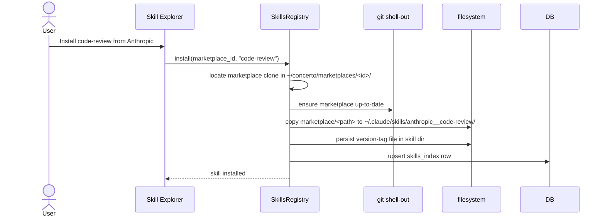
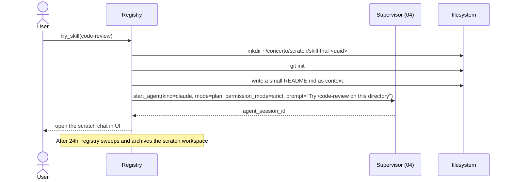

# 06 — Skills Registry

*Sub-system design doc. Inherits locked decisions from `00_Architecture_Overview.md`. PRD §11 defines the product. The four skill scopes (personal / project / plugin / enterprise) are the agent's standard contract; this sub-system surfaces them in a UI and adds marketplace install.*

---

## 1. Purpose & scope

The Skills Registry **does not execute skills** — Claude Code and Codex do that. The registry's job is to **make skills visible, discoverable, installable, and toggleable** without users having to manage files by hand. It is the VS-Code-Extensions panel for agent skills.

It owns:

- **Discovery** across the four scopes — enterprise (managed), personal (`~/.claude/skills/`), project (`.claude/skills/`), plugin (`<plugin>/skills/`).
- **Marketplace** integration — Git-URL-based marketplaces (Anthropic's, Awesome Skills, custom).
- **Install / uninstall / update.**
- **Per-project enable/disable** without uninstalling.
- **Visibility overrides** — the four states (`on` / `name-only` / `user-invocable-only` / `off`).
- **Slash commands** — `.claude/commands/*.md` and `.codex/commands/*.md` are treated as skills with default frontmatter (PRD §11.3) and appear in the same explorer.
- **Sandbox testing** — "Try this skill" launches a scratch chat with the skill pre-invoked.
- **Last-invocation tracking** — when each skill was last used in each project (PRD §11.1).
- **Enterprise-managed skills** — pinned via managed settings; cannot be uninstalled by user.

It does **not** own: the skill execution loop (the agent does that); the SKILL.md format (that's the agent's standard, we just read it).

---

## 2. Phase scope

| Phase | What ships |
|---|---|
| **V0.1** | Discovery across all four scopes. Per-project enable/disable. Visibility overrides. Slash commands surfaced together. No marketplace. |
| **V1.0** | + marketplace add by Git URL. + install / uninstall / update. + version pinning (commit SHA / tag / branch). + scheduled marketplace refresh. + sandboxed "Try this skill". + last-invocation tracking. + enterprise-managed allow/deny lists. + diff view between installed and upstream when an update is available. |
| **V2.0** | + signature-verification on marketplaces (when the marketplace publishes a pubkey). + skill telemetry (opt-in: per-skill usage histograms shared back to skill authors). + AI-ranked skill suggestions (Maestro recommends installing a skill that fits a recurring user pattern). |

---

## 3. Key design decisions (sub-system-internal)

### 3.1 Discovery model: on-demand filesystem scan + cached index

**Choice:** The registry maintains a SQLite-backed index of all discovered skills (`skills_index` table, 09 §4.5). It does a full rescan:

- On Core start.
- On filesystem-watcher events for the four scope directories.
- On explicit `RefreshSkills` RPC.

Between scans, the cached index is the source of truth — fast, indexed, no filesystem walks on every UI query.

**Why not a pure on-demand scan:** the Skill Explorer needs sub-100ms response times; walking four directory trees on each open is too slow for projects with many skills.

### 3.2 Slash commands as first-class skills

**Choice:** `.claude/commands/<name>.md` files are listed alongside skills, with their kind labeled "slash command." They're added with default frontmatter (the agent's own behavior — Claude Code treats them as skills internally).

This means the Skill Explorer is the single discoverability surface for both. The PRD §11.3 anticipates this.

### 3.3 Marketplace format: Git-URL + manifest, pluggable source trait

**Choice:** A marketplace is a Git repository containing a `marketplace.json` at the root. The Git-URL flavor is the V1.0 default and only OSS implementation; the **`SkillRegistrySource` trait** is the seam through which future hosted marketplaces (Concerto Inc's V2.0 hosted marketplace, enterprise allow-list-enforced internal marketplaces) plug in without forking. This is one of the extension trait seams locked in `18 §3.7`.

```rust
#[async_trait]
pub trait SkillRegistrySource: Send + Sync + 'static {
    /// Identifier the user sees in Settings → Skills → Sources.
    fn id(&self) -> &str;

    /// Fetch the manifest. May be a one-shot HTTP fetch, a git pull, or
    /// an authenticated API call — the trait doesn't care.
    async fn fetch_manifest(&self) -> Result<MarketplaceManifest>;

    /// Materialize a skill onto disk for the agent to read.
    async fn install_skill(&self, name: &str, target: &Path) -> Result<InstallReport>;

    /// Whether this source is reachable; used to render UI badges.
    async fn health(&self) -> SourceHealth;
}
```

**V1.0 impls (both MIT):**

- `GitMarketplaceSource` — clones / fetches the configured git URL; copies skill directories into `~/.claude/skills/`. This is what Anthropic's "Awesome Skills" and similar community marketplaces look like.
- `LocalDirectorySource` — points at a directory on disk (for development; per-org NFS-shared skill libraries also use this).

**V2.0+ candidates (planned, not in MIT monorepo per `18 §3.7`):**

| Impl | Where it lives |
|---|---|
| `ConcertoHostedMarketplaceSource` — talks to Concerto Inc's hosted marketplace API; supports search, ratings, payments | `crates/enterprise-marketplace` (BSL); Concerto Inc operates the backend |
| `OrgManagedMarketplaceSource` — enterprise allow-list-enforced, signature-verifying, audit-emitting | `crates/enterprise-org-marketplace` (BSL) |

The Core ships with the OSS impls; the user (or `managed.json`) chooses which sources are active. The MIT marketplace format defined below is stable across all impls — a self-hoster can run any combination of sources without losing parity with hosted users.

A marketplace is a Git repository containing a `marketplace.json` at the root:

```json
{
  "name": "Anthropic Skills",
  "description": "Official skills from Anthropic",
  "skills": [
    {
      "name": "code-review",
      "path": "skills/code-review/",
      "version": "1.4.2",
      "tags": ["development", "review"],
      "description": "Review code for issues",
      "min_concerto_version": "1.0.0"
    },
    ...
  ],
  "public_key": "base64-ed25519-optional"
}
```

Installing a skill from a marketplace clones (or sparse-checkouts) the skill's directory into the user's `~/.claude/skills/<marketplace-name>__<skill-name>/`. The naming scheme prevents collisions between marketplaces.

Marketplace updates: periodic `git fetch` + diff against installed versions. UI surfaces "X update available" badges.

### 3.4 Privacy: marketplace browsing is a remote call

**Choice:** Browsing marketplaces requires network access. When `enterpriseDataPrivacy = true` is set (managed setting or per-user toggle), the marketplaces tab is **hidden**, not just disabled — visible disabling would still leak the URL list.

Already-installed skills remain functional; they're local files.

### 3.5 Visibility overrides

**Choice:** Each skill has a per-(scope × project) override matrix:

```
state ∈ { on, name-only, user-invocable-only, off }
```

| State | The agent can auto-invoke | The agent sees the description | The user can invoke via slash |
|---|---|---|---|
| `on` | Yes | Yes | Yes |
| `name-only` | Yes (decides without description text) | No | Yes |
| `user-invocable-only` | No | Yes | Yes |
| `off` | No | No | No |

This matches Claude Code's `skillOverrides` setting. The registry persists these per `(skill_id, scope, project_id)` in `skills_index` augmented rows; the agent reads them via the skills-config writeback below.

### 3.6 Writing back to the agent's config files

**Choice:** When the user toggles a skill in our UI, we write back to the agent's config files where the agent expects them:

- Per-project: `.claude/settings.json` (the `skillOverrides` section).
- Personal: `~/.claude/settings.json` ditto.
- Project `.mcp.json` if MCP is part of the toggle.

We never invent our own config layer. The agent is the canonical reader; we're the canonical UI writer.

### 3.7 Enterprise-managed skills

**Choice:** Managed settings (`12 §3.8`) carry `allowedSkills` and `deniedSkills` glob lists. The registry enforces:

- Skills matching a `denied` glob are hidden + non-installable; existing installations are disabled.
- Skills matching an `allowed` glob get an "Org" badge in the UI.
- If both lists are empty, no filtering.

Org-managed skill pinning: a managed setting `pinnedSkills` can force a specific version (`name@v1.4.2`) — the registry refuses upgrades that don't match.

### 3.8 Sandboxed "Try this skill"

**Choice:** A "Try this skill" button opens a one-shot agent session in a special **scratch workspace** at `~/concerto/scratch/skill-trial-<uuid>/` — a fresh git-init'd directory. The skill is invoked with a small example prompt (taken from `SKILL.md`'s frontmatter `examples` field if present; otherwise "Demonstrate this skill").

The trial workspace is auto-archived after 24 hours. Permission mode defaults to `strict` (the skill being tested has no track record).

---

## 4. Data model

Primary table: `skills_index` (09 §4.5). The full schema is small enough to reproduce:

```sql
CREATE TABLE skills_index (
    id              TEXT PRIMARY KEY,
    scope           TEXT NOT NULL,                     -- personal | project | plugin | enterprise
    project_id      TEXT REFERENCES projects(id),
    name            TEXT NOT NULL,
    description     TEXT,
    path            TEXT NOT NULL,                     -- filesystem path to skill dir
    marketplace_id  TEXT,                              -- which marketplace it came from
    pinned_version  TEXT,                              -- commit SHA or tag
    visibility      TEXT NOT NULL DEFAULT 'on',        -- on | name-only | user-invocable-only | off
    enabled         INTEGER NOT NULL DEFAULT 1,        -- per-project enable
    last_used_at    INTEGER,
    invocation_count INTEGER NOT NULL DEFAULT 0,
    kind            TEXT NOT NULL DEFAULT 'skill'      -- skill | slash_command
);

CREATE TABLE marketplaces (
    id              TEXT PRIMARY KEY,
    name            TEXT NOT NULL,
    git_url         TEXT NOT NULL,
    pinned_ref      TEXT,                              -- branch | tag | commit
    public_key      BLOB,                              -- for signature verification (V2)
    last_fetch_at   INTEGER,
    last_fetch_error TEXT
);
```

The `skills_index` row is rebuilt by the discovery scan; durable fields (visibility, enabled, last_used_at, invocation_count) are preserved across rescans by keying on `(scope, name, project_id)`.

---

## 5. Interfaces

### 5.1 Public Rust API

```rust
pub struct SkillsRegistryHandle { /* opaque */ }

impl SkillsRegistryHandle {
    // Discovery
    pub async fn refresh(&self) -> Result<RefreshReport>;
    pub async fn list_skills(&self, filter: ListSkillsFilter) -> Result<Vec<Skill>>;
    pub async fn get_skill(&self, id: SkillId) -> Result<Option<Skill>>;

    // Per-project toggling
    pub async fn set_skill_enabled(&self, id: SkillId, project: ProjectId, enabled: bool) -> Result<()>;
    pub async fn set_skill_visibility(&self, id: SkillId, project: ProjectId, v: Visibility) -> Result<()>;

    // Marketplaces
    pub async fn add_marketplace(&self, url: GitUrl, pin: Option<GitRef>) -> Result<MarketplaceId>;
    pub async fn refresh_marketplaces(&self) -> Result<Vec<MarketplaceRefreshReport>>;
    pub async fn list_marketplaces(&self) -> Result<Vec<Marketplace>>;
    pub async fn remove_marketplace(&self, id: MarketplaceId) -> Result<()>;

    // Install / uninstall
    pub async fn install(&self, marketplace: MarketplaceId, skill_name: &str) -> Result<SkillId>;
    pub async fn uninstall(&self, id: SkillId) -> Result<()>;
    pub async fn update(&self, id: SkillId) -> Result<UpdateReport>;

    // Try
    pub async fn try_skill(&self, id: SkillId) -> Result<SessionId>;

    // Invocation tracking (called by 04 when an agent uses a skill)
    pub async fn record_invocation(&self, id: SkillId, project: ProjectId) -> Result<()>;
}
```

### 5.2 gRPC surface

Mirrors §5.1 in the `Skills` service (10 §5.1).

### 5.3 Emitted events

| Event | Stream | When |
|---|---|---|
| `skill.installed` / `skill.uninstalled` | broadcast | Install or remove |
| `skill.updated` | broadcast | Version bump |
| `skill.update_available` | broadcast | Marketplace fetch found a newer version |
| `skill.invoked` | broadcast | An agent invoked a skill |
| `marketplace.fetch_failed` | broadcast | Marketplace refresh errored |

---

## 6. Internal architecture

```mermaid
flowchart TB
    subgraph Reg["SkillsRegistryActor"]
        Disco["discovery scanner<br/>(4 scope walks)"]
        Watch["fs watcher<br/>(per scope dir)"]
        MP["marketplace manager"]
        Install["installer/uninstaller"]
        Try["sandbox runner"]
        ConfWrite["agent config writeback"]
        Track["invocation tracker"]
    end
    Disco --> DB["09 Persist<br/>skills_index"]
    Watch -.fs change.-> Disco
    MP --> Git["git clone/fetch"]
    Install --> ConfWrite
    Try --> Sup["04 Agent Supervisor<br/>(scratch session)"]
    Track --> DB
    Sup -.agent.invoked event.-> Track
```

### 6.1 Discovery scan implementation

Per scope:

```
for scope in [enterprise, personal, project(p), plugin]:
    for entry in walk(scope.path):
        if entry.is_dir() and (entry / "SKILL.md").exists():
            parse SKILL.md frontmatter
            upsert skills_index row
        elif scope ∈ {personal, project} and entry.suffix == ".md" and entry.parent.name == "commands":
            treat as slash_command; upsert
```

The scan is incremental on watcher events. Initial scan at Core start fully rebuilds.

### 6.2 Marketplace install



### 6.3 Marketplace fetch loop

A periodic task (default every 6 hours, configurable) calls `git fetch` on each registered marketplace. Diffs the manifest; emits `skill.update_available` for any installed skills with new versions.

**On Core start:** the registry uses the cached index immediately (no startup latency), then triggers a background async refresh of all registered marketplaces. This gives fast start + up-to-date data within ~10s of boot. Refresh failures are logged but don't block use; users see "last fetch failed" badges in Settings if relevant.

### 6.4 "Try this skill"



---

## 7. Sequence diagrams — already covered in §6

(Marketplace install in 6.2, Try in 6.4.)

---

## 8. Error handling & failure modes

| Failure | Detection | Response |
|---|---|---|
| Malformed SKILL.md frontmatter | YAML parse fails | Skip skill; emit warning in UI; do not crash discovery |
| Skill path moves underneath us (user manually deletes) | fs watcher event | Soft-delete row in skills_index; clear from agent config |
| Marketplace clone fails | git error | Mark marketplace in failed state; surface in UI; do not delete config |
| Marketplace signature invalid (V2) | sig verify | Refuse install/update; UI surfaces "untrusted marketplace" |
| Skill incompatible with current Concerto version (`min_concerto_version`) | At install | Refuse with clear error |
| Org allow/deny list updated mid-session | managed.json reload | Re-evaluate enabled status; disable any newly-denied skills |
| Two marketplaces have a skill with the same name | Naming collision | Distinguish by `<marketplace>__<skill>`; both visible in UI |
| Scratch workspace not cleaned up after crash | Periodic sweep at Core start | Sweep `~/concerto/scratch/*` older than 7d; archive |
| Agent's config writeback fails (file locked) | Retry with backoff; final failure | Surface to user; the UI toggle reverts to disk state |
| Skill calls a missing dependency | Agent's runtime concern | Out of scope here — surfaced by 04 |

---

## 9. Dependencies on other sub-systems

| Sub-system | How |
|---|---|
| **09 Persistence** | `skills_index`, `marketplaces` tables |
| **04 Agent Supervisor** | Starts scratch sessions for Try; consumes `skill.invoked` |
| **12 Security** | `enterpriseDataPrivacy` blocks marketplace browse; allowed/denied lists |
| **02 Repo Mgr** | Indirectly — marketplaces are git clones (we shell out, not go through 02; they live separately under `~/concerto/marketplaces/`) |

---

## 10. Testing strategy

| Layer | What | How |
|---|---|---|
| Unit | SKILL.md parser | Golden fixtures (good + malformed) |
| Unit | Per-(scope, project, name) override matrix | Property-based |
| Integration | Discovery against a fake skills tree | E2E fixture |
| Integration | Install + uninstall + update round-trip | With a local fake marketplace (a tmp git repo) |
| Integration | Agent config writeback round-trips (we write; the agent reads correctly) | E2E with real `claude` |
| Failure | Malformed marketplace.json | Parser tests |
| Performance | Discovery on 1000-skill tree | < 1s |
| Privacy | `enterpriseDataPrivacy = true` hides marketplaces tab | UI test |

---

## 11. Open questions / deferred

*All items resolved. See **§12 Resolved decisions log** below.*

## 12. Resolved decisions log

| # | Question | Decision | Where in doc |
|---|---|---|---|
| R-1 | Multiple marketplaces with the same skill name | **Yes — namespace by `<marketplace>__<skill>`**. Both visible side-by-side. | §3.3 |
| R-2 | Skill ratings / reviews | **V2.0** — opt-in telemetry to marketplace publishers. Local-first principle preserved (off by default). | (V2.0) |
| R-3 | AI-ranked skill suggestions (Maestro) | **V2.0** — driven by Suggestion Engine's interest signals. | (V2.0) |
| R-4 | Refresh marketplaces on Core start | **Background async refresh** — cached index used immediately for fast start; async fetch refreshes within ~10s. Failures logged, not blocking. | §6.3 |
| R-5 | Skill versioning scheme | **Don't enforce — trust marketplace authors.** `min_concerto_version` is the only hard compatibility check. | §3.3 |
| R-6 | Sandbox-Try permission mode | **`strict`.** Trying an unknown skill in `yolo` is dangerous. | §3.8 |
| R-7 | Slash-command marketplaces | **Out of scope V1.0** — live in users' personal configs. Revisit if demand emerges. | (deferred) |
| R-8 | Org-pinned version vs user's existing different version | **Force-replace with audit; warn user once.** Honors org policy. | §3.7 |
| R-9 | Marketplace signature key rotation | **V2.0** — `marketplace.json` carries `keys: [...]`; we accept the union; rotation has a sunset period. Deferred to when signing actually exists. | (V2.0) |

---

*End of `06_Skills_Registry.md`. Skill execution is the agent's job (`04_Agent_Supervisor.md`); managed allow/deny lists come from `12_Security_Identity.md`.*
