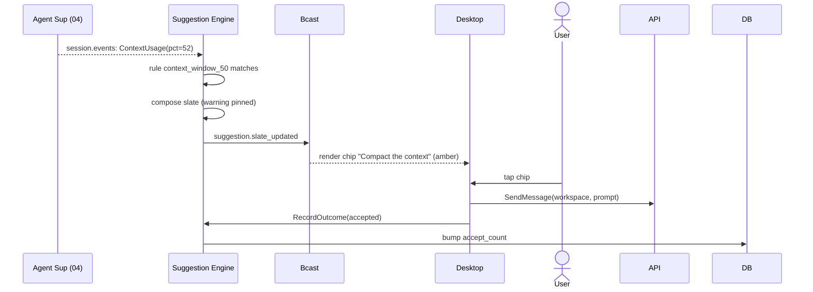
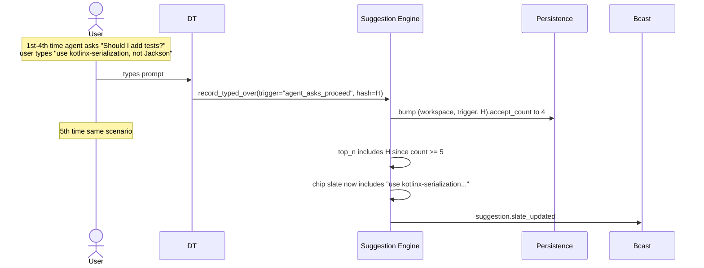
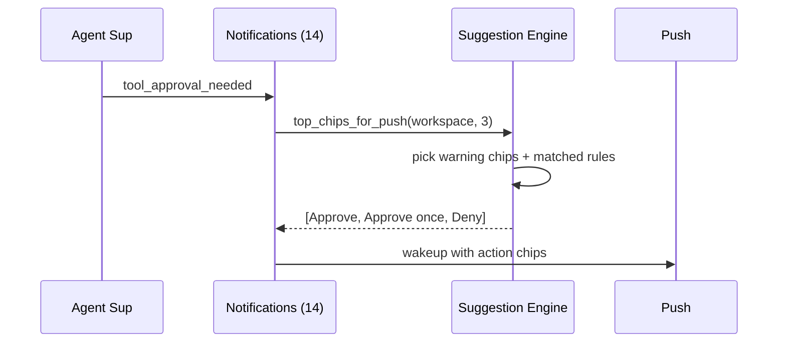

# 07 — Suggestion Engine

*Sub-system design doc. Inherits locked decisions from `00_Architecture_Overview.md`. PRD §13 defines the product. The engine is **deterministic + local learning** — never remote LLM calls in V1.0 (revisited V1.5).*

---

## 1. Purpose & scope

The Suggestion Engine generates **one-tap chips** that appear beneath the composer in every workspace (and on mobile push notifications). PRD §13 lays out the product rationale; this doc covers the mechanism.

It owns:

- **Rule engine** — deterministic triggers from agent events + workspace state.
- **Learning store** — per-(workspace × trigger × prompt-hash) frequency-and-recency counters.
- **Org-shared rules (V2.0)** — `org-suggestions.toml` distributed via managed settings.
- **Chip composition** — the prompt text, the action kind, the ordering.
- **Best-practice auto-prompts** — the warning-styled chips (context-window full, branch stale, destructive command, etc.).
- **Outcome tracking** — every shown chip's acceptance/dismissal recorded for learning.
- **Top-3 push-chip extraction** — chips for lock-screen action buttons (consumed by 14).

It does **not** own: the agent's tool-approval flow (04 owns; chips can target it); the Maestro's natural-language chat (08 owns; maestro may consume chips).

---

## 2. Phase scope

| Phase | What ships |
|---|---|
| **V0.1** | Deterministic rule set only (§3.2.1 from PRD). No learning. No org-shared. Bundled `suggestions.toml`. |
| **V1.0** | + per-user learning (frequency + recency counters; optional embedding-similarity collapse). + best-practice auto-prompts with severity styling. + top-3 chip extraction for push. + per-user reset / disable. + chip outcome events. |
| **V1.5** | + optional **LLM-ranked mode** (§3.11) where a user-chosen LLM scores chip candidates. Provider-agnostic — Claude / Codex / Gemini CLIs or direct API. |
| **V2.0** | + org-shared `org-suggestions.toml` via managed settings + per-workspace override UI. + smart-suppression (chip the user dismissed 3× in 7d stops appearing for that trigger). |

---

## 3. Key design decisions (sub-system-internal)

### 3.1 Three sources, ranked

PRD §13.2 spelled out three sources of suggestions. Ranking when assembling the final chip slate:

1. **Best-practice auto-prompts** — warning-styled, always pin to the top when active. Most likely to fire for genuinely-important state (context full, conflict, destructive command).
2. **Agent-state heuristics** — deterministic rules matching the latest agent turn / workspace state.
3. **Learned suggestions** — frequency-and-recency-ranked from user history.
4. **Org-shared (V2.0)** — interleaved per the rules in the org's file.

The Engine produces up to **4 chips visible** + a "More ▾" overflow with the remaining ranked list.

### 3.2 Rule format: TOML, versioned, hot-reloadable

**Pluggable rule sources.** The Engine consumes rules from a chain of `SuggestionRuleSource` implementations, locked as an extension seam in `18 §3.7`. The OSS Core ships:

- `BundledRulesSource` — the default rule pack compiled into the binary.
- `LocalTomlRulesSource` — reads `~/.concerto/suggestions.toml`.

Future BSL impls (V2.0+, per `18 §3.7`): `OrgSharedRulesSource` (fetches `org-suggestions.toml` from a configured HTTPS endpoint with signature verification, polled per `managed.json.rule_refresh_interval`), `RemoteAnalyticsRulesSource` (AI-suggested rules from Concerto Inc's hosted analytics service in a fully-opt-in flow).

```rust
#[async_trait]
pub trait SuggestionRuleSource: Send + Sync + 'static {
    fn id(&self) -> &str;
    async fn fetch_rules(&self) -> Result<Vec<CompiledRule>>;
    fn precedence(&self) -> i32;   // org-shared > local > bundled
}
```

The MIT Engine merges rules from all configured sources, ordered by precedence; conflicts are won by higher precedence. No `SuggestionRuleSource` impl is licensed-gated in the MIT Core — only the V2.0 enterprise-flavor source crates are BSL.

**Choice:** Rules live in `suggestions.toml` (the path opens in the user's editor from Settings):

```toml
version = 2

[[rule]]
id = "context_window_50"
trigger = { type = "agent_event", event = "ContextUsage", min_pct = 50 }
chip_text = "Compact the context"
prompt = "Please compact this conversation: summarize the work so far and continue."
severity = "warning"
priority = 80

[[rule]]
id = "agent_asks_proceed"
trigger = { type = "agent_event", event = "Message", contains_any = ["should I proceed", "shall I continue"] }
chip_text = "✓ Yes, proceed"
inject_decision = "y"             # injects directly into agent stdin (faster than send_message)
priority = 100

[[rule]]
id = "tests_failed"
trigger = { type = "agent_event", event = "ToolResult", from_tool = "test_runner", result_contains = "FAIL" }
chip_text = "Fix the failing tests"
prompt = "The tests failed. Investigate and fix."
priority = 70

[[rule]]
id = "branch_stale"
trigger = { type = "workspace_state", commits_behind_main = ">= 50" }
chip_text = "Rebase on main"
prompt = "This branch is far behind main. Rebase before continuing."
severity = "warning"
priority = 60
```

Schema is small and versioned. Migrations bump `version` and may rewrite rules; the Core ships defaults and merges user customizations on top.

### 3.3 Trigger evaluation

**Choice:** A trigger is a typed predicate over inputs from `04` and `02` event streams + the live `WorkspaceContext`. Categories:

- `agent_event` — match against the latest `AgentEvent` (Message, ToolCall, ToolResult, ContextUsage, AwaitingApproval, ...).
- `workspace_state` — match against `WorkspaceContext` (commits_behind, dirty, conflict, run_script_running, ...).
- `time_since_event` — fires after N seconds without a particular event (e.g., "agent idle 30+ min").
- `compound` — AND/OR of other triggers.

Each rule is registered with the triggers it cares about; the Engine maintains an index `event_type → rule_ids` so it only re-evaluates affected rules when an event fires.

### 3.4 Learning model: simple frequency-and-recency

**Choice:** No LLMs. No vector embeddings as a hard dependency (optional, see §3.6). Just per-(workspace × trigger × prompt-hash) counters in `suggestion_learn` (09 §4.5):

```
score(prompt | workspace, trigger) =
    accept_count / (accept_count + dismiss_count + 1)
        × recency_weight(last_seen_at)

recency_weight(t) = exp(-Δt / 14d)
```

When the user types a custom prompt after a trigger fires (and Concerto didn't propose it), the Engine:

1. Hashes the prompt (BLAKE2b of normalized text).
2. Bumps `(workspace, trigger, prompt_hash)`.

After 5 occurrences of the same hash, the prompt is promoted to a learned chip and shown in the chip slate for that trigger.

### 3.5 Privacy: learning is local, no telemetry

**Locked:** all learning lives in the user's SQLite. No data ever leaves the machine for learning. The user can reset learning data with one click (Settings → Suggestions → Reset learning data, PRD §13.4).

`enterpriseDataPrivacy = true` (managed setting) disables learning entirely if the org has flagged it as a data-residency concern.

### 3.6 Optional: embedding-based prompt similarity

**Choice:** When the user has many slightly-different prompts for the same trigger ("rerun the tests", "run tests again", "execute the test suite"), counters fragment. An optional local sentence-encoder collapses prompts that are semantically similar.

V1.0 default: **off** (avoid the runtime dep). V1.5: on with a tiny on-device model (e.g., `MiniLM-L6` at ~80 MB). Toggled in Settings.

### 3.7 Best-practice auto-prompts

A subset of rules, marked `severity = "warning"`, render with a different visual style and bypass normal ranking — they always appear when active. These are the table in PRD §13.3.

Important property: **these never auto-execute**. Even when the agent is in `yolo` permission mode (`04 §3.10`), warning chips are still one-tap. A YOLO agent might auto-do everything but the user still has to tap the warning before the warning's prompt is sent.

### 3.8 Push chip extraction (top 3)

**Choice:** When a `tool_approval_needed` notification is created (14), the Engine extracts up to 3 chips to attach to the push payload. Ranking: warning chips first, then highest-priority rule chips, then learned chips.

The "Approve / Deny / Open" chip set is the default for any tool approval if no other chips qualify.

### 3.9 Chip kinds

The Engine emits chips with one of these action kinds:

| Kind | What happens on tap |
|---|---|
| `send_message` | Compose the chip's prompt and send to the agent (default) |
| `inject_decision` | Inject text directly into the agent's PTY (for approval prompts, more efficient than send_message) |
| `tool_decision` | Resolve a pending `tool_approval` with a specific Decision |
| `navigate` | Open a workspace / file / Settings page (no prompt) |
| `compose` | Pre-fill the composer with the prompt text, don't send |
| `meta` | Engine action: pause the agent, save a checkpoint, etc. |

Different kinds serve different purposes; the chip slate may mix them.

### 3.10 Suppression

When a user dismisses a chip (taps "More" past it, or explicitly hides it), the dismissal is recorded. After **3 dismissals in 7 days** for the same (workspace × trigger × prompt_hash), the rule is auto-suppressed for that workspace for 30 days. Surfaced in Settings → Suggestions → Suppressed (manual unsupress allowed).

### 3.11 LLM-ranked mode (V1.5) — pluggable provider

**Off by default.** Opt-in toggle in Settings → Suggestion Engine → Ranking. When enabled, after the rule engine + learning store produce a candidate chip slate, a one-shot LLM call ranks them against the current workarea context (last 1–2 agent turns + workarea state summary). The top-ranked chips become the visible slate.

**Provider choice (user-configurable):**

| Backend | How it routes | Auth source |
|---|---|---|
| **Claude CLI** | One-shot `claude --model <model> --prompt <rank_prompt>` subprocess; no PTY. | User's existing Claude Code auth (Pro/Max session or API key in keychain). |
| **Codex CLI** | One-shot `codex ...` subprocess. | User's Codex auth. |
| **Gemini CLI** | One-shot `gemini ...` subprocess. | User's Gemini auth. |
| **Direct API** | `reqwest` POST to Anthropic / OpenAI / Bedrock / Vertex / OpenRouter / Vercel AI Gateway / Azure AI Foundry. | API token in `09 §3.7` keychain (`SecretKind::ProviderToken`). |

Setting (`settings.suggestion_engine.ranking`):
```json
{
  "enabled": true,
  "backend": "claude_cli" | "codex_cli" | "gemini_cli" | "direct_api",
  "model": "claude-4.6-haiku" | "gpt-5-mini" | "gemini-flash-2.5" | "...",
  "max_input_tokens": 4000,
  "max_output_tokens": 200,
  "daily_budget_tokens": 50000,
  "timeout_ms": 1500
}
```

**Defaults if enabled with no preference:** Pick the cheapest model available from the user's configured providers in this order: Claude Haiku → Gemini Flash → GPT-5-mini → Codex equivalent. If none is configured, the toggle stays off and the UI surfaces an "Add a provider" CTA.

**Budget guardrails:** Daily token cap (default 50K total). When exhausted, ranking silently falls back to non-LLM (frequency + recency) for the rest of the day. UI surfaces in Diagnostics.

**Latency budget:** 1.5s timeout (configurable). If the LLM call doesn't return in time, fall back to non-LLM ranking for that turn. Slate continues to be reactive (target: chip slate updates within 200ms of trigger events regardless of LLM availability).

**Privacy:**
- Provider-agnostic means the user's own provider sees the ranking prompt (a short summary of the workarea state + chip candidates). The prompt is small; no full chat history.
- `enterpriseDataPrivacy = true` disables LLM-ranked mode entirely unless the configured backend is an on-prem LLM (Bedrock with VPC, Vertex, Azure AI Foundry, local).
- Audit log records `suggestion_llm_rank_call { backend, tokens_in, tokens_out }` per call.

**Independence from the Maestro's LLM:** the Suggestion Engine's LLM call is separate from the Maestro's daily budget (`08 §3.9`). Different budgets, different model preferences. Users may want Sonnet for the Maestro (which reasons across workareas) and Haiku for ranking (which scores ~10 chips per turn).

**Implementation lives in V1.5.** The V1.0 design ships pure rule + frequency. The trait `ChipRanker { rank(candidates, context) -> Vec<RankedChip> }` is the seam; V1.0 ships the `FrequencyRanker` impl, V1.5 adds `LlmRanker`.

---

## 4. Data model

Primary table: `suggestion_learn` (09 §4.5). Plus:

```sql
CREATE TABLE suggestion_suppressions (
    workspace_id    TEXT NOT NULL REFERENCES workspaces(id) ON DELETE CASCADE,
    trigger         TEXT NOT NULL,
    prompt_hash     TEXT NOT NULL,
    suppressed_at   INTEGER NOT NULL,
    expires_at      INTEGER NOT NULL,                  -- 30 days
    PRIMARY KEY (workspace_id, trigger, prompt_hash)
);

CREATE TABLE suggestion_events (
    id              TEXT PRIMARY KEY,                  -- ULID
    workspace_id    TEXT NOT NULL REFERENCES workspaces(id) ON DELETE CASCADE,
    workarea_id     TEXT NOT NULL REFERENCES workareas(id) ON DELETE CASCADE,
    session_id      TEXT REFERENCES sessions(id),     -- which session the trigger fired in (NULL for workarea-state triggers)
    trigger         TEXT NOT NULL,
    prompt_hash     TEXT NOT NULL,
    chip_text       TEXT NOT NULL,
    outcome         TEXT NOT NULL,                     -- shown | accepted | dismissed | typed_over
    created_at      INTEGER NOT NULL
);

CREATE INDEX idx_suggestion_events_workarea ON suggestion_events(workarea_id, created_at);
```

The `suggestion_events` table is the audit-of-suggestions. It's separate from the main audit log because it's high-volume (potentially many per minute) and lower-severity.

In-memory:

```rust
pub struct SuggestionState {
    rules: Vec<CompiledRule>,              // from suggestions.toml + org-suggestions.toml
    org_rules: Vec<CompiledRule>,          // V2.0
    workspace_contexts: HashMap<WorkspaceId, ChipSlate>,
    suppressions: HashMap<(WorkspaceId, String, [u8; 32]), Instant>,
    enabled: bool,
}

pub struct ChipSlate {
    chips: Vec<Chip>,
    generation: u64,
    last_event: Instant,
}
```

---

## 5. Interfaces

### 5.1 Public Rust API

```rust
pub struct SuggestionEngineHandle { /* opaque */ }

impl SuggestionEngineHandle {
    /// Get the current chip slate for a workspace.
    pub async fn get_chips(&self, workspace: WorkspaceId) -> Result<ChipSlate>;

    /// For notifications (14): top N chips for a push.
    pub fn top_chips_for_push(&self, workspace: WorkspaceId, n: usize) -> Vec<Chip>;

    /// Called by the API layer when a chip is acted on.
    pub async fn record_outcome(&self, w: WorkspaceId, chip: ChipId, outcome: Outcome) -> Result<()>;

    /// Reload rule files (suggestions.toml + org file).
    pub async fn reload_rules(&self) -> Result<()>;

    /// Reset learning data — bulk delete from suggestion_learn.
    pub async fn reset_learning(&self, scope: ResetScope) -> Result<()>;

    /// Disable / re-enable globally.
    pub async fn set_enabled(&self, enabled: bool) -> Result<()>;
}
```

### 5.2 gRPC surface

Mirrors §5.1 in the `Suggestions` service.

### 5.3 Emitted events

| Event | Stream | When |
|---|---|---|
| `suggestion.slate_updated` | `suggestion.events`, filter workspace | New chips computed for a workspace |
| `suggestion.shown` | `suggestion.events` | A chip was visibly shown in a client |
| `suggestion.accepted` | `suggestion.events` | User tapped a chip |
| `suggestion.dismissed` | `suggestion.events` | User explicitly dismissed |
| `suggestion.typed_over` | `suggestion.events` | User typed a custom prompt; we learn from it |
| `suggestion.suppressed` | `suggestion.events` | Auto-suppression triggered |

---

## 6. Internal architecture

```mermaid
flowchart TB
    subgraph Eng["SuggestionEngineActor"]
        Rules["Rule loader<br/>(suggestions.toml)"]
        Eval["Trigger evaluator<br/>(event-indexed)"]
        Learn["LearningStore"]
        Suppress["SuppressionStore"]
        Compose["Chip composer<br/>+ ranker"]
        OutcomeRec["OutcomeRecorder"]
    end
    Sup["04 Agent Sup"] -.session.events.-> Eval
    WSM["03 Workspace/Workarea/Session Mgr"] -.workarea.events.-> Eval
    VCS["13 VCS"] -.checks events.-> Eval
    Eval --> Compose
    Learn --> Compose
    Suppress --> Compose
    Compose -->|emit slate_updated| Bcast["broadcast"]
    OutcomeRec --> Learn
    OutcomeRec --> Suppress
    OutcomeRec --> DB["09 Persist"]
```

### 6.1 Event-driven recomputation

The Engine subscribes to:

- `session.events.<sid>` for every active session.
- `workarea.events` filtered to active workareas.
- `checks.<workarea_id>.<repository_id>` for CI signals.

When any of these fires, the Engine:

1. Identifies the workspace.
2. Re-runs only the rules indexed against that event type.
3. Composes the new slate.
4. Diffs against the prior slate; if changed, emits `slate_updated`.

Recomputation latency target: < 10ms per event.

### 6.2 Slate composition

```
compose(workspace) -> ChipSlate:
    candidates = []
    for rule in rules:
        if rule.matches(current_state):
            candidates.push((rule.priority, Chip::from_rule(rule)))
    for (trigger, learned) in learning_store.top_n(workspace.id, 5):
        candidates.push((LEARNED_BASE_PRIORITY + learned.score * 10, Chip::from_learned(learned)))
    candidates.sort_by_priority_desc()
    # warning chips always pin to the top
    visible = warnings + non_warnings[:4 - len(warnings)]
    overflow = candidates[len(visible):]
    ChipSlate { visible, overflow }
```

### 6.3 Learning update path

```
on user types prompt P:
    if last_slate had a chip with prompt == P: outcome = accepted_via_compose
    else: outcome = typed_over
    record suggestion_events row
    if accepted_via_compose: bump accept_count, decay others
    if typed_over: bump (trigger, prompt_hash).accept_count for the just-fired trigger
on user taps chip C:
    record suggestion_events row outcome=accepted
    bump accept_count for that rule's prompt_hash
on user dismisses C explicitly:
    record dismissed
    bump dismiss_count
    if dismiss_count >= 3 in 7d: insert suppression
```

### 6.4 Reloading rules

On Core start: load `suggestions.toml` + org file (if managed) + bundled defaults. Hot-reload on `SIGHUP` (driven by `01`'s config bus). Failed parse: keep prior rules; surface a warning.

---

## 7. Sequence diagrams — hot paths

### 7.1 Compact-context warning chip



### 7.2 Learned chip surfaces after 5 occurrences



### 7.3 Top-3 push chips for lock-screen approval



---

## 8. Error handling & failure modes

| Failure | Detection | Response |
|---|---|---|
| Malformed `suggestions.toml` | Parser | Keep prior rules; surface warning; log |
| Org-suggestions file missing | Managed setting points but file unreachable | Skip; warn; continue with user rules |
| Embedding model load failure (V1.5+) | Init error | Fall back to hash-only learning; user sees a one-time notice |
| Outcome events backlog | Engine throughput cap | Drop oldest; emit `slate_throughput_warning` |
| Rule has invalid trigger field | Validation at load | Reject that rule; report; keep rest |
| Suppression DB corruption | Schema check | Wipe suppression table; alert user; learning data untouched |
| User reset learning while a slate is showing learned chips | Atomic | Re-compose with empty learning; emit slate_updated |
| Engine disabled mid-session | `set_enabled(false)` | Emit empty slate; learning paused |

---

## 9. Dependencies on other sub-systems

| Sub-system | How |
|---|---|
| **04 Agent Supervisor** | Source of agent events and ContextUsage |
| **03 Workspace Mgr** | Source of workspace state events |
| **13 VCS Provider** | Source of CI / PR state events |
| **09 Persistence** | learning + suppression + suggestion_events |
| **14 Notifications** | Consumes `top_chips_for_push` |
| **12 Security** | `enterpriseDataPrivacy` toggles learning |

Consumers:
- **15/16/17** clients render the slate and call `record_outcome` on user action

---

## 10. Testing strategy

| Layer | What | How |
|---|---|---|
| Unit | Trigger evaluator — each trigger type | Synthetic events |
| Unit | Slate composer — ranking + warning pinning | Fixture rules + state |
| Unit | Learning: counter bump on accept, decay over time | Synthetic clock |
| Unit | Suppression: 3 dismisses in 7d | Synthetic clock |
| Integration | Real agent stream → chip slate updates correctly | E2E with stubbed agent |
| Performance | < 10ms per event recompute on a slate of 20 active rules | Bench |
| Privacy | `enterpriseDataPrivacy = true` halts writes to `suggestion_learn` | Behavioral assertion |
| Hot-reload | Edit suggestions.toml; assert slate updates | E2E |
| TOML schema | Validate all bundled rules + sample user files | Schema test |

---

## 11. Open questions / deferred

*All items resolved. See **§12 Resolved decisions log** below.*

## 12. Resolved decisions log

| # | Question | Decision | Where in doc |
|---|---|---|---|
| R-1 | Learning threshold (occurrences before promotion) | **Configurable per workspace; default 5.** Beta data may tune. | §3.4 |
| R-2 | Learned suggestions on workspace deletion | **Drop.** Workspace-scoped data goes with the workspace (workspaces are archived; the learned rows are dropped on deletion). | §3.4 |
| R-3 | Org-shared vs user rules precedence | **Org-shared rules apply first; user can override per-workspace (V2.0 UI).** | §3.1 |
| R-4 | LLM-ranked mode (V1.5) | **Pluggable LLM provider** (Claude CLI / Codex CLI / Gemini CLI / direct API). User picks in Settings → Suggestion Engine → Ranking. Defaults to cheapest model available; daily budget cap; 1.5s timeout fallback to frequency ranker; `enterpriseDataPrivacy` disables external backends. | §3.11 (new) |
| R-5 | Multi-language prompt support | **Out of scope V1.0** — user types whatever language. | (deferred) |
| R-6 | Chips during voice-input mode (mobile) | **Show chips.** Voice + chips are complementary. | (cross-ref `16`) |
| R-7 | Two rules emit same chip text | **Dedup by text; merge priority; emit once.** | §3.1 |
| R-8 | Culturally biased best-practice triggers | **Per-workspace opt-out per rule.** V1.5 may add multi-workflow variants if data shows demand. | §3.2, §3.7 |
| R-9 | Chip cap per turn | **4 visible + overflow** in "More ▾". | §3.1 |
| R-10 | Rule packs per language/framework | **V2.0.** Universal pack ships V1.0; framework packs add value once ecosystem stabilizes. | (V2.0) |

---

*End of `07_Suggestion_Engine.md`. Push integration via `14_Notifications_Push.md`. Per-chip outcome events are also consumed by `08_Maestro_Agent.md` for digest generation.*
