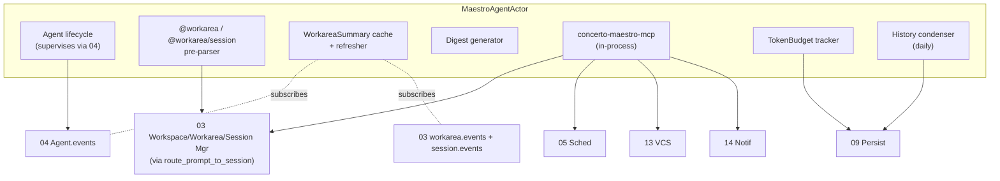
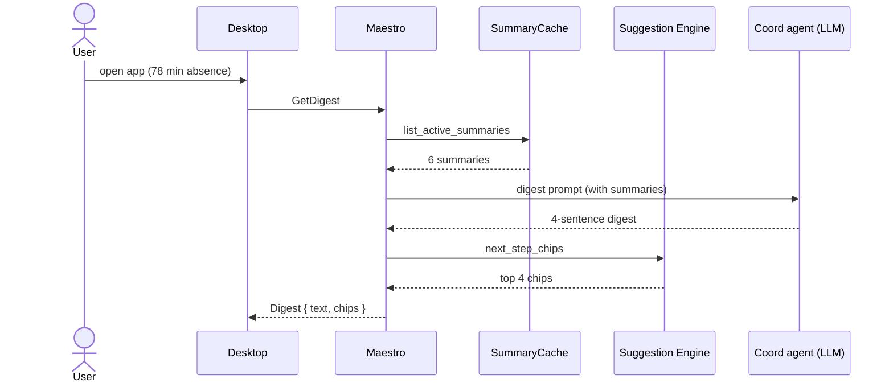
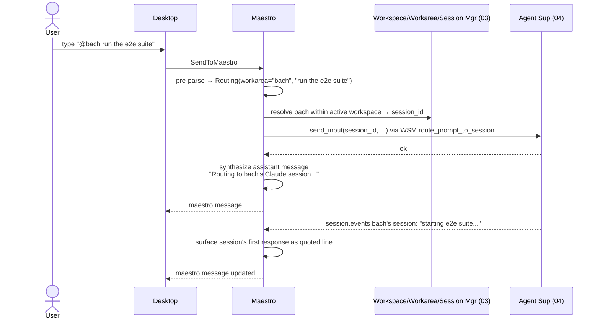
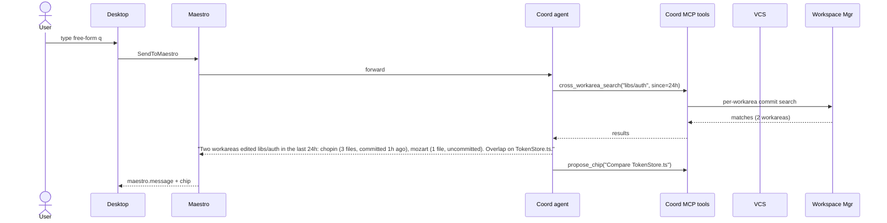
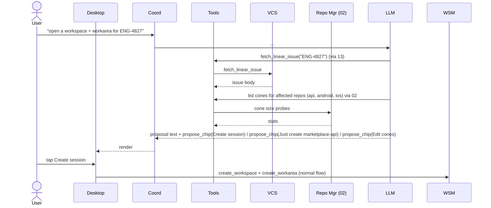

# 08 — Maestro Agent

*Sub-system design doc. Inherits locked decisions from `00_Architecture_Overview.md`. PRD §14 defines the product. This is the LLM session behind the "Concerto chat" at the top of the app.*

---

## 1. Purpose & scope

The Maestro Agent is an **agent process supervised by 04 with a different toolset and no working directory**. Its job (PRD §14.1):

- Be the "dispatcher / historian / planner" so the user can spend attention on review + prompt-writing.
- Surface a digest after the user returns from absence.
- Route prompts to specific workareas / sessions via `@workarea` and `@workarea/session-kind` syntax.
- Spawn new workspaces + workareas from natural language.
- Answer cross-workarea / cross-workspace queries ("what touched libs/auth today?").
- Propose next steps as chips.

It owns:

- **Maestro session lifecycle** — itself a session (per 03's 3-level model) running under a special "maestro" workarea-equivalent with restricted tools.
- **Maestro tool implementations** — ~16 tools the agent can call covering workspaces, workareas, sessions.
- **Digest generation** — periodic and on-demand rolling summaries across active workareas.
- **Per-workarea summary cache** — short summaries of workarea state (plus its sessions' last turns), refreshed as workareas work.
- **Routing parser** — `@workarea` / `@workarea/session` / `@all` / `@idle` / `@blocked` / `/digest` / `/pause` / `/new`.
- **Privacy enforcement** — what the Maestro can read from each workarea (summary-only by default; full chat opt-in per project).
- **Maestro chat history** — persisted like any chat; with daily condense pass.
- **Cost guardrails** — per-day token cap; cheap-model default.

It does **not** own: writing code (no edit/shell tools); modifying workareas directly (it sends prompts; workarea sessions do the work); replacing per-session chats.

---

## 2. Phase scope

| Phase | What ships |
|---|---|
| **V0.1** | (not in V0.1) |
| **V1.0** | Full Concerto chat with the 16-tool set (§5). `@workarea` and `@workarea/session-kind` routing. Digest on user return. New-workspace-and-workarea-from-natural-language. Suggested next-step chips. Per-workarea summary cache. Default model: Sonnet. Daily token budget. Per-workarea `exclude_from_maestro` toggle. |
| **V2.0** | + MCP-augmented context (Linear, Slack — fetches issue text, channel summaries). + cross-workarea search over commits/diffs. + voice-first interaction on Apple Watch. + spawn parallel multi-workarea plans from one prompt. |

---

## 3. Key design decisions (sub-system-internal)

### 3.1 The Maestro is itself an agent process

**Choice:** The Maestro runs as a long-lived agent process supervised by 04 — same `concerto-agent-host` machinery as workarea sessions, but:

- The agent CLI is invoked with **our** tool set (via Claude Code's tool-config or MCP), not the default.
- Working directory is `~/concerto/maestro/` (a scratch dir; not a worktree).
- The agent has no file-edit, no shell, no network — a strictly restricted toolset.
- Permission mode is always `strict` (every Maestro tool call is intercepted by 04's PermissionResolver, except those classified as `ReadOnly`).

**Why "an agent" rather than a custom orchestrator:**
- Reuses 04's lifecycle, host-survival, cold-resume, token tracking.
- Stays close to the underlying agent's reasoning loop — natural language in, structured tool calls out.
- Same UI patterns (chips, voice, attachments).

### 3.2 Tool definitions: MCP server hosted in-Core

**Choice:** Concerto ships a built-in MCP server, `concerto-maestro-mcp`, that exposes the Maestro tools (§5.1) over the MCP wire protocol. When the Maestro agent spawns, the supervisor configures it with only this MCP server (no filesystem, no shell). The agent calls the tools via standard MCP semantics.

**Why MCP:** it's the contract the agent CLIs already speak. We don't invent a new tool-calling shape; we leverage what's there.

The Concerto MCP server is the **same binary as the Core** running an in-process MCP transport (stdio over a pipe to the agent host). No separate process.

### 3.3 Reading state — summaries by default, at the workarea grain

**Choice:** The Maestro's `get_workarea_summary` tool reads from a **cache** of per-workarea summaries, not from raw chat. Cache shape:

```rust
pub struct WorkareaSummary {
    pub workarea_id: WorkareaId,
    pub workspace_id: WorkspaceId,
    pub workspace_name: String,
    pub composer_name: String,
    pub branch_name: String,
    pub status: WorkareaStatus,
    pub last_activity_at: Instant,

    // Aggregated across all sessions of this workarea (each session's
    // last turn is summarized by its agent; we keep the most recent).
    pub sessions: Vec<SessionSummary>,
    pub last_turn_summary: String,                    // ≤ 300 chars; from the most recently active session
    pub last_3_turn_summaries: Vec<String>,

    // Hard facts (per repo in the workarea — no LLM)
    pub repos: Vec<RepoSummary>,                      // commits_ahead, files_changed, lines, pr_state, ci_state per repo

    pub blocked_on: Option<BlockedReason>,            // "awaiting_approval" | "test_failure" | "merge_conflict" | ...

    pub generated_at: Instant,
    pub generation: u64,
}

pub struct SessionSummary {
    pub session_id: SessionId,
    pub agent_kind: AgentKind,
    pub model: String,
    pub status: SessionStatus,
    pub last_turn_summary: String,
}

pub struct RepoSummary {
    pub repository_id: RepositoryId,
    pub repo_name: String,
    pub commits_ahead: u32,
    pub files_changed: u32,
    pub lines_added: u32,
    pub lines_removed: u32,
    pub pr_state: Option<PrState>,
    pub ci_state: Option<CiState>,
}
```

**Per-workarea privacy toggle:** if `workareas.settings_json.exclude_from_maestro = true`, only the hard facts (status, branch, repo names) are exposed; summaries are blanked. The workarea shows up as `[private workarea, name only]` in the Maestro's view.

**Per-project full-chat access:** `projects.settings_json.concerto_chat_full_chat_access = true` lifts the Maestro out of summary-only and grants it the raw last-3-turns of chat (per session). Off by default.

### 3.4 Summary generation

**Choice:** Two sources, in order of preference:

1. **The workspace agent's own end-of-turn summary** — emitted via the parser packs (04). Some agents (Claude Code with `--end-summary`) produce this naturally. Stored on each `chat_messages` row that closes a turn.
2. **A Concerto-side rolling summarizer** — when the agent doesn't produce its own, the Core runs a tiny Haiku-class summarization call against the last N messages (with rate-limit + token budget). Cached.

The first option is free (the agent was already going to summarize). The second costs tokens but is cheap.

Summaries refresh:
- After every workspace agent turn complete (the agent owns the cadence).
- After 10 minutes of inactivity (the Concerto summarizer ensures freshness).
- On `GetMaestroDigest` call (force-refresh if stale > 60 s).

### 3.5 Routing: `@workarea` and `@workarea/session` parser

**Choice:** The Maestro's text input goes through a **pre-parse** before the LLM sees it. The routing syntax targets workareas (by composer name) or specific sessions within a workarea (by agent kind):

```
"@bach apply the migration pattern from chopin"
  → { kind: "workarea", target: "bach", body: "..." }
  → routes to the most-recently-active session in workarea "bach"

"@bach/claude apply the migration pattern from chopin"
  → { kind: "session", workarea: "bach", agent_kind: "claude", body: "..." }
  → routes to the Claude session in workarea "bach" specifically

"@bach,@mozart apply..."
  → { kind: "fanout", targets: ["bach", "mozart"], body: "..." }

"@all status"   / "@idle ..."   / "@blocked ..."
  → resolves dynamically to a set of workareas/sessions at routing time
```

Cross-workspace disambiguation: workarea composer names are unique within a workspace but not across workspaces. When the user types `@bach` and multiple workspaces have a "bach" workarea, the Maestro picks the **currently-selected** one (the one the UI has focus on). If ambiguous, the Maestro asks: "I see two `bach` workareas — Idempotency keys / Login refactor. Which?"

When a routing directive is detected:

1. The pre-parser handles it directly — calls `route_prompt_to_session(session_id, prompt)` per resolved target — without involving the Maestro LLM (saves tokens, ensures literal routing).
2. The Maestro records the action in its chat history with a synthesized assistant message ("Routed to bach / Claude").
3. The user sees the session's response surfaced back in the Maestro chat as quoted lines.

Free-form text (no `@`, no `/`) goes to the Maestro LLM normally.

This means **routing is deterministic** (no risk of LLM mis-routing) and **the Maestro only spends tokens on the questions that actually need its reasoning**.

### 3.6 Digest generation (the killer feature)

PRD §14.4.3. When the user has been away > 30 minutes and reopens Concerto, or asks `/digest`:

```
generate_digest():
    summaries = [get_workarea_summary(wa) for wa in active_workareas]
    deltas_since_last_user_activity = compute_deltas(summaries, last_seen_at)
    prompt = build_digest_prompt(summaries, deltas)
    response = LLM.complete(prompt, model=sonnet, max_tokens=600)
    chips = suggestion_engine.next_step_chips(workareas=active_workareas)
    return Digest { text: response, chips: chips }
```

The digest prompt is templated:

```
You are Concerto's maestro. The user just returned after being away N minutes.
Here is the state of their {n} active workareas (grouped by workspace):

{per_workarea_block}

Write a concise (3-5 sentence) digest. Group by:
- Finished (and ready for action)
- Blocked (and needing user input)
- Still working (with current focus)

End with a one-line proposed next step.
```

The output is rendered above the standard chat composer. Chips come from 07.

Target: < 5s p50 (PRD §22.3) — measured from `GetDigest` RPC to UI render.

### 3.7 Maestro chat history — daily condensation

**Choice:** The Maestro's chat grows continuously. To keep token cost bounded:

- Recent messages (last 24h) are kept verbatim.
- Each day, an offline summarizer pass condenses 24-48h-old messages into a one-paragraph daily summary.
- The agent's input is `daily_summaries[:weekly] + verbatim[last 24h] + user's latest`.
- The user sees the full unabridged history in the UI; only the agent's input is summarized.

This keeps per-day cost roughly flat regardless of session length.

### 3.8 Spawn new workspace + workarea from natural language

**Choice:** The Maestro's `create_workspace_from_description` tool wraps multiple sub-calls:

1. Parse the description for an issue reference (Linear, GitHub) → if found, fetch via 13.
2. Detect multi-repo intent (e.g., "across both the API and the iOS app") → propose the repo set.
3. Plan-mode cone suggestion via Repo Mgr (02) → propose per-(workarea, repo) cones.
4. Compose a confirmation chip slate ("Create workspace + first workarea (bach)" / "Just create the workspace, no workarea yet" / "Edit repo set / cones").
5. The user confirms; create flows through Workspace/Workarea/Session Mgr (03) as normal — first the workspace, then the first workarea, then an initial session (Claude in plan mode by default).

The Maestro never creates a workspace, workarea, or session silently. The user always confirms.

### 3.9 Cost: provider, model, and budget

**Pluggable LLM provider.** The Maestro's LLM backend is **user-configurable** in Settings → Concerto Chat → Backend. Same pattern as the Suggestion Engine's ranking backend (`07 §3.11`):

| Backend | How it routes | Auth source |
|---|---|---|
| **Claude CLI** | Long-lived `claude` session spawned by 04 via `concerto-agent-host`; the Concerto preamble is replaced with the Maestro preamble; tool surface is `concerto-maestro-mcp`. | User's Claude Code auth (Pro/Max session or API key). |
| **Codex CLI** | Same shape via `codex`. | User's Codex auth. |
| **Gemini CLI** | Same shape via `gemini`. | User's Gemini auth. |
| **Direct API** | The Maestro session runs against a direct provider API (Anthropic / OpenAI / Bedrock / Vertex / OpenRouter / Vercel AI Gateway / Azure AI Foundry), bypassing CLI subprocesses. Tool-calling implemented via the provider's native function-call API. Foundry uses the deployment-name → model-name mapping configured in Settings → Providers. | API token in `09 §3.7` keychain. |

**Defaults:**

- **Backend:** Auto-pick the first available from `Claude CLI → Codex CLI → Gemini CLI → Direct API (Anthropic)`. User can change anytime.
- **Model:** `claude-4.6-sonnet` (cheaper than Opus, plenty smart for orchestration). For Codex / Gemini / Direct API, the equivalent tier ("Sonnet-class").
- **Daily input budget:** 200K tokens.
- **Daily output budget:** 50K tokens.

All user-configurable in Settings → Concerto Chat.

When the budget is exceeded:
- The Maestro goes inert (no LLM calls); routing and tool calls (deterministic) still work.
- The UI shows a yellow banner: "Maestro budget exhausted; routing still works."
- Resets at UTC midnight or on user-clicked "Reset budget."

**Provider switching mid-day:** the user can change backend at any time; in-flight calls finish on the old backend, new calls go to the new. Daily budget is **per backend** (changing backend doesn't reset the day's total — the cumulative count is across backends). Audit log records backend switches.

For enterprise with on-prem LLMs (Bedrock with VPC, Vertex, Azure AI Foundry, local): use the **Direct API** backend with the appropriate base URL.

### 3.10 `enterpriseDataPrivacy` interaction

When `managed.json.enterpriseDataPrivacy = true`:

- If the Maestro's model is **external** (Anthropic API, etc.): Maestro is disabled. Tray + UI shows it's off due to policy.
- If the Maestro's model is **on-prem** (Bedrock with VPC, Vertex, Azure AI Foundry, local LLM): Maestro works normally.

Routing still works in all modes (deterministic, no LLM).

---

## 4. Data model

### 4.1 Persistent

A dedicated `chats` row with `kind = 'maestro'`. Its `chat_messages` are the Maestro chat history.

```sql
-- A single maestro chat per user (one row in chats)
-- Reuses chat_messages

CREATE TABLE maestro_state (
    id              INTEGER PRIMARY KEY CHECK (id = 1),  -- singleton
    daily_in_today  INTEGER NOT NULL DEFAULT 0,
    daily_out_today INTEGER NOT NULL DEFAULT 0,
    budget_resets_at INTEGER NOT NULL,
    last_digest_at  INTEGER,
    enabled         INTEGER NOT NULL DEFAULT 1
);
```

Daily summaries are stored as `chat_messages` with a `metadata.role_extra = 'daily_summary'` tag.

### 4.2 In-memory

```rust
pub struct MaestroState {
    session: Option<SessionId>,                  // the running Maestro session
    summary_cache: HashMap<WorkareaId, WorkareaSummary>,
    daily_budget: TokenBudget,
    pending_routings: HashMap<RoutingId, RoutingHandle>,
}
```

---

## 5. Interfaces

### 5.1 Maestro tools (exposed to the Maestro agent via MCP)

The tool set is split across the 3 levels:

```
# Read-only — workspace/workarea/session hierarchy
list_workspaces()                                      → [{id, name, archived, n_workareas, n_repos}]
list_workareas(workspace_id?)                          → [{id, workspace_id, composer, branch, status, last_activity}]
list_sessions(workarea_id?)                            → [{id, workarea_id, agent_kind, status, last_activity}]
get_workspace_summary(workspace_id)                    → { workspace, n_active_workareas, ... }
get_workarea_summary(workarea_id)                      → WorkareaSummary

# Read-only — adjacent state
list_recent_activity(since)                            → [Event]
list_active_schedules()                                → [Schedule]
read_inbox_summary()                                   → InboxSummary
read_pr_set_for_workarea(workarea_id)                  → PrSetStatus
get_workarea_recent_commits(workarea_id, repo_id?)     → [Commit]
cross_workarea_search(query)                           → [Hit]      (commits, diffs, todos across all workareas)

# Write — all require user confirmation chip in the UI before executing
route_prompt_to_session(session_id, prompt)
fanout_to_sessions([session_ids], prompt)
create_workspace(spec)                                 → workspace_id  (user confirms)
create_workarea(workspace_id, spec)                    → workarea_id   (user confirms)
set_workarea_paused(workarea_id, paused: bool)

# Side-channels
notify_user(text, severity)                            → goes through 14
propose_chip(chip)                                     → adds to current slate
```

**16 tools total.** Read-only for most; mutations (route, create, pause, propose_chip) surface as confirmation chips before executing for any **user-visible** side effect.

The `concerto-maestro-mcp` server runs in-process (same Core binary, stdio transport to the Maestro agent host). It is **not** the same as `concerto-mcp` — that server is for **workarea sessions** and exposes workarea-introspection tools (see `04 §3.11`). The Maestro never sees `concerto-mcp`; workarea sessions never see `concerto-maestro-mcp`. Two distinct tool surfaces, two distinct roles.

### 5.2 Public Rust API (Core-side)

```rust
pub struct MaestroHandle { /* opaque */ }

impl MaestroHandle {
    pub async fn send_to_maestro(&self, text: String, attachments: Vec<Attachment>) -> Result<()>;
    pub async fn get_digest(&self) -> Result<Digest>;
    pub async fn set_workarea_visibility(&self, wa: WorkareaId, vis: MaestroVisibility) -> Result<()>;
    pub async fn set_enabled(&self, on: bool) -> Result<()>;
    pub async fn get_state(&self) -> Result<MaestroState>;
}
```

### 5.3 gRPC surface

```proto
service Maestro {
  rpc SendToMaestro(MaestroMessageRequest) returns (google.protobuf.Empty);
  rpc GetDigest(GetDigestRequest) returns (Digest);
  rpc SetWorkareaVisibility(VisibilityRequest) returns (google.protobuf.Empty);
}
```

### 5.4 Emitted events

| Event | Stream | When |
|---|---|---|
| `maestro.message` | `maestro.events` | Maestro emitted a chat message |
| `maestro.routing_executed` | `maestro.events` | A `@workspace` routing fired |
| `maestro.digest_generated` | `maestro.events` | Digest produced |
| `maestro.budget_exhausted` | `maestro.events` | Daily budget tripped |
| `maestro.disabled_by_policy` | `maestro.events` | enterpriseDataPrivacy turned it off |

---

## 6. Internal architecture



### 6.1 Maestro lifecycle

- On Core start, if `maestro_state.enabled = 1` and the model is permitted by managed settings: spawn the Maestro agent via 04 with the special toolset config and the daily-summary preamble.
- The agent host is just another `concerto-agent-host` instance — survives Core restart.
- On user message via `SendToMaestro`:
   - Pre-parse for `@workarea` / `@workarea/session` / `/cmd` directives.
   - If directive: handle deterministically, append synthesized assistant message.
   - Else: forward to the agent's stdin; stream response.
- On budget exhaustion: stop the agent (clean), surface inert state. Re-spawn at midnight reset.

### 6.2 Summary cache maintenance

The Maestro subscribes to `session.events.*` for every active session. On `TurnComplete` for a session:

1. Extract the end-of-turn summary (parser pack provides it).
2. Update the owning `WorkareaSummary.last_turn_summary` (and the per-session entry inside `sessions: Vec<SessionSummary>`).
3. Increment `generation`; emit a lightweight "summary updated" hint.

Hard facts (commits ahead, PR state, CI) are pulled from 03 + 13 caches on demand.

If `concerto_chat_full_chat_access = true` for a project: the summary cache also pulls last-3-turn raw text and stores it.

### 6.3 Routing pre-parse implementation

```rust
fn pre_parse(input: &str) -> ParseOutcome {
    let lower = input.to_ascii_lowercase();
    if let Some((directive, body)) = parse_slash(&input) { return Slash { directive, body }; }
    if let Some((targets, body)) = parse_at(&input) { return Routing { targets, body }; }
    Freeform(input.to_owned())
}
```

Targets like `@all` / `@idle` / `@blocked` resolve to dynamic workarea (or session) sets at routing time, scoped to the currently-active workspace.

### 6.4 Digest flow



Target latency: < 5s p50.

---

## 7. Sequence diagrams — hot paths

### 7.1 `@bach run the e2e suite`



### 7.2 "What touched libs/auth today?"



### 7.3 New workspace + workarea from natural language



---

## 8. Error handling & failure modes

| Failure | Detection | Response |
|---|---|---|
| LLM unreachable | API error | Routing + tools still work; LLM-required questions surface "model unreachable" |
| Budget exhausted | counter | Maestro goes inert (LLM-side); routing/tools work; UI banner |
| Workarea mid-restart while Maestro queries | summary cache miss | Maestro says "<workarea> is currently restarting; one moment" |
| User asks for content from `exclude_from_maestro` workarea | privacy check | Decline politely; surface that the workarea is privacy-restricted |
| Bad routing target (`@nonexistent`) | pre-parser | Synthesize assistant message: "I don't see a workarea named X in the active workspace — did you mean bach / mozart?" |
| Ambiguous `@composer` (multiple workspaces have it) | resolver | Ask user to disambiguate; offer matching workareas as chips |
| Routing target with no active agent | check | Synthesize: "<target> has no active agent. Start one?" with a chip |
| Maestro agent host crashes | 04 cold-resume flow | Auto-restart since maestro history persists |
| `enterpriseDataPrivacy = true` + external LLM | managed check at start | Maestro disabled with a clear banner; routing still works |
| Maestro's daily summary task fails | log + retry | Skip a day if necessary; user not blocked |
| Tools call returns excessive data (e.g., 10MB cross_workarea_search result) | tool guardrail | Truncate + summarize before LLM sees it; warn in tool result |

---

## 9. Dependencies on other sub-systems

| Sub-system | How |
|---|---|
| **04 Agent Supervisor** | Hosts the Maestro agent process; same host machinery as workarea sessions |
| **03 Workspace/Workarea/Session Mgr** | Per-workarea state, routing target, summary source |
| **05 Scheduler** | Listing schedules |
| **13 VCS Provider** | Issue fetches, PR / check status for digest |
| **07 Suggestion Engine** | Next-step chips for digest |
| **09 Persistence** | Maestro chat history, budget, daily summaries |
| **14 Notifications** | `notify_user` tool flows here |
| **12 Security** | enterpriseDataPrivacy + managed.maestro settings |

The Maestro depends on a lot — by design. It's the "outer agent" that needs visibility into everything.

---

## 10. Testing strategy

| Layer | What | How |
|---|---|---|
| Unit | Pre-parser routing — every directive shape | Table-driven |
| Unit | Budget tracking | Synthetic clock |
| Unit | Summary cache update on TurnComplete | Synthetic event |
| Integration | Real Maestro agent + stubbed workarea sessions → routing fires | E2E |
| Integration | Digest generation against 6-workarea fixture | E2E |
| Privacy | `exclude_from_maestro` excludes from summaries | Behavioral |
| Privacy | `enterpriseDataPrivacy` disables LLM but not routing | Behavioral |
| Cost | Daily condensation keeps token cost roughly flat over 30 days | Bench |
| Resilience | Maestro host crash mid-routing | Inject SIGKILL; assert recovery |
| Latency | Digest < 5s on a 6-workarea state | Bench |

---

## 11. Open questions / deferred

*All items resolved. See **§12 Resolved decisions log** below.*

## 12. Resolved decisions log

| # | Question | Decision | Where in doc |
|---|---|---|---|
| R-1 | Default model: Sonnet vs Haiku | **Sonnet** — better orchestration. User downgrades to Haiku to save tokens. | §3.9 |
| R-2 | Write tools that bypass user confirmation | **No bypass.** Every user-visible side effect surfaces as a chip. Maintains the "every action is user-confirmed" invariant. | §3.1 |
| R-3 | Maestro + external MCP (Linear, Slack) | **V2.0.** External context expands attack surface; defer. | (V2.0) |
| R-4 | Multiple Maestros per user | **No — singleton.** One chat at the top of the app. | §3.1 |
| R-5 | Maestro follows PRs across machines | **V2.0.** Cross-Core federation is a bigger design problem. | (V2.0) |
| R-6 | Cross-workarea search indexing | **V1.0 live grep; V2.0 Tantivy** if performance demands. | §3.7 |
| R-7 | Maestro inert — show last digest? | **Yes — show last good digest with a "stale" badge.** Continuity matters. | §3.9 |
| R-8 | Voice on Apple Watch | **V2.0 via iPhone bridge.** Tools produce voice-rendered choices. | (V2.0) |
| R-9 | Chat attachments (file uploads) | **V1.0 text-only; V1.5 drag-drop of a diff or commit URL.** | (phased) |
| R-10 | Token-budget alert thresholds | **80% amber, 100% red; user-configurable.** | §3.9 |
| R-11 | LLM provider for Maestro | **Pluggable** — Claude CLI / Codex CLI / Gemini CLI / Direct API (Anthropic, OpenAI, Bedrock, Vertex, OpenRouter, etc.). User picks in Settings → Concerto Chat → Backend. Auto-picks first available on first run. Daily budget cumulative across backends. (Parallel to `07 §3.11`.) | §3.9 (revised) |

---

*End of `08_Maestro_Agent.md`. The Maestro agent is hosted by `04_Agent_Supervisor.md` like any other agent, but with a restricted toolset implemented as an in-process MCP server. Digest chips come from `07_Suggestion_Engine.md`.*
