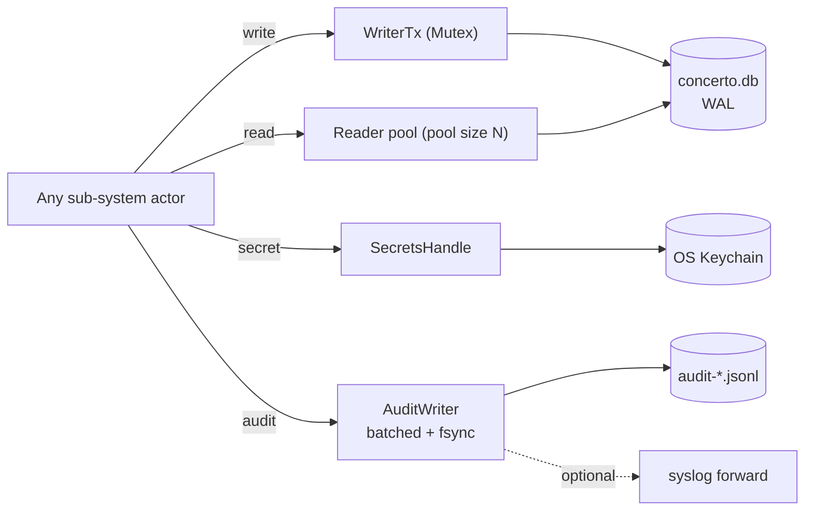
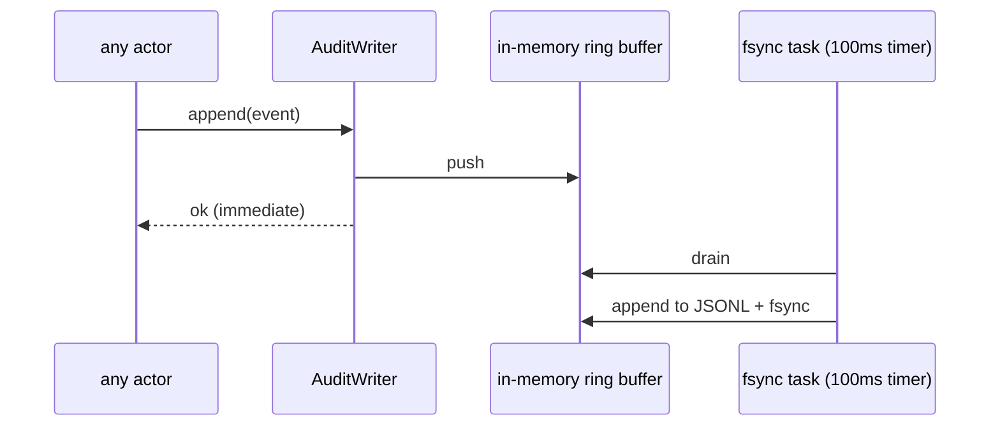
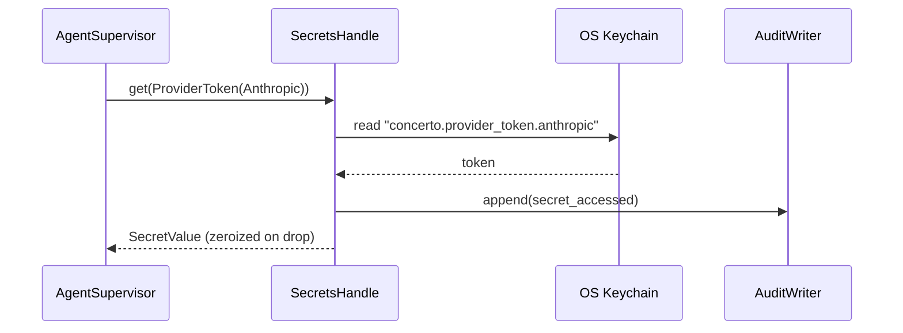

# 09 — Persistence

*Sub-system design doc. Inherits locked decisions from `00_Architecture_Overview.md` §6.2 (SQLite via sqlx, WAL, keyring-rs, JSONL audit log).*

---

## 1. Purpose & scope

Persistence is the single source of durable state for the Core. Every other sub-system reads and writes through it. It owns:

- **SQLite database** (`~/.concerto/concerto.db`) — repositories (a global registry), workspaces, workspace_repos, workareas, workarea_repos, sessions, chat messages, checkpoints, todos, schedules, skills, suggestion-learning counters, devices, audit metadata, settings.
- **Schema migrations** — forward-only, ordered, idempotent.
- **Connection pooling** — one writer, many readers, WAL.
- **Secret store wrapper** — typed access to the OS keychain via `keyring-rs`.
- **On-disk worktree directory tree** (path policy, not file contents — git owns the contents).
- **Audit log** — JSONL append-only, rotated, optional syslog forward.
- **Backup & export** — `concerto backup` CLI surface, `concerto export-workspace` for archival.

It does **not** own: any business logic; what to store, when to migrate; encryption-at-rest above what the OS provides (the keychain takes care of secrets, the filesystem ACL protects the DB).

---

## 2. Phase scope

| Phase | What ships |
|---|---|
| **V0.1** | Full SQLite schema (single-user, single-machine). Migration runner. Keychain wrapper for tokens + pairing keys. Worktree directory policy. Basic JSONL audit log. |
| **V1.0** | + multi-device key store (per-device certs + revocations). + audit-log rotation + syslog forwarding hook. + `concerto backup` CLI. + on-startup integrity check (`PRAGMA quick_check`). + redaction layer for telemetry/PII. |
| **V2.0** | + at-rest AES-256-GCM encryption for the audit log (key in keychain). + remote-host shared schema (multi-tenant rows tagged by `org_id`). + audit forwarding to SIEM with replay. |

---

## 3. Key design decisions (sub-system-internal)

### 3.1 Schema philosophy: normalize relations, JSON-blob the agent's own stuff

**Choice:** Tables for entities Concerto reasons about (repositories, workspaces, sessions, devices, schedules, todos, PRs). Schema columns for the fields we filter/sort/join on. JSON columns (SQLite's typed `JSON1` extension) for opaque agent-state and configurations we never query into.

Examples:
- `chat_messages.content` — JSON blob (agent text + tool calls + structured metadata). Never SQL-queried internally.
- `workspaces.sparse_cones` — JSON array. Set-membership not queried in SQL.
- `agent_sessions.checkpoint_ref` — string. Frequently looked up.

**Alternatives considered:**
- (A) Fully relational with a `chat_message_parts` table for tool calls etc. Avoided because the agent's message shape changes with each upstream CLI release.
- (B) Document store (`sqlite-vec`, `libsql vector`). Overkill for V1.

### 3.2 Migration tool: `sqlx::migrate!` with embedded SQL files

**Choice:** Migrations live in `crates/core/migrations/NNNN_description.sql`, embedded into the binary via `sqlx::migrate!`. Each migration is a single transactional SQL file (forward-only, no down-migrations).

**Alternatives considered:**
- (A) `refinery`. Equivalent feature set; avoided to minimize dependency count.
- (B) Hand-rolled migration table. Avoided — solved problem.

### 3.3 Connection pool: one writer connection, N reader connections, WAL

**Choice:** Two pools.
- `WriterPool` — capacomposer 1, serializes all writes through it. Avoids SQLite's write contention errors.
- `ReaderPool` — capacomposer `min(num_cpus, 8)`. Each connection sets `PRAGMA query_only = ON`.

WAL is mandatory; `PRAGMA journal_mode = WAL`, `PRAGMA synchronous = NORMAL`, `PRAGMA busy_timeout = 5000`.

### 3.4 Repository pattern: thin Rust functions per entity

**Choice:** Each entity has a module under `crates/core/src/persist/` with typed read/write functions. No generic ORM. Examples:

```rust
mod workspaces {
    pub async fn insert(tx: &mut Writer, w: NewWorkspace) -> Result<WorkspaceId>;
    pub async fn get(r: &Reader, id: WorkspaceId) -> Result<Option<Workspace>>;
    pub async fn list_all(r: &Reader, include_archived: bool) -> Result<Vec<Workspace>>;
    pub async fn archive(tx: &mut Writer, id: WorkspaceId) -> Result<()>;
    pub async fn update_status(tx: &mut Writer, id: WorkspaceId, s: Status) -> Result<()>;
}
```

Each function uses `sqlx::query_as!` for compile-time-checked SQL.

### 3.5 Audit log: JSONL on disk, not in SQLite — with pluggable subscribers

**Choice:** Append-only `~/concerto/audit/audit-YYYY-MM-DD.jsonl`. Rotated daily; retention configurable. The writer fans out to a configured chain of `AuditLogSubscriber` implementations — this is one of the extension trait seams locked in `18 §3.7`.

```rust
#[async_trait]
pub trait AuditLogSubscriber: Send + Sync {
    fn id(&self) -> &str;
    async fn on_event(&self, event: &AuditEvent);
    async fn flush(&self);
}
```

> **V1.0 amendment (2026-06-02) — as shipped in Task 112.** The trait methods
> return **`()`**, not `Result<()>`: a subscriber **absorbs its own errors**
> (logs via `tracing::warn!` and drops, with slow/failing network subscribers
> isolated behind a bounded channel + worker task) so that a misbehaving
> forwarder can never stall the fan-out or the foreground writer. `JsonlFileSubscriber`
> is the **durable floor** and is never reordered behind the network subscribers.
> The `+ 'static` bound was also dropped (not required by the implementation).
> The four V1.0 OSS impl names and the reserved V2.0 BSL names below are
> unchanged. (The original `-> Result<()>` signature above is superseded by this
> note.)

**V1.0 OSS impls** (all in the MIT Persistence crate):

- `JsonlFileSubscriber` — the canonical on-disk writer; always present.
- `StdoutSubscriber` — for debugging.
- `SyslogSubscriber` — RFC 5424 over UDP/TCP; targets local rsyslog / journald or remote `syslog://` endpoints.
- `HttpsForwarderSubscriber` — POSTs newline-delimited JSON events to a configured endpoint; usable as a poor-man's SIEM hook.

**V2.0+ BSL impls** (planned, not in MIT monorepo per `18 §3.7`):

| Impl | Behavior | Where it lives |
|---|---|---|
| `SiemForwarderSubscriber` | Multi-tenant SIEM integration (Splunk HEC, Elastic, Datadog); retry-with-replay buffer; field mapping; compliance attestations | `crates/enterprise-siem` (BSL) |
| `EncryptedAtRestSubscriber` | AES-256-GCM at-rest writer with keychain-derived key; for orgs requiring encrypted audit logs even on encrypted-volume disks | `crates/enterprise-encrypted-audit` (BSL) |

Why this matters: the OSS Core can already emit syslog and POST audit JSON anywhere. The BSL modules add the operational features (retry, replay, mapping, compliance) that enterprises pay for — without requiring any change in the MIT Core or the audit-event schema.

**Why not SQLite:** Audit-log writes are append-heavy and never updated. SQLite would force them through the writer pool and compete with foreground writes. JSONL with `O_APPEND` is fast, crash-safe, and trivially exportable to syslog / Splunk / Elasticsearch.

**Cross-references:** Audit events reference SQLite rows by ID (`workspace_id`, `device_cert_id`, etc.). Joins happen at read time in tooling, not at write time.

### 3.6 PII inventory — what's stored, where, and what an operator can see

For SOC2 / enterprise-buyer conversations, this table is the authoritative answer to "what personally identifiable information does Concerto store?" — referenced from `18 §3.4` (telemetry policy) and `12 §3.9` (deployment trust modes).

| Data class | Where | Visible to local OS user? | Visible to hosted-relay operator? | Visible to Apple/Google push? |
|---|---|---|---|---|
| User's name / email | **Never stored.** No accounts. | n/a | n/a | n/a |
| Device name (user-supplied at pairing, e.g. "Amin's iPhone") | `devices.name` (SQLite) | Yes (filesystem ACL) | No | No |
| Device public-key fingerprint | `devices.id` (SQLite); `identity.pub` on disk | Yes | No (relay sees Iroh endpoint IDs, not device fingerprints) | No |
| Workspace / repo names | SQLite | Yes | No (encrypted payload) | No |
| Chat messages, prompts, agent output | `chat_messages.content_json` (SQLite, JSON blob) | Yes | No | No (never in push payload per `14 §3.2`) |
| File paths, code content | Worktrees on disk | Yes | No | No |
| Provider API tokens (Anthropic, OpenAI, Gemini) | OS keychain | Yes (with OS auth prompt where applicable) | No | No |
| GitHub PAT, Linear/Jira OAuth tokens | OS keychain | Yes | No | No |
| Source IP at relay connect | Relay routing table (transient, 90s TTL) | n/a | Yes | No |
| Wakeup notification IDs | Expo / APNs / FCM in-transit | n/a | No (Concerto's Expo project sees these for Concerto-published builds; not the body) | Yes (the wakeup metadata only) |
| Audit log events (no payloads) | JSONL on disk; optional forwarders | Yes | Only if user opts into HTTPS forwarder pointing at hosted destination | No |
| Telemetry traces (when enabled) | OTLP endpoint user configures | Yes | Only if user points at a Concerto-Inc-operated OTLP endpoint (never the default) | No |

**What is intentionally not stored anywhere**, by design: user emails, organization identities (unless the user provides them in `managed.json`), behavioral analytics, click streams, feature-usage counters, A/B-test variants, or any data that would let Concerto Inc — or any other operator — profile a user without their explicit configuration.

Sub-system docs should treat this table as authoritative; if a new feature would store anything not on this list, it requires an explicit decision in `00 §6.11` or in this section.

### 3.7 Secret storage: typed keychain wrapper

**Choice:** All keychain access goes through a thin `Secrets` module that:
- Namespaces entries by `concerto.<kind>.<id>` (e.g., `concerto.provider_token.anthropic`).
- Returns typed enums for the value (token, key, etc.).
- Logs access in the audit log (without the secret).
- Wraps `keyring-rs` errors into typed `SecretsError`.

Keychain entries never appear in SQLite. SQLite stores references like `provider_token_ref: String` that resolve through `Secrets::get`.

---

## 4. Data model

The full SQLite schema. Annotated with which sub-system reads/writes each table.

### 4.1 Core entities — the 3-level hierarchy over a global repo registry

Concerto organizes work in three nested levels (see `03_Workspace_Session_Manager.md` for the model) over a **global Repository registry**:

```
Repository registry      (global; a cloned .git shared across all workspaces)
  ▲ selected by
Workspace                (logical workstream; declares 1..N repos directly)
  └── Workarea           (a worktree + branch attempt; on-disk)
        └── Session      (an agent run on the workarea; one chat)
```

After the Project→Workspace collapse (2026-06-08), there is **no `projects` table**. Repositories and workspaces are both top-level. Everything the former Project owned — shared settings/scripts, permission/deliberation defaults, the icon — moved onto the **Workspace** (`workspaces.settings_json` + `workspaces.icon`). Repo ownership became a global registry that workspaces select from via `workspace_repos`.

```sql
-- Repositories: a GLOBAL registry. A repo's clone lives at ~/concerto/repos/<id>/.git
-- and is shared (one .git, many worktrees) across every workspace/workarea that
-- includes it. Not scoped to any project. `clone_strategy` is a per-repository
-- property; `cone_defaults_json` is the repo's editable default sparse cone, the
-- least-specific layer of the cone-inheritance chain (02 §3.2).
CREATE TABLE repositories (
    id                  TEXT PRIMARY KEY,
    name                TEXT NOT NULL,                    -- short name used in folder paths (e.g. "marketplace-api")
    url                 TEXT NOT NULL,                    -- e.g. git@github.com:coupang/marketplace.git
    local_path          TEXT NOT NULL,                    -- ~/concerto/repos/<id>/
    clone_strategy      TEXT NOT NULL,                    -- full | blobless | treeless (per-repository)
    default_branch      TEXT NOT NULL,
    cone_defaults_json  TEXT NOT NULL DEFAULT '[]',       -- editable repo default cone; seeds workspace_repos at attach
    fs_monitor_pid      INTEGER,
    last_fetch_at       INTEGER,
    UNIQUE(url),                                          -- global uniqueness
    UNIQUE(name)                                          -- global uniqueness
);

-- Workspaces (LOGICAL workstream — no own worktree). Top-level entity after the
-- Project→Workspace collapse. Declares 1..N repos via workspace_repos.
-- settings_json absorbs the former project settings (scripts, files_to_copy_rules,
-- default_permission_mode, deliberation defaults, writable_paths_outside_worktree,
-- enterprise_data_privacy). `slug` is GLOBALLY unique.
CREATE TABLE workspaces (
    id                          TEXT PRIMARY KEY,
    name                        TEXT NOT NULL,            -- user-supplied, e.g. "Idempotency keys for payments"
    slug                        TEXT NOT NULL,            -- filesystem-safe derivation of name
    icon                        TEXT,                     -- moved from the former projects.icon
    description                 TEXT,
    permission_mode             TEXT,                     -- inherits from settings_json default if NULL
    bypass_destructive_guard    INTEGER,                  -- inherits from settings_json default if NULL
    settings_json               TEXT NOT NULL DEFAULT '{}', -- workspace defaults; absorbs the former project settings
    created_at                  INTEGER NOT NULL,
    archived_at                 INTEGER,
    UNIQUE(slug)
);
-- settings_json schema for workspaces (absorbs the former project schema):
--   {
--     "scripts": { "setup": "...", "setup_workarea": "...", "run": "...", "archive": "..." },
--     "run_script_mode": "concurrent" | "nonconcurrent",
--     "enterprise_data_privacy": bool,
--     "default_permission_mode": "strict" | "normal" | "auto" | "yolo",         -- new workareas inherit
--     "default_bypass_destructive_guard": bool,
--     "default_deliberation_mode": "plan" | "normal" | "fast",                   -- see 04 §3.12
--     "default_reasoning_level":   "minimal" | "low" | "medium" | "high",        -- see 04 §3.12
--     "default_personality":       "<name>",                                      -- see 04 §3.12
--     "files_to_copy_rules": [ { "pattern": "<glob>", "mode": "copy"|"symlink"|"exclude" }, ... ],  -- 03 §3.10
--     "writable_paths_outside_worktree": [ "<path>", ... ],
--     "concerto_chat_full_chat_access": bool
--   }
-- A checked-in .concerto/workspace_settings.json at the workspace's reference repo
-- root (the first repo by position) mirrors this schema and takes precedence over
-- this row per 03 §3.13.

-- Which repos this workspace declares. Defines the set every workarea works with.
-- `position` is the per-workspace 0-based ordinal (the first by position is the
-- reference repo, 03 §3.10/§3.13). `sparse_cones_json` is the per-(workspace, repo)
-- sparse-cone SNAPSHOT, seeded from the repo's cone_defaults_json when the repo is
-- attached; editing repo defaults later does NOT retroactively change existing
-- workspaces (snapshot semantics, 02 §3.2).
CREATE TABLE workspace_repos (
    workspace_id      TEXT NOT NULL REFERENCES workspaces(id) ON DELETE CASCADE,
    repository_id     TEXT NOT NULL REFERENCES repositories(id),
    position          INTEGER NOT NULL DEFAULT 0,
    sparse_cones_json TEXT NOT NULL DEFAULT '[]',
    PRIMARY KEY (workspace_id, repository_id)
);

CREATE INDEX idx_workspace_repos_position ON workspace_repos(workspace_id, position);

-- Workareas: a specific attempt at the workspace's task. Worktrees on disk.
-- One workspace → 1..N workareas (e.g. bach / mozart for two approaches).
CREATE TABLE workareas (
    id                          TEXT PRIMARY KEY,
    workspace_id                TEXT NOT NULL REFERENCES workspaces(id) ON DELETE CASCADE,
    composer_name                   TEXT NOT NULL,            -- "bach", unique within workspace
    branch_name                 TEXT NOT NULL,            -- applied across ALL repos in this workarea
    worktree_root               TEXT NOT NULL,            -- ~/concerto/workspaces/<slug>/<composer>/
    status                      TEXT NOT NULL,            -- created | active | running | awaiting | paused | archived | crashed
    permission_mode             TEXT,                     -- inherits from workspace if NULL
    bypass_destructive_guard    INTEGER,                  -- inherits from workspace if NULL
    created_at                  INTEGER NOT NULL,
    archived_at                 INTEGER,
    last_activity_at            INTEGER,
    UNIQUE(workspace_id, composer_name)
);

CREATE INDEX idx_workareas_status ON workareas(status);
CREATE INDEX idx_workareas_workspace ON workareas(workspace_id);

-- Per-(workarea, repo) state: each repo's worktree path inside the workarea
-- root, its sparse cones, and any per-repo branch override.
CREATE TABLE workarea_repos (
    workarea_id         TEXT NOT NULL REFERENCES workareas(id) ON DELETE CASCADE,
    repository_id       TEXT NOT NULL REFERENCES repositories(id),
    worktree_path       TEXT NOT NULL,                    -- <worktree_root>/<repo.name>/
    branch_override     TEXT,                             -- NULL = use workareas.branch_name; else this repo uses a different branch
    sparse_cones_json   TEXT NOT NULL DEFAULT '[]',       -- cones for this repo in this workarea
    PRIMARY KEY (workarea_id, repository_id)
);

-- Chats: each session has exactly one chat. The maestro chat is the singleton
-- with kind='maestro'.
CREATE TABLE chats (
    id              TEXT PRIMARY KEY,
    session_id      TEXT REFERENCES sessions(id) ON DELETE CASCADE,
    kind            TEXT NOT NULL,                        -- session | maestro
    created_at      INTEGER NOT NULL,
    CHECK ( (session_id IS NOT NULL) OR kind = 'maestro' )
);

CREATE TABLE chat_messages (
    id              TEXT PRIMARY KEY,
    chat_id         TEXT NOT NULL REFERENCES chats(id) ON DELETE CASCADE,
    role            TEXT NOT NULL,                        -- user | assistant | system | tool
    content_json    TEXT NOT NULL,                        -- agent message (text + tool calls + metadata)
    created_at      INTEGER NOT NULL,
    parent_id       TEXT REFERENCES chat_messages(id),    -- branching (for checkpoint revert)
    superseded_by   TEXT REFERENCES chat_messages(id)     -- soft-delete on revert
);

CREATE INDEX idx_chat_messages_chat ON chat_messages(chat_id, created_at);
```

### 4.2 Sessions, checkpoints, tool approvals

```sql
-- Sessions: a specific agent run on a workarea. Replaces the old `agent_sessions`
-- table. A workarea can have many sessions (Claude + Codex on the same code).
CREATE TABLE sessions (
    id                          TEXT PRIMARY KEY,
    workarea_id                 TEXT NOT NULL REFERENCES workareas(id) ON DELETE CASCADE,
    chat_id                     TEXT NOT NULL REFERENCES chats(id),
    agent_kind                  TEXT NOT NULL,             -- claude | codex | gemini | maestro
    agent_version               TEXT,
    model                       TEXT,
    mode                        TEXT,                      -- plan | fast | default (agent reasoning mode)
    host_pid                    INTEGER,                   -- concerto-agent-host pid
    host_socket                 TEXT,                      -- ~/concerto/runtime/agents/<sid>.sock
    pty_cookie                  BLOB,                      -- 32-byte cookie for host adoption auth
    external_session_id         TEXT,                      -- agent CLI's own session id, for --resume
    permission_mode             TEXT NOT NULL DEFAULT 'normal',
    bypass_destructive_guard    INTEGER NOT NULL DEFAULT 0,
    started_at                  INTEGER NOT NULL,
    ended_at                    INTEGER,
    last_heartbeat              INTEGER,
    status                      TEXT NOT NULL              -- starting | running | awaiting | finished | crashed
);

CREATE INDEX idx_sessions_workarea ON sessions(workarea_id);
CREATE INDEX idx_sessions_status ON sessions(status) WHERE status IN ('starting','running','awaiting');
CREATE INDEX idx_sessions_yolo ON sessions(permission_mode) WHERE permission_mode IN ('auto','yolo');

-- Checkpoints are per-(workarea, repo) since each repo has its own ref namespace.
-- A turn that touches multiple repos produces multiple checkpoint rows.
CREATE TABLE checkpoints (
    id              TEXT PRIMARY KEY,
    workarea_id     TEXT NOT NULL REFERENCES workareas(id) ON DELETE CASCADE,
    repository_id   TEXT NOT NULL REFERENCES repositories(id),
    chat_message_id TEXT NOT NULL REFERENCES chat_messages(id),
    git_ref         TEXT NOT NULL,                     -- refs/concerto/checkpoints/<workarea_id>/<repo_id>/<n>
    created_at      INTEGER NOT NULL,
    diff_stats_json TEXT
);

CREATE INDEX idx_checkpoints_workarea ON checkpoints(workarea_id);

CREATE TABLE tool_approvals (
    id              TEXT PRIMARY KEY,
    session_id      TEXT NOT NULL REFERENCES sessions(id) ON DELETE CASCADE,
    tool_name       TEXT NOT NULL,
    payload_json    TEXT NOT NULL,                     -- the request (cmd, cwd, reasoning)
    requested_at    INTEGER NOT NULL,
    decided_at      INTEGER,
    decided_by_device_id TEXT REFERENCES devices(id),
    decision        TEXT                               -- approve | approve_once | deny | auto_<mode>
);
```

### 4.3 Scheduling

```sql
CREATE TABLE schedules (
    id                          TEXT PRIMARY KEY,
    kind                        TEXT NOT NULL,                  -- loop | scheduled_task
    workspace_id                TEXT REFERENCES workspaces(id), -- optional scope
    workarea_id                 TEXT REFERENCES workareas(id),  -- required for /loop; optional for scheduled_task
    name                        TEXT NOT NULL,
    prompt                      TEXT NOT NULL,
    cron_expr                   TEXT,                           -- null for /loop (interval based)
    interval_seconds            INTEGER,                        -- for /loop
    model                       TEXT,
    agent_kind                  TEXT NOT NULL DEFAULT 'claude', -- which CLI to spawn
    permission_mode             TEXT NOT NULL DEFAULT 'normal', -- strict | normal | auto | yolo
    bypass_destructive_guard    INTEGER NOT NULL DEFAULT 0,
    worktree_mode               TEXT,                           -- latest (use existing workarea) | fresh (spin up a throwaway workarea per run)
    failure_policy_json         TEXT,
    daily_budget_tokens         INTEGER,
    paused                      INTEGER NOT NULL DEFAULT 0,
    created_at                  INTEGER NOT NULL,
    expires_at                  INTEGER                         -- for /loop, 3 days
);

CREATE TABLE schedule_runs (
    id              TEXT PRIMARY KEY,
    schedule_id     TEXT NOT NULL REFERENCES schedules(id) ON DELETE CASCADE,
    started_at      INTEGER NOT NULL,
    finished_at     INTEGER,
    status          TEXT NOT NULL,                     -- success | failed | running
    tokens_in       INTEGER,
    tokens_out      INTEGER,
    session_id      TEXT REFERENCES sessions(id),
    error_message   TEXT
);
```

### 4.4 Identity, devices, audit

```sql
CREATE TABLE devices (
    id              TEXT PRIMARY KEY,                  -- public key fingerprint
    name            TEXT NOT NULL,                     -- "iPhone 17 (Amin)"
    public_key      BLOB NOT NULL,                     -- Ed25519
    paired_at       INTEGER NOT NULL,
    last_seen_at    INTEGER,
    revoked_at      INTEGER,
    push_token      TEXT,                              -- Expo Push token
    push_platform   TEXT                               -- apns | fcm
);
CREATE INDEX idx_devices_active ON devices(revoked_at) WHERE revoked_at IS NULL;
```

The audit log table itself lives outside SQLite (§3.5). SQLite carries device + workspace IDs that audit events reference.

### 4.5 Skills, suggestions, todos, PRs

```sql
CREATE TABLE skills_index (
    id              TEXT PRIMARY KEY,
    scope           TEXT NOT NULL,                     -- personal | workspace | plugin | enterprise
    workspace_id    TEXT REFERENCES workspaces(id),    -- set when scope = 'workspace'
    name            TEXT NOT NULL,
    description     TEXT,
    path            TEXT NOT NULL,
    marketplace_id  TEXT,
    pinned_version  TEXT,
    enabled         INTEGER NOT NULL DEFAULT 1,
    last_used_at    INTEGER,
    invocation_count INTEGER NOT NULL DEFAULT 0
);

CREATE TABLE suggestion_learn (
    workspace_id    TEXT NOT NULL REFERENCES workspaces(id) ON DELETE CASCADE,
    trigger         TEXT NOT NULL,                     -- "context_window_50", "tests_failed"
    prompt_hash     TEXT NOT NULL,                     -- BLAKE2b of normalized prompt
    prompt_text     TEXT NOT NULL,
    accept_count    INTEGER NOT NULL DEFAULT 0,
    dismiss_count   INTEGER NOT NULL DEFAULT 0,
    last_seen_at    INTEGER NOT NULL,
    PRIMARY KEY (workspace_id, trigger, prompt_hash)
);

CREATE TABLE todos (
    id              TEXT PRIMARY KEY,
    workarea_id     TEXT NOT NULL REFERENCES workareas(id) ON DELETE CASCADE,
    text            TEXT NOT NULL,
    done            INTEGER NOT NULL DEFAULT 0,
    created_at      INTEGER NOT NULL,
    completed_at    INTEGER
);

-- Pull requests are per-(workarea, repository). One workarea can produce N PRs.
-- The workarea's PR set is implicit (all rows for that workarea_id), ordered by merge_order.
CREATE TABLE pull_requests (
    id                      TEXT PRIMARY KEY,                  -- internal
    workarea_id             TEXT NOT NULL REFERENCES workareas(id) ON DELETE CASCADE,
    repository_id           TEXT NOT NULL REFERENCES repositories(id),
    provider                TEXT NOT NULL,                     -- github | gitlab | bitbucket
    external_id             TEXT NOT NULL,                     -- e.g. "4821"
    repository_full_name    TEXT NOT NULL,
    state                   TEXT NOT NULL,                     -- draft | open | merged | closed
    base_branch             TEXT NOT NULL,
    head_branch             TEXT NOT NULL,
    title                   TEXT NOT NULL,
    url                     TEXT,
    merge_order             INTEGER,                           -- ordering within the workarea's PR set
    last_synced_at          INTEGER,
    UNIQUE(workarea_id, repository_id)
);

CREATE INDEX idx_pull_requests_workarea ON pull_requests(workarea_id);
```

---

## 5. Interfaces

### 5.1 Persistence handle (in-process)

```rust
#[derive(Clone)]
pub struct PersistenceHandle {
    writer: Arc<Mutex<WriterConn>>,        // singleton writer
    readers: deadpool::Pool<ReaderConn>,
    secrets: SecretsHandle,
    audit: AuditWriter,
}

impl PersistenceHandle {
    pub async fn write<F, R>(&self, op: F) -> Result<R>
    where F: for<'a> AsyncFnOnce(&'a mut WriterTx) -> Result<R>;

    pub async fn read<F, R>(&self, op: F) -> Result<R>
    where F: for<'a> AsyncFnOnce(&'a Reader) -> Result<R>;

    pub fn secrets(&self) -> &SecretsHandle;
    pub fn audit(&self) -> &AuditWriter;
}
```

Every sub-system gets a `PersistenceHandle` from the Runtime context. They never construct one.

### 5.2 Secrets

```rust
pub enum SecretKind {
    ProviderToken(Provider),                // anthropic, openai, ...
    GithubPat,
    DevicePairingKey,
    CoreIdentityPrivateKey,
    PushExpoApiKey,
}

impl SecretsHandle {
    pub async fn get(&self, kind: SecretKind) -> Result<Option<SecretValue>>;
    pub async fn set(&self, kind: SecretKind, value: SecretValue) -> Result<()>;
    pub async fn delete(&self, kind: SecretKind) -> Result<()>;
}
```

### 5.3 Audit writer

```rust
pub struct AuditEvent {
    pub at: SystemTime,
    pub kind: AuditKind,                    // typed enum
    pub actor: AuditActor,                  // device cert ID or system
    pub subject_ids: Vec<(EntityKind, String)>,
    pub details_json: serde_json::Value,
}

impl AuditWriter {
    pub fn append(&self, event: AuditEvent);   // non-blocking, batched
    pub async fn flush(&self) -> Result<()>;
}
```

The `append` call returns immediately; the writer batches and fsyncs every 100ms or on shutdown.

---

## 6. Internal architecture



### 6.1 Writer queue

Writes are not parallel. A single Tokio task owns the writer connection and drains an mpsc queue of `Box<dyn AsyncWriteOp>`. Each op runs inside an implicit transaction. The queue depth is monitored; if it exceeds 100, the Runtime emits a `persistence.backpressure` event.

This pattern lets us write `db.write(|tx| async move { ... })` from anywhere without blocking other writers — they queue.

### 6.2 Migration runner

Runs on `PersistenceActor` start, before any other actor. Migrations:

1. `0001_initial_schema.sql` — all tables defined above.
2. `0002_*` — additive only. Never reorder, never edit a prior file.

A failed migration leaves the DB at the prior version and aborts Core startup.

### 6.3 At-rest integrity

On startup, after migrations: `PRAGMA quick_check;`. If non-OK, the Core refuses to start and emits a clear error pointing the user at `concerto db recover` (V1.5+ tool).

### 6.4 Backup / export

`concerto backup` (CLI subcommand of `concerto-core`):

1. Acquires a read lock by opening a writer transaction (briefly).
2. `VACUUM INTO '~/concerto/backups/concerto-YYYY-MM-DD.db'`.
3. Tars the worktree directory (optional: `--include-worktrees`).
4. Exports the audit log range.

Restore is the reverse, requires Core to be stopped.

---

## 7. Sequence diagrams — hot paths

### 7.1 Cross-actor write under contention

```mermaid
sequenceDiagram
    participant WkMgr as WorkspaceMgr
    participant Sched as Scheduler
    participant WQ as WriterQueue
    participant DB as SQLite (WAL)
    WkMgr->>WQ: enqueue write(create workspace)
    Sched->>WQ: enqueue write(record schedule_run)
    WQ->>DB: BEGIN; workspace insert; COMMIT
    DB-->>WQ: ok
    WQ-->>WkMgr: WorkspaceId
    WQ->>DB: BEGIN; schedule_run insert; COMMIT
    DB-->>WQ: ok
    WQ-->>Sched: ok
```

### 7.2 Audit append is non-blocking



### 7.3 Secret lookup



---

## 8. Error handling & failure modes

| Failure | Detection | Response |
|---|---|---|
| DB locked (writer contention) | `SQLITE_BUSY` after busy_timeout | Surface as a transient error; caller may retry once. Should be rare with single-writer pattern. |
| DB corrupt | `PRAGMA quick_check` fails on startup | Abort Core start; print restore instructions |
| Disk full on write | I/O error from sqlx | Return error to caller; emit `persistence.disk_full`; Tray shows alert |
| Audit fsync fails | `tokio::fs::File::sync_data` error | Log loudly; continue (next event will retry). Refuse to start if it fails consecutively > 100 times. |
| Keychain access denied | `keyring-rs` error | Surface to caller; for startup-critical secrets (CoreIdentityPrivateKey), abort start |
| Migration failure | sqlx returns Err | Abort start; preserve DB at prior version |
| Concurrent writer (two Core processes) | Should be impossible due to §3.3 of `01_*`. If it happens, `SQLITE_BUSY` storm. | Single-instance guard prevents it. |
| Schema drift (binary downgrade) | Startup detects `schema_version > binary_version` | Refuse to start; print "this binary is older than your data; install newer Core or run `concerto db migrate-down --to N`" (V1.5+) |

---

## 9. Dependencies on other sub-systems

| Sub-system | How |
|---|---|
| **01 Runtime** | Hosts the PersistenceActor; provides the `PersistenceHandle` to others |
| **12 Security** | Reads the Core identity from keychain via `Secrets` |
| **All others** | Read/write via `PersistenceHandle` |

Persistence has **no upward dependencies**. It is a leaf node — nothing depends on Persistence's state except via the handle.

---

## 10. Testing strategy

| Layer | What | How |
|---|---|---|
| Unit | Each repository function | `sqlx::test` (creates an in-memory DB per test) |
| Schema | Migrations apply cleanly from empty + are idempotent | A test that applies each migration sequentially, then re-applies |
| Concurrency | Writer queue serialization | Spawn 100 concurrent writers; assert ordering invariants |
| Corruption | `PRAGMA quick_check` failure path | Inject a corrupt DB file; assert Core refuses to start |
| Audit | Append-only, daily rotation, no log loss on crash | Kill the writer mid-batch; on restart, assert no duplicate events and no lost events (within the batched window — disclosed in user-facing docs) |
| Secrets | Keychain integration on Mac/Win/Linux | Per-platform integration test in CI |
| Backup | `concerto backup` → restore round-trips | Backup, fresh data dir, restore, diff |

---

## 11. Open questions / deferred

*All items resolved. See **§12 Resolved decisions log** below.*

## 12. Resolved decisions log

| # | Question | Decision | Where in doc |
|---|---|---|---|
| R-1 | Adopt `libsql` (embedded replicas) for multi-device sync? | **Defer to V2.0.** Single Core per machine in V1.0/V1.5; clients connect to it. Revisit only if a "two-Core" use case emerges. | (V2.0) |
| R-2 | Split `chat_messages.content` into a parts table? | **Defer.** JSON-blob works; agent message shapes change frequently across upstream releases. Revisit if analytics demand SQL queries into tool-call structure. | §3.1, §4.1 |
| R-3 | Audit log at-rest encryption | **V2.0.** Keychain-derived AES-256-GCM key, rotated periodically. V1.0 uses filesystem ACL as protection. | §3.5, (V2.0) |
| R-4 | Backfill `suggestion_learn` from prior usage | **No.** Start fresh per user; learning accrues over time. Avoids privacy-sensitive parsing of past prompts. | §3.4 (cross-ref 07) |
| R-5 | Soft- vs hard-delete for archived workspaces | **Soft-delete** (set `archived_at`). Worktree on disk may be physically removed; DB row stays for history and restore. | §4.1 |
| R-6 | Max DB size expectations | **Targets: 100k chat messages, 1k workspaces, 10k audit events/day.** SQLite handles 100s of GB easily — not a concern at V1.0 scale. | (capacomposer model) |

---

*End of `09_Persistence.md`. The schema defined here is the authoritative source for the data model; sub-system docs (02–14) reference these tables but do not redefine them.*
