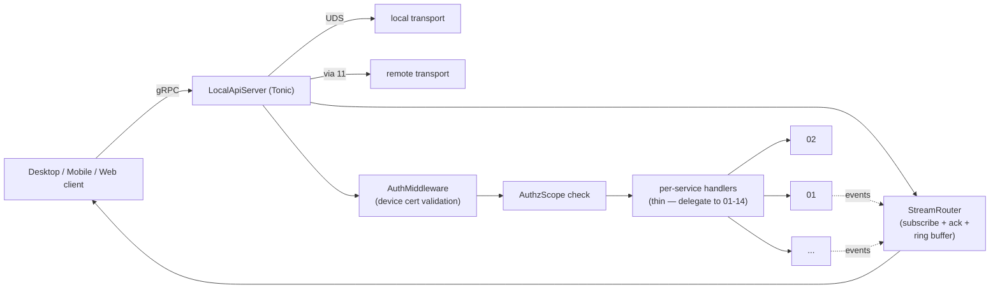
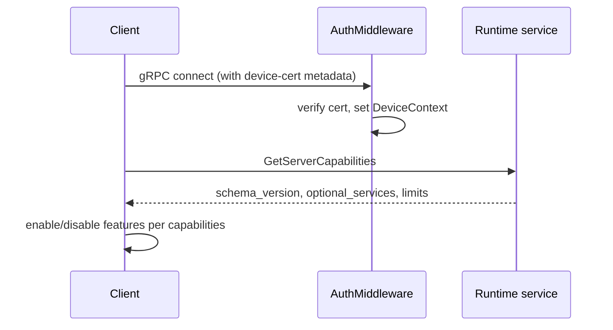
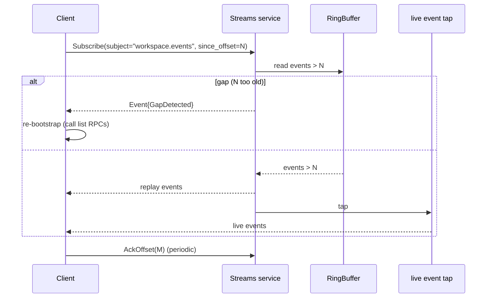
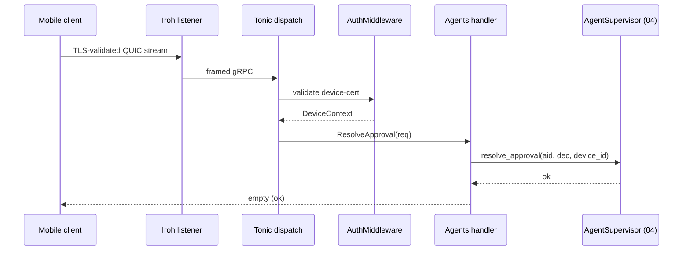

# 10 — Client API Protocol

*Sub-system design doc. Inherits locked decisions from `00_Architecture_Overview.md` §6.5 (gRPC via Tonic — transport-agnostic schema; UDS for co-located, Iroh for split-host Desktop + Mobile, Connect-Web bridge for Web; one stream per typed subject). The doc filename remains `10_Local_API_Protocol.md` for historical link stability; "Local API" and "Client API" refer to the same thing.*

---

## 1. Purpose & scope

The Client API Protocol is **the contract between the Core and every client**, and it is **transport-agnostic** — the same gRPC schema rides over any supported wire. It is consumed by:

- The Desktop client (15), over **UDS / named pipe in co-located mode** *or* **Iroh QUIC in split-host mode** — picked per paired Core, both first-class V1.0 configurations.
- The Mobile client (16), tunnelled over Iroh by 11.
- The Web client (17), via Connect-Web with HTTP/SSE fallback through 11's WSS bridge.

The schema does not branch by transport. Auth and a small number of capability fields differ (see §3.4); RPCs and streams are identical.

The protocol owns:

- **gRPC schema** — every `.proto` file defining services, messages, and stream types.
- **Code-generation pipeline** — Rust server stubs (Tonic), Rust client (for Tauri), TypeScript client (for Desktop + Web + Mobile), Swift / Kotlin clients (V1.5+ native mobile).
- **Streaming subjects** — long-lived server-streaming RPCs that deliver typed events (`workspace.events`, `workarea.events`, `session.events.<sid>`, `session.io.<sid>`, etc.).
- **Streaming reconnect semantics** — per-stream offset acknowledgment so a reconnecting client gets the gap without re-bootstrapping.
- **Schema versioning** — additive field numbers, deprecation policy, capability negotiation on connect.
- **Authentication binding** — every RPC carries a device certificate (issued by 12); the API server validates before dispatching.
- **Authorization scoping** — per-device capability flags (V1.0: binary; V2.0: read/write/admin).
- **Connect-Web bridge** — translates browser HTTP+SSE traffic into the same gRPC services.
- **Error model** — typed error codes that propagate through every transport unchanged.

It does **not** own: business logic (each service method delegates into 01–14); transport mechanics (10 calls into 11 for the wire; locally, it binds the UDS directly).

---

## 2. Phase scope

| Phase | What ships |
|---|---|
| **V0.1** | gRPC over UDS only. Single-version schema. No reconnect-offset semantics (clients re-bootstrap). TypeScript client generated. |
| **V1.0** | + Connect-Web bridge. + streaming reconnect with offset acknowledgment + server-side ring buffer per stream. + capability negotiation on connect (`GetServerCapabilities`, now reports `transport_kind`). + per-method auth+authz middleware. + protobuf reflection endpoint for in-Tray diagnostics. + Swift / Kotlin clients (Connect framework variants). + **`concerto` CLI** wrapping the gRPC API (subcommand of `concerto-core`) — useful for scripting, automation, and recovery when the UI is unavailable. + **Desktop ↔ Iroh transport at parity with UDS** (every RPC and stream callable over either wire — see §3.4). + **`Files` service** (`Files.Upload` streaming, `Files.Download` streaming) for split-host file transfer between Desktop and Core. |
| **V2.0** | + read/write/admin capability scopes. + protocol version downgrade negotiation (old client / new Core). + protobuf-over-WebSocket alternative for browsers behind aggressive HTTP middleboxes. |

---

## 3. Key design decisions (sub-system-internal)

### 3.1 One service per domain, not one giant service

**Choice:** Group RPCs into per-domain services that map 1:1 with sub-systems:

```proto
service Runtime { ... }         // 01 — admin
service Repositories { ... }    // 02
service Workspaces { ... }      // 03 — logical workstreams
service Workareas { ... }       // 03 — on-disk attempts
service Sessions { ... }        // 03 + 04 — agent runs on workareas
service Schedules { ... }       // 05
service Skills { ... }          // 06
service Suggestions { ... }     // 07
service Maestro { ... }     // 08
service Vcs { ... }             // 13
service Notifications { ... }   // 14
service Devices { ... }         // 12 — pairing, revoke
service Files { ... }           // 10 — split-host file transfer (V1.0)
service Streams { ... }         // 10 — generic stream subscribe / ack
```

**Why per-domain:**
- Clients can selectively generate only the services they consume (mobile may skip `Maestro` for now).
- Auth middleware can be applied per service uniformly.
- Easier to deprecate cleanly when one sub-system evolves.

### 3.2 Streams as a separate service, not RPCs per subject

**Choice:** The `Streams` service exposes one generic `Subscribe(SubscribeRequest) returns (stream Event)` RPC where `SubscribeRequest` names the subject and optional filter, and `Event` is a `oneof` over all event types.

**Why:**
- One method to maintain; new subjects don't require new RPCs.
- Connect-Web (which can't do client-streaming over HTTP) handles server-streaming fine; this fits.
- Ack flows as messages on the same stream (`ClientFrame { ack: { offset } }` over a duplex stream); clients that can't do duplex use a periodic `AckOffset` unary RPC.

```proto
service Streams {
  rpc Subscribe(SubscribeRequest) returns (stream Event);
  rpc AckOffset(AckOffsetRequest) returns (google.protobuf.Empty);
}

message SubscribeRequest {
  string subject = 1;                   // "workspace.events" | "workarea.events" | "session.io.<sid>" | ...
  optional string filter = 2;            // subject-specific (e.g. workspace_id, workarea_id, repository_id)
  optional uint64 since_offset = 3;      // resume from this offset
}

message Event {
  uint64 offset = 1;
  google.protobuf.Timestamp at = 2;
  oneof body {
    WorkspaceEvent workspace = 10;        // workspace created / archived / repos updated
    WorkareaEvent workarea = 11;          // workarea FSM transitions, branch rename, PR set changes
    SessionEvent session = 12;            // per-session: turn complete, awaiting approval, tool calls
    SessionIoChunk session_io = 13;       // raw stdout/stderr bytes from a session's PTY
    DiffEvent diff = 14;                  // (workarea, repo) diff changed
    ChecksEvent checks = 15;              // (workarea, repo) CI / PR state changed
    PrSetEvent pr_set = 16;               // workarea's PR set changed
    SuggestionEvent suggestion = 17;
    MaestroEvent maestro = 18;
    NotificationEvent notification = 19;
    RuntimeEvent runtime = 20;
    // expanding via field numbers, never reusing
  }
}
```

### 3.3 Streaming reconnect via per-subject ring buffer

**Choice:** The Core maintains a per-subject in-memory ring buffer (default 256 events; configurable; per-stream override for `session.io` which carries much higher volume — sized in bytes, default 1 MiB). Each event has a monotonic 64-bit offset.

On `Subscribe { since_offset = N }`, the server replays events with offset > N before transitioning to live. If N is older than the buffer, the server emits a `GapDetected` event and the client must re-bootstrap that subject.

Acks travel in-stream when supported, or via `AckOffset` unary calls (Connect-Web). Server prunes the buffer past min(all subscribers' acks).

### 3.4 Authentication: device cert in metadata, not in every message

**Choice:** Every gRPC call carries a `concerto-device-cert` metadata header containing the signed device cert (12 §3.2). The API server validates on the way in:

1. Parse cert; verify Core's signature.
2. Check `device.revoked_at IS NULL`.
3. Set request-scoped `DeviceContext { device_id, capabilities }`.
4. Dispatch to handler with context.

For UDS connections (co-located Desktop and tray), an additional `SO_PEERCRED` (Linux) / `LOCAL_PEERPID` (macOS) check confirms the connecting UID matches the Core's owning UID. UDS connections from a same-UID process implicitly carry full admin capability (no cert needed for the local-pipe path — the kernel attests to the peer).

This means there are **two equally-supported auth paths into the same RPC surface**:

| Transport | Auth | Pairing required? | Used by |
|---|---|---|---|
| UDS / named pipe | `SO_PEERCRED` / `LOCAL_PEERPID` matches Core UID → implicit admin | No | Desktop in co-located mode; tray; local `concerto` CLI |
| Iroh QUIC | `concerto-device-cert` metadata header validated against Core pubkey + devices table | Yes (QR / token flow per `12 §3.3`) | Desktop in split-host mode; Mobile; Web (through 11's WSS bridge, which re-presents the cert from the browser's stored pairing) |

The Core listens on both wires concurrently. Either path lands in the same Tonic service handlers; the request-scoped `DeviceContext` is populated identically (with an implicit "local-uds" pseudo-cert for the UDS path so handlers don't branch on transport).

`GetServerCapabilities` returns the negotiated transport kind so the client can suppress affordances that don't make sense in remote mode (e.g., "Reveal in Finder"). See `15 §3.11` for the Desktop's use of this field.

### 3.5 Error model: typed codes mirror Rust errors

**Choice:** Every error returns a gRPC `Status` with code + a `details` containing a typed `ConcertoError`:

```proto
message ConcertoError {
  string code = 1;          // stable string code, e.g. "workspace.not_found"
  string message = 2;       // human-readable
  google.protobuf.Struct fields = 3;   // structured details (workspace_id, etc.)
  string transaction_id = 4; // for log correlation
}
```

The string code is the wire-stable identifier. Adding new codes is fine; renaming is forbidden.

### 3.6 Code generation pipeline

**Pipeline** (driven by `cargo make codegen` and CI):

```
crates/proto/*.proto
  → Rust server stubs  (tonic-build)
  → Rust client        (tonic-build, client-only)
  → TypeScript client  (buf + protoc-gen-connect-es)
  → Swift client       (V1.5 — swift-protobuf + connect-swift)
  → Kotlin client      (V1.5 — connect-kotlin)
```

The proto files live in `crates/proto/proto/` and are the single source of truth. CI fails the build if any generated artifact is out of sync.

---

## 4. Data model

The protocol itself is the data model. Two artifacts:

### 4.1 The `.proto` files

Organized by service:

```
crates/proto/proto/
├── concerto/v1/
│   ├── common.proto           # shared types (Identifiers, Errors, Timestamps)
│   ├── runtime.proto
│   ├── repositories.proto
│   ├── workspaces.proto
│   ├── sessions.proto
│   ├── agents.proto
│   ├── schedules.proto
│   ├── skills.proto
│   ├── suggestions.proto
│   ├── maestro.proto
│   ├── vcs.proto
│   ├── notifications.proto
│   ├── devices.proto
│   └── streams.proto
```

Every service is `concerto.v1.X`. The `v1` namespace is reserved; `v2` would coexist if we ever need an incompatible break (highly unlikely; field-number additions cover most cases).

### 4.2 Capability descriptor

What a client gets on connect:

```proto
message ServerCapabilities {
  string server_version = 1;          // semver
  string schema_version = 2;          // "concerto.v1"
  repeated string optional_services = 3;     // e.g. "Maestro" if disabled
  repeated string optional_streams = 4;
  uint64 default_stream_buffer = 5;
  ResourceLimits limits = 6;
  TransportKind transport_kind = 7;   // how this client reached the Core
  // V1.0 also reports the Core's host OS + hostname for display in Desktop's
  // "Connected Cores" UI (`15 §3.10.4`); these are non-secret.
  string core_host_os = 8;            // "darwin" | "linux" | "windows"
  string core_hostname = 9;
}

enum TransportKind {
  TRANSPORT_KIND_UNSPECIFIED = 0;
  TRANSPORT_KIND_UDS = 1;             // co-located: same machine, peer-UID auth
  TRANSPORT_KIND_IROH = 2;            // split-host or mobile: device-cert auth
  TRANSPORT_KIND_WSS_BRIDGE = 3;      // browser via 11's WSS bridge
}

message ResourceLimits {
  uint32 max_concurrent_streams = 1;
  uint64 max_payload_bytes = 2;
  uint32 max_chats = 3;       // ...
}
```

A client introspects this on every connect, after auth, before subscribing.

---

## 5. Interfaces

### 5.1 The full service catalog — RPC index

A condensed list. Full schema lives in `crates/proto/proto/`.

```proto
service Runtime {
  rpc GetServerCapabilities(google.protobuf.Empty) returns (ServerCapabilities);
  rpc GetStatus(google.protobuf.Empty) returns (RuntimeStatus);
  rpc ReloadConfig(google.protobuf.Empty) returns (google.protobuf.Empty);
}

service Repositories {
  // Repositories are a GLOBAL registry (no project_id). AddRepository takes
  // either `url` (clone into the shared pool) or `local_path` (adopt an
  // existing on-disk git repo in place). ListRepositories is unscoped
  // (replaces the old ListByProject). SetRepoConeDefaults edits the repo's
  // default sparse cone and re-applies it to existing workareas.
  rpc AddRepository(AddRepoRequest) returns (Repository);
  rpc Clone(CloneRequest) returns (stream CloneProgress);
  rpc ListRepositories(ListRepositoriesRequest) returns (ListRepositoriesResponse);
  rpc EstimateRepoSize(EstimateRepoSizeRequest) returns (SizeReport);
  rpc EstimateConeSize(EstimateConeSizeRequest) returns (ConeStats);
  rpc PrewarmBlobs(PrewarmRequest) returns (stream PrewarmProgress);
  rpc ListTree(ListTreeRequest) returns (ListTreeResponse);
  rpc SetRepoConeDefaults(SetRepoConeDefaultsRequest) returns (Repository);
}

service Workspaces {
  // Workspaces are logical workstreams; no own worktree (see 03). Top-level
  // after the Project→Workspace collapse. CreateWorkspace declares its repos
  // inline as WorkspaceRepoSpec{ repository_id, sparse_cones } from the global
  // registry. ListWorkspaces is unscoped (all workspaces; include_archived).
  rpc CreateWorkspace(CreateWorkspaceRequest) returns (Workspace);
  rpc GetWorkspace(WorkspaceId) returns (Workspace);
  rpc ListWorkspaces(ListWorkspacesRequest) returns (ListWorkspacesResponse);
  rpc UpdateWorkspaceSettings(UpdateWorkspaceSettingsRequest) returns (Workspace);
  rpc ArchiveWorkspace(WorkspaceId) returns (google.protobuf.Empty);
  rpc RestoreWorkspace(WorkspaceId) returns (Workspace);
}

// CreateWorkspaceRequest (see workspaces.proto) — repos declared inline:
//   message CreateWorkspaceRequest {
//     string name = 1;
//     repeated WorkspaceRepoSpec repos = 2;   // { repository_id, sparse_cones }
//     optional PermissionMode permission_mode = 3;
//     optional string description = 4;
//     optional string icon = 5;
//   }
//   message ListWorkspacesRequest { bool include_archived = 1; }

service Workareas {
  // Workareas are on-disk attempts. One workspace → 1..N workareas. (see 03)
  rpc CreateWorkarea(CreateWorkareaRequest) returns (Workarea);
  rpc GetWorkarea(WorkareaId) returns (Workarea);
  rpc ListWorkareas(ListWorkareasRequest) returns (ListWorkareasResponse);
  rpc PauseWorkarea(WorkareaId) returns (google.protobuf.Empty);
  rpc ResumeWorkarea(WorkareaId) returns (google.protobuf.Empty);
  rpc ArchiveWorkarea(ArchiveWorkareaRequest) returns (google.protobuf.Empty);
  rpc RestoreWorkarea(WorkareaId) returns (Workarea);
  rpc RenameWorkareaBranch(RenameBranchRequest) returns (google.protobuf.Empty);
  rpc SuggestWorkareaBranchName(WorkareaId) returns (BranchSuggestion);

  // Per-(workarea, repo) operations
  rpc SetWorkareaRepoCones(SetConesRequest) returns (google.protobuf.Empty);
  rpc StartDevServer(StartDevServerRequest) returns (DevServerInfo);          // per (workarea, repo)
  rpc StopDevServer(StopDevServerRequest) returns (google.protobuf.Empty);
  rpc GetWorkareaRepoDiff(GetDiffRequest) returns (DiffPayload);              // per (workarea, repo)

  // PR set semantics: implicit set of all pull_requests for this workarea.
  rpc GetWorkareaPrSet(WorkareaId) returns (PrSetStatus);
  rpc GetWorkareaMergePlan(WorkareaId) returns (MergePlan);
  rpc UpdateWorkareaMergePlan(UpdateMergePlanRequest) returns (MergePlan);
  rpc MergeWorkareaPrSet(WorkareaId) returns (MergeReport);
  rpc RevertWorkareaPrSet(WorkareaId) returns (RevertReport);

  // Permission mode controls (per workarea; entry ceremony in clients)
  rpc UpdateWorkareaPermissionMode(UpdatePermissionModeRequest) returns (Workarea);
  rpc SetWorkareaBypassDestructiveGuard(SetBypassRequest) returns (Workarea);
}

service Sessions {
  // Sessions are agent runs on a workarea (Claude / Codex / Gemini).
  rpc CreateSession(CreateSessionRequest) returns (Session);
  rpc GetSession(SessionId) returns (Session);
  rpc ListSessions(ListSessionsRequest) returns (ListSessionsResponse);
  rpc StopSession(StopSessionRequest) returns (google.protobuf.Empty);
  rpc RestartSession(SessionId) returns (Session);
  rpc ColdResumeSession(SessionId) returns (Session);

  // Conversation
  rpc SendMessage(SendMessageRequest) returns (google.protobuf.Empty);
  rpc ResolveApproval(ResolveApprovalRequest) returns (google.protobuf.Empty);
  rpc RevertToCheckpoint(RevertRequest) returns (google.protobuf.Empty);

  // MCP — per-repo project-level configs in a workarea
  rpc ListMcpServers(McpScopeRequest) returns (ListMcpResponse);
  rpc UpsertProjectMcp(McpServerSpec) returns (google.protobuf.Empty);
}

service Schedules {
  rpc CreateSchedule(CreateScheduleRequest) returns (Schedule);
  rpc ListSchedules(ListSchedulesRequest) returns (ListSchedulesResponse);
  rpc UpdateSchedule(UpdateScheduleRequest) returns (Schedule);
  rpc PauseSchedule(ScheduleId) returns (google.protobuf.Empty);
  rpc DeleteSchedule(ScheduleId) returns (google.protobuf.Empty);
  rpc PromoteLoopToScheduled(LoopId) returns (Schedule);
  rpc GetScheduleHistory(GetHistoryRequest) returns (GetHistoryResponse);
}

service Skills {
  rpc ListSkills(ListSkillsRequest) returns (ListSkillsResponse);
  rpc InstallSkill(InstallSkillRequest) returns (Skill);
  rpc UninstallSkill(UninstallSkillRequest) returns (google.protobuf.Empty);
  rpc ToggleSkill(ToggleSkillRequest) returns (Skill);
  rpc AddMarketplace(AddMarketplaceRequest) returns (Marketplace);
  rpc RefreshMarketplaces(google.protobuf.Empty) returns (google.protobuf.Empty);
}

service Suggestions {
  rpc GetSuggestions(GetSuggestionsRequest) returns (Suggestions);
  rpc RecordSuggestionOutcome(SuggestionOutcomeRequest) returns (google.protobuf.Empty);
  rpc UpdateRules(UpdateRulesRequest) returns (google.protobuf.Empty);
  rpc ResetLearning(ResetLearningRequest) returns (google.protobuf.Empty);
}

service Maestro {
  rpc SendToMaestro(MaestroMessageRequest) returns (google.protobuf.Empty);
  rpc GetDigest(GetDigestRequest) returns (Digest);
  rpc SetWorkareaVisibility(VisibilityRequest) returns (google.protobuf.Empty);
}

service Vcs {
  rpc GetPullRequest(PullRequestId) returns (PullRequest);
  rpc CreatePullRequest(CreatePrRequest) returns (PullRequest);
  rpc UpdatePullRequest(UpdatePrRequest) returns (PullRequest);
  rpc MergePullRequest(MergePrRequest) returns (PullRequest);
  rpc GetChecks(GetChecksRequest) returns (ChecksReport);
  rpc FetchIssue(FetchIssueRequest) returns (Issue);
  rpc ListReviewThreads(ListThreadsRequest) returns (ListThreadsResponse);
}

service Notifications {
  rpc GetInbox(GetInboxRequest) returns (InboxPage);
  rpc MarkRead(MarkReadRequest) returns (google.protobuf.Empty);
  rpc UpdateProjectNotifSettings(ProjectNotifSettings) returns (google.protobuf.Empty);
}

service Devices {
  rpc StartPairing(google.protobuf.Empty) returns (PairingChallenge);
  rpc CompletePairing(CompletePairingRequest) returns (DeviceCert);
  rpc ListDevices(google.protobuf.Empty) returns (ListDevicesResponse);
  rpc RevokeDevice(RevokeDeviceRequest) returns (google.protobuf.Empty);
  rpc UpdateDevicePushToken(UpdatePushTokenRequest) returns (google.protobuf.Empty);
}

// Split-host file transfer between client (typically Desktop in remote mode) and Core.
// Co-located clients don't need this — they read/write the same filesystem.
// Scoped to a (workarea, repo) or a workarea's .context/; Core enforces the
// permission-mode + allow-list checks from 12 §7.2.
service Files {
  rpc Upload(stream UploadChunk) returns (UploadResult);
  rpc Download(DownloadRequest) returns (stream DownloadChunk);
  rpc Stat(StatRequest) returns (StatResult);
  rpc List(ListFilesRequest) returns (ListFilesResponse);
}

message UploadChunk {
  oneof body {
    UploadHeader header = 1;   // first frame: target path, mode, expected size
    bytes data = 2;            // subsequent frames: ≤ 256 KiB each
    UploadFinalize finalize = 3; // last frame: checksum
  }
}

message UploadHeader {
  string workarea_id = 1;
  optional string repository_id = 2;  // None = .context/ root
  string relative_path = 3;           // within the (workarea, repo) scope
  uint64 expected_size = 4;
  string content_type = 5;
}

message UploadFinalize { bytes blake2b = 1; }
message UploadResult   { string stored_path = 1; uint64 size = 2; }

message DownloadRequest {
  string workarea_id = 1;
  optional string repository_id = 2;
  string relative_path = 3;
  optional uint64 offset = 4;
  optional uint64 length = 5;
}

message DownloadChunk { bytes data = 1; }

service Streams {
  rpc Subscribe(SubscribeRequest) returns (stream Event);
  rpc AckOffset(AckOffsetRequest) returns (google.protobuf.Empty);
}
```

### 5.2 Stream subject catalog

| Subject | Filter | Body type | Typical volume |
|---|---|---|---|
| `runtime.events` | — | RuntimeEvent | < 1/min |
| `workspace.events` | optional `workspace_id` | WorkspaceEvent | low — workspace created / archived / repos updated |
| `workarea.events` | optional `workarea_id` | WorkareaEvent | 1/sec per active workarea — FSM transitions, branch rename, PR set changes |
| `session.events.<sid>` | required `sid` | SessionEvent | 1–10/sec during a turn |
| `session.io.<sid>` | required `sid` | SessionIoChunk (bytes) | up to 1 MB/sec during heavy output |
| `diff.<workarea_id>.<repository_id>` | required | DiffEvent | bursty, on file save (per repo in workarea) |
| `checks.<workarea_id>.<repository_id>` | required | ChecksEvent | low frequency (per repo) |
| `pr_set.events` | required `workarea_id` | PrSetEvent | low — PR added, ordering changed, merge stepped |
| `suggestion.events` | required `workarea_id` | SuggestionEvent | 1/turn |
| `maestro.events` | — | MaestroEvent | low–medium |
| `notification.events` | — | NotificationEvent | medium |

Ring-buffer sizes are tuned per subject. `session.io.<sid>` is sized in bytes (default 1 MiB), not events.

---

## 6. Internal architecture



### 6.1 Handler thinness

Service handlers are intentionally thin. They:

1. Parse the proto request.
2. Translate to the sub-system's Rust call.
3. Map the Result back to a proto response (or typed Status).

No business logic. This keeps the proto layer narrow and the cost of regenerating the protocol low.

### 6.2 StreamRouter

A central component owning the ring buffers and subscriber tables. Sub-systems publish events via a typed `EventBus::publish(subject, body)`. The router:

- Assigns each event a monotonic offset.
- Persists it in the per-subject ring buffer.
- Fans out to all subscribers matching the subject + filter.
- Prunes the buffer based on min-ack across subscribers.

Subscribers are tracked in memory only; on Core restart, clients re-subscribe.

### 6.3 UDS vs Iroh transport — same Tonic server

The Tonic server doesn't know whether it's serving UDS or Iroh. Both transports plug into Tonic's `tower::Service` abstraction:

- **UDS:** `LocalApiServer::serve_uds(path)` uses `tokio::net::UnixListener` + `tonic::transport::Server::builder().add_service(...).serve_with_incoming(...)`.
- **Iroh:** `LocalApiServer::serve_iroh(endpoint)` accepts Iroh bidi streams and feeds each, wrapped as a `tokio::io::AsyncRead + AsyncWrite` duplex, to the same `serve_with_incoming` (per the hand-rolled adapter — see amendment). Same builder, same handlers.

> **V1.0 amendment (2026-06-02) — hand-rolled tonic-0.12 adapter, per spike 102.**
> This section originally named `tonic-iroh-transport::IrohListener` as the Iroh
> listener. Spike 102 (`design/spikes/tonic-iroh-findings.md` §2) retired that crate
> (it forces `tonic 0.14`, conflicting with the workspace `tonic 0.12` pin) in favor
> of a **hand-rolled `tonic 0.12` ↔ Iroh-bidi-stream duplex adapter** that runs the
> production Tonic server unmodified over Iroh. The canonical V1.0 mapping is **one
> gRPC connection per Iroh bidi stream**, fed to `serve_with_incoming`; Task 212 builds
> it (details + gotchas in `design/11 §3.x`). `tonic-iroh-transport` is superseded.

The auth middleware sees the difference: UDS connections have peer-uid; Iroh connections have device-cert metadata.

---

## 7. Sequence diagrams — hot paths

### 7.1 First connect, capability negotiation



### 7.2 Stream subscribe with offset resume



### 7.3 Mobile RPC with auth + delegation



---

## 8. Error handling & failure modes

| Failure | Detection | Response |
|---|---|---|
| Invalid device cert | Sig check fails or expired | `UNAUTHENTICATED` + `ConcertoError{code="auth.invalid_cert"}` |
| Revoked device | `devices.revoked_at IS NOT NULL` | `PERMISSION_DENIED` + `ConcertoError{code="auth.revoked"}`; emit revocation event |
| Stream backpressure (slow client) | tokio mpsc full | Drop oldest from per-client send queue; emit `BackpressureDropped` event |
| Stream gap (since_offset too old) | RingBuffer miss | Emit `GapDetected`; client re-bootstraps |
| RPC timeout | Tonic deadline | Client retries with backoff; idempotent calls only |
| Schema mismatch (newer proto field) | Client decodes unknown field | Proto's standard behavior: ignore unknown — forward-compat works |
| Codegen drift | CI check | Build fails before merge |
| UDS missing (Core not running) | Connect error from client | Client tries to spawn Core via OS integration; surface "starting Concerto" UI |
| Iroh path failure | Tonic-iroh-transport error | 11 retries; bubble up if persistent |

---

## 9. Dependencies on other sub-systems

| Sub-system | How |
|---|---|
| **01 Runtime** | LocalApiServerActor is supervised by 01; uses `RuntimeAdmin` RPC |
| **11 Transport** | Provides Iroh listener; manages remote sessions |
| **12 Security** | Validates device certs; provides authz capability lookup |
| **All others (02–14)** | Handlers delegate into them |

Consumers (in the sense of "who calls in over the wire"):
- **15 Desktop** — UDS
- **16 Mobile** — Iroh via 11
- **17 Web** — Connect-Web via 11's WSS bridge

---

## 10. Testing strategy

| Layer | What | How |
|---|---|---|
| Schema | Proto compiles; field numbers not reused | `buf lint` + custom check in CI |
| Codegen | Generated Rust + TS + Swift + Kotlin builds | CI per platform |
| Unit | Auth middleware: valid, expired, revoked, missing cert | Stub Security service |
| Unit | StreamRouter: ack pruning, gap detection, backpressure drop | Synthetic publishers/subscribers |
| Integration | Full RPC round-trips for every service over UDS | `concerto-core-test` harness |
| Integration | Same over Iroh (loopback Iroh node pair) | E2E test |
| Compat | New Core ↔ old client; old Core ↔ new client (additive fields) | Pinned proto fixtures |
| Performance | gRPC over Iroh: latency + throughput on synthetic delay/loss | `tc netem` shaping |

---

## 11. Open questions / deferred

*All items resolved. See **§12 Resolved decisions log** below.*

## 12. Resolved decisions log

| # | Question | Decision | Where in doc |
|---|---|---|---|
| R-1 | Persist ack offsets across client restart | **V1.0 no** — client re-bootstraps on restart. **V2.0 optional** durable cursor (IMAP-like). | §3.3 |
| R-2 | Bidi-streaming on Connect-Web | **Server-streaming + unary `AckOffset` by default; bidi where Connect supports it natively (HTTP/2).** | §3.2 |
| R-3 | Reflection endpoint exposure | **Off in production; on with feature flag for Diagnostics panel.** | §3 (security) |
| R-4 | Custom binary framing for `session.io` | **Defer until benchmarks show bottleneck.** gRPC + protobuf is the baseline; revisit only with data. | (deferred) |
| R-5 | Proto schema changes — clients need rebuild? | **No — additive fields; clients ignore unknown.** Removing fields requires a V2 major bump. | §3.5 |
| R-6 | Ship a `concerto` CLI | **V1.0 mandatory** — subcommand of `concerto-core` wrapping the gRPC API. Useful for scripting, automation, and recovery when the UI is unavailable. | §2 phase scope |
| R-7 | Authz scopes (V2 read/write/admin) wire format | **`repeated string capabilities` in DeviceCert**; missing field = "admin" (backward-compatible V1.0 behavior). | (V2.0, cross-ref `12 §3.2`) |
| R-8 | Compression on `session.io` stream | **Threshold-based: enable zstd for streams > 100 KB/sec.** Skip on idle / low-volume streams to save CPU. | §3, §8 |

---

*End of `10_Local_API_Protocol.md`. The proto files live in `crates/proto/`; this doc summarizes them. Auth primitives detailed in `12_Security_Identity.md`; remote transport in `11_Remote_Transport_Relay.md`.*
