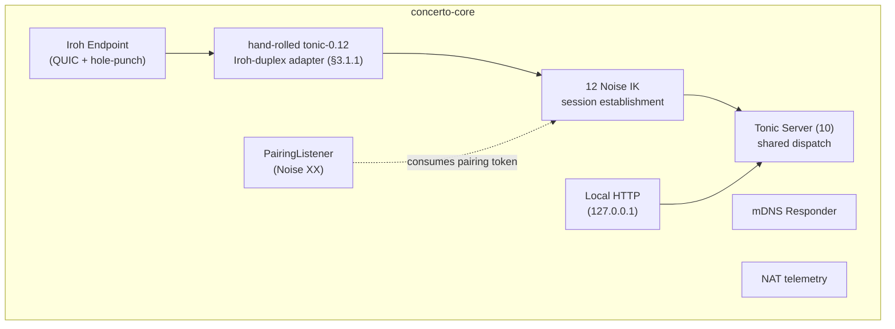
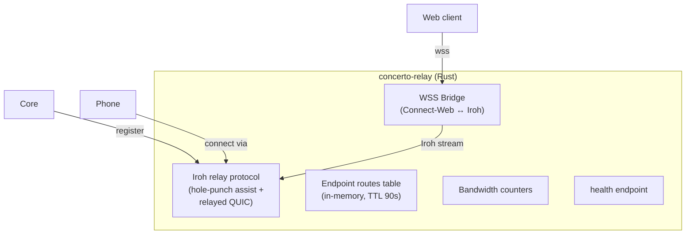
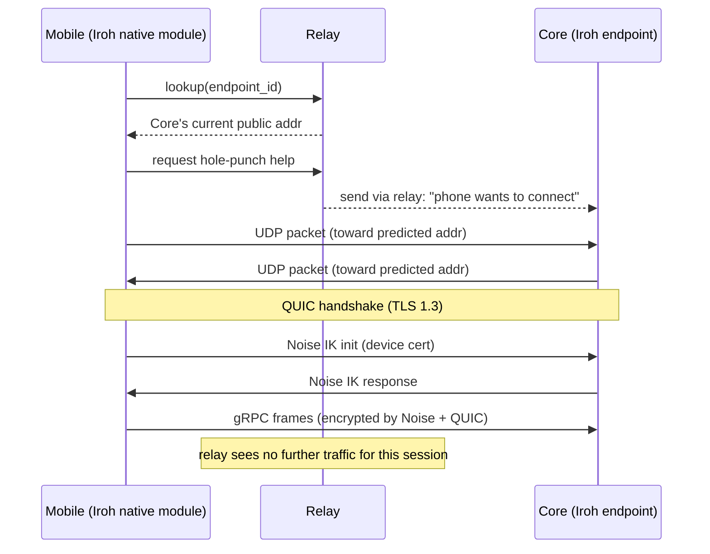
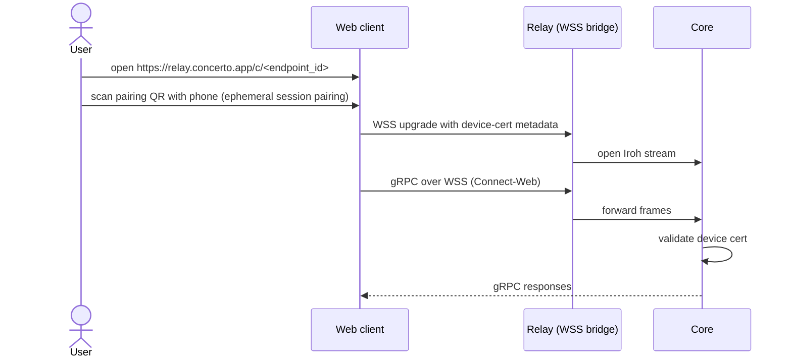

# 11 — Remote Transport & Relay

*Sub-system design doc. Inherits locked decisions from `00_Architecture_Overview.md` §6.6 (Iroh + a **hand-rolled `tonic 0.12` ↔ Iroh-bidi-stream duplex adapter** — see the §6.6 amendment and §3.1.1 below; original wording said `tonic-iroh-transport`, superseded by spike 102 — Noise IK from 12 atop Iroh's TLS, self-hosted relay on Fly.io anycast, WSS bridge for web V1.0, mDNS for LAN). The Iroh prototype spike (`00 §11`, item 2) gates this design — fallback strategy noted in §11.*

---

## 1. Purpose & scope

The Remote Transport & Relay sub-system makes the gRPC API from `10` reach **any paired device** the user has, anywhere on the internet. In V1.0 this covers Mobile (16), Web (17), **and Desktop in split-host mode (15)** — a Desktop running on a different machine from the Core is, transport-wise, just another paired device. It owns:

- **Iroh endpoint** in the Core — accepts incoming QUIC connections, performs hole-punching, falls back to relay.
- **Desktop transport library** integration — the hand-rolled tonic-0.12 Iroh adapter (§3.1.1) linked into the Tauri shell for split-host Desktops (15 §3.2).
- **Mobile transport library** integration — Iroh on iOS / Android (via React Native bridge in V1.0).
- **mDNS responder + browser** — Core advertises itself on LAN; LAN clients find it. Useful for Desktop ↔ Core on the same Wi-Fi (skip relay entirely) as well as Mobile.
- **Self-hosted relay binary** — small Rust daemon deployed on anycast, run by us in V1.0 and by enterprises in V2.0.
- **Web transport bridge** — translates Connect-Web over WSS into the same Tonic services (since browsers can't speak Iroh natively in V1.0).
- **Connection lifecycle** — pairing channel, normal API channel, push-wakeup hint channel.
- **NAT-traversal telemetry** — measures direct vs relayed success per connection; surfaces to PRD §22.3.
- **Reconnect / migration** — QUIC connection migration when the client's network changes (Wi-Fi → LTE).

It does **not** own: the protocol (10), the crypto inside the connection (12), notifications themselves (14 uses this transport).

---

## 2. Phase scope

| Phase | What ships |
|---|---|
| **V0.1** | (not in V0.1 — desktop-only, no remote) |
| **V1.0** | Iroh endpoint in Core. mDNS LAN discovery (Desktop + Mobile). Self-hosted relay binary deployed. Tonic-over-Iroh for **split-host Desktop** + Mobile. Connect-Web + WSS bridge for browsers. NAT-success telemetry (broken out by client kind so we can see whether split-host Desktops, which are mostly residential ↔ residential or residential ↔ cloud-VM, get worse rates than Mobile). QUIC connection migration. Pairing channel using Noise XX (PSK pairing token). |
| **V2.0** | + Iroh-in-browser direct transport (eliminating the WSS bridge once browser support is mature). + multi-tenant relay (per-org isolation, bandwidth quotas). + dynamic relay selection (geographic). + traffic shaping for mobile-data networks. |

---

## 3. Key design decisions (sub-system-internal)

### 3.1 Iroh as the single transport for non-browser remote clients

**Locked in `00 §6.6`.** "Remote" here means any client not reachable via the Core's UDS — that includes Mobile (16), Web through the WSS bridge (17), **and Desktop running in split-host mode (15)**. A Desktop running co-located with the Core uses UDS and skips this sub-system entirely.

Sub-system internals:

- Each Core has one long-lived Iroh **endpoint** (the Iroh-level identity, separate from the Core's Ed25519 identity per 12 §3.1). Endpoint key generated by Iroh and stored in Iroh's own state directory.
- The Core registers its endpoint with the configured relay (default: our hosted; override via managed settings).
- The mapping `Iroh endpoint ↔ Core identity` is established at pairing: the QR contains both `core_pubkey` and `iroh_endpoint_id`. Same payload whether the device scanning the QR is a phone or a split-host Desktop.
- Clients connect by Iroh endpoint ID; Iroh tries direct hole-punch, falls back to relayed QUIC.
- A **hand-rolled tonic-0.12 ↔ Iroh-bidi-stream duplex adapter** (§3.1.1) wraps each Iroh bidi stream as a Tonic transport so the same Tonic server (10) handles UDS and Iroh callers identically — no per-transport handler branching.

**Why Desktop-over-Iroh isn't a special case:** the Tauri shell links the same hand-rolled tonic-0.12 Iroh adapter (§3.1.1) the Mobile client uses; the only differences vs. mobile are (a) richer error UI in the shell when the relay path degrades, and (b) the Desktop adds a long-lived API channel even when idle so streaming subjects (e.g. `session.io`) flow without per-message setup latency. Both are local behaviors of 15, not new transport features.

#### 3.1.1 The Tonic-over-Iroh adapter — hand-rolled on tonic 0.12 (Task 212 inherits)

> **V1.0 amendment (2026-06-02) — hand-rolled tonic-0.12 adapter, per spike 102.**
> Earlier text in this doc (and `00 §6.6`) named the off-the-shelf
> `tonic-iroh-transport` crate as the Tonic-over-Iroh adapter. Spike 102
> (`design/spikes/tonic-iroh-findings.md` §2) **ruled against it**: that crate forces
> **`tonic 0.14`**, which collides head-on with the workspace's **`tonic 0.12`** pin.
> The spike hand-rolled a ~70-line adapter (Iroh bidi stream → tokio `AsyncRead +
> AsyncWrite` duplex → Tonic's `serve_with_incoming` / `connect_with_connector`) on the
> production stack with **no schema or codegen change** and proved it clears both perf
> bars (streaming 70–230× over bar; unary GO on the real-RTT intent). So the **canonical
> V1.0 adapter is the hand-roll**, `tonic-iroh-transport 0.9.2` is **superseded**, and
> the validated pinned trio is `iroh 0.98.2` / `iroh-relay 0.98.0` / `tonic 0.12.3` +
> `prost 0.13.5`. **Task 212 builds this adapter.** It revisits `tonic-iroh-transport`
> only if/when the workspace itself moves to tonic 0.14.

**Four adapter gotchas Task 212 inherits** (from `spikes/tonic-iroh-findings.md §2`, §2.1–§2.4):

1. **Inherent-vs-trait `poll_*` shadowing (§2.1).** `iroh::endpoint::SendStream` /
   `RecvStream` each expose an **inherent** `poll_write` / `poll_read` *and* the
   `tokio::io::Async{Write,Read}` trait method of the same name. A bare
   `Pin::new(&mut s).poll_write(..)` silently binds to the **inherent** one (error type
   `WriteError`, not `io::Error`) → confusing type error. Call with **fully-qualified
   trait syntax** (`AsyncWrite::poll_write(Pin::new(&mut s), ..)`); the adapter won't
   compile otherwise.
2. **One gRPC connection == one Iroh bidi stream (§2.2).** Tonic speaks HTTP/2 and
   multiplexes its own streams over the single byte duplex; QUIC then multiplexes many
   such duplexes over one Iroh `Connection`. Map **each peer-opened bidi stream** to a
   fresh `serve_with_incoming` with a single-element incoming stream — the "QUIC stream
   pool for gRPC" shape (§3.3).
3. **Acceptor priming (§2.3).** Iroh defers surfacing a peer-opened bidi stream to the
   server's `accept_bi()` until the opener writes. The client connector sends a
   **zero-byte `flush()`** immediately so the server task wakes promptly; without it the
   first RPC stalls until the first HTTP/2 frame. Keep this.
4. **Message-size ceilings (§2.4).** Lift Tonic's default **4 MiB** decode/encode ceiling
   **explicitly** on both client and server (the spike used 64 MiB). The product's
   `session.io` chunking (1 MiB, `10 §5.2`) stays under 4 MiB, but set explicit limits
   regardless.

### 3.2 Self-hosted relay (Rust, single-binary)

**Choice:** We do not depend on n0's hosted relays in production. We deploy our own Rust binary across a small fleet, behind anycast (Fly.io is the V1.0 default; alternative cloud is fine).

The relay's job is **minimal**:
1. Accept Iroh's relay protocol.
2. Maintain a routing table: `iroh_endpoint_id → current public IP+port` (refreshed by the endpoint every minute).
3. For direct hole-punch assistance: exchange `STUN`-like address packets.
4. For relayed-fallback streams: forward QUIC packets between two endpoints.

State is per-endpoint, in-memory, with optional persistence to Redis (V2 multi-tenant deployments).

**Why our own and not n0's:**
- Trust boundary: any third-party relay that observes our routing metadata is part of our security story (PRD §16.4). We want to operate or have the user operate this.
- SLA: we want bandwidth + latency guarantees we can debug.
- Enterprise: self-host is required for managed deployments.

**Topology:**

```
   ┌─ Fly.io US-East ─┐  ┌─ Fly.io US-West ─┐  ┌─ Fly.io EU-FRA ─┐
   │  concerto-relay  │  │  concerto-relay  │  │ concerto-relay  │
   └────────┬─────────┘  └────────┬─────────┘  └────────┬────────┘
            └─────────anycast IP / latency-routed───────┘
```

Each relay is stateless except for the per-endpoint routing entries (TTL 90s).

### 3.3 Connection lifecycle: three logical channels per pairing

A paired (Core, Device) pair has three logical channels over Iroh:

1. **API channel** — long-lived QUIC stream pool, carries the bidirectional gRPC traffic (the same Tonic services from `10`). Established lazily when the device wants to send a request.
2. **Push hint channel** — opt-in, lightweight. The relay-side push trigger (from `14`) sends a wakeup hint to the device through APNs/FCM; on wakeup the device opens this channel to fetch the payload.
3. **Pairing channel** — short-lived, used only once per device, gated by the pairing token (`12 §3.3`).

All three are Iroh QUIC streams. They share the same Iroh endpoint identity at the Core but different stream multiplexing IDs / Noise IK sessions.

### 3.4 Connect-Web + WSS bridge for browsers

**Choice (V1.0):** Browsers cannot speak Iroh natively in V1.0. Browser clients (Web client, 17) reach the Core in one of two paths:

**Path A — LAN reachability:**
- Web client served by Core's HTTP server on `127.0.0.1:<port>` (Core spawns a tiny `hyper` server bound only to LAN/loopback interfaces).
- Connect-Web requests go directly to this HTTP server.
- The HTTP server runs the same Tonic services via Connect-Web's HTTP transport (Connect framework handles this natively).

**Path B — Remote reachability via WSS bridge:**
- Web client points at `https://relay.concerto.app/wss/<endpoint_id>`.
- Relay opens an Iroh stream to the Core's endpoint and bridges WSS frames ↔ Iroh stream frames.
- Browser establishes Noise IK inside the WSS stream (using the device cert it has from pairing).
- Relay sees ciphertext only (it cannot decrypt the inner Noise layer).

The WSS bridge is the **only** non-Iroh path we run. It's a deliberate compromise for V1.0 to ship a working web client. V2.0 swaps it for browser-native Iroh once mature.

### 3.5 mDNS LAN discovery

**Choice:** Core publishes `_concerto._tcp.local` with TXT records containing:

```
endpoint_id=<iroh_endpoint_id>
core_pubkey=<base64-ed25519>
version=<semver>
caps=<comma-separated-features>
```

Client devices on the same network browse for this service. If found, they prefer the LAN path: open Iroh directly to that endpoint without consulting the relay. Iroh handles the local QUIC connection without hole-punching needed.

For privacy: mDNS broadcast can be opted out (managed setting or per-network preference). On work networks where mDNS is blocked or policy-forbidden, the relay path remains.

### 3.6 NAT traversal telemetry

**Choice:** For every connection, the Core records whether it succeeded direct (Iroh hole-punched) or relayed. Aggregated per day, per network, per region. The user sees:

- A small `direct` / `via relay` badge in the device-list UI.
- Stats in Settings → Diagnostics: "Direct connections this week: 82%."

The PRD §22.3 target is > 70% direct. If beta data shows we miss that, we fall back to one of the spike alternatives (00 §11, item 2) — adding a Tailscale tsnet sidecar or rolling our own WireGuard control plane.

### 3.7 Reconnect and connection migration

**Choice:** Iroh + QUIC supports connection migration natively — when a client's IP changes (Wi-Fi → LTE), the QUIC connection ID stays the same and traffic continues. The Core's gRPC subscribers (10 §3.3) see no interruption beyond ~1–3 seconds of latency.

For longer outages (subway, plane mode), the device reconnects from scratch: re-establish Iroh, re-establish Noise IK, replay missed events from offset.

### 3.8 Why not Tailscale tsnet

The TechStack doc (§9.2) considered tsnet. It's the runner-up and the fallback if the Iroh prototype fails. Reasons we picked Iroh:

- **Account friction.** tsnet requires a Tailscale account (or Headscale self-host). Concerto's "no accounts" principle (PRD §16.1) is a load-bearing differentiator.
- **Topology mismatch.** tsnet creates a mesh; we want a star (Core ↔ paired devices). The tsnet model doesn't fit cleanly.
- **Language fit.** tsnet is Go-only; Iroh is Rust-native and matches the Core's language.

If the Iroh prototype shows < 60% direct-connection success, we'd revisit by adding a tsnet sidecar (Go process the Rust Core supervises) — but this is the contingency, not the plan.

### 3.9 Hosted vs. self-hosted relay — same binary, two trust models

**Locked in `00 §6.11`:** the relay binary is MIT-licensed and identical in both deployments. The only difference is the operator. This sub-section makes the *operational trust difference* explicit so the security pitch and the SOC2 / enterprise-buyer conversations have a precise artifact to reference. See also `18 §3.1`–`§3.2` for the broader hosted-vs-self-hosted boundary.

**What a relay operator can observe** (regardless of who operates it):

| Observable | Hosted relay (Concerto Inc) | Self-hosted relay (customer) | Source-of-truth doc |
|---|---|---|---|
| Source IP of a connecting client | Yes | Yes | QUIC packet headers; unavoidable for routing |
| Iroh endpoint ID being addressed | Yes | Yes | Iroh routing table; necessary to forward |
| Ciphertext byte counts per session | Yes | Yes | Forwarding pass-through |
| Connection timestamps and durations | Yes | Yes | Routing-table TTL refresh |
| NAT-traversal success/failure | Yes (aggregated) | Yes | `§3.6` telemetry |
| Geographic region (from anycast PoP) | Yes | n/a (typically single-region) | Routing decision |
| **Plaintext payload (prompts, code, agent output)** | **No** | **No** | Encrypted by Noise IK inside the Iroh tunnel (`12 §3.4`) |
| **Device certificate contents** | **No** | **No** | Carried in encrypted gRPC metadata, not in relay-visible frames |
| **Workspace names, repo names, file paths** | **No** | **No** | All in encrypted payload |
| **Pairing tokens** | **No** | **No** | Used in Noise XX pre-handshake; never visible to relay |

The cryptographic guarantee is that **the relay sees only metadata that a TCP/IP-aware network observer would see anyway** (source IP, byte counts, connection lifetime), plus the addressed endpoint ID. It does not see what the user is doing, what repo they're working on, what the agent is saying, or any device credential.

**Differences that matter to a buyer:**

| Concern | Hosted relay implication | Self-hosted relay implication |
|---|---|---|
| Data residency | Traffic transits Concerto Inc's anycast PoPs (US-E, US-W, EU-FRA in V1.0) | Stays within customer's chosen region/cloud |
| Subpoena exposure | Concerto Inc can be compelled to produce relay logs (which still contain no payload) | Customer's own legal exposure |
| Operator trust | Customer trusts Concerto Inc to not log payloads it can't decrypt anyway | Customer is the operator |
| Web-bundle integrity (web client only) | Concerto Inc serves the JS bundle from the WSS bridge; SRI hashes + signed releases mitigate (`18 §3.8`) | Customer serves their own; integrity is self-verifiable |
| Bandwidth quotas / abuse | Concerto Inc enforces per-endpoint caps (default 1 Gbps burst, 50 GB/day; configurable) | Customer policy |
| Status page / SLA | Concerto Inc commits an SLA in the Pro tier | Customer operates their own |

**LAN-only mode** (managed.json `disable_remote = true`) eliminates any relay involvement entirely; the Core only accepts mDNS-discovered LAN clients. This is the strongest deployment mode for air-gapped or strict-residency environments.

**Operational identity:** the hosted relay fleet (`relay.concerto.app`) is operated by Concerto Inc — the same legal entity that publishes the App Store / Play Store builds. Customers who don't trust that entity should self-host the relay binary; the source is in this monorepo and the build instructions are in `CONTRIBUTING.md`.

---

## 4. Data model

The transport stores no business state in SQLite. It maintains in-memory state:

```rust
pub struct TransportState {
    iroh_endpoint: iroh::Endpoint,
    relay_url: Url,
    mdns_responder: MdnsResponder,
    sessions: HashMap<DeviceId, ActiveSession>,
    nat_stats: NatStats,                          // daily counters
    pairing_listener: Option<PairingListener>,    // open during a pairing
}

pub struct ActiveSession {
    device_id: DeviceId,
    noise: NoiseSession,            // from 12
    iroh_connection: iroh::Connection,
    api_streams: Vec<QuicStream>,
    last_seen: Instant,
    path: ConnectionPath,           // Direct | Relayed | Lan
}

pub struct NatStats {
    direct_today: u32,
    relayed_today: u32,
    by_network_class: HashMap<String, NetworkStats>,
}
```

The relay's state is even smaller:

```rust
pub struct RelayState {
    routes: HashMap<IrohEndpointId, EndpointRoute>,
    bandwidth_counters: HashMap<IrohEndpointId, BandwidthCounter>,
    wss_bridges: HashMap<BridgeId, WssBridge>,
}

pub struct EndpointRoute {
    public_addr: SocketAddr,
    last_seen: Instant,
    expires_at: Instant,    // 90s TTL refreshed by keep-alive
}
```

---

## 5. Interfaces

### 5.1 Public Rust API (in Core)

```rust
pub struct TransportHandle { /* opaque */ }

impl TransportHandle {
    pub async fn start(&self, cfg: TransportConfig) -> Result<()>;
    pub async fn stop(&self) -> Result<()>;

    pub async fn listen_pairing(&self, token_hash: [u8;32]) -> Result<PairingListener>;
    pub async fn close_pairing(&self) -> Result<()>;

    pub async fn current_relay(&self) -> Result<RelayInfo>;
    pub async fn switch_relay(&self, url: Url) -> Result<()>;

    pub async fn nat_stats(&self) -> Result<NatStats>;

    pub async fn close_sessions_for_device(&self, id: DeviceId) -> Result<()>;
    pub async fn send_wakeup_hint(&self, id: DeviceId, payload: WakeupPayload) -> Result<()>;
}
```

### 5.2 Client SDKs

Three client surfaces consume the transport:

- **Desktop client (15)** — uses local UDS when on the same machine; uses Iroh via the hand-rolled tonic-0.12 Iroh adapter (§3.1.1) when remote (rare for desktop but possible — e.g., a user's home + work machines).
- **Mobile clients (16)** — RN/Expo. The Iroh integration uses a native module (Rust → C → JSI on iOS, Rust → JNI on Android). V1.5 native rewrite uses Iroh's Swift/Kotlin FFI.
- **Web client (17)** — Connect-Web targeting either `127.0.0.1:<port>` (LAN) or `wss://relay/.../<endpoint>` (remote).

All three reach the same Tonic services. The client's only knowledge of transport is "how do I open a session" — after that, RPCs look identical.

### 5.3 Emitted events

| Event | Stream | When |
|---|---|---|
| `transport.session_opened` | broadcast | Device established a session (with path: direct/relayed/lan) |
| `transport.session_closed` | broadcast | Device disconnected |
| `transport.relay_switched` | broadcast | Relay URL changed |
| `transport.nat_success_changed` | broadcast | NAT success rate over the last hour materially changed |

---

## 6. Internal architecture

### 6.1 Core-side



### 6.2 Relay-side



### 6.3 Relay deployment

- **Binary:** `concerto-relay`, single static Rust binary; Docker image published to a public registry; raw binary for self-hosters.
- **Hosting (default):** Fly.io anycast across 3 regions (US-E, US-W, EU-FRA) in V1.0; expand to APAC + LATAM in V1.5.
- **Config:** Environment vars only (Twelve-Factor). Key vars: `RELAY_LISTEN_ADDR`, `WSS_LISTEN_ADDR`, `MAX_ROUTES`, `BANDWIDTH_CAP_PER_ENDPOINT`, `PROMETHEUS_LISTEN_ADDR`.
- **Observability:** Prometheus metrics (routes count, bytes forwarded, hole-punch success rate per region).
- **Resource:** A single relay node handles 10k–50k routes (in-memory) and ~1 Gbps bridged bandwidth. Scale horizontally.

### 6.4 LAN-only mode

For air-gapped or strict-privacy users: `managed.json` can set `disable_remote = true`. The Core then:

- Does not register with any relay.
- Continues to publish mDNS.
- Accepts only LAN connections.

Useful for engineers on isolated networks who never need mobile from outside.

---

## 7. Sequence diagrams — hot paths

### 7.1 Remote mobile connection — direct hole-punch



### 7.2 Remote mobile connection — relay fallback

```mermaid
sequenceDiagram
    participant Phone as Mobile
    participant Relay as Relay
    participant Core as Core
    Phone->>Relay: lookup; hole-punch attempt fails (symmetric NAT)
    Phone->>Relay: open relayed QUIC stream
    Relay->>Core: open paired QUIC stream
    Phone->>Relay: QUIC packets (ciphertext)
    Relay->>Core: forwarded
    Note over Phone,Core: Noise IK still inside; relay sees only ciphertext
    Phone->>Core: gRPC frames (via relay)
```

### 7.3 Web client connecting from a borrowed laptop (via WSS bridge)



### 7.4 Wi-Fi → LTE connection migration

```mermaid
sequenceDiagram
    participant Phone as Mobile
    participant Core as Core
    Phone->>Core: streaming session.io chunks
    Note over Phone: Wi-Fi drops; LTE takes over
    Phone->>Core: QUIC PATH_CHALLENGE from new addr
    Core->>Phone: PATH_RESPONSE; migrate connection ID
    Phone->>Core: stream resumes (same connection_id)
    Note over Phone,Core: ~1-3s blip; gRPC streams uninterrupted
```

---

## 8. Error handling & failure modes

| Failure | Detection | Response |
|---|---|---|
| Relay unreachable | Iroh registration timeout | Retry with exponential backoff; LAN path still works; surface as "remote unavailable" in tray |
| Hole-punch fails | Iroh signals fallback | Use relayed path; emit `transport.nat_success_changed` |
| Iroh endpoint key mismatch (after machine reinstall) | Pairing verification fails | Force re-pair; clear endpoint key |
| WSS bridge connection drops | Browser-side reconnect | Connect-Web reconnects; replay missed events from offset |
| QUIC connection migration fails (idle too long) | Reconnect | Client opens fresh session; same Noise IK; subscribe with last_offset |
| Relay overload | Backpressure signal | Client retries different relay region |
| Self-hosted relay misconfigured | Connect failure | Surface to user with diagnostic info; suggest fallback |
| Iroh upgrade breaks our wire compat | Pin Iroh version | Carry Iroh as a vendored sub-crate; update intentionally |
| User's ISP blocks UDP | All Iroh attempts fail | Relayed-over-TCP fallback (Iroh has this); if that also fails, web-only over WSS |

---

## 9. Dependencies on other sub-systems

| Sub-system | How |
|---|---|
| **12 Security** | Provides Noise IK handshake, device cert validation, pairing token |
| **10 Local API** | Receives Tonic dispatches over Iroh / WSS / UDS interchangeably |
| **14 Notifications** | Sends push wakeup hints (relay forwards to APNs/FCM via Expo) |
| **09 Persistence** | Reads device list for routing |

Consumers:
- **16 Mobile**, **17 Web**, occasionally **15 Desktop** in remote mode

---

## 10. Testing strategy

| Layer | What | How |
|---|---|---|
| Unit | NAT stats aggregation | Synthetic events |
| Unit | Pairing listener lifecycle | Mock Iroh |
| Integration | Two-process Iroh loopback (Core + client) | E2E |
| Integration | Relay binary in Docker container; Core + Mobile-stub talk through it | docker-compose test |
| Integration | WSS bridge round-trip with a real browser via Playwright | E2E |
| Performance | Throughput: 1 MB/s `session.io` over Iroh + Noise + gRPC | Compare to bare UDS baseline; aim within 30% |
| Resilience | Drop UDP packets, force migration, kill relay, restart relay | `tc netem` shaping |
| NAT diversity | 10 real network environments per the prototype spike | manual + scripted via WireGuard test rigs |
| Multi-region | Cross-region relay latency | CI runs from US-E + EU-FRA to single relay |
| Cross-platform | Iroh native modules on iOS / Android / Mac / Win / Linux | Per-platform CI |

The NAT-diversity spike (`00 §11`, item 2) blocks confidence in V1.0. Run it in week 1–2.

---

## 11. Open questions / deferred

*All items resolved. See **§12 Resolved decisions log** below.*

## 12. Resolved decisions log

| # | Question | Decision | Where in doc |
|---|---|---|---|
| R-1 | Iroh fallback if NAT success < 60% | **Contingency only; decide after the spike** (`00 §11` item 2). Tsnet sidecar would cost Go-process complexity + Tailscale account friction. | §3.8 |
| R-2 | Relay billing model | **Out of scope V1.0** — likely flat per-seat for org + free quota for individuals. Product decision, not tech. | (PRD §23.6) |
| R-3 | mDNS over IPv6 only? | **Support both v4 and v6.** Some networks suppress one but not the other. | §3.5 |
| R-4 | Iroh-in-browser in V1.0 | **No — too early.** V1.0 ships Connect-Web + WSS bridge. Revisit V2.0 once browser WebTransport support is mature. | §3.4, §3.9 |
| R-5 | Publish Iroh endpoint to public registry | **No.** Pairing-only acquisition path preserves the privacy story. | §3.7 |
| R-6 | Multi-region relay routing | **V1.0 anycast (DNS-based); V1.5 latency probe + best-relay select.** Anycast is good enough for V1.0. | §3.2 |
| R-7 | Relay protocol — Iroh's vs our own | **Use Iroh's `iroh-relay` binary** with our config. Avoids defining a new protocol. | §3.2 |
| R-8 | TURN-style port 443 fallback for hostile networks | **Iroh handles it.** Verify in spike. | §8 failure modes |
| R-9 | Concerto Cloud (V2.0 hosted Cores) | **Out of scope here** — implies a multi-tenant Core deployment story. | (V2.0) |
| R-10 | Pairing channel via push (asynchronous pairing) | **No — sync only.** Pairing requires both ends online. | §3.3 |

---

*End of `11_Remote_Transport_Relay.md`. The protocol it carries is in `10_Local_API_Protocol.md`. The crypto wrapped around it is in `12_Security_Identity.md`. Push wakeups travel through here for `14_Notifications_Push.md`.*
