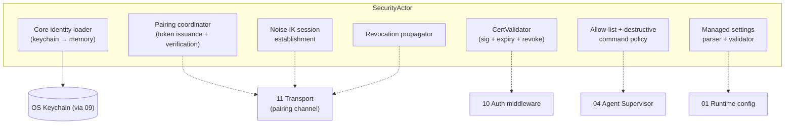
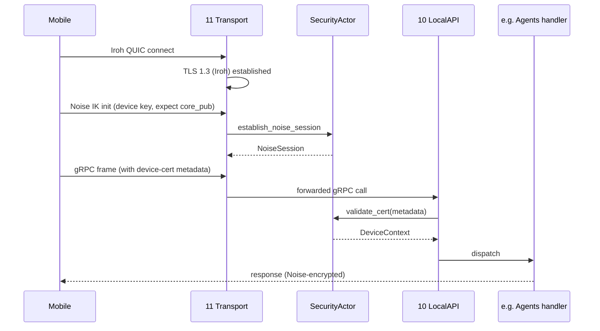
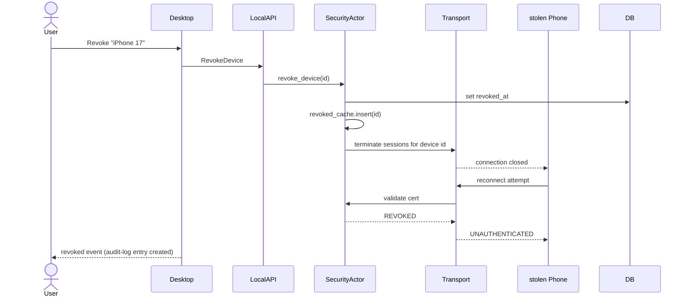

# 12 — Security & Identity

*Sub-system design doc. Inherits locked decisions from `00_Architecture_Overview.md` §6.7 (Ed25519 device identity, QR pairing, Noise IK + AES-256-GCM, MLS out of scope). The threat model is summarized here and reflects PRD §16.*

---

## 1. Purpose & scope

Security & Identity is the **trust anchor** for the whole system. It owns the cryptographic primitives, the identity model, the pairing flow, the session key lifecycle, the sandboxing policy, the secrets-store API, the audit log schema, and the managed-settings enforcement.

It owns:

- **Core identity.** The Ed25519 keypair representing the Core. Generated on first launch. Private key in OS keychain.
- **Device identity.** Per-client Ed25519 keypairs, public keys recorded as `devices.public_key` (09 §4.4). Signed device certificates issued by the Core.
- **Pairing protocol.** QR-code-based one-shot exchange that authenticates a new client.
- **Session keys.** Noise IK handshake on top of the device cert; AES-256-GCM session crypto.
- **Sandboxing primitives.** Filesystem allow-list per agent, optional Docker isolation.
- **Secrets API surface** (the keychain side; persistence side in 09).
- **Audit log policy.** What events get audited, what fields are redacted, retention.
- **Managed settings.** Parsing, validation, enforcement of `~/.concerto/managed.json`.
- **Threat model documentation.** Living artifact maintained here.

It does **not** own: the cryptography of the underlying QUIC/TLS (Iroh does that — see 11); the storage of secrets (keychain via 09 wrappers); the wire-level pairing transport (that's 11's pairing channel — this doc defines the message exchange).

---

## 2. Phase scope

| Phase | What ships |
|---|---|
| **V0.1** | Core identity keypair generation + storage. Local-UDS auth via peer-uid. Audit log basic events. Managed-settings file parsing. **No pairing, no remote, no Noise.** |
| **V1.0** | + QR pairing flow (applies to Mobile, Web, **and Desktop in split-host mode** — same protocol, same cert format). + device-cert issuance + verification. + Noise IK session establishment on top of every Iroh connection. + agent filesystem allow-list. + audit log full event taxonomy + retention. + per-project notification opt-out. + auto-deny destructive shell commands without user approval. + headless `concerto pair` CLI subcommand for Core machines without a tray (cloud VM, home server) — prints QR to TTY plus a copy-pasteable base64 token. |
| **V2.0** | + organization-managed CA (org signs device cert chains; CA root in `managed.json`). + read/write/admin capability scopes. + audit-log encryption at rest. + audit forwarding to SIEM (syslog/HTTPS endpoint, configurable in managed settings). + Docker per-agent isolation full integration. + device-management policy hooks (MDM). |

---

## 3. Key design decisions (sub-system-internal)

### 3.1 Core identity: Ed25519, keychain-stored, one per machine

**Choice:** On first Core start, generate a 32-byte Ed25519 private key. Store under `concerto.core_identity_private` in the OS keychain. The public key is mirrored to a non-secret file at `~/.concerto/identity.pub` for convenience (it's public; sharing is fine).

**Why Ed25519 and not X25519:**
- We need a signature primitive (signing device certs); Ed25519 is the standard.
- Iroh's endpoint key is also Ed25519; we can use the same key for both roles, but we don't — Iroh's endpoint key is generated by Iroh and lives in Iroh's state. Our Core identity is independent.

### 3.2 Device certificate format

A signed structure issued by the Core to each paired device. Format:

```rust
struct DeviceCert {
    version: u8,                          // 1
    device_id: [u8; 32],                  // BLAKE2b(device_pubkey)
    device_pubkey: [u8; 32],              // Ed25519
    device_name: String,                  // user-supplied at pairing
    core_pubkey: [u8; 32],                // Core's identity (for cross-machine validation)
    issued_at: u64,                       // unix epoch seconds
    expires_at: u64,                      // issued_at + 365 days (default)
    capabilities: Vec<String>,            // V1.0: ["admin"]; V2.0: ["read","write","admin","spectate"]
    revocation_check_required: bool,      // V1.0: true (always check)
}

struct SignedDeviceCert {
    cert: DeviceCert,        // serialized canonically
    signature: [u8; 64],     // Core's Ed25519 over canonical-serialized cert
}
```

Serialization: deterministic CBOR with canonical ordering (no JSON — JSON's whitespace and ordering vary).

The cert is sent on every connect as gRPC metadata (10 §3.4) and validated:

1. Verify signature against the configured `core_pubkey` (clients carry this from pairing).
2. Check `expires_at > now`.
3. Look up `device_id` in `devices` table; ensure `revoked_at IS NULL`.
4. Extract `capabilities` for authz.

### 3.3 Pairing flow (QR-code based)

The most user-visible security ceremony. Same protocol used by Happy Coder; documented in PRD §16.1.

```mermaid
sequenceDiagram
    participant CoreUI as Core (tray)
    participant Core as Core (identity)
    participant Phone as new device
    participant DB as devices table
    CoreUI->>CoreUI: User clicks "Pair new device"
    Core->>Core: generate pairing_token (32 random bytes)
    Core->>Core: store {pairing_token, expires_at=now+60s} in memory
    Core->>CoreUI: QR payload = base64({core_pubkey, pairing_token, lan_endpoint, relay_hint})
    Phone->>Phone: scan QR
    Phone->>Phone: generate Ed25519 keypair
    Phone->>Core: PairingRequest{device_pubkey, device_name,<br/>nonce, sig_over_(pairing_token||nonce||device_pubkey)}
    Note over Phone,Core: Sent over a Noise XX channel — first contact,<br/>both ends authenticate via the pairing_token
    Core->>Core: verify sig over (pairing_token||nonce||device_pubkey)
    Core->>Core: invalidate pairing_token (one-shot)
    Core->>Core: issue DeviceCert; sign with core_identity_private
    Core->>DB: insert devices row
    Core-->>Phone: SignedDeviceCert + core_pubkey
    Phone->>Phone: store {device_priv, device_cert, core_pubkey}
    Note over Phone: Pairing complete. Subsequent connects authenticate<br/>via Noise IK using device key + DeviceCert.
```

The pairing channel is itself a Noise XX (mutual unauthenticated) handshake, **bootstrapped by the shared `pairing_token`** — both ends know it from the QR. The token expires in 60 seconds.

If the pairing happens over LAN (the QR contains an mDNS-resolved endpoint), it never touches the relay. Otherwise, the QR contains a relay hint and the handshake is relayed (with the relay still seeing only ciphertext).

**Device classes that use this flow:**

| Class | When it pairs | Notes |
|---|---|---|
| Mobile (iOS / Android) | Always | Camera-based QR scan is the default UX. |
| Web client | Always | Browser-based QR scan via webcam, or pasted token. Pairing is ephemeral (IndexedDB) per `17`. |
| **Desktop in split-host mode** | When the user installs the Desktop on a machine where no local Core runs, or explicitly chooses "Pair with a remote Core" (`15 §3.10.3`) | Same protocol, same cert format. The Desktop persists `{device_priv, device_cert, core_pubkey}` in the OS keychain alongside any other paired Cores. |
| Desktop in co-located mode | Never | Authenticates via UDS peer-UID (`§3.6`); no cert issued. |

For headless Core machines (cloud VM, home server) that lack a tray UI to display a QR, the `concerto pair` CLI subcommand prints the same payload as both a unicode-block QR (works in most terminals) and a base64-encoded token line that can be copy-pasted into the pairing client. The protocol on the wire is unchanged.

### 3.4 Session establishment: Noise IK on every Iroh connection

After pairing, each connect uses Iroh's QUIC + TLS for the outer transport. We add a **Noise IK handshake inside the QUIC stream** with:

- **Initiator's static key** = device key (the paired key).
- **Responder's static key** = Core identity key.
- **Pattern:** IK — initiator has the responder's static key in advance (it's in the DeviceCert).

```
-> e, es, s, ss
<- e, ee, se
```

After the handshake, both ends derive AES-256-GCM session keys and a transport BLAKE2b hash. Subsequent payloads are encrypted with the session keys.

**Why double-encrypt (Noise inside QUIC+TLS)?** Defense in depth, with two **different** authentication roots:

| Layer | Auth root | Compromise impact |
|---|---|---|
| Iroh's QUIC+TLS | Iroh endpoint key (per-Iroh-node) | Relay impersonating endpoint can MITM (Iroh's threat model) |
| Concerto's Noise IK | Device pairing key (user-attested via QR) | None — relay never saw this key |

If Iroh's relay or endpoint discovery is ever compromised, the inner Noise layer still holds. The user's QR scan is the trust root; nothing the relay sees changes that.

### 3.5 Filesystem allow-list per agent

**Choice:** Each agent's working directory is treated as the root of an allow-list. Additional paths can be added per project (e.g., `node_modules` is symlinked from a shared cache). The supervisor (04) hooks the agent's tool-approval flow so that any file-write outside the allow-list triggers an explicit approval.

This is **not a kernel sandbox** in V1.0 (no seccomp / sandbox-exec / AppContainer). It's a policy enforced by intercepting tool calls.

**Allow-list rules:**

- Always allowed: worktree path, `.context/`, the project's declared `paths.writable_outside_worktree` list.
- Approval required: anywhere else (typical `$HOME`, `/tmp`).
- Always denied: system paths (`/etc`, `/usr`, `C:\Windows`, `~/.ssh` unless the user explicitly opts in).

The deny list is configurable in `managed.json` and includes `~/.aws`, `~/.gnupg`, `~/.ssh`, `~/.docker/config.json`, `~/.netrc`, `~/.kube`, etc. by default.

### 3.6 Destructive command intercept

**Choice:** Independent of the allow-list and the permission mode (`04 §3.10`), the supervisor pattern-matches commands the agent wants to run. A small list of "always-confirm" patterns (`rm -rf`, `git push --force`, `DROP TABLE`, `kubectl delete`, etc.) triggers an explicit approval with red urgent styling, regardless of the agent's reasoning. This is the security counterpart to PRD §13.3's UX warning chips.

The patterns are versioned in `destructive-commands.toml` shipped with the binary and extendable in managed settings (`destructiveCommandsExtras`).

**The bypass flag (escape hatch).** There is a separate per-workarea flag `bypass_destructive_guard` (also exposed per-workspace as a default, per-schedule, and per-session). When set, the destructive intercept is **disabled** for that scope. Setting it requires:

1. Typing the literal string `"I understand the risks"` in the confirmation dialog.
2. The current `permission_mode` to be at least `auto` (you can't bypass-destructive in `strict` or `normal` — those modes confirm everything anyway, so the bypass would be meaningless).
3. `managed.json.allow_bypass_destructive_guard` to be true (V1.0 default: true for personal installs, false for managed deployments).

Setting the flag emits an audit event `BypassDestructiveGuardEnabled{by_device, workarea_id}`. Every command that would have been intercepted but ran due to the bypass emits a `DestructiveCommandRanWithBypass{tool, args_summary, session_id}` event.

The deny-list (§3.5) is the **only** floor that is never bypassed — even with `permission_mode = yolo` and `bypass_destructive_guard = true`, writes into `~/.ssh`, `~/.aws`, etc. always require explicit approval.

### 3.7 Audit log policy

**What we audit:** Every state-changing event, every secret access, every device action. From `01 §6.4` (audit writer is in 09) — this doc defines the event taxonomy.

**Event categories:**

```rust
enum AuditKind {
    // Identity
    CoreIdentityCreated,
    DevicePairingStarted,
    DevicePairingCompleted,
    DevicePairingFailed,
    DeviceRevoked,
    DeviceSeen,                            // per-day-aggregated
    // Auth
    AuthFailed { reason: String },
    // Workspace
    WorkspaceCreated, WorkspaceArchived, WorkspaceRestored,
    BranchRenamed,
    // Agent
    AgentStarted, AgentStopped, AgentCrashed,
    ToolApprovalRequested, ToolApprovalDecided,
    CheckpointCreated, CheckpointReverted,
    // VCS
    PullRequestCreated, PullRequestMerged, PullRequestReverted,
    PrSetMergeStarted, PrSetMergeCompleted, PrSetReverted,
    // Skills
    SkillInstalled, SkillUninstalled, SkillEnabled, SkillDisabled,
    MarketplaceAdded,
    // Schedules
    ScheduleCreated, ScheduleDeleted, ScheduleFired, ScheduleFailed,
    // Secrets
    SecretAccessed { kind: String },       // never log the value
    SecretRotated,
    // Managed settings
    ManagedSettingsLoaded, ManagedSettingsViolation,
    // Sparse cones
    SparseConesChanged,
    // Sandboxing
    OutOfAllowlistAccessApproved,
    DestructiveCommandApproved,
    // Permission modes (see 04 §3.10)
    PermissionModeChanged { from: PermissionMode, to: PermissionMode, scope: ModeScope },
    EnteredYoloMode { workarea_id: WorkareaId, session_id: Option<SessionId> },
    YoloModeAction { tool: String, args_summary: String, workarea_id: WorkareaId, session_id: SessionId },
    BypassDestructiveGuardEnabled { workarea_id: WorkareaId },
    BypassDestructiveGuardDisabled { workarea_id: WorkareaId },
    DestructiveCommandRanWithBypass { tool: String, args_summary: String },
    ManagedPolicyBlockedModeChange { requested: PermissionMode, max_allowed: PermissionMode },
}
```

**Retention:** Default 90 days; configurable via managed settings.

**Redaction:** Audit events never contain secret values, prompt text, or chat content. They contain references (IDs) and shapes (counts, paths). When chat content is needed for compliance investigations, the user exports the SQLite + worktree separately.

### 3.8 Managed settings enforcement

`~/.concerto/managed.json` is the **org-controlled override layer**. Once a field is set there, the user cannot change it via UI; the setting is locked.

Schema (V1.0):

```json
{
  "version": 1,
  "enterpriseDataPrivacy": true,
  "defaultModel": "claude-4.7-sonnet",
  "claudeExecutablePath": "/opt/anthropic/bin/claude",
  "codexExecutablePath": "/opt/openai/bin/codex",
  "geminiExecutablePath": "/opt/google/bin/gemini",
  "allowedSkills": ["coupang-*"],
  "deniedSkills": [],
  "allowedMcpServers": ["fs", "github", "coupang-internal"],
  "deniedMcpServers": ["postgres-prod"],
  "allowedPairingDevices": null,    // null = any; array of device-pubkey fingerprints = whitelist
  "maxPairedDevicesPerUser": 4,
  "relayUrl": "https://relay.coupang-internal/concerto",
  "auditForwardEndpoint": "syslog://splunk.coupang-internal:514",
  "destructiveCommandsExtras": ["bigquery delete *"],
  "denyFilesystemPaths": ["~/.aws", "~/.ssh", "~/.gnupg", "/opt/coupang-secrets"],
  "concertoChatEnabled": true,
  "concertoChatModel": "claude-4.7-sonnet",
  "concertoChatFullChatAccess": false,

  // Permission-mode policy (see 04 §3.10)
  "maxPermissionMode": "auto",         // strict|normal|auto|yolo — caps what users can pick
  "allowYolo": false,                  // hard block; overrides maxPermissionMode if false
  "allowBypassDestructiveGuard": false,
  "defaultPermissionMode": "normal",   // fallback for projects that don't set their own
  "forceAuditForwardingBeforeYolo": true  // V1.0: when true, yolo requires audit forwarding to be live before activating
}
```

Validation runs on load; invalid fields are flagged in the audit log (`ManagedSettingsViolation`) and the field reverts to the default. Surface in Tray + Settings → Diagnostics.

### 3.9 Deployment trust modes — what each operator can see

The threat-model table in `§6.4` enumerates adversaries. This subsection is the complementary table that enumerates **legitimate operators** and what each can observe across the four deployment modes Concerto supports. Locked at `00 §6.11`: the same source produces every mode; what differs is who's running which process and which network the traffic crosses.

| Mode | Who runs Core | Who runs relay | Network path | Concerto Inc sees | Self-host operator sees | Network observer sees |
|---|---|---|---|---|---|---|
| **Local-only** | User | n/a (`disable_remote`) | Loopback / mDNS LAN only | Nothing | n/a | LAN mDNS broadcasts (TXT records, public-key fingerprint) |
| **LAN + mDNS** | User | Optional, unused on LAN | Local Wi-Fi between Core and devices | Nothing | n/a | Same as above; plus encrypted QUIC between devices and Core |
| **Self-hosted relay** | User | Customer (the user's own infra) | Through customer's relay deployment | Nothing | Source IPs, endpoint IDs, byte counts, NAT-success per `11 §3.9` | Encrypted QUIC between client ↔ relay and relay ↔ Core |
| **Concerto-hosted relay** | User | Concerto Inc (anycast) | Through `relay.concerto.app` | Source IPs, endpoint IDs, byte counts, NAT-success per `11 §3.9` | n/a | Same as above |
| **Concerto-hosted relay + Expo Push** | User | Concerto Inc | + APNs/FCM via Concerto Inc's Expo project | + Wakeup-ID notification metadata per `14 §3.2` | n/a | + Push wakeup metadata between Apple/Google and the device |

What **no operator in any mode** can see: prompts, code, agent output, device certificates, secret values, pairing tokens, or anything inside the Noise IK tunnel. The cryptographic root is the QR scan at pairing time (`§3.3`); nothing the relay or push provider does changes that root.

A user can downgrade trust at any time by switching modes — the `disable_remote = true` flag (`11 §6.4`) eliminates relay involvement entirely without changing the Core or rebuilding any binaries. Enterprise deployments typically run the self-hosted relay mode with `disable_remote = false` (so org devices can still reach the Core off-network), routed through the enterprise's own infrastructure.

### 3.10 Pluggable device-cert issuer (extension seam for org-managed CA)

**Locked in `18 §3.7`:** the `DeviceCertIssuer` trait is the seam through which future enterprise modules (V2.0+ org-managed CA, MDM integration, SAML/SCIM-bridged identity) replace the V1.0 self-issuance flow without forking the MIT Core. This subsection defines the trait so each enterprise impl has a stable contract.

```rust
#[async_trait]
pub trait DeviceCertIssuer: Send + Sync + 'static {
    /// Verify the incoming pairing request and produce a signed cert.
    /// The default impl uses the Core's own Ed25519 identity (§3.1, §3.2).
    /// Enterprise impls may delegate to an org root of trust, an MDM API,
    /// or an external CA.
    async fn issue(&self, req: PairingRequest) -> Result<SignedDeviceCert>;

    /// Validate a cert presented by a client. Default checks the Core's
    /// own signature; enterprise impls may also check an org cert chain.
    fn validate(&self, raw: &[u8]) -> Result<DeviceContext>;

    /// List capabilities the issuer can attach to certs (V2.0+).
    fn supported_capabilities(&self) -> &'static [&'static str];
}
```

**V1.0 impl (`LocalCoreIssuer`):** the flow described in `§3.2`–`§3.3`. Self-signed by the Core's Ed25519 identity. Capabilities = `["admin"]`.

**V2.0 BSL impls (planned, not in MIT monorepo):**

| Impl | Behavior | Where it lives |
|---|---|---|
| `OrgManagedCaIssuer` | Cert chain: Core key → Org root key → Device. Org root key configured via `managed.json.org_root_pubkey`. | `crates/enterprise-managed-ca` (BSL) |
| `MdmIssuer` | Each pairing call validated against Jamf / Intune / Workspace ONE; cert lifetime tied to MDM-managed device status. | `crates/enterprise-mdm` (BSL) |
| `OidcBridgeIssuer` | OIDC user assertion required at pairing; user identity bound into cert; revocation tracks IdP-signaled deprovisioning. | `crates/enterprise-oidc` (BSL) |

The Core selects the issuer at startup based on `managed.json.identity_issuer` (`"local"` default). All issuers produce wire-compatible `SignedDeviceCert` bytes; clients don't need to know which issuer minted their cert. The MIT Core ships `LocalCoreIssuer` and the trait; no MIT code is licensed-gated.

### 3.11 Revocation

**Choice:** Setting `devices.revoked_at` is immediate; the audit-log entry is the source of truth. The Core actively closes any open streams from the revoked device. Future connects fail at auth.

**Time-to-revoke:** PRD §22.4 target is < 60s — meaning from "user clicks Revoke on their stolen-phone scenario" to "stolen phone can no longer connect."

A user can revoke from any other paired device, or from the Core's tray. There is no remote password-reset; the user's other paired devices are the recovery mechanism.

If **all devices are lost**, the user must physically access the Core machine to reset (or the org's MDM intervenes via managed settings).

**If the Core machine itself is stolen:** the threat model degrades to "the attacker is the local user" (OS keychain protections are the only floor; if the machine is unlocked, the attacker has the user's access). What the user can still do remotely from any other paired device:

- **Revoke that machine's paired devices** (kills active remote sessions originating from devices paired with that Core).
- **Revoke the relay endpoint** (Core can no longer reach external devices through our relay).

Surfaced as a clear advisory in Settings → Security → "If your machine is stolen": the panel lists what revocation can and can't do, plus a one-tap "Revoke all devices for this Core" action. We do not claim this prevents local exploitation of the unlocked machine — that's an OS responsibility (FileVault, BitLocker, screen-lock policy).

---

## 4. Data model

Primary tables (09 §4.4):
- `devices`
- Audit JSONL (out-of-DB)

In-memory:

```rust
struct IdentityState {
    core_priv: SigningKey,              // Ed25519
    core_pub: VerifyingKey,
    cert_validator: CertValidator,       // checks signatures, expiry, revocation
    pairing_tokens: HashMap<TokenHash, PairingTokenState>,  // short-lived
    revoked_cache: HashSet<DeviceId>,    // synced from DB on every revoke
    managed: ManagedSettings,            // parsed managed.json
}

struct PairingTokenState {
    token_hash: [u8; 32],
    issued_at: Instant,
    expires_at: Instant,
    consumed: bool,
}
```

---

## 5. Interfaces

### 5.1 Public Rust API

```rust
pub struct SecurityHandle { /* opaque */ }

impl SecurityHandle {
    // Core identity
    pub fn core_public_key(&self) -> &[u8; 32];

    // Pairing
    pub async fn start_pairing(&self, requested_by: PairingSource) -> Result<PairingChallenge>;
    pub async fn complete_pairing(&self, req: CompletePairing) -> Result<SignedDeviceCert>;

    // Device cert validation (called by 10's auth middleware)
    pub fn validate_cert(&self, raw: &[u8]) -> Result<DeviceContext>;

    // Revocation
    pub async fn revoke_device(&self, id: DeviceId, by: DeviceId) -> Result<()>;
    pub async fn list_devices(&self) -> Result<Vec<DeviceListEntry>>;

    // Session keys (Noise IK)
    pub fn establish_noise_session(&self, transport: NoiseTransport) -> Result<NoiseSession>;

    // Sandbox policy
    pub fn allowlist_for_workspace(&self, w: WorkspaceId) -> AllowList;
    pub fn is_destructive_command(&self, cmd: &str) -> bool;

    // Managed settings
    pub fn managed(&self) -> &ManagedSettings;

    // Audit shortcut (delegates to 09)
    pub fn audit(&self, kind: AuditKind, subject_ids: Vec<(EntityKind, String)>);
}
```

### 5.2 gRPC surface (subset)

```proto
service Devices {
  rpc StartPairing(google.protobuf.Empty) returns (PairingChallenge);
  rpc CompletePairing(CompletePairingRequest) returns (SignedDeviceCert);
  rpc ListDevices(google.protobuf.Empty) returns (ListDevicesResponse);
  rpc RevokeDevice(RevokeDeviceRequest) returns (google.protobuf.Empty);
  rpc GetCoreInfo(google.protobuf.Empty) returns (CoreInfo);    // core_pubkey for client carry
}
```

### 5.3 Emitted events

| Event | Stream | When |
|---|---|---|
| `device.paired` | broadcast | Pairing completed |
| `device.revoked` | broadcast | Revocation persisted |
| `device.seen` | broadcast (low-rate) | First daily contact from each device |
| `security.violation` | broadcast | Auth failure, destructive command intercepted, allow-list breach |

---

## 6. Internal architecture



### 6.1 Cert validation hot path

Optimized: signature verification, expiry check, and revoke-set membership are all in-memory operations. Target latency: < 200µs per call. No DB hit on the hot path; the revoked set is mirrored from DB on every revoke event.

### 6.2 Pairing token security

- Token is 32 random bytes from `getrandom`.
- Stored only in memory (never persisted) — survives Core restart only by user re-initiating pairing.
- One-shot: consuming the token clears it. If the QR was photographed but never used, the token still expires in 60s.
- Rate-limited: at most 3 active tokens at a time. Older ones rotate out.

### 6.3 Noise session keys lifecycle

- New session per Iroh connection. Rekey periodically (every 1 GB of data or 1 hour, whichever first — Noise transport's standard rekey).
- On rekey failure or replay-counter overflow, drop the connection; client reconnects.
- Session keys never touch disk.

### 6.4 Threat model summary (lives here as canonical)

PRD §16's table reproduced and tightened:

| Adversary | Can | Cannot (under V1.0 design) |
|---|---|---|
| **The relay** | See ciphertext blob sizes, timestamps, which Core ↔ which device | Read code, prompts, agent output, secrets |
| **Apple / Google (push)** | See wakeup metadata (device X has something pending) | Read notification body (post-wakeup fetched over E2EE) |
| **Network observer (Wi-Fi, ISP)** | See ciphertext between Core and relay / direct peer | Decrypt traffic; impersonate either end |
| **A local non-Concerto process on the Core machine** | Try to connect to UDS (fails — peer-uid check) | Bypass single-instance guard; read keychain entries owned by Concerto without OS prompt |
| **Stolen Core machine (still on)** | Use the local UI as the user; access keychain entries that are still unlocked | Bypass keychain prompts that require login password / Touch ID |
| **Stolen paired phone** | Connect as the user up to revoke | Continue once any other paired device revokes it |
| **Compromised LLM provider** | See prompt text and agent output (the agent sends them) | Impersonate the user to GitHub (the Core holds GH PAT, never sent to provider) |
| **Compromised MCP server** | See whatever the agent sends to it (controlled by MCP tool design) | Read other MCP servers' input/output; reach into Core internals |
| **Compromised Core binary (supply-chain)** | Everything | (We mitigate: signed binaries, reproducible builds in V2.0) |
| **Org sysadmin with managed.json** | Lock all settings, deny skills/MCP, route through their relay, forward audit, cap max permission mode | Decrypt user's traffic if they aren't in path (E2EE still holds) |
| **Agent running in `auto` mode** | Edit any file inside the workspace allow-list without prompting | Write outside the worktree (still confirms); run destructive commands (still confirms) |
| **Agent running in `yolo` mode** | Edit any file inside the workspace allow-list and outside (any user-readable path) without prompting | Write into deny-list paths (`~/.ssh`, `~/.aws`, etc.); run destructive commands unless `bypass_destructive_guard = true` |
| **Agent running in `yolo` + `bypass_destructive_guard`** | Run any command including `rm -rf` and `git push --force` without prompting | Write into deny-list paths (the only floor that never bypasses) |

---

## 7. Sequence diagrams — hot paths

### 7.1 First device pairing over LAN

```mermaid
sequenceDiagram
    actor User
    participant CoreTray as Core tray
    participant Core as SecurityActor
    participant mDNS as mDNS (11)
    participant Phone as Mobile (16)
    User->>CoreTray: Pair new device
    Core->>Core: gen pairing_token; lan_endpoint = mDNS publish
    CoreTray-->>User: QR{core_pub, pairing_token, lan_endpoint}
    User->>Phone: scan QR
    Phone->>mDNS: resolve LAN endpoint
    Phone->>Core: Noise XX init (PSK = pairing_token)
    Core->>Core: verify handshake; consume token
    Phone-->>Core: PairingRequest{device_pub, device_name, nonce, sig}
    Core->>Core: verify sig; mint DeviceCert
    Core-->>Phone: SignedDeviceCert + core_pub
    Phone->>Phone: persist {device_priv, cert, core_pub}
    Core->>DB: insert devices row; audit DevicePairingCompleted
```

### 7.2 Authenticated remote call (mobile)



### 7.3 Revocation



---

## 8. Error handling & failure modes

| Failure | Detection | Response |
|---|---|---|
| Keychain access denied at startup | `Secrets::get(CoreIdentityPrivate)` returns AccessDenied | Block Core startup with platform-specific message |
| Pairing token expired | Timestamp check | Reject with `pairing.expired`; user starts new pairing |
| Pairing replay (same token, second use) | One-shot flag | Reject with `pairing.consumed` |
| Cert signature invalid | Verifier | `UNAUTHENTICATED`; audit AuthFailed |
| Cert expired | Expiry check | `UNAUTHENTICATED`; UI suggests re-pair |
| Cert from unknown Core (`core_pubkey` mismatch) | Identity check | Reject; could indicate client was paired with a different Core |
| Noise handshake fails | Snow returns Err | Drop connection; client retries |
| Managed.json malformed | Validation fails | Audit ManagedSettingsViolation; revert to defaults; emit security.violation |
| Destructive command without approval | Allow-list policy detects | Auto-deny; emit security.violation |
| Out-of-allow-list write attempt | Tool interceptor | Raise approval request to user; default deny |
| All devices revoked, none left to pair from | User scenario | Provide local-machine recovery: TTY-based `concerto-core reset-identity --confirm` (deletes core_pub, forces re-pair from scratch) |
| Clock skew (cert expiry near boundary) | Validator | Accept ± 5min skew tolerance; warn in audit |

---

## 9. Dependencies on other sub-systems

| Sub-system | How |
|---|---|
| **09 Persistence** | `devices` table, audit log, keychain wrappers |
| **11 Transport** | Pairing channel (Noise XX over Iroh); session crypto on every connection |
| **10 Local API** | Auth middleware calls `validate_cert` |
| **04 Agent Supervisor** | Filesystem allow-list policy; destructive command policy |

Consumers (via SecurityHandle):
- **All other sub-systems** for audit
- **15/16/17 clients** call `start_pairing` + `complete_pairing` via gRPC

---

## 10. Testing strategy

| Layer | What | How |
|---|---|---|
| Unit | Cert sign/verify, expiry, revoke check | Standard `cargo test` |
| Unit | Pairing token issuance, expiry, replay | Property-based |
| Unit | Noise IK against `snow` test vectors | Pass through known vectors |
| Integration | Full pairing over LAN with two test processes | E2E |
| Integration | Revoke mid-stream — connection closed within 1s | Latency-budgeted test |
| Security | Replay attack on pairing | Recorded handshake; replay; assert rejection |
| Security | Cert from wrong Core (different identity) | Cross-Core test |
| Security | Managed.json malformed → no privilege escalation | Fuzz the parser |
| Security | Audit log redaction — no secrets in any event | Static analysis on event constructors |
| Security | Fuzz `validate_cert` with malformed input | cargo-fuzz |
| Cross-platform | Keychain access on Mac/Win/Linux | CI matrix |

---

## 11. Open questions / deferred

*All items resolved. See **§12 Resolved decisions log** below.*

## 12. Resolved decisions log

| # | Question | Decision | Where in doc |
|---|---|---|---|
| R-1 | DeviceCert format | **CBOR** — deterministic, standalone (recovery tools don't need proto schema). | §3.2 |
| R-2 | Cert renewal | **Automatic at 30-days-before-expiry, transparent.** V1.5 adds org rotation hook. | §3.2 |
| R-3 | Pairing path: LAN-only vs relay | **Both in V1.0.** QR contains a LAN endpoint when discovered, plus a relay hint as fallback. | §3.3 |
| R-4 | Noise pattern | **IK** — client has Core's static key from the cert; one round trip cheaper than XK. | §3.4 |
| R-5 | Post-quantum migration | **Out of scope V1.0.** Watch `snow`'s ML-KEM support; revisit V2.0. | (V2.0) |
| R-6 | Audit log at-rest encryption | **V2.0.** V1.0 uses filesystem ACL only. (Cross-ref `09 R-3`.) | §3.7, (V2.0) |
| R-7 | MDM integration for org-managed CA | **V2.0** — managed-settings hook for `org_root_pubkey` + per-device cert chain. | (V2.0) |
| R-8 | Stolen Core machine recovery | **OS-keychain is the floor.** From other paired devices the user can revoke that Core's paired devices and revoke its relay endpoint (kills remote access). Settings → Security has a "If your machine is stolen" advisory + one-tap "Revoke all devices for this Core." Does not prevent local exploitation of an unlocked machine — that's the OS's job. | §3.11 (expanded) |
| R-11 | Hosted vs. self-hosted trust boundary explicit table | **Locked.** Added in §3.9 to give buyers and auditors a precise artifact to reference; complements `11 §3.9` (relay-side observability). | §3.9 |
| R-12 | Pluggable device-cert issuer for V2.0 org-CA / MDM | **Trait seam (`DeviceCertIssuer`) defined in §3.10**, OSS impl `LocalCoreIssuer` in MIT Core, BSL impls planned (`OrgManagedCaIssuer`, `MdmIssuer`, `OidcBridgeIssuer`) per `18 §3.7`. | §3.10 |
| R-9 | Session key rekey trigger | **Time (1h) and data (1GB), whichever first.** Standard for QUIC + Noise. | §3.4 |
| R-10 | Sign `managed.json` | **V2.0** — org-signed `managed.json.sig` verified against `org_root_pubkey`. | (V2.0) |

---

*End of `12_Security_Identity.md`. The transport that wraps these primitives is in `11_Remote_Transport_Relay.md`. Auth middleware that consumes the cert validator is in `10_Local_API_Protocol.md` §3.4.*
