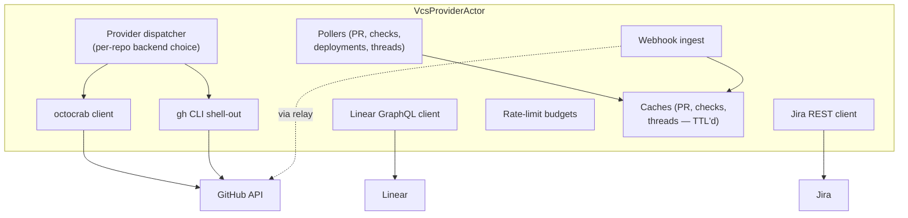
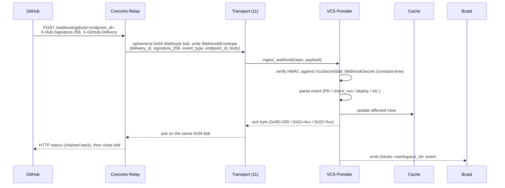
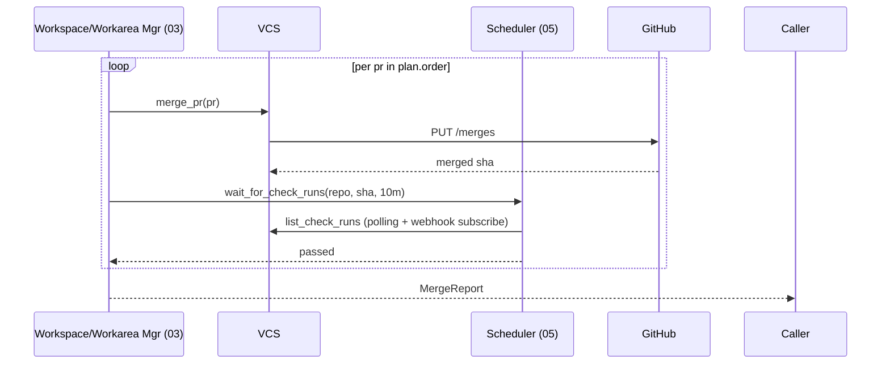
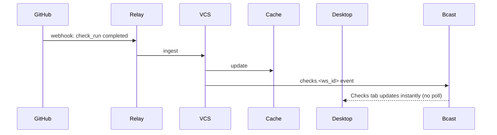

# 13 — VCS Provider Integration

*Sub-system design doc. Inherits locked decisions from `00_Architecture_Overview.md`. Schema reference: `09_Persistence.md` §4.5 (`pull_requests` keyed on `(workarea_id, repository_id)`). The PR set for a workarea is the implicit set of all rows for that `workarea_id` ordered by `merge_order`. This is the only sub-system that talks to GitHub / GitLab / Bitbucket.*

---

## 1. Purpose & scope

The VCS Provider Integration owns **all interaction with external version-control hosts**. Workareas (03) ask "create this PR for repo R, merge the workarea's PR set, what's the status." The Checks/Diff/PR per-repo tabs in the UI ask "what threads / approvals / checks / deployments are on this PR." Maestro (08) asks "fetch this Linear issue."

It owns:

- **GitHub API client** — REST + GraphQL via `octocrab` (Rust) or shell-out to `gh`.
- **Webhook receiver** — a small HTTPS endpoint on the Core that GitHub can push events to (when reachable), avoiding poll storms.
- **`gh` CLI fallback** — when API tokens are stale or auth is delegated to gh, shell out.
- **PR lifecycle** — create, update title/body/base, mark ready/draft, merge (squash/merge/rebase), revert.
- **CI / check / deployment status aggregation** — pull from GitHub Actions checks API and the Deployments API.
- **Review threads** — fetch, mark resolved, attach as composer context.
- **PR set merge mechanics** — coordinate the merge sequence with checks waits (consumed by 03 + 05).
- **Linear / Jira issue fetch** — for workspace + workarea creation from issues (PRD §6.7).
- **Provider abstraction** — V1.0 GitHub-only behind a trait; V2.0 GitLab + Bitbucket adapters.

It does **not** own: git operations (02 handles those); PR data persistence beyond caching (canonical state is GitHub's; we cache).

---

## 2. Phase scope

| Phase | What ships |
|---|---|
| **V0.1** | GitHub via `gh` CLI shell-out only. Create PR, get state, list checks, list deployments. No webhooks. Linear/Jira via the agent (out-of-band). |
| **V1.0** | + native `octocrab` client. + webhook receiver with HMAC verification. + review-thread sync. + PR-set semantics + coordinated merge (with 05 + 03). + Linear API client (native). + Jira API client (native; OAuth flow in Settings). + check-run + deploy aggregation. + GitHub App option (for orgs that prefer App auth over PAT). |
| **V2.0** | + GitLab adapter (gitlab.com + self-hosted). + Bitbucket adapter. + provider auto-detect from repo URL. + cross-repo coherence checks (PRD §10.5) — typecheck across the contract boundary between linked PRs. |

---

## 3. Key design decisions (sub-system-internal)

### 3.1 Two backends: octocrab native + gh CLI fallback

**Choice:** Run `octocrab` (Rust GitHub client) as the default. Fall back to shell-out `gh` when:

- The user has gh installed and authenticated but no PAT configured in Concerto.
- A rate-limit headers from API indicate we should back off and `gh`'s rate limit pool is separately tracked.
- A specific operation isn't supported by octocrab (rare) or the API version we're targeting.

Both backends implement the same `GitHubBackend` trait. Switching is per-call; the user doesn't pick.

**Why both:**
- `gh` is what most engineers already have. The user shouldn't need to provision a new PAT.
- `octocrab` gives us streaming-friendly async I/O for the hot paths (webhooks, check polling).

### 3.2 Webhooks: an HTTPS endpoint on the Core, reachable via relay

**Choice:** The Core's `concerto-relay` route includes a `/webhook/github/<endpoint_id>` URL that GitHub can register against. The relay forwards the webhook to the Core over a dedicated, short-lived transport channel.

> **V1.0 amendment (2026-06-05) — precise relay→Core framing, per `PHASE3_PLANNING §1 D3` + `§4.2`; the wire shape is FROZEN in `design/11 §3.4.1`.**
> The original wording ("forwards the webhook payload to the Core over the **existing** Iroh tunnel") was imprecise — there may be **no live device session** when a webhook lands, so there is no "existing" tunnel to reuse. The precise framing: on each `POST /webhook/github/<endpoint_id>`, the relay opens an **ephemeral `0x04` Webhook bidi** to the addressed Core's `endpoint_id` (a new reserved channel tag, `design/11 §3.3`/`§3.4.1`; **not** the long-lived `0x01` API channel), writes a single **`WebhookEnvelope`** — `delivery_id` (`X-GitHub-Delivery`), `signature_256` (`X-Hub-Signature-256`, passed through verbatim), `event_type` (`X-GitHub-Event`), `endpoint_id`, and the opaque `body` (≤ 25 MiB) — reads the Core's one-byte ack, and chains the corresponding HTTP status (`200`/`4xx`/`5xx`) back to GitHub. The `0x04` channel runs **no Noise**: the peer is GitHub-via-relay, not a paired device, so authenticity rests entirely on the HMAC the Core verifies (below). See `design/11 §3.4.1` for the FROZEN envelope encoding, the body ceiling, and the ack→HTTP-status mapping Task 315 implements on both the relay-write and Core-read sides.

**Why through the relay:**
- The Core typically doesn't have a public IP.
- GitHub requires a stable HTTPS URL.
- Reusing the relay infrastructure means no new public service.

The webhook secret (HMAC) is the per-repo `VcsSecretSlot::WebhookSecret` (Task 313), rotated per-pairing and verified **only at the Core**; the relay forwards opaque body bytes and never holds the secret (`design/11 §3.9` carve-out). The Core recomputes HMAC-SHA256 over the body and constant-time-compares before acting.

If webhook delivery fails (relay unreachable, Core offline, secret mismatch), the Core falls back to polling (`§3.3`). The relay itself **does not buffer** a delivery it cannot route — it drops + logs + returns `5xx` so GitHub redelivers (`§8`, `design/11 §3.4.1`).

### 3.3 Polling cadence

When webhooks aren't available (V0.1, or webhook receipt failed):

- **PR state** — poll every 30s while the workarea is in foreground, every 5 min otherwise.
- **Check runs** — poll with exponential backoff while waiting (1s, 2s, 4s, 8s, 16s, 30s cap) — same as 05 §3.9.
- **Review threads** — poll every 60s while the workarea is viewing the Checks panel.
- **Deployments** — poll every 60s.

The cadence is tuned to GitHub's rate limits (5000/hr for authenticated PAT, 15000/hr for GitHub App).

### 3.4 PR creation — what we fill in

**Choice:** When `CreatePullRequest` is called for a (workarea, repo) pair, the VCS Provider:

1. Reads context: workarea composer + branch name; the specific repo's recent commits; last user message + summary of changes.
2. Calls 08 to compose a title and body (delegated; **on by default**, opt-out per workspace in Repository Settings → PR Defaults). Falls back to a deterministic title (composer + branch) and body (last user message) if no LLM provider is configured or the call fails/times out (2s).
3. Reads the repo's PR template (`.github/pull_request_template.md` if present).
4. Pushes the branch on that repo (delegated to 02 via git shell-out).
5. Calls GitHub's create-PR API.
6. Persists the `pull_requests` row (keyed by `(workarea_id, repository_id)`) + emits `pr.events`.
7. Returns the URL.

For workareas that touched multiple repos, the user (or the Maestro on a confirmation chip) can "Create PRs for all repos with commits" — iterates the above per repo.

The body always includes a footer "Created from Concerto · workarea bach · agent claude-4.7" with a deep link.

### 3.5 PR-set merge protocol

The implementation of PRD §10.4. Driven by Workspace/Workarea Mgr (03) with sequencing help from Scheduler (05). PR set is **implicit per workarea** (all `pull_requests` rows with the same `workarea_id`).

```
WorkareaMgr.merge_pr_set(workarea)
  → fetch all pull_requests for this workarea, ordered by merge_order
  → for each PR (in order):
      → VCS.merge_pull_request(pr_id, method) — calls GitHub
      → Scheduler.wait_for_check_runs(repo, merge_commit_sha, timeout=10m)
         → blocks until all required checks are conclusive
      → if checks pass: continue
      → if checks fail: pause; emit pr_set.merge_failed_step; surface auto-revert option
  → all members merged → emit pr_set.merged
```

Coordinated revert is the inverse: for each PR in the workarea in reverse `merge_order`, call `revert_pull_request` (which is a `git revert` + new PR, or a hard reset on the merge commit if the user opted in).

### 3.6 Review-thread sync

**Choice:** GitHub's GraphQL API for review threads is preferred (one query, full structure). When a thread is updated:

- The Core stores the thread (in-memory cache keyed by `(pr_id, thread_id)`) and emits `checks.<workarea_id>.<repository_id>` events.
- The Checks panel + Diff viewer render the thread inline (per repo).
- "Send to agent" composes a message with the thread context attached, routed to a session of the workarea (user picks which session).
- "Mark resolved" calls the GraphQL mutation; on success, updates the cache + emits.

Review threads are **not** persisted to SQLite — they're GitHub's canonical state. We cache for low-latency UI; refresh from origin on workarea open.

### 3.7 Linear / Jira issue fetch

For workspace + workarea creation from an issue URL or ID:

- **Linear** — GraphQL API. OAuth flow stored in `Settings → Linear`. Returns title, description, labels, status.
- **Jira** — REST + OAuth (Atlassian). Same fields.

Issue content flows into the workspace creation flow (PRD §6.7) and is shown to the user; if `auto-suggest cones from issue text` is on, the Maestro (08) plan-mode reads it to propose per-repo cones for the first workarea.

We never persist issue body content; we fetch on demand. Cached for 1 hour in memory.

### 3.8 Provider abstraction

The `VcsProvider` trait is one of the extension-point trait seams locked in `18 §3.7`. The MIT Core ships GitHub support; future providers (GitLab, Bitbucket, Gerrit, GitHub Enterprise variants) can either land in the MIT monorepo as additional OSS impls or — for vendor-specific commercial integrations — ship as BSL crates loaded via the same trait without forking the Core.

```rust
#[async_trait]
pub trait VcsProvider: Send + Sync + 'static {
    async fn create_pr(&self, req: CreatePrRequest) -> Result<PullRequest>;
    async fn get_pr(&self, id: ProviderPrId) -> Result<PullRequest>;
    async fn list_check_runs(&self, repo: &str, sha: &str) -> Result<Vec<CheckRun>>;
    async fn merge_pr(&self, id: ProviderPrId, method: MergeMethod) -> Result<MergeReport>;
    async fn revert_pr(&self, id: ProviderPrId) -> Result<RevertReport>;
    async fn list_review_threads(&self, id: ProviderPrId) -> Result<Vec<ReviewThread>>;
    async fn resolve_thread(&self, id: ThreadId) -> Result<()>;
    async fn list_deployments(&self, repo: &str, ref_: &str) -> Result<Vec<Deployment>>;
    async fn fetch_issue(&self, url: &Url) -> Result<Option<Issue>>;
    // ...
}
```

V1.0 implementations (both MIT): `GitHubProvider` (octocrab) and `GitHubProviderViaCli` (gh shell-out). Picked at runtime per repo based on what's configured. V2.0 plans `GitLabProvider` and `BitbucketProvider` as additional MIT impls in the monorepo.

### 3.9 Rate-limit handling

**Choice:** Every API call goes through a per-provider rate-limit budget. When < 10% of budget remains:

- Polling cadence doubles.
- New API calls deprioritize background tasks (deployments, threads) over user-driven ones (create PR, merge).
- UI emits a soft warning in Settings → Diagnostics.

When budget exhausted: API calls fail with `RateLimited{reset_at}`; the user sees a banner; tasks queue and resume on reset.

---

## 4. Data model

Primary table: `pull_requests` keyed by `(workarea_id, repository_id)` with `merge_order` (09 §4.5). The workarea's PR set is the implicit set of rows for that `workarea_id`.

In-memory caches:

```rust
pub struct VcsState {
    providers: HashMap<RepoId, Box<dyn VcsProvider>>,
    pr_cache: HashMap<PullRequestId, CachedPr>,
    check_cache: HashMap<(RepoId, ShaString), Vec<CheckRun>>,    // TTL 30s
    threads_cache: HashMap<PullRequestId, Vec<ReviewThread>>,    // refreshed on open
    rate_limits: HashMap<ProviderKey, RateLimitBudget>,
    webhook_secrets: HashMap<RepoId, [u8; 32]>,
}
```

Issue fetches are not persisted; held in a small TTL cache (1h).

---

## 5. Interfaces

### 5.1 Public Rust API

```rust
pub struct VcsHandle { /* opaque */ }

impl VcsHandle {
    pub async fn create_pr(&self, req: CreatePrRequest) -> Result<PullRequest>;
    pub async fn get_pr(&self, id: PullRequestId) -> Result<PullRequest>;
    pub async fn list_open_prs(&self, repo: RepositoryId) -> Result<Vec<PullRequest>>;
    pub async fn update_pr(&self, id: PullRequestId, patch: UpdatePrPatch) -> Result<PullRequest>;
    pub async fn mark_ready(&self, id: PullRequestId) -> Result<()>;
    pub async fn merge_pr(&self, id: PullRequestId, method: MergeMethod) -> Result<MergeReport>;
    pub async fn revert_pr(&self, id: PullRequestId) -> Result<RevertReport>;

    pub async fn list_check_runs(&self, workarea: WorkareaId, repo: RepositoryId) -> Result<Vec<CheckRun>>;
    pub async fn list_deployments(&self, workarea: WorkareaId, repo: RepositoryId) -> Result<Vec<Deployment>>;
    pub async fn list_review_threads(&self, pr: PullRequestId) -> Result<Vec<ReviewThread>>;
    pub async fn resolve_thread(&self, id: ThreadId) -> Result<()>;

    pub async fn fetch_issue(&self, url: &str) -> Result<Issue>;
    pub async fn fetch_linear_issue(&self, id: &str) -> Result<Issue>;

    // Called by webhook receiver (12 forwards events here)
    pub async fn ingest_webhook(&self, repo: RepositoryId, payload: WebhookPayload) -> Result<()>;
}
```

### 5.2 gRPC surface

Mirrors §5.1 in the `Vcs` service (10 §5.1).

### 5.3 Emitted events

| Event | Stream | When |
|---|---|---|
| `pr.created` / `pr.updated` / `pr.merged` / `pr.reverted` | broadcast | State transitions |
| `pr.check_run_updated` | `checks.<workarea_id>.<repository_id>` | Check status changes |
| `pr.deployment_updated` | `checks.<workarea_id>.<repository_id>` | Deployment status changes |
| `pr.thread_updated` | `checks.<workarea_id>.<repository_id>` | Review thread changed |
| `pr_set.merge_step_completed` | `pr_set.events` | One member merged in a set |
| `vcs.rate_limit_warning` | broadcast | Budget below 20% |
| `vcs.webhook_received` | broadcast (low-rate) | Webhook ingested (informational) |

---

## 6. Internal architecture



### 6.1 Backend dispatch logic

```
choose_backend(repo, op) -> Backend:
    if op == fetch_issue: use the specific Linear/Jira client
    if repo.has_octocrab_token: use Octocrab
    elif gh_cli_available(): use GhCli
    else: return Error::NoVcsCredentials
```

The user is guided through credential setup at first PR creation if needed.

### 6.2 Webhook flow



> **V1.0 amendment (2026-06-05):** the `Relay→Trans` arrow is the **ephemeral `0x04` Webhook bidi** carrying the `WebhookEnvelope` (FROZEN in `design/11 §3.4.1` per `PHASE3_PLANNING §1 D3`/`§4.2`), **not** the long-lived API tunnel. The Core's status is returned as a **one-byte ack** on the same bidi, which the relay maps to the HTTP status it chains back to GitHub (`0x00`→`200`, `0x01`→`4xx`, `0x02`→`5xx`), then closes the stream.

Webhook payloads are validated before update. Replay attacks are blocked by the GitHub delivery-id idempotency cache — the persistent `webhook_deliveries` table (migration `0013`, Task 315) keyed on `delivery_id`, so dedup survives a Core restart.

### 6.3 Cache invalidation

- On webhook receipt: targeted invalidation of just the affected PR / check / thread.
- On TTL expiry: lazy refresh (next read triggers fetch).
- On user-initiated refresh (pull-to-refresh in UI): force-fetch everything for the open workarea.

---

## 7. Sequence diagrams — hot paths

### 7.1 Create PR from a workarea (one repo)

```mermaid
sequenceDiagram
    actor User
    participant DT as Desktop
    participant API as Local API
    participant WSM as Workspace/Workarea Mgr (03)
    participant Vcs as VCS Provider
    participant Repo as Repo Mgr (02)
    participant Coord as Maestro (08, optional)
    participant GH as GitHub
    User->>DT: Create PR
    DT->>API: CreatePullRequest(workarea_id, repository_id)
    API->>WSM: prepare context
    WSM->>Vcs: create_pr(req)
    opt LLM-composed title/body (on by default; falls back deterministically if no LLM available)
        Vcs->>Coord: suggest_pr_metadata(workarea, repo)
        Coord-->>Vcs: title, body
    end
    Vcs->>Repo: git push origin <branch>
    Repo-->>Vcs: pushed
    Vcs->>GH: POST /repos/.../pulls
    GH-->>Vcs: PR object
    Vcs->>DB: insert pull_requests row
    Vcs-->>API: PullRequest
    API-->>DT: rendered
```

### 7.2 PR-set coordinated merge



### 7.3 Webhook drives faster check updates



---

## 8. Error handling & failure modes

| Failure | Detection | Response |
|---|---|---|
| Auth failure (PAT invalid) | 401 from GH | Surface "GitHub auth expired"; UI walks user through PAT setup |
| Rate limit hit | 403 X-RateLimit-Remaining=0 | Queue calls until reset; UI banner; degrade polling cadence |
| Webhook HMAC mismatch | sig verify fail | Drop payload; log; do NOT inform sender (could be probe). Core acks `0x01`→ relay returns `400` to GitHub (`design/11 §3.4.1`) |
| Webhook stale (replay) | Delivery-ID seen (`webhook_deliveries`, migration `0013`) | Drop; Core acks `0x00`→`200` (idempotent success, so GitHub stops redelivering) |
| **Offline Core when a webhook lands** (V1.0 amendment 2026-06-05, per `PHASE3_PLANNING §1 D3`) | Relay's `0x04` dial to `<endpoint_id>` fails (no route / Core down / dial timeout) | Relay **drops + logs** the attempt (endpoint id + delivery id + timestamp; never the body) and returns `502`/`503` to GitHub → GitHub redelivers per its own retry policy. The relay **does not buffer** (near-stateless, `design/11 §3.2`/`§3.4.1`). The Core's standing fallback for the gap is polling (`§3.3`). |
| Network timeout to GH | reqwest timeout | Retry with backoff (max 3); fall back to cached state with "stale" badge |
| GitHub API schema change (new fields) | octocrab handles gracefully (unknown fields ignored) | OK — forward-compat works |
| GitHub API schema removal | Field missing | Surface to user; degrade gracefully (omit affected info) |
| `gh` CLI not authenticated | Probe at startup | Hide gh option; offer octocrab token wizard |
| Merge conflict on PR (server-side) | GH returns 405 | Surface to user with "resolve conflicts" CTA in the workarea's per-repo panel |
| Required reviewer not approved | GH refuses merge | Surface as a blocker in Checks tab |
| Webhook delivery from spoofed source | HMAC check | Reject |
| Issue URL malformed (Linear/Jira) | Parser | Reject with clear error in workspace-create flow |

---

## 9. Dependencies on other sub-systems

| Sub-system | How |
|---|---|
| **09 Persistence** | `pull_requests` (keyed `(workarea_id, repository_id)`) |
| **02 Repo Mgr** | `git push` for PR creation |
| **05 Scheduler** | `wait_for_check_runs` consumer |
| **03 Workspace/Workarea Mgr** | Triggers PR ops; owns the workarea-level PR set |
| **11 Transport** | Webhook forwarding via relay |
| **12 Security** | Webhook secrets in keychain |
| **08 Maestro** | Optional title/body composition (delegated up — to avoid coupling here) |

---

## 10. Testing strategy

| Layer | What | How |
|---|---|---|
| Unit | Per-backend method implementations against stubbed responses | `wiremock` |
| Unit | HMAC webhook verification | Known good/bad fixtures |
| Unit | Rate-limit budget logic | Synthetic time |
| Integration | Create + get + merge round-trip against a real GitHub repo | CI-gated, opt-in |
| Integration | Webhook arrives during a poll — assert no double-update | E2E with fixture relay |
| Integration | gh CLI fallback path | Per-CI |
| Failure | Mid-merge revert when post-merge canary trips | Inject failing check |
| Performance | Polling cadence at scale (100 open PRs across 10 repos) | Synthetic |

---

## 11. Open questions / deferred

*All items resolved. See **§12 Resolved decisions log** below.*

## 12. Resolved decisions log

| # | Question | Decision | Where in doc |
|---|---|---|---|
| R-1 | Provider auto-detect from repo URL | **V2.0** — tied to GitLab/Bitbucket support. | (V2.0) |
| R-2 | GitLab + Bitbucket adapters | **V2.0** — same `VcsProvider` trait, different impls. | §3.8, (V2.0) |
| R-3 | Cache PR diffs locally? | **No.** Cheap to re-fetch; clients restyle per viewer. Avoids stale-cache hazards. | §6.3 |
| R-4 | LLM-composed PR titles/bodies | **Default ON; opt-out per workspace** in Repository Settings → PR Defaults. Falls back to deterministic title (composer + branch) and body (last user message) if no LLM provider or the call fails/times out (2s). | §3.4 |
| R-5 | Coordinated revert algorithm | **Revert-commit by default** (always safe); hard-reset only on explicit opt-in (rare; main branch usually protected). | §3.5 |
| R-6 | Cross-repo coherence checks | **V2.0.** Non-trivial. The Concerto preamble's multi-repo awareness (`04 §3.11`) reduces need; revisit whether explicit checks are even required in V2. | (V2.0) |
| R-7 | GitHub App option | **V1.0 yes (alongside PAT).** Higher rate limit, finer scope, easier rotation. | §3.1 |
| R-8 | Reviewer suggestion via git blame | **V2.0** for UI surfacing. The agent can do this via shell today. | (V2.0) |
| R-9 | Linear/Jira write-back on PR merge | **V1.0 yes; configurable per workspace.** | §3.7 |
| R-10 | Self-hosted GitHub Enterprise | **Configurable base URL; same octocrab works.** Documented. | §3.1 |

---

*End of `13_VCS_Provider_Integration.md`. PR-set semantics are owned here; coordinated merge sequencing is owned by `03_Workspace_Session_Manager.md` consuming this + `05_Scheduler.md`.*
