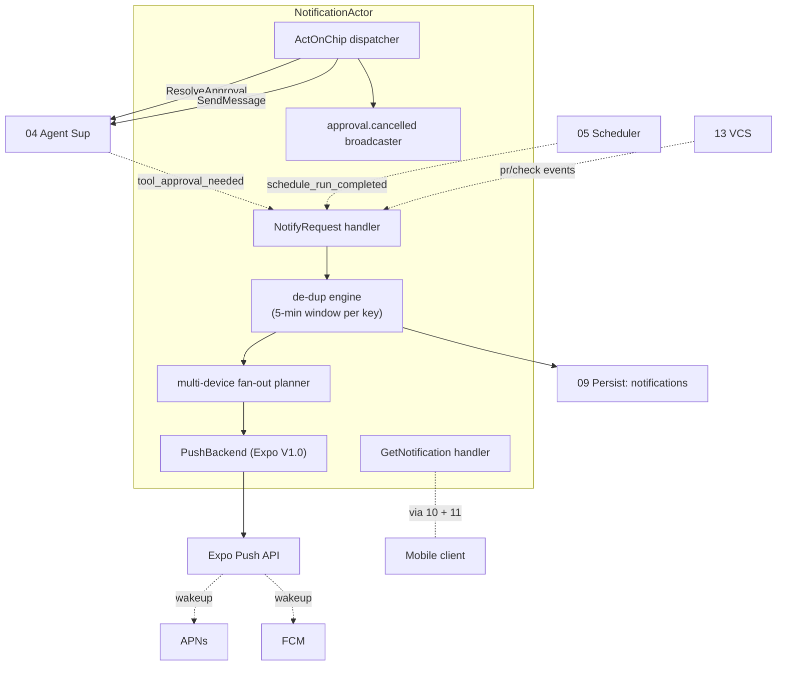
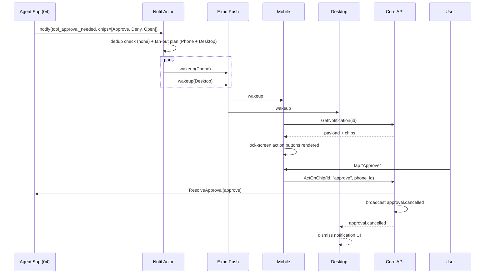

# 14 — Notifications & Push

*Sub-system design doc. Inherits locked decisions from `00_Architecture_Overview.md` §6.9 (Expo Push wrapping APNs/FCM in V1.0, direct APNs/FCM as a V1.5 swap). PRD §16.6 + §15.1.6 define the wakeup-only payload contract.*

> **Amendment (2026-06-14 — Phase-5 planning reconciliation).** Reconciles this doc with the built code Phase 5 lands on (`tasks/v1.0/PHASE5_PLANNING.md §1/§4`). Where these bullets conflict with the prose below, these govern; the prose is the product intent.
> - **`subject_kind` taxonomy (D3):** the enum is `{workspace, workarea, session, pull_request, schedule_run}` — `workarea` is first-class (the FK columns in §4 + §3.3's common case), and it is `session` (not `agent_session`). Task 501 freezes it as the `notifications.proto` enum + the `0017` `subject_kind` CHECK.
> - **Chip identity & dispatch (D4):** `SuggestionChip`/`chip_id`/`ChipId` referenced in §3.3/§3.5 **do not exist**. The real wire type is `Chip` (`crates/proto/proto/concerto/v1/suggestions.proto:29` — `rule_id=1`/`workarea_id=2`/`title=3`/`priority=4`/`created_at_ms=5`/`action=6`, free-form `action` token, no `chip_id`). Notifications persist chips as this shape in `chips_json`; `ActOnChip` identifies a chip by **`rule_id`**; the `action`-token → dispatch map (`approval`/`resolve_* ⇒ Sessions.ResolveApproval`; `message`/`send_* ⇒ Sessions.SendMessage`; `open_*`/`navigate ⇒ navigate event`) is owned by Task 505.
> - **First-wins single source of truth (D5):** the atomic guard is the existing `tool_approvals` row / `Sessions.ResolveApproval` idempotency (not a second guard on `notifications.action_taken`, which is a denormalized UI marker set *after* the underlying resolve). Avoids a cross-table double-resolve race.
> - **`WakeupPayload` shape (D6):** the opaque ID-only carrier (`crates/transport/src/api.rs:912`) carries exactly `{notification_id, kind, source}` and nothing else; Task 506's property test enforces the no-PII invariant.
> - **`push_platform` + `UpdateDevicePushToken` (D8):** `devices.push_platform` CHECK widens to add `'expo'` (migration `0018`, in-place `writable_schema` rewrite — CHECK-widening is otherwise banned) and the deferred `Devices.UpdateDevicePushToken` RPC (`devices.proto:173`) lands; both in Task 503.
> - **`notification.events` (D9):** the new stream subject rides the opaque `Event.checks_opaque=17` carrier (the `maestro.events`/`checks.*` precedent), with `Subject::NotificationEvents` + `parse_subject` + `StreamsHandler::with_notification_events` registered at **both** `api_server.rs` and `connect_bridge.rs`. No new `Event.body` oneof arm (the oneof is FROZEN through 16). Task 507.
> - **Timestamps:** all `int64` unix-ms (the Maestro `generated_at_ms` precedent) — no `google.protobuf.Timestamp`.

---

## 1. Purpose & scope

The Notifications & Push sub-system **gets the user's attention when they're away from their device**, while leaking as little as possible to Apple, Google, or Expo.

It owns:

- **Notification model.** A typed event with severity, subject, body, and one-to-three actionable chips.
- **Inbox** — the chronological in-app feed of notifications (PRD §15.1.2). Lives in SQLite.
- **Push wakeup delivery** — APNs/FCM wakeups containing only a notification ID; no payload.
- **Post-wakeup payload fetch** — device wakes, opens its E2EE channel to the Core, pulls the notification body.
- **Multi-device fan-out** — push to every paired device that's eligible per its preferences.
- **Tool-approval fan-out** — first-device-wins approval resolution (PRD §16.8). Other devices get a cancel event.
- **Lock-screen action chips** — top suggestion chips surface as APNs/FCM action buttons (PRD §13.7).
- **Per-workspace / per-event-type opt-outs.**
- **Expo Push integration** — V1.0 implementation; abstracted behind a `PushBackend` trait so V1.5 can swap to direct APNs/FCM.

It does **not** own: the suggestion chips themselves (07 generates them); the agent-event source (04 publishes events that trigger notifications).

---

## 2. Phase scope

| Phase | What ships |
|---|---|
| **V0.1** | (no mobile in V0.1) |
| **V1.0** | Inbox + chronological feed. Push wakeups via Expo. Multi-device fan-out. Post-wakeup payload fetch over Iroh. Tool-approval fan-out with first-device-wins. Lock-screen action chips. Per-workspace opt-out + notification preferences. |
| **V1.5** | + direct APNs/FCM (skip Expo Push) for orgs that want zero third-party in the wakeup metadata path. + Apple Watch routing. |
| **V2.0** | + spectator notifications (read-only roles see "X happened in bach" but can't act). + smart-quieting (Maestro suggests "you've been interrupted 5 times — switch to action-only mode"). + notification scheduling (DND windows). |

---

## 3. Key design decisions (sub-system-internal)

### 3.1 Notification taxonomy

**Choice:** Six notification kinds; each maps to a default delivery channel and severity.

| Kind | Default delivery | Severity | Inbox? |
|---|---|---|---|
| `tool_approval_needed` | Push immediately to all paired devices | High | Yes |
| `agent_completed_with_message` | Push if user not active in that workspace | Med | Yes |
| `agent_crashed` | Push (any device) | High | Yes |
| `pr_state_changed` (ready / merged / failed) | Inbox only by default; push if `notify_on_pr` is on | Low–Med | Yes |
| `check_run_failed` | Inbox only by default | Low | Yes |
| `schedule_run_completed` | Per the schedule's `notify_*` preference | Low–High | Yes (if user opts in) |

The default is **conservative push**. The user can opt up (more push) or down (inbox-only).

### 3.2 Push payload is wakeup-only — no content

**Locked in `00 §7.2`.** The push body contains:

```json
{
  "notification_id": "01H...",
  "kind": "tool_approval_needed",
  "source": "concerto-relay"
}
```

That's it. Apple/Google/Expo see nothing about which workspace, what the agent said, or what tool is being approved. The phone wakes up; the app opens its Iroh tunnel; pulls the body from the Core; renders. **Total elapsed:** typically 200–600 ms.

### 3.3 Post-wakeup fetch is a regular gRPC call

**Choice:** After wakeup, the mobile app calls `Notifications.GetNotification(id)` over the existing E2EE Iroh channel (`11`). The Core returns:

```proto
message NotificationPayload {
  string id = 1;
  NotificationKind kind = 2;
  string subject_id = 3;             // workarea_id / session_id / workspace_id / pull_request_id
  string title = 4;
  string body = 5;
  google.protobuf.Timestamp at = 6;
  repeated SuggestionChip chips = 7; // top suggestion chips for action
  // For tool approvals
  optional ToolApprovalContext approval = 8;
}
```

If the user is offline at fetch time, the wakeup is wasted — but the inbox catches up on next reconnect.

### 3.4 Multi-device fan-out + first-wins approval

**Choice:** When a `tool_approval_needed` notification is created:

1. Compute the eligible-device set (all paired devices with `revoked_at IS NULL` and a valid `push_token`).
2. Subtract devices that are actively viewing the workspace (no need to push to a desktop the user is staring at).
3. Send a wakeup to every device in the resulting set.
4. The first device to resolve via `Agents.ResolveApproval` wins.
5. The Core broadcasts an `approval.cancelled` event to other devices, which dismiss their notification UI.

A "device is actively viewing the workarea" signal comes from the stream subscriptions — if a client is subscribed to `workarea.events { id = X }` or to any `session.events.<sid>` for a session in that workarea within the last 30 seconds, it's "active."

### 3.5 Lock-screen action chips

**Choice:** When the notification kind is `tool_approval_needed` (or any kind with `chips`), the Core attaches the top 3 suggestion chips (from 07) to the push payload as APNs/FCM action buttons.

- iOS supports up to 4 categorized actions per notification; we use 3 + a fallback "Open."
- Android similar with notification actions.

Tapping an action button:
- Wakes the app silently (background fetch).
- App sends `Notifications.ActOnChip(notification_id, chip_id)`.
- The Core converts the chip to its underlying action (typically `Agents.ResolveApproval` with the chip's pre-composed Decision, or `Agents.SendMessage` with the chip's prompt).
- The notification is dismissed; a confirmation toast appears if the app is foregrounded shortly after.

If the chip requires a typed response (e.g., "Reply with details"), tapping it opens the app to the workspace with a pre-filled composer.

### 3.6 Expo Push abstraction (and who operates it)

**Choice:** A `PushBackend` trait — this is one of the enterprise-extension trait seams locked in `18 §3.7`. V1.0 implementation: `ExpoPushBackend` — sends to `https://exp.host/--/api/v2/push/send` with the device's Expo Push token (stored in `devices.push_token`).

```rust
#[async_trait]
pub trait PushBackend: Send + Sync + 'static {
    async fn send_wakeup(&self, target: PushTarget, payload: WakeupPayload) -> Result<DeliveryReport>;
    async fn register_device(&self, device: DeviceId, token: &str, platform: PushPlatform) -> Result<()>;
    async fn revoke_device(&self, device: DeviceId) -> Result<()>;
}
```

**Who operates the V1.0 Expo project:**

- For users running the **Concerto-published** mobile apps from the App Store / Play Store (the default for most users), the Expo Push project is operated by **Concerto Inc**. The Expo project ID is baked into the published mobile builds. Concerto Inc's Expo account sees wakeup-ID metadata only (per `§3.2`); payloads are never sent through Expo.
- For users running **self-built or sideloaded** mobile apps, the Expo project ID is whatever they configured at build time. They bring their own Expo account, their own APNs key, their own FCM credentials. The Core configures `ExpoPushBackend` from `managed.json.push_backend_config` so the same MIT binary handles both modes.
- For users running the Core but using **no mobile clients at all** (desktop-only deployments), this entire sub-system is dormant. No Expo project required.

This is part of the hosted-vs-self-hosted boundary documented in `18 §3.1`. Self-host parity is preserved: every push capability available to the hosted offering is available to a self-hoster with their own credentials.

V1.5 swap-in: `DirectApnsFcmBackend` implements the same trait. Enterprises that want to remove Expo entirely from their metadata path can configure direct APNs/FCM credentials. The Core code path is unchanged; only `managed.json.push_backend` flips from `expo` to `direct`.

V2.0 candidates for the `PushBackend` slot (planned, not in MIT monorepo per `18 §3.7`): on-prem push gateways, Apple Push Notification HTTP/2 service direct integration with org-managed certificates, WebPush for browser-only deployments.

**Why Expo for V1.0:** PRD §15.1.6 — saves credential ops weeks. Expo sees wakeup IDs but no payload. The trade-off is documented in §16.6.

### 3.7 De-duplication

**Choice:** When the same logical event would fire multiple notifications (e.g., a check_run flips fail→success→fail again in 30s), the Core de-duplicates by `(workarea_id, kind, subject_id)` (or `(workspace_id, kind, subject_id)` for workspace-scoped notifications when there's no workarea):

- If a prior notification for the same key was created within the last 5 minutes and is **not yet read** in the inbox, update its body + `at` instead of creating a new row.
- The push wakeup is **not** re-sent for an update — the inbox just refreshes when the user opens the app.

This prevents notification spam during noisy CI failures.

### 3.8 Notification preferences

**Choice:** A hierarchy:

1. **Per-event-kind global default** (in user settings).
2. **Per-workspace override** — a workspace can opt out of all push entirely (PRD §16.6 enterprise-private workspaces).
3. **Per-device override** — a phone can be in DND mode; the inbox still receives.
4. **Per-schedule override** (05) — schedules have their own notify preferences.

The Core consults these in order before deciding to push.

### 3.9 Replay buffer for offline devices

**Choice:** When a device hasn't been reachable for > 10 minutes and a high-severity notification arrives, the Core still sends the wakeup (Apple/Google buffer it for a while). On reconnect, the device pulls the inbox tail to catch up. There's no explicit replay queue — the inbox IS the persistent state.

---

## 4. Data model

Primary tables (extends 09):

```sql
CREATE TABLE notifications (
    id              TEXT PRIMARY KEY,                  -- ULID
    kind            TEXT NOT NULL,
    subject_kind    TEXT NOT NULL,                     -- workspace | agent_session | pr | schedule_run
    subject_id      TEXT NOT NULL,
    workspace_id    TEXT REFERENCES workspaces(id) ON DELETE CASCADE,    -- optional
    workarea_id     TEXT REFERENCES workareas(id) ON DELETE CASCADE,     -- optional; most notifications are workarea-scoped
    session_id      TEXT REFERENCES sessions(id) ON DELETE CASCADE,      -- optional; for tool-approval / agent-crash notifications
    title           TEXT NOT NULL,
    body            TEXT NOT NULL,                     -- short — full content is fetched on tap if needed
    chips_json      TEXT,                              -- top 3 suggestion chips
    severity        TEXT NOT NULL,                     -- low | medium | high
    created_at      INTEGER NOT NULL,
    read_at         INTEGER,
    superseded_by   TEXT REFERENCES notifications(id), -- for de-dup
    action_taken    TEXT,                              -- chip_id or "opened" or NULL
    action_taken_at INTEGER,
    action_taken_by_device_id TEXT REFERENCES devices(id)
);

CREATE INDEX idx_notifications_inbox ON notifications(workarea_id, read_at) WHERE read_at IS NULL;
CREATE INDEX idx_notifications_workspace ON notifications(workspace_id, read_at) WHERE read_at IS NULL;

CREATE TABLE notification_deliveries (
    notification_id TEXT NOT NULL REFERENCES notifications(id) ON DELETE CASCADE,
    device_id       TEXT NOT NULL REFERENCES devices(id),
    delivered_at    INTEGER,
    fetched_at      INTEGER,
    PRIMARY KEY (notification_id, device_id)
);
```

The `devices.push_token` + `devices.push_platform` (09 §4.4) are reused.

---

## 5. Interfaces

### 5.1 Public Rust API

```rust
pub struct NotificationHandle { /* opaque */ }

impl NotificationHandle {
    /// Called by 04, 13, 05, etc. to create a notification.
    pub async fn notify(&self, req: NotifyRequest) -> Result<NotificationId>;

    pub async fn get_inbox(&self, filter: InboxFilter) -> Result<Vec<Notification>>;
    pub async fn get_notification(&self, id: NotificationId) -> Result<Notification>;
    pub async fn mark_read(&self, id: NotificationId) -> Result<()>;
    pub async fn act_on_chip(&self, id: NotificationId, chip_id: ChipId, by: DeviceId) -> Result<ActOutcome>;

    pub async fn update_workspace_settings(&self, id: WorkspaceId, prefs: NotifPrefs) -> Result<()>;
    pub async fn register_device_push_token(&self, d: DeviceId, token: &str, platform: PushPlatform) -> Result<()>;
}
```

### 5.2 gRPC surface

Mirrors §5.1 in the `Notifications` service.

### 5.3 Emitted events

| Event | Stream | When |
|---|---|---|
| `notification.created` | `notification.events` | Inbox gets a new entry |
| `notification.updated` (de-dup case) | `notification.events` | Existing entry updated |
| `notification.read` | `notification.events` | User marked read |
| `notification.acted` | `notification.events` | User tapped a chip |
| `approval.cancelled` | `session.events.<sid>` (also reaches other devices' notification UI) | First-wins resolution happened elsewhere |

---

## 6. Internal architecture



### 6.1 Notify flow

```
notify(req)
  → resolve effective preferences (per-event, per-workspace, per-device)
  → check dedup window for (workspace, kind, subject)
  → either insert new notifications row OR update existing
  → if inserted AND eligible-devices set non-empty AND severity warrants push:
       → fan_out_devices = paired devices - actively-viewing devices
       → for each device, enqueue PushBackend.send_wakeup
  → emit notification.created/updated event
```

### 6.2 Fetch flow

```
client.GetNotification(id)
  → auth check (10 + 12)
  → load row
  → return payload (title, body, chips, approval_context if any)
  → if delivered: insert/update notification_deliveries row
```

### 6.3 Chip action dispatch

```
client.ActOnChip(notification_id, chip_id, by_device)
  → load notification + chip spec from notifications.chips_json
  → atomic: check action_taken IS NULL; if already set, return AlreadyResolved
  → set action_taken, action_taken_at, action_taken_by_device_id
  → dispatch by chip kind:
       - approval: call Agents.ResolveApproval
       - message: call Agents.SendMessage
       - navigate: emit a navigate event for the device's UI
  → broadcast approval.cancelled to other devices
```

### 6.4 Backend swap

The `PushBackend` trait is the only seam V1.5 needs to swap (Expo → direct APNs/FCM). Devices keep their `push_token` field but the format changes (Expo token → APNs device token / FCM registration token). Migration: at V1.5 release, the app re-registers and updates `devices.push_token` + `devices.push_platform`.

---

## 7. Sequence diagrams — hot paths

### 7.1 Tool approval push, first-device-wins



### 7.2 De-dup on noisy CI

```mermaid
sequenceDiagram
    participant VCS as VCS Provider (13)
    participant Notif as Notif Actor
    participant DB as Persist
    VCS->>Notif: notify(check_run_failed, ws=bach)
    Notif->>DB: insert row n1
    Note over Notif: 12s later, check flips to success then fail again
    VCS->>Notif: notify(check_run_failed, ws=bach)
    Notif->>Notif: dedup window hit; n1 exists, unread
    Notif->>DB: update n1.body + at; supersedes nothing
    Notif-->>Bcast: notification.updated
    Note over Notif: no new wakeup sent
```

### 7.3 Schedule-run completion routed to inbox only

```mermaid
sequenceDiagram
    participant Sched as Scheduler (05)
    participant Notif as Notif Actor
    Sched->>Notif: notify(schedule_run_completed, prefs=inbox-only)
    Notif->>DB: insert row
    Notif-->>Bcast: notification.created
    Note over Notif: no push wakeup; user sees it next time they open the app
```

---

## 8. Error handling & failure modes

| Failure | Detection | Response |
|---|---|---|
| Expo push API down / error | Backend Err | Retry with backoff (max 3); after that, log + carry inbox row; user catches up on app open |
| Expo push token invalid (rotated by OS) | Expo returns DeviceNotRegistered | Mark `devices.push_token = NULL`; surface re-pair prompt |
| Device offline at wakeup time | Apple/Google's TTL window passes | Wakeup lost; inbox row remains; user catches up |
| Phone rejects post-wakeup fetch (Iroh unreachable) | Retry on next reconnect | Notification stays unread; the OS shows generic "Concerto has 3 updates" if iOS suppresses repeated empty notifications |
| Two devices race ActOnChip | Atomic check on `action_taken` | Loser gets `AlreadyResolved`; UI dismisses |
| User in DND on all devices | Per-device prefs | Skip push; inbox still populated |
| Workspace marked enterprise-private | Per-workspace pref | Suppress push entirely; surface only "you have unread updates" generic if at all |
| Notification body grows large (> 4KB) | Validation on create | Truncate body + add "open to see more"; full content via `GetNotification` |
| Stale dedup key (old notification was marked read) | dedup considers only unread | Create fresh row |
| Push payload exceeds APNs/FCM size limit | Wakeup-only design ensures we're well under | N/A |

---

## 9. Dependencies on other sub-systems

| Sub-system | How |
|---|---|
| **04 Agent Supervisor** | Source of `tool_approval_needed`, `agent_completed_with_message`, `agent_crashed` |
| **13 VCS Provider** | Source of `pr_state_changed`, `check_run_failed` |
| **05 Scheduler** | Source of `schedule_run_completed` |
| **07 Suggestion Engine** | Provides top 3 chips for action notifications |
| **11 Transport** | Reaches the device (post-wakeup fetch over Iroh) |
| **12 Security** | Auth on `ActOnChip` and `GetNotification` |
| **09 Persistence** | Inbox storage |

---

## 10. Testing strategy

| Layer | What | How |
|---|---|---|
| Unit | Dedup window logic | Synthetic time |
| Unit | Fan-out planner — active-viewing exclusions | Stubbed subscription state |
| Unit | Chip dispatch (each chip kind) | Table-driven |
| Integration | Real Expo Push to a sandboxed device | Opt-in CI |
| Integration | First-wins approval with two clients | E2E |
| Failure | Expo Push down | Mock + assert retry + inbox-only fallback |
| Privacy | Enterprise-private workspace → no push, no body in wakeup | Property-based: assert no PII in `WakeupPayload` |
| Performance | 100 notifications/min creation rate sustained | Latency + memory bench |

---

## 11. Open questions / deferred

*All items resolved. See **§12 Resolved decisions log** below.*

## 12. Resolved decisions log

| # | Question | Decision | Where in doc |
|---|---|---|---|
| R-1 | Push relay: own vs Expo Push | **V1.0 Expo Push; V1.5 direct APNs/FCM swap** via the `PushBackend` trait. Saves weeks of credential ops; Expo sees wakeup metadata only. | §3.6 |
| R-2 | Dedup window | **5 min default, configurable per workspace.** TBD-tuned via beta data. | §3.7 |
| R-3 | Apple Watch support | **V1.5+** — Watch sees iPhone-derived notifications; chip actions route through iPhone's existing pairing. | (V1.5) |
| R-4 | Lock-screen typed-response actions (iOS Notification Content Extension) | **V1.5.** V1.0 ships chip actions only (Approve / Deny / Open / pre-composed prompts). Typed-reply needs iOS native work that isn't load-bearing for V1.0. | (V1.5) |
| R-5 | Quiet hours / DND windows | **V2.0** — iOS/Android Focus modes are the V1.0 fallback. | (V2.0) |
| R-6 | APNs/FCM rich notifications (images) | **No.** Kills the wakeup-only privacy story. Text only. | §3.2 |
| R-7 | Multi-device push fan-out | **Push to all paired devices by default; respect per-device prefs.** Cost is negligible. | §3.4 |
| R-8 | Mark notif read across all devices | **Yes — sync via `notification.read` event over streams.** | §5.3 |
| R-9 | Inbox retention | **90 days default; configurable; older auto-archived (kept, not deleted).** | §4 |

---

*End of `14_Notifications_Push.md`. Chip composition is in `07_Suggestion_Engine.md`; the wakeup wire path through the relay is in `11_Remote_Transport_Relay.md`; auth on chip-action gRPC is in `10_Local_API_Protocol.md` + `12_Security_Identity.md`.*
