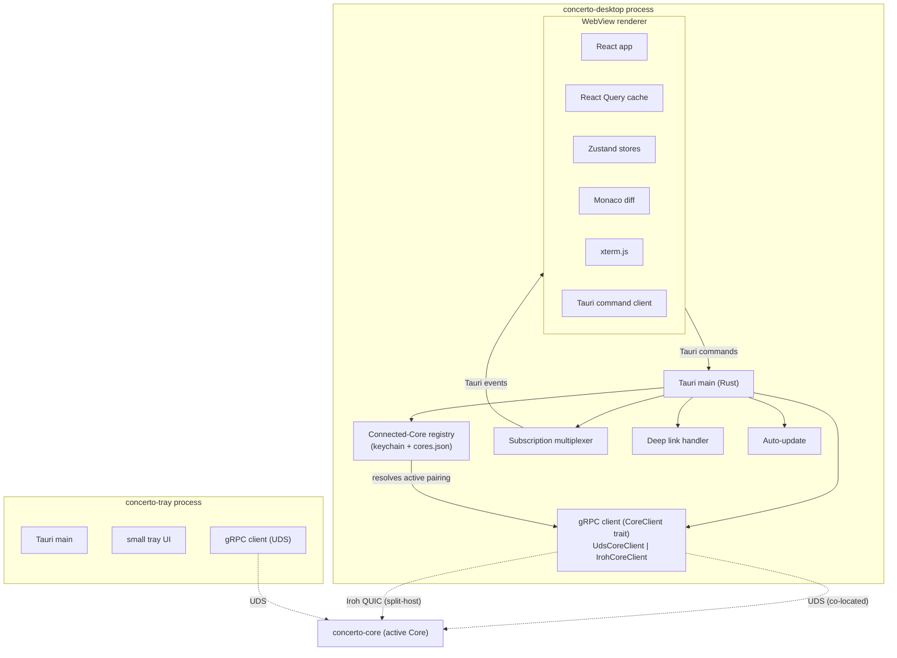
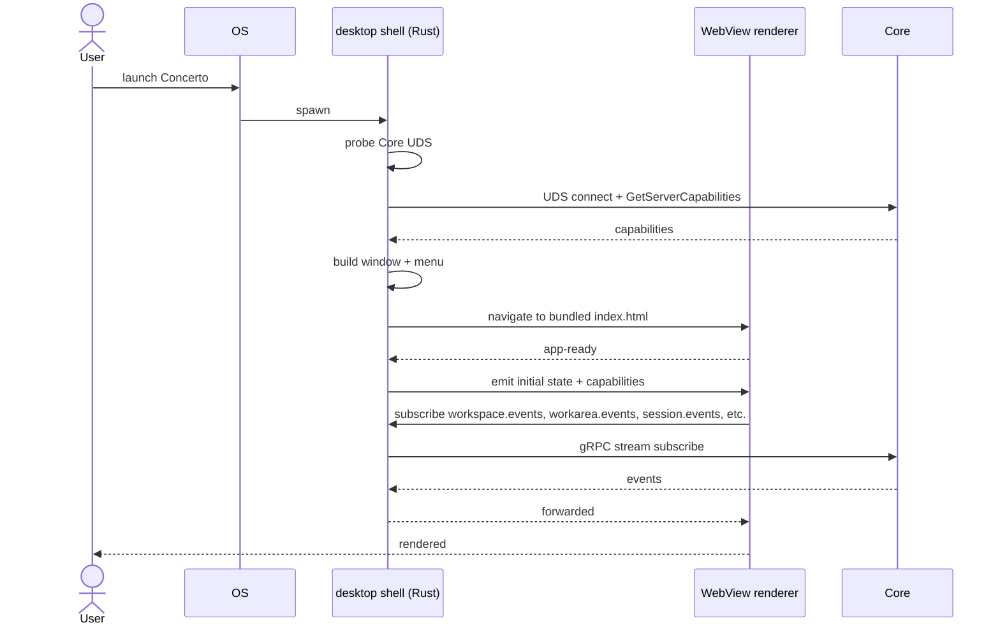
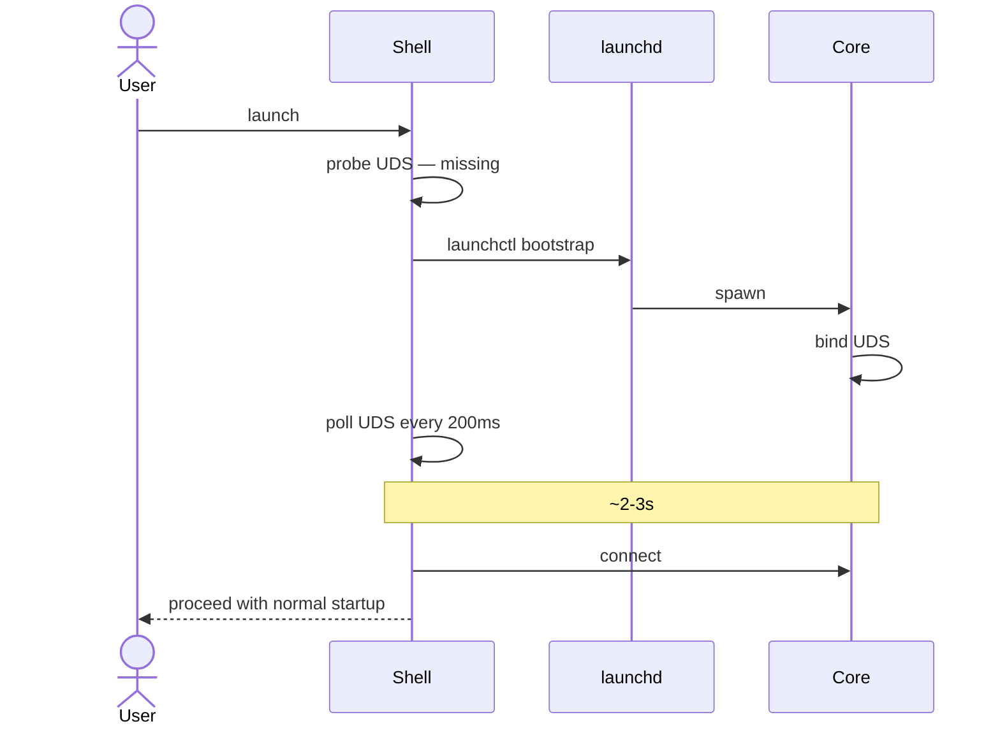
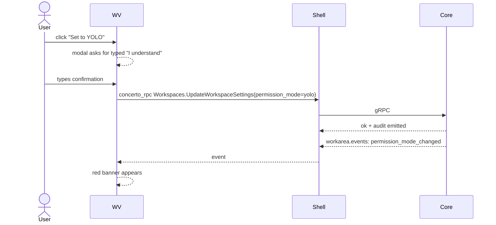

# 15 — Desktop Client

*Sub-system design doc. Inherits locked decisions from `00_Architecture_Overview.md` §6.8 (Tauri 2 + React + Vite + Zustand + shadcn/ui + Tailwind + Monaco diff + xterm.js terminal + tauri-plugin-updater).*

---

## 1. Purpose & scope

The Desktop Client is the **primary user-facing surface** of Concerto on macOS and Windows. It is a Tauri 2 application: a Rust shell process (`concerto-desktop`) hosting a system WebView that renders a React SPA. Same SPA is reused by the Web Client (17), which is also the supported client on Linux (there is no Linux desktop build — see 17 §1).

It owns:

- **Tauri shell** — Rust process, native window, system menus, native dialogs, OS integration.
- **React renderer** — Vite-built SPA, the entire visible UI.
- **Dual transport to Core** — UDS connection for co-located mode (peer-UID auth, no pairing — `12 §3.4`); Iroh QUIC connection for split-host mode (device-cert auth, QR pairing — `12 §3.3`). Same gRPC client code; transport is selected per paired Core.
- **Connected-Core registry** — local store (OS keychain + config file) listing every Core this Desktop has paired with, the wire it uses for each, and which one is currently active. UI affordance to switch.
- **Three-panel layout** — projects + workspaces + workareas tree sidebar (3 nested levels), workarea center, context-rail (PRD §8.2.1, extended for the 3-level model).
- **Monaco diff viewer** — custom decoration layer for inline comments + review threads.
- **xterm.js terminal** — agent's PTY output rendered.
- **Tray sidecar** — separate `concerto-tray` Tauri app (per `01 §3.5`) — own doc section here.
- **Auto-update** — `tauri-plugin-updater`.
- **Deep links** — `concerto://` URLs (PRD §6.14).
- **Keyboard shortcuts** — full set (PRD §6.18).
- **Native menus** — File / Edit / View / Workspace / Window / Help with platform-appropriate conventions.
- **Permission-mode UI** — mode chips, non-dismissible banners, entry-ceremony modals (per `03 §3.8`).
- **Auto-spawn Core** — if the local Core isn't running, attempt to start it via OS integration; fallback to a "Start Concerto Core" UI.
- **Window management** — main window + optional detached windows (Workflow Explorer, Diagnostics).
- **Command palette** — Cmd+K palette over every visible action, recent workareas, archived workareas, and slash commands (§3.12).
- **First-run dependency check** — detect `gh`, `claude`, `codex`, `gemini` auth on first launch; guide remediation (§3.13).
- **History pane** — sidebar drawer listing archived workspaces / workareas with one-click restore (§3.14).
- **Orchestrated one-shot actions** — Fix Errors / Pull Latest / Open PR in GitHub / Commit & Push as discrete shortcuts that wire agent + VCS + scheduler under one keystroke (§3.15).
- **Session deliberation chips** — Plan/Fast, reasoning level, personality controls in the session header (§3.16).

It does **not** own: any canonical state (the Core does); pairing flow internals (12); the workspace/workarea/session model (03); persistent storage (the Desktop is stateless — DB read-throughs only).

**Source vs. published builds** (locked in `00 §6.11`, full picture in `18 §3.1`–`§3.3`): the Desktop client source is **MIT**. The signed, notarized binaries published at `concerto.app/download` (and via the auto-updater) are operated by **Concerto Inc** using its Apple Developer ID and Windows EV code-signing cert. Self-hosters build from source and ad-hoc-sign (or use their own developer certs); the resulting binaries are functionally identical except for the signing chain and update-server endpoint. There is no "open-source edition" vs "pro edition" code fork — every Desktop feature is in the MIT codebase.

---

## 2. Phase scope

| Phase | What ships |
|---|---|
| **V0.1** | macOS only. Three-panel layout. Monaco diff. xterm.js terminal. Tray sidecar. Auto-update. Keyboard shortcuts. Deep links (including `concerto://async`, §3.8). First-run dependency check (§3.13). Suggestion chips. |
| **V1.0** | + Windows. + Concerto chat top bar / expanded view (08). + permission-mode UI. + Workflow Explorer + Skill Explorer windows. + multi-repo session UI. + Sparse-cone picker. + **first-class split-host mode**: dual transport (UDS + Iroh) selected per paired Core, first-launch Connect-to-Core picker, Settings → Connected Core for managing multiple pairings, remote-mode UI affordances (hide local-only actions, expose `Files.Upload`/`Files.Download`). + Cmd+K command palette (§3.12). + History pane for archived workspaces (§3.14). + orchestrated one-shot actions: Fix Errors, Pull Latest, Open PR, Commit & Push (§3.15). + inline-comment-to-composer workflow in diff viewer (§3.5). + session deliberation chips: Plan/Fast + reasoning + personality (§3.16). |
| **V2.0** | + plugin surface for org extensions (allowed Tauri commands registered by org-managed packages). + read-only spectate mode UI for team-shared sessions. + accessibility audit passed (VoiceOver / NVDA / Narrator). |

---

## 3. Key design decisions (sub-system-internal)

### 3.1 Tauri capabilities: deny-by-default, narrow allow-list

**Choice:** Tauri 2's capability system is used aggressively. The renderer is given **only** the commands and event subjects it needs:

```toml
# capabilities/main.json
{
  "identifier": "main-window",
  "windows": ["main"],
  "permissions": [
    "core:default",
    "dialog:default",
    "notification:default",
    "shell:allow-open",            # for opening URLs (gh, linear)
    "deep-link:default",
    "updater:default",
    { "identifier": "concerto:rpc", "allow": ["*"] }  # our custom IPC
  ]
}
```

No filesystem write capability for the renderer. No process spawn. No raw HTTP fetch. **Anything outside the renderer's job (file open dialogs, opening URLs in browser) goes through narrowly-scoped Tauri commands.**

### 3.2 IPC: Tauri commands wrap a transport-agnostic gRPC client

**Choice:** The renderer doesn't speak gRPC directly. Instead, the Rust shell hosts a thin **command proxy** wrapping a single `CoreClient` that abstracts over UDS and Iroh:

```rust
#[tauri::command]
async fn concerto_rpc(method: String, payload: serde_json::Value, state: tauri::State<'_, CoreClient>) -> Result<serde_json::Value, ApiError> {
    state.dispatch(&method, payload).await
}

#[tauri::command]
async fn concerto_subscribe(subject: String, filter: serde_json::Value, app: tauri::AppHandle) -> Result<SubscriptionId, ApiError> {
    state.start_stream(subject, filter, move |event| {
        app.emit_to("main", &format!("concerto/{}", subject), event).ok();
    }).await
}
```

The `CoreClient` is a trait with two implementations:

```rust
trait CoreClient {
    async fn dispatch(&self, method: &str, payload: Value) -> Result<Value, ApiError>;
    async fn start_stream(&self, subject: &str, filter: Value, sink: StreamSink) -> Result<SubscriptionId, ApiError>;
}

struct UdsCoreClient { /* tonic over UDS, peer-UID auth */ }
struct IrohCoreClient { /* tonic-iroh-transport, device-cert in metadata */ }
```

At launch the shell resolves the active pairing (per §3.x below) and instantiates one of the two. The renderer never sees the difference; all UI code talks to the same Tauri command surface.

The Rust shell holds the single gRPC connection to the active Core; maintains all subscriptions; multiplexes events into Tauri's event bus. The renderer subscribes to event channels.

**Why not raw gRPC in the renderer:**
- Connect-Web works in WebView, but adds a JS gRPC stack we don't need (one less dep).
- The shell's gRPC client is already shared with the rest of the Rust workspace (codegen + types).
- One auth + connection per process is cleaner.
- Centralizes transport selection (UDS vs Iroh) in one place so the renderer doesn't branch.

### 3.3 State management: server-canonical, Zustand for UI-only

**Choice:** Server (Core) is the source of truth for everything domain. Zustand stores hold only:

- Currently selected project / workspace IDs.
- Sidebar collapse state.
- Diff-viewer view mode (split / unified / by-commit).
- Composer draft text per workspace.
- UI ephemera (dropdown open, etc.).

Data fetched from Core is cached in **React Query (TanStack Query)** — keyed by RPC method + args; invalidated by event streams. Server events (`workspace.events`, `workarea.events`, `session.events.<sid>`, `diff.<wa>.<repo>`, `checks.<wa>.<repo>`, etc.) trigger React Query invalidations.

No Redux. The client is a thin renderer; complexity belongs in the Core.

### 3.4 Layout: three-panel shell with a 3-level sidebar tree

```
┌─────────────────────────────────────────────────────────────────────────────────┐
│  Concerto chat bar (collapsed by default; expand to overlay)                     │
├────────────────────┬────────────────────────────────────────────┬───────────────┤
│  Sidebar (tree)    │  Center — workarea view                     │  Right rail  │
│                    │                                             │              │
│  ▾ Project A       │  ┌─ Session tabs ──────────────────────────┐│ Schedules    │
│   ▾ Workspace 1    │  │ ● Claude  ◐ Codex  + new session       ││ Skills       │
│     ● bach  ←sel  │  ├─ Sub-tabs within selected session ─────┤│ Todos        │
│       ─ Claude     │  │ Chat   Terminal                         ││ Files        │
│       ─ Codex      │  │ (chat content)                          ││ MCP          │
│     ○ mozart        │  └─────────────────────────────────────────┘│              │
│   ▸ Workspace 2    │  ┌─ Code & PRs panel ──────────────────────┐│              │
│  ▾ Project B       │  │ Repo tabs ─ Level 1                     ││              │
│   ▾ Workspace 3    │  │ ● repo-1 (3 files)  ○ repo-2 (1 file)   ││              │
│     ● gershwin        │  ├─ Within selected repo ─ Level 2 tabs ──┤│              │
│   + new workspace  │  │ Diff   Checks   PR                      ││              │
│                    │  │ [content...]                            ││              │
│  + new project     │  │ [ Create PR ]  [ Merge PR ]             ││              │
│                    │  └─────────────────────────────────────────┘│              │
├────────────────────┴────────────────────────────────────────────┴───────────────┤
│  Status bar — connection / unread counts / current permission mode               │
└─────────────────────────────────────────────────────────────────────────────────┘
```

**Sidebar tree** (3 levels nested, each row expandable):

- **Project** (root) — name + project icon; expand to show its workspaces.
- **Workspace** (level 2) — user-chosen name (e.g., "Idempotency keys") + count of active workareas; expand to show workareas.
- **Workarea** (level 3) — composer name + branch chip + status dot (green/amber/blue/grey). Selecting a workarea activates the center panel for that workarea.
- Optional fourth-level expand shows the workarea's sessions; selecting one focuses it in the center session-tabs.

The sidebar is resizable + collapsible (icon-only mode).

**Center panel** (when a workarea is selected) splits horizontally into two stacked regions:

1. **Session region** (top, default ~55% height): session tabs (one per running session — Claude / Codex / Gemini / +new). Within the active session: sub-tabs `Chat` / `Terminal`. The Chat tab is the primary surface (composer at the bottom; agent messages above; suggestion chips above the composer). The Terminal tab is the raw PTY view via xterm.js.

2. **Code & PRs region** (bottom, default ~45% height; resizable splitter): **two-level tabs** (your Q5):
   - **Level 1 — Repo selector:** one tab per repo in the workarea (e.g., `marketplace-api · 3 files · CI green`, `marketplace-android · 1 file · CI pending`, `marketplace-ios · no changes`). Tabs carry per-repo status dots so the user knows at a glance which repos are dirty or have failing checks.
   - **Level 2 — Per-repo views:** `Diff` (changed files list + Monaco diff with the per-line comment layer), `Checks` (CI runs + deployments + review threads), `PR` (PR status; **Create PR** button if none exists; **Mark ready for review** / **Merge PR** / **Open in browser** buttons if it does; per-PR controls like base branch, labels).
   - **Workarea-wide actions** above the level-1 tabs: `Create PRs for all dirty repos`, `Merge workarea PR set` (greyed if any repo's checks are red), `Revert workarea PR set`.

The user can swap region positions (sessions on bottom, Code & PRs on top) or change to side-by-side (sessions left, Code & PRs right) via View → Layout. Default is sessions-on-top because chat is what the user looks at most.

**When a workspace is selected** (not a workarea) — the center panel shows a workspace summary view: list of workareas with status dots, PR set status across workareas, "+ new workarea" button.

**When a project is selected** — the center panel shows the project home: recent activity, list of workspaces, "Add repository", "New workspace" buttons.

**Right rail**: tab strip vertically (Scheduler / Skill Explorer / Todos / Files / MCP); collapsible. Tabs are scoped:
- Scheduler / Skill Explorer / MCP are global-ish (per project or per user).
- Todos / Files / MCP for a selected workarea are scoped to that workarea.

**Top bar**: Concerto chat collapsed by default; click to overlay (per `08 §3.6`).

Layout state (sidebar width, region heights, collapse state, default view) persists per user in `localStorage`.

### 3.5 Monaco diff viewer with custom decorations

**Choice:** `@monaco-editor/react` configured in diff mode. Lives inside the level-2 `Diff` tab of the Code & PRs panel — one Monaco instance per visible (workarea, repo). Decorations layered on top:

- Inline review threads (gutter icon + popup on click).
- "Add a comment" hover affordance per line.
- Concerto-specific highlights (recently edited by a session, AI-flagged issues).

The diff data comes from Core's `Workareas.GetWorkareaRepoDiff(workarea_id, repository_id)` RPC — a structured payload (file list + hunks + per-line annotations). Monaco renders; decorations layer is React-managed.

**Performance:** Diffs > 1000 lines load progressively (virtualized file list; only visible file's content loaded). Switching repo tabs unmounts the previous Monaco instance after a short debounce.

**Inline comment → composer attachment.** Hovering a changed line reveals a "comment" affordance. Submitting a comment does two things, controlled by a per-comment toggle:

- **Local comment** (default): persists as a `diff_comments` row (`13`), shown in the gutter, included when this diff is re-opened.
- **Send to agent**: in addition to persisting, the comment is **automatically appended to the active session's composer as an attachment** of shape:

  ```
  📎 marketplace-api/src/auth.rs:142
     > if !token.is_valid() {
     "This branch leaks the token. Mask it or move the check earlier."
  ```

  The attachment carries the file path, line range, the diff line content as a quote, and the comment body. The user sees the attachment in the composer pre-fill and can edit/extend before sending. Multiple comments accumulate as separate attachments — useful for batching a pass of review notes into one agent turn.

The "Resolve in agent" button on a GitHub review thread (`13 §3.5`) reuses the same attachment shape: thread URL + author + each comment becomes one attachment, sent to the agent with action-pref injection for `code_review` from `04 §3.13`.

If no session is active in the workarea, the attachment queues in the composer and a one-time prompt offers to start a new Claude session.

### 3.6 Terminal: xterm.js + react-xtermjs

**Choice:** `react-xtermjs` wrapper. One terminal instance per **session** (lives inside the session's "Terminal" sub-tab). Subscribes to `session.io.<sid>` for the raw bytes stream. Renders with the WebGL renderer for performance. Sends user keystrokes back via the `Sessions.SendMessage` RPC (terminal mode of the agent supervisor).

Resizing the terminal sends a `Resize` frame through Core to the `concerto-agent-host` (`04 §3.9`'s bridge protocol).

### 3.7 Tray sidecar (concerto-tray)

A separate Tauri app, ~300 LoC of Rust + a tiny UI. Shipped as a sub-binary in the same installer. Spawned by Core (per `01 §3.5`) with capability for tray-only Tauri APIs.

Tray functions (PRD §18.13):
- Online/offline indicator for Core.
- Pending approvals badge + popover.
- Active workspaces list (max 5; "open Concerto" for more).
- Scheduled tasks summary.
- "Pair new device" → opens the QR dialog via Core RPC.
- "Open Concerto" → launches the main desktop app.

The tray connects to Core over **the same transport the main Desktop uses for its active Core** — UDS in co-located mode, Iroh in split-host mode — with its own capability scope (read-only + pair + restart-agent only). On a client-only machine where no local Core exists, the tray shows the active Core's reachability status and a quick-switch menu instead of local controls.

### 3.8 Deep-link handling

**`concerto://` URLs handled in two paths:**

- **Cold-launch:** Tauri receives the URL via OS launch arg; the shell stores it pre-renderer-init; the React app reads it via `tauri-plugin-deep-link`'s API on mount.
- **Hot:** OS delivers via `tauri-plugin-deep-link`; emit a custom event to the renderer.

Supported URLs (PRD §6.14, extended for the 3-level model):
```
# Open levels
concerto://workspace/<workspace_id>
concerto://workarea/<workarea_id>
concerto://session/<session_id>

# Create from external sources
concerto://workspace/from-issue?provider=linear&id=ENG-4827
concerto://workspace/from-issue?provider=github&url=...
concerto://workarea/from-branch?repo=<id>&branch=...   (creates workspace + workarea)

# Direct deep targets
concerto://settings/<page>
concerto://diff/<workarea_id>/<repository_id>?file=...&line=...
concerto://slash/<command>?workarea=...                 (sends a slash command to the workarea's active session)

# Async plan handoff (creates workspace + workarea + attaches a plan)
concerto://async?plan=<base64-url-encoded markdown>&repo=<project_id_or_repo_url>&title=...
```

**The async-plan flow.** External tools (cloud agents, ChatGPT, code-review bots, an iOS shortcut) can produce a markdown plan and hand it off to Concerto without going through Concerto's UI. The URL carries:

| Param | Required | Meaning |
|---|---|---|
| `plan` | yes | Base64-URL-encoded markdown. Capped at 64 KB (URL practical limit). Anything larger should write to a Gist/Drive and link in the body. |
| `repo` | no | A `project_id` or git URL the workspace should be created against. If absent, Concerto opens a picker pre-populated with the first project. If the given URL doesn't match a known project, Concerto offers to add it as a new project (with the standard repo-add flow). |
| `title` | no | Workspace title. Defaults to the first H1 in the plan, or "Async plan — <timestamp>". |
| `agent` | no | `claude` (default) / `codex` / `gemini` — initial session kind. |
| `deliberation` | no | `plan` (default) / `normal` / `fast` — initial session deliberation mode (`04 §3.12`). |

**What happens on receive.**

1. Tauri deep-link handler reads the URL.
2. Renderer decodes the plan, shows a confirmation modal with the plan preview and the target project/repo. Cmd+Enter accepts.
3. On confirm: create workspace + first workarea via standard `03` flow. The plan is written to `.context/plan.md` in the workarea.
4. The initial session starts in the requested deliberation mode, with its preamble extended by `"A plan has been attached at .context/plan.md. Read it before proposing changes."`.
5. Audit log records `AsyncPlanReceived{source_hint, bytes, project_id}`.

**Safety.** The plan is treated as untrusted user input. Concerto never executes it directly; the agent reads it as context. If `managed.json.allow_async_plans = false`, the deep link is rejected with an audit entry. The confirmation modal is non-skippable in V1.0 (no "always trust this source" affordance).

### 3.9 Auto-update — `tauri-plugin-updater`

Daily check against the update manifest URL. Signed updates verified against a pinned public key. When an update is available:
- Foreground app: silent download in background; a non-blocking toast appears with "Restart to update."
- Background: download on next foreground.

Critical: the Core can keep running across desktop restarts. So a desktop update is a 2-second restart with no agent disruption.

### 3.10 Connecting to a Core: picker, auto-spawn, multi-pairing

The Desktop supports **two transports** (UDS, Iroh) and **multiple paired Cores**. Connection selection happens at launch and is user-switchable from Settings.

#### 3.10.1 Connected-Core registry

The shell persists a small registry of Cores this Desktop has paired with:

```rust
struct PairedCore {
    core_id: CoreId,                    // BLAKE2b(core_pubkey)
    display_name: String,               // user-friendly ("Home workstation", "Cloud VM")
    transport: TransportKind,           // Uds | Iroh
    uds_socket_path: Option<PathBuf>,   // Some when transport == Uds
    iroh_endpoint_id: Option<String>,   // Some when transport == Iroh
    core_pubkey: [u8; 32],
    device_cert: Option<SignedDeviceCert>, // None for Uds (peer-UID auth)
    last_connected_at: Option<u64>,
}

struct ActiveCore { core_id: CoreId }   // single field — which one is "current"
```

Storage: the registry metadata lives in `~/Library/.../concerto-desktop/cores.json` (cleartext, no secrets); device certs and device private keys live in the OS keychain keyed by `core_id`.

#### 3.10.2 Launch flow

On Desktop launch the shell runs this decision tree:

1. **If there is an `ActiveCore` recorded**, attempt to connect using its `transport`:
   - `Uds`: open the socket; if connect succeeds, done.
   - `Iroh`: open Iroh endpoint, present device cert; if handshake succeeds, done.
   - If the active Core fails to connect, show a banner with: "Reconnect to <name>" / "Switch to another Core" / "Add another Core".
2. **If there is no `ActiveCore`** but a local UDS exists at the default path (`~/.concerto/core.sock`), promote it: register an implicit `PairedCore { transport: Uds, display_name: "This machine" }`, set it active, connect.
3. **If neither**, try to auto-spawn a local Core (co-located fallback):
   - macOS: `launchctl bootstrap gui/<uid> ~/Library/LaunchAgents/com.concerto.core.plist`.
   - Windows: `sc.exe start ConcertoCore` or scheduled task fallback.
   - Retry-poll the UDS for up to 30s.

   (No Linux branch — there is no Linux desktop build. A Linux Core paired from a Mac/Windows Desktop is split-host and is started by the user on the Core machine via `systemctl --user start concerto-core.service`.)
4. **If auto-spawn fails or is declined**, show the **Connect-to-Core picker**:
   - "Start a local Core" — re-runs step 3 with extra diagnostics.
   - "Pair with a remote Core" — opens the QR / token entry flow (see §3.10.3).
   - List of any previously paired Cores → "Connect to <name>".

The principle: a brand-new install on a typical developer's laptop falls straight through steps 2–3 and never sees the picker. The picker only appears when there's ambiguity (no local Core *and* the user has previously chosen otherwise, or this is a client-only machine).

#### 3.10.3 Pairing flow (split-host)

When the user picks "Pair with a remote Core":

1. Renderer asks the user how they want to provide the pairing payload:
   - **Scan QR** (webcam-capable machines) — opens a camera view.
   - **Paste token** — accepts the base64 string a headless `concerto pair` command prints.
2. On the Core machine the user runs `concerto pair` (or tray → "Pair new device"). The Core generates a 32-byte pairing_token (60s TTL) and emits a payload containing `core_pubkey`, `pairing_token`, `iroh_endpoint_id`, `relay_hint`.
3. The Desktop shell decodes the payload, generates a fresh Ed25519 keypair for this Desktop, opens a Noise XX pairing channel through Iroh, and sends a `PairingRequest` per `12 §3.3`.
4. The Core verifies, issues a `SignedDeviceCert`, returns it.
5. The shell writes a new `PairedCore` row, stores the device key + cert in the keychain, sets the Core active, and opens the API channel.

The user names the pairing on first connect (default suggestion: hostname of the Core machine).

#### 3.10.4 Switching active Core

`Settings → Connected Cores` lists all `PairedCore` entries with status dots (reachable / unreachable / never connected). The user can:
- **Switch active** — disconnects current, connects target. The renderer reloads to clear cached state from the previous Core.
- **Remove pairing** — deletes the local row and notifies the Core to revoke the cert (best-effort; the Core's revocation list is authoritative).
- **Rename pairing**.
- **Add another** — re-enters the pairing flow.

The status bar shows the active Core's display name; clicking opens a quick-switch menu (Cmd-K-style) for power users.

### 3.11 Remote-Core mode: UI implications

When the active Core is reached via Iroh (split-host), the Desktop's local filesystem is *not* where the worktrees, agent processes, or SQLite live. The renderer adapts:

| Affordance | Co-located behavior | Split-host behavior |
|---|---|---|
| "Open file in IDE" / "Reveal in Finder" | Opens local path via Tauri shell command | Hidden in V1.0 (no path on this machine to open). Deferred to V2.0 via remote IDE bridge. |
| Drag-and-drop file upload into composer | Tauri reads local path, attaches inline | Tauri reads local path, streams via `Files.Upload` RPC to Core, which stores under workarea's `.context/` and surfaces the resulting handle |
| Download an artifact from a session | Direct filesystem | `Files.Download` RPC streams bytes; Tauri prompts for save location |
| Localhost preview tunnel (PRD §6) | Direct `localhost:<port>` | Same tunnel mechanism the Mobile client uses (`16` §3.x); Core forwards over Iroh, Desktop shell binds a local port |
| Deep links (`concerto://...`) | Resolved against local Core | Resolved against the active Core (which might be remote); the URL is otherwise identical |
| `Reveal pairing QR` action | Opens the local Core's QR dialog | Disabled — to pair another device, the user uses the Core machine's tray or `concerto pair` |

The renderer reads `ServerCapabilities.transport_kind` on connect (added to 10's capability descriptor) and conditionally renders these affordances. Same React tree, conditional branches at the leaf.

### 3.12 Command palette (Cmd+K)

A single fuzzy-match palette over the entire app surface. Opened with **Cmd+K** (`Ctrl+K` on Windows). Closed with Esc.

**What's in it:**

| Category | Examples |
|---|---|
| **Recent workareas** | Last 20 selected workareas, ranked by recency × frequency. Default-focus on Enter when the palette opens with no query. |
| **All workareas** | Active + archived (archived shown with a faded chip and an `archived` filter; Tab toggles "only active"). |
| **Slash commands** | Every entry from `06 Skills Registry` (`/review`, `/ship`, etc.). Executing routes to the active session via `concerto://slash/...` internally. |
| **Actions** | Every registered action — those that drive a UI surface (Open Settings, Open Diff Viewer, Toggle Permission Mode) and every orchestrated one-shot from §3.15. |
| **Files in the current workarea** | `path/to/file.rs` — opens the file in the diff viewer when the diff contains it; otherwise opens the file in the agent's "show me" mode. |
| **Skills** | Search and one-tap install/enable from the marketplace (delegates to `06`). |
| **Settings** | Deep-links into Settings → <page> (covered by the existing `concerto://settings/<page>` route). |

**Implementation.**

```ts
interface PaletteItem {
  id: string;
  category: 'workarea' | 'slash' | 'action' | 'file' | 'skill' | 'setting';
  label: string;
  hint?: string;          // right-aligned: keyboard shortcut, last-used time, etc.
  keywords: string[];     // searchable tokens
  invoke: () => Promise<void>;
}
```

The palette is a React-Aria `<ComboBox>` over a `useFuzzyList` hook (`fuse.js`, indexed in a Web Worker). The action registry is exposed by a Zustand store; every UI component that mounts a button can register an item via `useRegisterPaletteAction({ ... })`. Unmounting auto-deregisters.

**Performance.** Index updates are debounced (200ms). Search returns top 50 results. Cold-open target: < 80ms p50, < 200ms p99 even with 10K palette items.

**Privacy.** Recent-workarea ranking lives in `localStorage`. No telemetry on what the user searches for.

### 3.13 First-run dependency check

**The problem.** Concerto requires `gh` (GitHub CLI authenticated), at least one agent CLI (`claude` / `codex` / `gemini`) authenticated, and optionally `git` ≥ 2.34. Without a guided check, first workspace creation fails opaquely.

**The flow.** On first launch (or any launch where `~/.concerto/setup_complete` is missing), the Desktop shows a **Setup screen** with a checklist:

| Check | How | Remediation chip |
|---|---|---|
| `git` ≥ 2.34 | `git --version` parse | "Install Git" → opens platform-appropriate download page |
| `gh` installed | `which gh` | "Install GitHub CLI" → opens https://cli.github.com |
| `gh auth status` | `gh auth status --hostname github.com` | "Sign in to GitHub" → runs `gh auth login` in an embedded `xterm.js` panel |
| `claude` available | `which claude` | "Install Claude Code" → opens https://docs.claude.com/docs/claude-code/quickstart |
| `claude` auth | `claude --print-token-status` (or version-appropriate check) | "Sign in to Claude" → runs `claude /login` in an embedded panel |
| `codex` available | `which codex` | "Install Codex" → opens download page |
| `codex login` ok | `codex auth status` | "Sign in to Codex" → runs `codex login` in an embedded panel |
| `gemini` available | `which gemini` | "Install Gemini CLI" |
| `gemini auth status` | per its CLI | "Sign in to Gemini" |
| Concerto Core daemon | UDS probe | "Start Concerto Core" → §3.10 auto-spawn |

The flow tolerates **partial setup**: GitHub + any one agent is sufficient to proceed. Other agents stay listed as "available later — install when you need them." A "Skip for now" button lets the user proceed even with no agent (workspaces can be created; sessions can't start until an agent is installed).

When everything passes, the screen writes `~/.concerto/setup_complete` (a stamp file containing the detected versions). Subsequent launches skip the screen entirely. Settings → System → Run Setup Check re-runs the flow.

**Re-detection on demand.** If a user installs `gemini` later, Concerto detects it lazily on next session-kind-picker open (probing PATH only when the dropdown renders) — no daemon-side polling.

**Live remediation panels.** "Sign in to Claude" etc. don't deep-link out; they open a small embedded `xterm.js` panel running the CLI's login flow as a child of the desktop process. On exit, the check re-runs automatically and the row turns green. Avoids the platform-tab-shuffle that an "open Terminal yourself" flow forces.

**Telemetry.** No outbound telemetry from this flow; the entire check runs locally.

### 3.14 History pane — archived workspaces & workareas

**The problem.** Active workspaces dominate the sidebar; archived ones must remain discoverable for restore but must not clutter the day-to-day.

**The shape.** A drawer that slides from the bottom of the sidebar when "History" is clicked (or via Cmd+Shift+H). When open, it covers the lower half of the sidebar; the upper half (active workspaces) stays visible.

```
Sidebar
├── Projects (active)
│   ├── Project A
│   │   ├── Workspace 1
│   │   └── + new workspace
│   └── + new project
│
└── ▼ History (47 archived)            ← click to expand drawer
    ├── filter: [ project ▾ ] [ workarea/workspace ▾ ] [ last 30d ▾ ]
    ├── search: [ ___________ ]
    ├── 2026-05-14  Project A / Login refactor / bach    [ Restore ] [ Open snapshot ▸ ]
    ├── 2026-05-12  Project A / Idempotency / mozart       [ Restore ] [ Open snapshot ▸ ]
    ├── 2026-05-09  Project B / Audit log fix / gershwin     [ Restore ] [ Open snapshot ▸ ]
    └── ... pagination at 50 ...
```

**What "Open snapshot" shows.** A read-only view of the workarea at the moment of archive: chat history, final diff, todos, PR set state, audit-log slice. The diff renders against the recorded `worktree_root` if it still exists on disk; otherwise against the last committed state of the branch. Snapshot view is non-interactive — to act on the data, the user clicks Restore first.

**What "Restore" does.** Calls `Workareas.RestoreWorkarea` (`10 §5.5`). Per `03 §3.7` resolved decision R-4, `.context/` is preserved across archive, so chat history, todos, and scratch all come back. The branch is re-checked out (sparse cones reapplied) if the worktree was physically removed during archive. Per `04 §3.10` resolved-decision (mode reset), the workarea's `permission_mode` resets to the workspace default; the user sees a one-time toast.

**Data source.** Reads `workareas WHERE archived_at IS NOT NULL` and the analogous workspaces query, joined to `chat_messages` for the "what was the last thing said" preview. Pagination over `archived_at DESC`. Restore-eligible only — hard-deleted rows (V1.5 explicit delete) don't appear.

**Trash semantics.** None in V1.0. Archive is reversible forever (soft-delete in `09 §schema R-5`). Hard delete is a separate V1.5 action with its own confirmation.

### 3.15 Orchestrated one-shot actions

Concerto exposes "Fix errors" (Cmd+Shift+X), "Pull latest from main" (Cmd+Shift+L), and "Open PR in GitHub" (Cmd+Shift+G) as discrete single-keystroke flows. Each is an **orchestration** — agent + VCS + scheduler under one button — not a raw command. The actions are first-class entries in the command palette (§3.12) and the action registry, so adding a new orchestrated action means one registration and the keyboard layer, palette, and help dialog all pick it up.

| Action | Shortcut | What it orchestrates |
|---|---|---|
| **Fix errors** | Cmd+Shift+X | Start an agent session (if none) with `04 §3.13` action-pref `error_fix` injected. Send a structured "fix the failing checks" prompt enumerating each failed CI run, lint, type-check, and test from the current diff (`13` Checks). Pause-loop with `05` Scheduler: re-poll checks every 30s until green or two consecutive failures, then return control to the user with a summary. Uses the deliberation mode currently active on the workarea (default `normal`). |
| **Pull latest from main** | Cmd+Shift+L | Per-repo in the workarea, fetch the default branch, attempt fast-forward; if not fast-forwardable, invoke the agent with `04 §3.13` action-pref `conflict_resolve` to resolve. Re-runs the workarea's run-script (if `runScriptMode=concurrent`, otherwise per-repo serially). |
| **Open PR in GitHub** | Cmd+Shift+G | If a PR exists on the active repo of the active workarea, opens its URL via `open_in_external`. If no PR, opens the workarea's first repo with an open PR; otherwise opens the GitHub repo page with a toast "no PR yet — Cmd+Shift+P to create one." |
| **Commit and push** | Cmd+Shift+Y | Composes a commit message via the active agent with `04 §3.13` action-pref `commit_message`; shows a 1-click confirmation modal with the diff; on confirm, commits and pushes. |
| **Create PR** | Cmd+Shift+P | Agent drafts PR title + body with action-pref `pr_create` injected; user confirms; `13` creates the PR; checks subscription opens automatically. |
| **Review** | Cmd+Shift+R | One-shot agent review with action-pref `code_review` injected over the current diff. Returns review comments inline in the diff viewer (local until the user opts to "Send to GitHub"). |
| **Merge PR** | Cmd+Shift+M | If the workarea has a multi-PR set, runs the coordinated merge flow from `03 §3.9`. Otherwise merges the single PR per its required-checks state; refuses with a clear message if blockers exist. |
| **Archive workarea** | Cmd+Shift+A | Per `03 §3.7`. Confirmation suppressible per workarea after first use. |

**Shortcut table (V1.0):**

| Shortcut | Action |
|---|---|
| Cmd+K | Command palette |
| Cmd+N | New workspace |
| Cmd+Shift+N | New workspace from PR / branch / issue |
| Cmd+Shift+F | Go to all workspaces |
| Cmd+Shift+A | Archive current workarea |
| Cmd+Shift+H | Toggle History pane |
| Cmd+Shift+D | Open Diff Viewer |
| Cmd+Shift+R | Review (one-shot agent review of current diff) |
| Cmd+Shift+P | Create PR |
| Cmd+Shift+Y | Commit and push |
| Cmd+Shift+L | Pull latest from main *(rebound from Workflow Explorer — see §3.17)* |
| Cmd+Shift+M | Merge PR (or PR set) |
| Cmd+Shift+X | Fix errors |
| Cmd+Shift+G | Open PR in GitHub |
| Cmd+Shift+W | Workflow Explorer window |
| Cmd+Shift+I | Diagnostics window |
| Cmd+Shift+T | Toggle Big Terminal Mode *(deferred — V1.5)* |
| Option+C | Changes panel |
| Option+U | Uncommitted changes panel |
| Option+F | All files panel |
| Option+N | Notes panel |
| Shift+Option+C | Checks panel |
| Cmd+, | Settings |
| Cmd+/ | Shortcuts help (lists this table) |

Cmd+Shift+L was previously bound to Workflow Explorer; that window moves to Cmd+Shift+W so L is freed up for "Pull latest" — the more frequently invoked action wins the lower-friction shortcut.

**Action registry.** Each entry is a `PaletteAction` registered at startup. Shortcuts wire to the same handler. New actions require one registration point; the keyboard layer, command palette, and shortcuts-help dialog pick them up automatically.

**Audit.** Every orchestrated action emits a single audit entry naming the action + the workarea + the device. Useful when "how did this PR get merged" investigations begin.

### 3.16 Session deliberation chips

The session header (above the chat composer) renders three side-by-side chips reflecting `04 §3.12`:

```
┌─────────────────────────────────────────────────────────────────────┐
│ Claude — claude-4.7-sonnet                                           │
│  [ Plan | Normal | Fast ]  [ Reasoning: ▁▃█▅ medium ]  [ default ▾ ] │
│                                                       (personality)   │
└─────────────────────────────────────────────────────────────────────┘
```

- **Deliberation segment** — a three-segment toggle (`Plan` / `Normal` / `Fast`). Click to switch. Plan / Normal / Fast colors: blue / neutral / amber.
- **Reasoning slider** — discrete tick marks `minimal | low | medium | high`. Levels the active model doesn't expose are greyed out with a tooltip. A small `?` reveals a one-line cost/latency hint per tick.
- **Personality dropdown** — Codex-only; renders disabled with tooltip on other agents. Lists built-ins + the user's custom personalities (`~/.concerto/personalities/*.md`).

State writes flow through `Sessions.UpdateDeliberationControls` (added to `10` in §5 cross-reference) and persist per `04 §3.12`. Mid-session changes apply on the next turn; the chip shows a small "pending" dot until the next turn confirms the change took effect.

Managed-settings caps (`max_reasoning_level`, `allowed_personalities`) render unavailable values with a lock icon and the standard policy-source tooltip.

### 3.17 Multi-window support

A single main window plus optional **detached windows**:
- Workflow Explorer (Cmd+Shift+W — rebound from Cmd+Shift+L per §3.15)
- Diagnostics (Cmd+Shift+I)
- Settings (Cmd+,) — initially in-window, can be torn off

Each detached window is a separate Tauri window with its own renderer; they share the shell's gRPC connection and subscription multiplexer.

---

## 4. Data model

**The Desktop holds essentially no persistent state.**

| Storage | What |
|---|---|
| `localStorage` | Layout state (sidebar width, region heights, region orientation, collapse), recently-used filters, last-seen workarea per workspace, expanded tree branches |
| `sessionStorage` | Per-tab transient (current diff scroll, etc.) |
| **No IndexedDB** for V1.0 | Avoid bridging IndexedDB to React Query — server is fast enough |

Composer drafts (per-session) live in Zustand and persist in localStorage to survive accidental closes.

---

## 5. Interfaces

### 5.1 Renderer ↔ Shell (Tauri commands)

```rust
// Implemented in concerto-desktop/src/commands.rs
#[tauri::command] async fn concerto_rpc(method, payload) -> Value;
#[tauri::command] async fn concerto_subscribe(subject, filter) -> SubscriptionId;
#[tauri::command] async fn concerto_unsubscribe(id);
#[tauri::command] async fn open_in_external(url);
#[tauri::command] async fn show_open_file_dialog(opts) -> Vec<PathBuf>;
#[tauri::command] async fn launch_ide(ide: IdeKind, path: PathBuf);
#[tauri::command] async fn copy_to_clipboard(text);
#[tauri::command] async fn deep_link_initial() -> Option<String>;
#[tauri::command] async fn check_for_update() -> UpdateStatus;
#[tauri::command] async fn install_pending_update();
```

Events emitted to renderer (via Tauri's event bus):
- `concerto/workspace.events`, `concerto/workarea.events`, `concerto/session.events.<sid>`, `concerto/session.io.<sid>`, `concerto/diff.<wa>.<repo>`, `concerto/checks.<wa>.<repo>`, etc. (one channel per stream subject)
- `concerto/deep-link/<url>`
- `concerto/update/available`
- `concerto/connection/state`

### 5.2 Shell ↔ Core

Single gRPC connection to the **active Core** using `tonic-rs` + the generated client from `10`. The shell maintains the streaming subscriptions and forwards events to the renderer. Two transport variants behind the same client trait (§3.2):

- **Co-located**: `tonic` over UDS; the kernel attests to peer-UID; no cert metadata.
- **Split-host**: `tonic-iroh-transport` over a long-lived Iroh QUIC connection to the Core's endpoint; every RPC carries the stored `SignedDeviceCert` in metadata; falls back to relayed QUIC if hole-punching fails.

The shell auto-reconnects on transport failure (exponential backoff, surfaced as a status-bar indicator). Switching the active Core (via Settings → Connected Cores) tears down the current client and starts a new one from scratch; in-flight subscriptions are dropped and the renderer re-bootstraps.

### 5.3 No new gRPC surface

The Desktop is a pure client of `10`'s services. It doesn't expose any of its own RPCs. The new `Files.Upload` / `Files.Download` RPCs in `10` are *consumed* by the Desktop in split-host mode (for drag-and-drop upload and artifact download); they are added to `10`, not here.

---

## 6. Internal architecture



### 6.1 Shell startup sequence

1. Parse argv (deep link?).
2. Probe Core; auto-spawn if needed (§3.10).
3. Connect over UDS; perform `GetServerCapabilities` (10 §4.2).
4. Read managed.json overlay to pre-populate "what's locked."
5. Initialize Tauri window + menu.
6. Start renderer; wait for `app-ready` event.
7. Hand the initial deep link (if any) + capability set to renderer.

### 6.2 Subscription multiplexer

The shell holds a single set of streaming RPCs to Core. The renderer requests subscriptions (per subject + filter). The shell:

- Reuses an existing stream if a subscription for the same (subject, filter) already exists.
- Counts subscribers; on subscriber count = 0, ends the stream.
- Tracks the last offset per stream; on reconnect, resubscribes with `since_offset` (per `10 §3.3`).

This means multiple components subscribing to the same data share one network stream.

### 6.3 React Query event-driven invalidation

```ts
// Pseudocode
subscribe('workarea.events', null, (e) => {
  if (e.body.case === 'workarea') {
    queryClient.invalidateQueries(['workarea', e.body.workarea.id]);
    queryClient.invalidateQueries(['workspace', e.body.workarea.workspace_id]);
  }
});
subscribe('session.events', { session_id: activeSessionId }, (e) => {
  queryClient.invalidateQueries(['session', activeSessionId]);
});
```

Every event maps to a query key. The data layer stays consistent without manual refresh.

### 6.4 Permission-mode UI in renderer

Per `03 §3.8`:
- Mode chip in workarea header — reads from `workareas.permission_mode` (effective after inheritance).
- Non-dismissible banner for `auto` and `yolo`.
- Entry-ceremony modal: typed `"I understand"` for yolo; `"I understand the risks"` for bypass.
- The "Return to normal" button on the banner calls `Workspaces.UpdateWorkspaceSettings` with `permission_mode = "normal"`.

### 6.5 Cold-start budget

Target: **< 2s** from process spawn to interactive UI (PRD §22.3).

Breakdown:
- Tauri shell init: ~300 ms
- WebView2 / WebKit init: 200–500 ms
- React mount: ~200 ms
- First gRPC RPC (GetServerCapabilities + ListWorkspaces): 50–100 ms
- First paint: < 1.5s p50

If Core isn't running: budget extends to ~5s for spawn + connect.

---

## 7. Sequence diagrams — hot paths

### 7.1 Desktop start with Core running



### 7.2 Desktop start without Core (auto-spawn)



### 7.3 Tool approval flow on Desktop

```mermaid
sequenceDiagram
    participant Core
    participant Shell
    participant WV
    actor User
    participant Sup as 04
    Core-->>Shell: session.events: awaiting_approval
    Shell-->>WV: event
    WV-->>WV: render approval card with chips
    User->>WV: click "Approve"
    WV->>Shell: command concerto_rpc Agents.ResolveApproval(approve)
    Shell->>Core: gRPC call
    Core->>Sup: resolve
    Core-->>Shell: success
    Shell-->>WV: ok; emit approval.resolved
    WV-->>WV: dismiss card
```

### 7.4 Permission-mode change with typed confirmation



---

## 8. Error handling & failure modes

| Failure | Detection | Response |
|---|---|---|
| Core not running, auto-spawn fails | Probe timeout | Show "Start Concerto Core" troubleshooting screen with logs + a retry button |
| Core crashes while Desktop is open | Connection error on stream | Show reconnect banner; auto-reconnect on Core return; resubscribe with offset |
| WebView crash (rare) | Tauri reports | Reload the renderer; preserve subscription state in shell |
| Renderer JS error | Sentry-style local error capture (no remote) | Surface a red ribbon with "Reload" |
| Update manifest tampered | Tauri-plugin-updater signature fail | Refuse update; surface |
| Deep link with invalid params | Renderer validation | Show error; remain on current view |
| IDE launch fails | shell command non-zero | Toast error; offer to copy command |
| Diff too large (> 50,000 lines) | Size check | Render summary + "view in IDE" CTA |
| Terminal output rate > render rate | xterm.js backpressure | Drop oldest from local buffer; warn at threshold |
| Tray sidecar crash | Shell supervises (via Core) | Restart with rate limit |
| Disk full preventing localStorage writes | Catch error | Continue; UI ephemera lost on next launch only |

---

## 9. Dependencies on other sub-systems

| Sub-system | How |
|---|---|
| **10 Local API** | Whole gRPC surface |
| **11 Transport** | UDS locally; rarely Iroh for remote-Core |
| **All others** | Indirectly via the gRPC API |

---

## 10. Testing strategy

| Layer | What | How |
|---|---|---|
| Unit | React components | Vitest + Testing Library |
| Unit | Zustand stores | Vitest |
| Unit | Shell command handlers | `cargo test` |
| Integration | Auto-spawn Core path | Per-platform CI |
| Integration | Tauri command round-trip | Tauri's test runner |
| E2E | Playwright against the WebView | Playwright + concerto-core stub |
| Visual | Storybook + Chromatic for regression | Per-component |
| Performance | Cold-start budget | Per-PR perf bench |
| Accessibility | axe-core scan | CI gate |
| Cross-platform | Layout / fonts on WebKit (mac), WebView2 (win) | Per-platform CI screenshots |

---

## 11. Open questions / deferred

*All items resolved. See **§12 Resolved decisions log** below.*

## 12. Resolved decisions log

| # | Question | Decision | Where in doc |
|---|---|---|---|
| R-1 | Single cross-OS bundle vs per-OS | **Per-OS** (Tauri auto-builds). Smaller bundles. | §3.9 |
| R-2 | Linux desktop build | **Not shipped.** Linux users use the Web Client (17); Linux is still supported as a Core host. | §1, §2 |
| R-3 | Disconnected/cached state | **V1.0 explicit "reconnecting" state**; V1.5 TanStack persistent cache for partial offline. | §3.10 |
| R-4 | Plugin surface for org extensions | **V2.0 — needs design.** Deferred. | (V2.0) |
| R-5 | Differential auto-updates | **No** — `tauri-plugin-updater` doesn't support diff; full-binary update is small enough. | §3.9 |
| R-7 | Detached window state persistence | **Yes — per window in localStorage.** | §3.11 |
| R-8 | Sentry / OpenTelemetry for renderer | **Off by default; opt-in via Settings → Telemetry.** Crashes only, no user content (honors local-first principle). | §8 |

---

*End of `15_Desktop_Client.md`. Same React tree is reused by `17_Web_Client.md` with a different transport layer. Tray sidecar is a sibling Tauri app per `01_Core_Daemon_Runtime.md` §3.5.*
