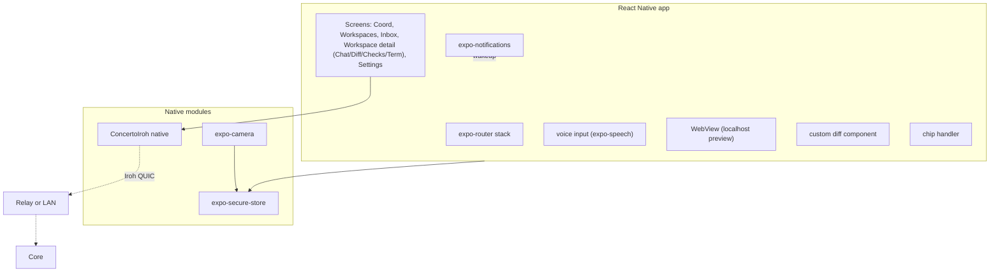
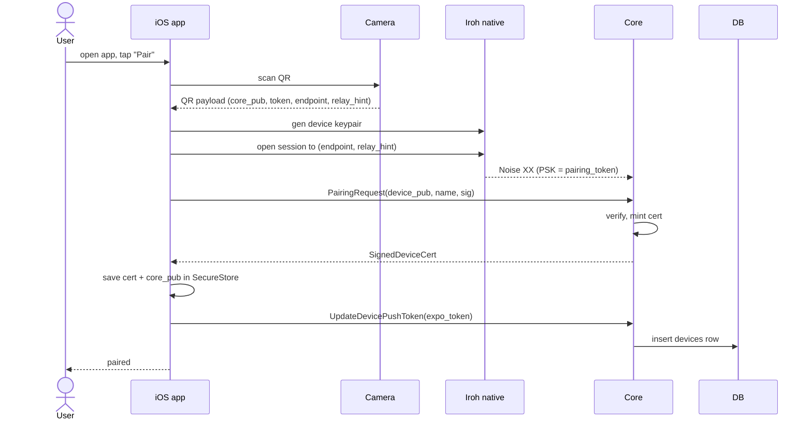
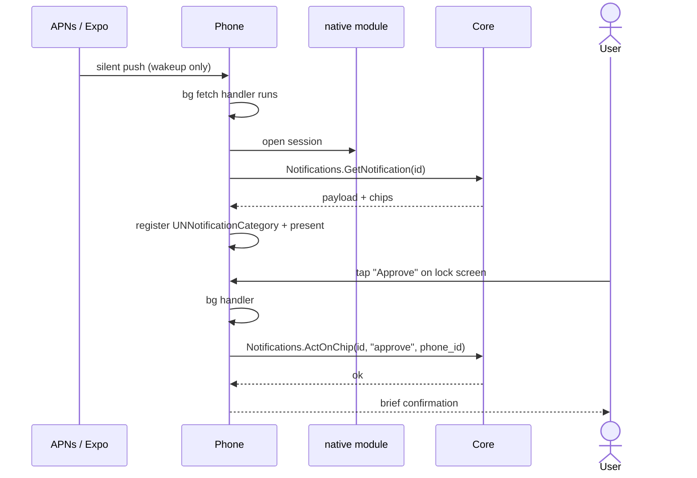
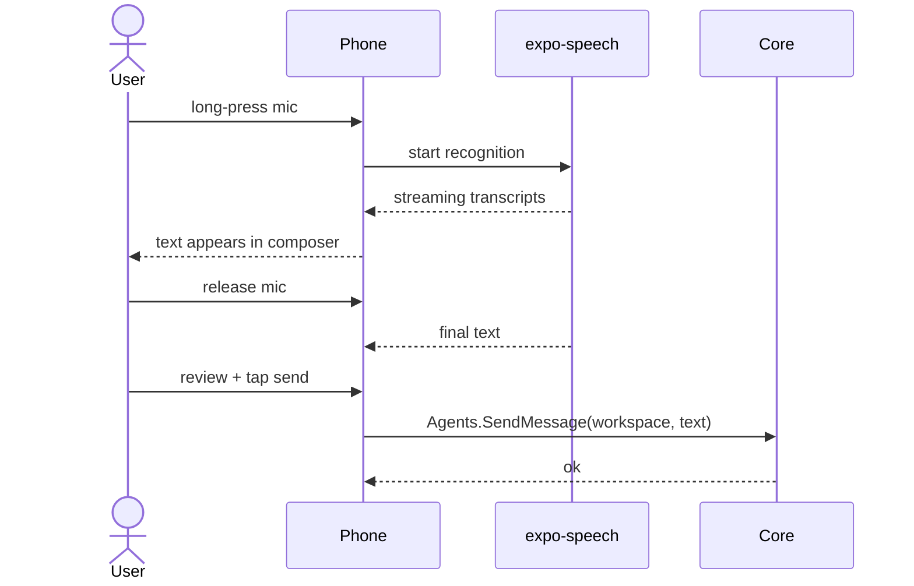
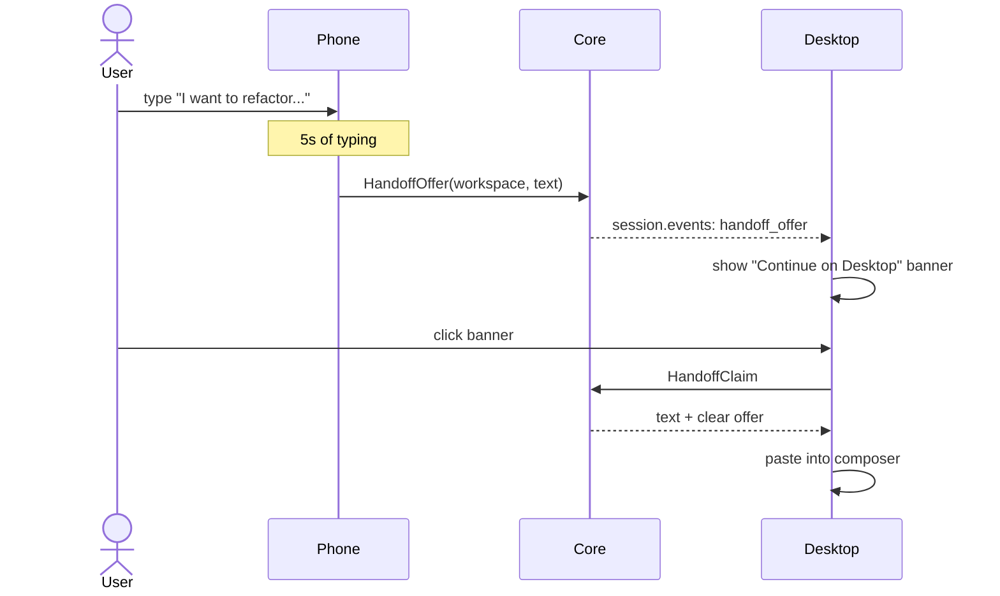

# 16 — Mobile Clients

*Sub-system design doc. Inherits locked decisions from `00_Architecture_Overview.md` §6.9 (React Native + Expo for V1.0, Expo Push wrapping APNs/FCM, on-device voice, custom RN diff renderer, EAS Build). V1.5 native (SwiftUI + Compose + KMP) is an explicit escape hatch.*

> **Amendment (2026-06-14 — Phase-5 planning reconciliation).** Reconciles this doc with built reality + the Phase-5 plan (`tasks/v1.0/PHASE5_PLANNING.md §1`). These bullets govern where they conflict with the prose.
> - **Native module is iroh-ffi-first (D12):** Task 509 evaluates `iroh-ffi` (iroh's official uniffi Swift/Kotlin bindings) as the base and hand-rolls Rust→C→JSI / Rust→JNI only if it cannot carry our `connect_channel` gRPC-over-Iroh + Noise-IK + `0x03` pairing. The generic `rpcUnary/rpcStream(method, bytes)` surface (§3.2) is a tonic `Grpc<Channel>` passthrough codec, not per-service stubs. Packaging (XCFramework/.aar + Expo plugin + cross-compile lane) is split into Task 509.5; on-device load/run is Tier-3.
> - **User-facing chat tab is "Concerto" (D14):** the bottom tab the prose sometimes calls "Maestro" is labelled **Concerto** (Maestro is the internal service name; Desktop already renamed it). §3.4 tab order: Concerto / Workspaces / Inbox.
> - **No project tier (D14):** the Project→Workspace collapse (2026-06-08) is done in code — there is no `Project` entity. §1/§3.6's "workspaces grouped by project" is obsolete; the drill-down is Workspace → Workarea (Task 513).
> - **Shared code boundary (D11):** mobile (RN) consumes only `@concerto/client` (proto-client + `DataClient` + the native-module transport); it does **not** reuse the Desktop React-DOM renderer (that is `@concerto/ui`, web-only). The §3.7 RN diff renderer is a from-scratch rewrite (no Monaco).
> - **RN diff perf verdict PENDING:** the spike-103 budget (1000-line diff <1.5 s, 60 fps on iPhone13+/Pixel6+) has no recorded on-device number yet (`design/spikes/rn-diff-findings.md`); Task 514 ships the RN renderer behind the documented V1.5 native-diff fallback and the GO/NO-GO is a Tier-3 checklist line, not a phase-entry blocker.

---

## 1. Purpose & scope

The Mobile Clients are **iOS and Android apps that share ~80% of code** as a single React Native + Expo project, with native escape hatches for the few places mobile platforms diverge in important ways (Iroh transport, push registration, biometrics).

They own:

- **App shell** — bottom-tab navigation (Maestro / Workspaces / Inbox), settings stack, modals.
- **Maestro chat as default landing** (PRD §14.10 + §15.1).
- **Workspaces tab** — drill-down navigation: list of workspaces grouped by project → tap to expand workareas → tap a workarea to enter detail.
- **Workarea detail** — the primary work surface on mobile. Two main tab groups (see §3.6):
  - **Sessions:** one tab per session (Claude / Codex / Gemini). Within a session: Chat / Terminal.
  - **Code & PRs:** two-level tabs (per repo, then per view) — Diff / Checks / PR-actions per repo.
- **Touch-first diff viewer** — custom React Native component parsing unified diff hunks (PRD §15.1.3).
- **Voice input** — hold-to-talk on the composer, transcription via OS speech recognition (PRD §15.1.4).
- **Localhost preview WebView** — workspace's dev server through the secure tunnel (PRD §15.1.5).
- **Push registration** — Expo Push tokens registered with Core (`14`).
- **Post-wakeup payload fetch** — pull the notification body over E2EE Iroh.
- **Lock-screen action chip handling** — surfaces from suggestion chips in 14 / 07.
- **Pairing scanner** — QR code from the Core's tray.
- **Iroh native module** — Rust → C → JSI (iOS) / Rust → JNI (Android).
- **Lite-mode streaming** — opt-in compression / collapsed tool-calls on cellular.
- **Cross-device handoff** — Continue-on-desktop banner via Apple Handoff-like signaling.

It does **not** own: code editing (out of scope per PRD §8.3.3); long-form prompt authoring (delegated to desktop via handoff); native push registration (Expo handles it).

**Source vs. published builds** (locked in `00 §6.11`, full picture in `18 §3.1`–`§3.2`): the mobile client source is **MIT**. The published apps on the **App Store** and **Google Play Store** are operated by **Concerto Inc**'s developer accounts under the trademarked "Concerto" name. Self-hosters and contributors can build from source and:

- iOS: distribute via **TestFlight** (Concerto Inc-managed, 10k-tester limit per build) for community previews, or under their own Apple Developer Program account if they want a separate listing. The Concerto Inc-published builds always require an active **Concerto Pro** subscription (the gate is at the App Store level, not in the source — sideloading or self-publishing bypasses it entirely per the locked posture).
- Android: sideload the APK from GitHub Releases, or publish under their own Play Console listing. Same gating rule: the Play Store-published build is the only one tied to Concerto Pro; self-built APKs are unrestricted.

The Concerto Inc Expo project (`14 §3.6`) is also Concerto-Inc-operated for the published builds; self-builds bring their own Expo / APNs / FCM credentials via `managed.json.push_backend_config`.

**Relation to split-host Desktop (`15`):** Mobile and a split-host Desktop are siblings under `11` — both reach a remote Core via Iroh, both pair via QR (`12 §3.3`), both consume the same `10` schema. The differences are surface-level (form factor, touch input, push) rather than transport. Implementation choices made here (Iroh native module, pairing UX, post-wakeup fetch) and in `15` (transport abstraction, multi-Core registry) should stay aligned where they can; transport-level work in `11` benefits both.

---

## 2. Phase scope

| Phase | What ships |
|---|---|
| **V0.1** | (no mobile) |
| **V1.0** | iOS (15+) + Android (11+) via Expo SDK. All surfaces above. Voice = dictation only. Localhost preview WebView. Iroh native module. EAS Build pipeline. App Store + Play Store submission via EAS Submit. |
| **V1.5** | + Apple Watch glance app (companion target on the iOS bundle). + native escape-hatch path: if RN perf regresses on diff viewing, replace just the diff viewer with SwiftUI / Compose embedded views. + direct APNs/FCM (bypass Expo) for enterprise. |
| **V2.0** | + Voice conversation mode (full-duplex TTS via OS audio APIs). + native SwiftUI + Compose rewrites layered on shared KMP business logic — only if V1.0 metrics show RN is the bottleneck (PRD §6.6). |

---

## 3. Key design decisions (sub-system-internal)

### 3.1 Expo SDK as the platform

**Choice:** Expo (managed workflow with one or two prebuild plugins for Iroh). Key Expo modules used:

- `expo-router` — file-system-based router; clean two-tab + stack layout.
- `expo-speech` + `@react-native-voice/voice` — speech-to-text on-device.
- `expo-notifications` — APNs/FCM via Expo Push.
- `expo-secure-store` — pairing key and device cert (Keychain on iOS, Keystore on Android).
- `expo-webview` — for localhost preview.
- `expo-haptics` — touch feedback on chip-tap.
- `expo-application` — version checks for self-update guidance.

**Why managed Expo:** Faster iteration; OTA-update for non-native changes via EAS Update (within Apple's rules); single config story for credentials.

### 3.2 Iroh native module

**The one place Expo's managed workflow won't suffice.** We ship a custom config plugin that adds:

- **iOS:** A precompiled XCFramework wrapping the Rust Iroh client (via `cargo-cocoapods` or a manual build). Exposed to JS via Expo Modules API (JSI for low-latency call/return) + a bridged event emitter for streaming.
- **Android:** A precompiled `.aar` exposing the same Rust crate via JNI. Same Expo Modules API for symmetry.

Module surface (TypeScript types autogenerated):

```ts
ConcertoIroh.openSession(coreEndpointId: string): Promise<SessionHandle>
ConcertoIroh.rpcUnary(handle, method: string, payload: Uint8Array): Promise<Uint8Array>
ConcertoIroh.rpcStream(handle, method, payload, onEvent: (Uint8Array) => void): SubscriptionId
ConcertoIroh.closeSession(handle): Promise<void>
ConcertoIroh.natStats(): Promise<NatStats>
```

The Connect-Web TypeScript client is **adapted** to call this module instead of HTTP — same generated services, different transport binding.

### 3.3 State management: same as desktop

- **React Query** for server state with event-driven invalidation.
- **Zustand** for UI ephemera (current tab, scroll positions, draft composers).
- **expo-secure-store** for pairing key + device cert.
- **AsyncStorage** for layout prefs and last-seen state.

No Redux. No persistence libraries.

### 3.4 Maestro chat as the default landing (mobile inversion)

PRD §14.10. The mobile app opens directly into the Maestro chat. The Workspaces and Inbox tabs are reachable but secondary.

This is the **inverse** of desktop, where the Workspace list is primary. The mobile rationale: a phone user almost never wants to scroll through workspaces; they want a digest and one-tap chips.

The bottom tab order: **Concerto** (default) — **Workspaces** — **Inbox**. Settings via the profile icon top-right.

### 3.5 Voice input — dictation only (V1.0)

PRD §15.1.4.

- **iOS:** `SFSpeechRecognizer` via `@react-native-voice/voice`. On-device (iOS 15+ supports this).
- **Android:** `SpeechRecognizer` (Android 11+). Falls back to Whisper.cpp on-device for languages where the OS doesn't ship a recognizer.

Flow:
1. User holds the mic button on the composer.
2. Recording starts; live transcription replaces composer text in real-time.
3. User releases → final transcription stays in the composer; the user can edit + send (or auto-send if configured).

Auto-send-on-release: opt-in (off by default). The "review before send" default avoids hilarious dictation errors getting routed to an agent in `yolo` mode.

Voice conversation (full-duplex with TTS reply) is V2.0.

### 3.6 Workarea detail: layout (Sessions + Code & PRs)

Mobile mirrors desktop's two-region design but with **swipe-between-views** instead of split-pane (small screen).

**Workarea screen — top:** a horizontal segmented control switches between two top-level modes:

```
[ Sessions ]  [ Code & PRs ]
```

**Sessions mode:**

```
╭──────────────────────────────╮
│  ← bach (workarea)        ⋮ │
│  feat/scroll-btn (workspace) │
├──────────────────────────────┤
│  [ Sessions | Code & PRs ]   │
├──────────────────────────────┤
│  Claude  ◐  ·  Codex  ●  · + │   ← session pills (horizontal scroll)
├──────────────────────────────┤
│  [Chat] [Terminal]            │   ← within selected session
├──────────────────────────────┤
│  (chat content for Claude)   │
│  ...                         │
│  ────────────────────────    │
│  🎙  type or hold to talk    │
│  ┌──────────────────────┐    │
│  │ Suggestion chips...  │    │
│  └──────────────────────┘    │
╰──────────────────────────────╯
```

**Code & PRs mode:** the two-level repo/view tabs from your Q5, adapted for narrow screens:

```
╭──────────────────────────────╮
│  ← bach                     │
│  [ Sessions | Code & PRs ]   │
├──────────────────────────────┤
│  marketplace-api  · 3 files  │   ← Repo selector (horizontal scroll;
│  ─── (selected repo)         │     dot color = CI status)
│  marketplace-android · 1 file│
│  marketplace-ios   · 0 files │
├──────────────────────────────┤
│  [ Diff | Checks | PR ]      │   ← Per-repo view selector
├──────────────────────────────┤
│  (Diff / Checks / PR content)│
│  ...                         │
├──────────────────────────────┤
│  [ Create PR ] [ Merge PR ]  │   ← per-repo action buttons
╰──────────────────────────────╯
```

Workarea-wide actions ("Merge workarea PR set", "Create PRs for all dirty repos") sit at the bottom of the Code & PRs mode as a separate row.

### 3.7 Touch-first diff renderer

Built from scratch in RN, not Monaco. Used inside the **Diff** level-2 tab per repo. Architecture:

- Diff payload fetched per (workarea, repo) via `Workareas.GetWorkareaRepoDiff`.
- A custom RN component renders hunks with:
  - Per-file pager (swipe left/right between files within the current repo).
  - Pinch-to-zoom hunk content.
  - Long-press a line → comment composer.
  - Tap a line → context menu (copy, blame, "open in desktop").
- Syntax highlighting via `react-native-syntax-highlighter` with a small whitelist of languages (TS/JS/Python/Go/Rust/Java/Kotlin/Swift/HTML/CSS/Markdown).

Performance budget (PRD §22.3):
- Render a 1000-line diff < 1.5s.
- Scrolling at 60fps on iPhone 13+ / Pixel 6+.

If V1.0 beta shows poor performance, the V1.5 fallback is to drop in native SwiftUI / Compose components just for this view (RN's escape hatch).

### 3.7 Localhost preview WebView (PRD §15.1.5)

When a workspace has a run-script with a dev-server port, the mobile app can render the dev server via WebView:

1. User taps "Preview" on a workspace.
2. App calls `Workareas.StartLocalhostTunnel(workarea_id, repository_id)` → Core opens a tunnel via 11 (the repo whose dev server is running).
3. The tunnel's local URL on the phone (e.g., `http://127.0.0.1:<random>/`) is returned.
4. WebView loads that URL with simple browser chrome (back / forward / reload / open-in-Safari).

Security: the tunnel is mTLS through the Iroh tunnel; the WebView speaks plain HTTP to a localhost socket the Iroh module proxies.

### 3.8 Pairing scanner

`expo-camera`-based QR scanner. On scan:

1. Parse QR payload (`12 §3.3` format).
2. Display "Pair with MacBook Pro (Amin)?" confirmation.
3. Generate device keypair via Iroh native module.
4. Call pairing handshake (Noise XX with PSK).
5. Receive `SignedDeviceCert`; store in `expo-secure-store`.
6. Save Core pubkey + endpoint ID alongside.
7. Register push token with Core via `Notifications.UpdateDevicePushToken`.

Done.

### 3.9 Push integration

- App startup: get Expo Push token via `expo-notifications`; send to Core via `Notifications.UpdateDevicePushToken`.
- Notification arrives: app wakes in background; calls `Notifications.GetNotification(id)` over the existing Iroh session.
- For action-chip notifications: each chip is an APNs action category (iOS) or notification action (Android). Tap → app wakes silently → calls `Notifications.ActOnChip`.
- The notification body fetched post-wakeup is rendered as a rich notification banner (iOS Notification Content Extension); otherwise renders in the app.

### 3.10 Lite-mode streaming

PRD §15.4. When the client identifies as mobile in the gRPC handshake, the Core's default stream payload is "lite":

- Tool calls collapsed to `{ name, args_summary }` instead of full args.
- File contents in diff events deferred (URLs only).
- Syntax highlighting omitted (the client highlights on-render).
- `session.io.<sid>` raw bytes compressed (zstd).

Toggling to "rich" mode happens when the client signals "I'm on Wi-Fi" (via `Application.networkInfo` change). The user can force lite via Settings → Data Saver.

### 3.11 Cross-device handoff (PRD §15.4)

When the user starts typing in the composer on mobile and a desktop is paired + online + idle, after 5 seconds of typing a "Continue on Desktop" banner appears. Tap → the composer text is uploaded to the Core as a pending-handoff blob; the desktop client picks it up via a `session.events: handoff_offer` event (scoped to the originating session) and pastes into its composer.

Inverse direction works too. The Core mediates; no peer-to-peer.

### 3.12 OS background and battery

- iOS: app uses `background-fetch` capability for push-wakeup fetches; declares no other background modes (no continuous-running). Background-fetch budget shared across apps so we keep ours small.
- Android: foreground service is NOT used. Background work happens through FCM wakeup + brief background tasks. Doze-mode respect.

Long-lived Iroh connections are not kept open in the background. On notification wakeup, the app opens a new Iroh session, fetches, closes.

### 3.13 App-lock (biometric gate)

**Choice:** A V1.0 toggle in Settings → Security → "Require biometric to open Concerto." When enabled, opening the app from background/cold requires Face ID / Touch ID on iOS or BiometricPrompt on Android. Failed authentication keeps the app gated; the user can fall back to the device passcode after N failed attempts (OS-managed).

**Why ship in V1.0** (not V1.5): Concerto can act on workareas (approve tool calls in `yolo` mode, send prompts, merge PRs) from a paired phone. A coworker briefly borrowing an unlocked phone shouldn't be able to do any of that. Biometric gate is a small piece of work (`expo-local-authentication`) and security-conscious users will expect it.

**Behavior details:**
- Default OFF (don't surprise existing users on upgrade).
- When ON, the Maestro chat, workareas, and Inbox are gated; the pairing flow and Settings are also gated.
- Push notifications still arrive on the lock screen with their action chips. **Tapping a chip from the lock-screen biometric-protects only the actions that would mutate state** (Approve / Deny / send-prompt); read-only chips (Open, Dismiss) work without unlock.
- App-lock survives across app restarts (state persisted in `expo-secure-store`).
- Logout / "Forget this Core" requires biometric.

**iOS specifics:** `LAContext.evaluatePolicy(.deviceOwnerAuthenticationWithBiometrics)`. On failure or unavailable biometrics: fall back to device passcode (`.deviceOwnerAuthentication`).

**Android specifics:** `BiometricPrompt` (AndroidX). Class 3 biometrics; fall back to credential.

**Threat-model framing:** App-lock protects against opportunistic local access (borrowed unlocked phone). It does **not** protect against:
- A compromised device with the user's biometrics / device passcode.
- Rooted / jailbroken phones with bypass tools.
- The OS keychain itself being compromised.

The Settings → Security panel makes this scope clear.

---

## 4. Data model

**Mobile is stateless beyond pairing.** Stored locally:

| Storage | What |
|---|---|
| `expo-secure-store` (Keychain/Keystore) | Device private key, signed device cert, Core pubkey, Core Iroh endpoint ID |
| `AsyncStorage` | UI prefs (data-saver toggle, default landing tab override) |
| In-memory only | Subscriptions, pending notifications, draft composers |

Composer drafts per workspace persist in AsyncStorage to survive app kill.

---

## 5. Interfaces

### 5.1 JS-to-native (Iroh module)

Per §3.2 above.

### 5.2 No new gRPC

Mobile is a client of `10`'s services like Desktop and Web. No new RPCs.

### 5.3 Push-token registration

`Notifications.UpdateDevicePushToken` (already in `14`'s service surface) is called on app start and on token rotation.

---

## 6. Internal architecture



### 6.1 App lifecycle

- **Cold launch:** load cert from SecureStore; open Iroh session; ListWorkspaces + GetDigest in parallel; render.
- **Warm launch:** reuse cached state from React Query; revalidate.
- **Push wakeup (background):** brief window — open session, GetNotification, render notification, close.
- **Foreground:** session stays open while screen on; closes shortly after backgrounding.

### 6.2 Connection resume across foreground / background

When the app returns to foreground:
1. If Iroh session is still valid: revalidate via `Heartbeat`; if fail, reopen.
2. Re-subscribe to streams with `since_offset` (10 §3.3) — replay missed events.
3. Refresh React Query caches that subscribed to those streams.

### 6.3 Notification action button mapping

```
notification.chips = [
  { id, kind, label, ... },
  ...
]

iOS: register a UNNotificationCategory per (notification.kind, chip-set-hash)
Android: build NotificationCompat.Action per chip
```

The chip-set-hash dedups categories — every unique combination registers once. Tapping → handled by the app delegate; calls `ActOnChip`.

### 6.4 Diff render pipeline

1. Workspace opens Diff tab.
2. Client calls `Workareas.GetWorkareaRepoDiff(workarea_id, repository_id, lite_mode=true)` for the selected repo tab.
3. Receives per-file metadata + first file's hunks.
4. Renders first file; lazy-load others on swipe.
5. Subscribe to `diff.<workarea_id>.<repository_id>` for live updates as agents edit.

---

## 7. Sequence diagrams — hot paths

### 7.1 First-time pairing on iPhone



### 7.2 Notification arrives + lock-screen approval



### 7.3 Voice prompt on the commute



### 7.4 Cross-device handoff



---

## 8. Error handling & failure modes

| Failure | Detection | Response |
|---|---|---|
| Iroh native module load fails (after install) | App boot error | Show recovery screen; surface "reinstall" hint; logs |
| Pairing token expired (60s passed) | Server rejects | Restart pairing; toast "Token expired, re-scan" |
| Cert rejected post-revoke | Auth error mid-call | Force pair-again UX |
| No network at notification arrival | session open fails | Show generic "you have unread updates" notification; full body waits for connectivity |
| QR scan fails (bad lighting) | camera reports | Offer "Enter pairing code manually" fallback (a shorter alphanumeric encoding) |
| Voice recognition unavailable (lang not supported) | API error | Toast; fall back to typing; offer Whisper-cpp fallback (Android only) |
| WebView refuses localhost (iOS ATS) | Configured ATS exception for the tunnel scheme | Documented in Info.plist |
| Push token rotation (OS) | expo-notifications fires update | Re-register with Core |
| Diff payload exceeds memory (huge diff) | Bytes check | Show "diff too large to view on mobile" with "Open on Desktop" CTA + first 200 lines preview |
| Permission-mode change attempted on mobile while not paired with admin scope | API rejects | Toast explaining the policy |
| OS denies background fetch | iOS Limited mode | Generic "you have updates" notification only; user must open app |

---

## 9. Dependencies on other sub-systems

| Sub-system | How |
|---|---|
| **10 Local API** | All RPCs |
| **11 Transport** | Iroh native module |
| **12 Security** | Pairing + cert |
| **14 Notifications** | Push registration + post-wakeup fetch + chip-action |
| **08 Maestro** | Default landing on mobile |
| **07 Suggestion Engine** | Chips below composer + chips in push |

---

## 10. Testing strategy

| Layer | What | How |
|---|---|---|
| Unit | RN components | Jest + React Native Testing Library |
| Unit | Diff renderer (chunking, syntax) | Snapshot tests |
| Integration | Iroh module → real Core | iOS Simulator + Android Emulator in CI |
| E2E | Detox runs pairing + simple chat flow | Per-PR |
| Push | Real APNs / FCM via EAS in staging | Manual smoke per release |
| Performance | Diff scroll fps, voice latency, cold start | Maestro + Perfetto / Instruments |
| Accessibility | TalkBack / VoiceOver | Per-screen audit |
| Device matrix | iPhone 13–17, Pixel 6–9 | Cloud farms (BrowserStack / Firebase Test Lab) |
| OS matrix | iOS 15–18, Android 11–15 | Same |

---

## 11. Open questions / deferred

*All items resolved. See **§12 Resolved decisions log** below.*

## 12. Resolved decisions log

| # | Question | Decision | Where in doc |
|---|---|---|---|
| R-1 | Native escape-hatch for diff (SwiftUI / Compose) | **Only if V1.0 beta perf misses target.** RN diff is the plan; native is the V1.5 contingency. | §3.7 |
| R-2 | iPad-specific layout (more panes) | **V1.5.** iPhone layout works in iPad compat mode for V1.0; Web Client is the V1.0 fallback for iPad. | (V1.5) |
| R-3 | Foldable Android column-aware layout | **V1.5** — niche segment. | (V1.5) |
| R-4 | Tablet-only "desktop-lite" mode | **No** — iPad in Safari/Web Client is the answer. | (cross-ref `17`) |
| R-5 | Apple Watch glance | **V1.5** — inbox + one-tap chip actions. | (V1.5) |
| R-6 | Direct APNs/FCM swap | **V1.5 (enterprise)** — drop Expo Push from the loop. (Same as `14 R-1`.) | §3.6, (V1.5) |
| R-7 | WebView Monaco diff inside the mobile app | **No** — too heavy; touch UX wrong. Custom RN diff is the way. | §3.7 |
| R-8 | Voice conversation full-duplex | **V2.0** — streaming TTS + barge-in handling. (Same as `04 R-4`.) | (V2.0) |
| R-9 | Spectator role read-only UI | **V2.0** — tied to authz scopes (`12 §3.2`). | (V2.0) |
| R-10 | Push reliability monitoring | **V1.5** — instrumentation in Core's audit (which devices missed pushes). | (V1.5) |
| R-11 | Multi-Core support on a single phone | **V1.0 yes** — device list + cert per Core. Many users have multiple machines. | §3.8 |
| R-12 | App-lock (biometric gate) | **V1.0** — Settings toggle; Face ID / Touch ID / Android BiometricPrompt. Default OFF (don't surprise on upgrade). Important since Concerto can act on workareas; opportunistic-access threat is real. | §3.13 (new) |

---

*End of `16_Mobile_Clients.md`. Reuses ~80% of code with `17_Web_Client.md` where the same data layer works; UI components are mobile-specific.*
