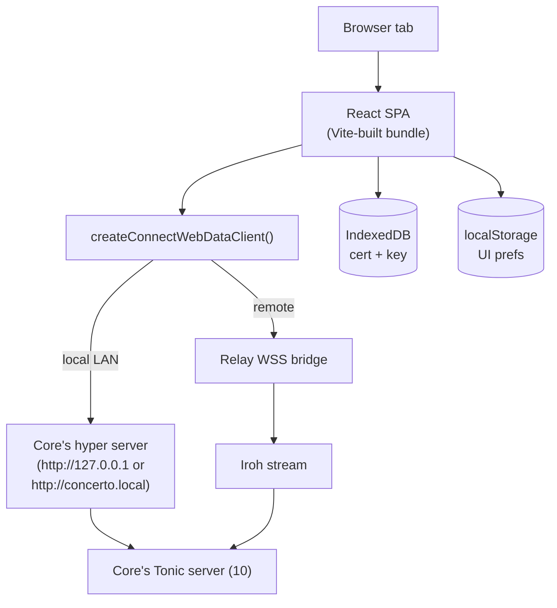
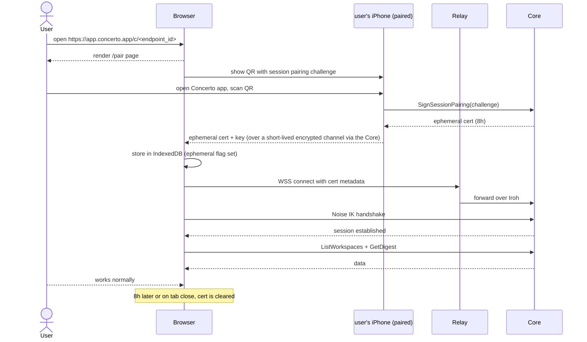

# 17 — Web Client

*Sub-system design doc. Inherits locked decisions from `00_Architecture_Overview.md` §6.6 (Connect-Web with HTTP/SSE fallback, V1.0 not Iroh-in-browser) + §6.8 (same React tree as Desktop). PRD §8.5 + §15.3 define the product surface.*

> **Amendment (2026-06-14 — Phase-5 planning reconciliation).** Reconciles this doc with built reality + the Phase-5 plan (`tasks/v1.0/PHASE5_PLANNING.md §1`). These bullets govern where they conflict with the prose.
> - **TS proto codegen is net-new (D10):** there is no TypeScript codegen today (Desktop hand-mirrors the protos). Task 507.5 stands up the repo's first codegen — **buf + `@connectrpc/connect-web` + `@bufbuild/protobuf`** (the §3.2 named choice) — using **gRPC-Web binary framing** to the bridge (avoids the prost-serde snake_case vs connect-es camelCase JSON mismatch). The "shared package extraction" the prose assumes is therefore *foundational*, not a move.
> - **Package boundary (D11):** `@concerto/client` (generated proto types + the `DataClient` interface + `createTauriDataClient`) is shared by desktop + web + mobile; `@concerto/ui` (the extracted React-DOM renderer) is reused by desktop + web only. The `DataClient` adapter pattern (§3.1) is real but currently unbuilt — Task 507.5 defines it and refactors Desktop's `client.ts` onto it.
> - **Connect-Web bridge posture (D15):** the bridge (`crates/core/src/connect_bridge.rs`) is built and live but **default-OFF** (`CONCERTO_CONNECT_BRIDGE`) and currently **auth-less + TLS-less**. It is never exposed on a non-loopback interface until Task 521 adds LAN-direct TLS pinned to the Core identity and Task 522 adds ephemeral session-cert auth (gated by 210's auth middleware). Loopback-only until then.
> - **Ephemeral pairing double (D... §2):** Task 522's Tier-2 path uses a **stub-phone signer** for the 8h `web_ephemeral` session cert; the real phone-mediated flow (mobile 511 signs for the browser) is Tier-3. So 522 completes in the web track ahead of mobile.

---

## 1. Purpose & scope

The Web Client is **a borrowed-laptop and Linux-primary surface** that ships the same React SPA as Desktop but over a browser-compatible transport.

Two scenarios (PRD §8.5):

1. **Borrowed machine.** A coworker's laptop, hotel business center, iPad in browser mode. Open a URL, pair via QR-scanned-from-phone, get a session that ends when the tab closes.
2. **Linux desktop.** The Desktop app (15) ships on macOS and Windows only; Linux users use the Web Client as their primary client (loaded against a local Core via mDNS/loopback or a remote Core via the WSS bridge). Anyone who simply prefers the browser uses this surface too.

It owns:

- **Same React SPA as Desktop** (~80% component reuse).
- **Connect-Web transport** — replaces Desktop's Tauri-command bridge.
- **Two routing paths** — LAN-direct (Core serves on `http://127.0.0.1:<port>` when on the same Wi-Fi as mDNS resolution succeeds) or WSS-through-relay (when remote).
- **Ephemeral pairing** — QR scan from an already-paired phone authorizes the web session without provisioning a new device.
- **In-browser key storage** — IndexedDB for pairing key + cert (with one-shot session option).
- **Differences from Desktop** — no Tauri shell features (tray, native menus, file dialogs, IDE launch, deep links to OS).

It does **not** own: standalone pairing flow (uses phone-mediated ephemeral pairing); persistent state (it's a stateless renderer); native push (browsers receive in-app updates only, not OS push in V1.0).

**Source vs. hosted bundle** (locked in `00 §6.11`, with the trust-model implication called out in `18 §3.8`): the web client source is **MIT**. When a user reaches the web client via:

- **LAN-direct** (`http://127.0.0.1:<port>` served by their local Core), the JS bundle comes from their own Core binary — no Concerto Inc surface touches it.
- **Remote via WSS bridge** through `relay.concerto.app`, the JS bundle is served by Concerto Inc's relay deployment. This means Concerto Inc has the *technical ability* to modify what JS the browser runs. Mitigations: pinned Subresource Integrity hashes, signed releases gated on the same key as desktop updates, and (V2.0) reproducible-build attestations so the served bundle can be verified against a tagged release. Enterprises with strict supply-chain requirements should self-host the relay; the same MIT relay binary serves the same MIT web bundle from their own infrastructure.

The web bundle has no Concerto-Inc-specific code path — it's the same React tree as Desktop with a Connect-Web transport adapter (`§3.1`). Self-hosters serving their own web bundle have full parity.

**Relation to split-host Desktop (`15`):** Both Web and a split-host Desktop reach a Core that isn't on the local machine, both consume the same `10` schema, and both render the same React tree. The Web client takes the lossy compromises (no native menus, no tray, browser-sandboxed file I/O, ephemeral pairing for borrowed machines) that the Desktop avoids by owning a Tauri shell. If a Mac or Windows user wants a persistent remote-Core experience, they install the Desktop in split-host mode (`15 §3.10`); Linux users (no native Desktop build) and anyone on a borrowed machine use the Web client.

---

## 2. Phase scope

| Phase | What ships |
|---|---|
| **V0.1** | (not in V0.1) |
| **V1.0** | All surfaces except: native menus, OS deep links, IDE launch, tray, OS push. Pairing via QR-scan-from-phone. Connect-Web with HTTP/SSE fallback. LAN-direct on loopback when available; WSS-bridge-via-relay otherwise. Ephemeral session option. |
| **V1.5** | + Iroh-in-browser via WebTransport (when browser support is mature). Removes the WSS bridge dependency for capable browsers. + WebPush in-browser notifications (Chrome/Edge). |
| **V2.0** | + service worker for offline-cached view of recent state. + organization SSO option (for Concerto Cloud V2.0 only). |

---

## 3. Key design decisions (sub-system-internal)

### 3.1 Same SPA — different transport adapter

**Choice:** The React app is **literally the same source** as Desktop. The difference is at the data-layer entrypoint:

```ts
// shared/dataClient.ts
export function createDataClient(): DataClient {
  if (window.__CONCERTO_DESKTOP__) return createTauriDataClient();
  return createConnectWebDataClient();
}
```

Both implementations satisfy the same `DataClient` interface — `rpc(method, payload)` and `subscribe(subject, filter, callback)`. Components above the data client are unaware.

This means 80%+ component sharing is structural, not coincidental.

### 3.2 Connect-Web for RPC; SSE fallback for streams

**Choice:** `@connectrpc/connect-web` (the Connect framework's TS client) targeting our `concerto.v1` protos. Same `.proto` definitions, same generated TypeScript. Browser features:

- Unary RPCs over HTTP/2 (or HTTP/1.1 fallback).
- **Server-streaming** over HTTP/2 (or chunked HTTP/1.1).
- **Client-streaming** is not supported by Connect-Web; we never use it (per `10 §3.2`).
- Bidirectional streaming — not needed; we use periodic unary `AckOffset` (10 §3.2).

If the connection traverses HTTP middleboxes that buffer responses (rare but possible on corporate networks), Connect-Web falls back to **Server-Sent Events** for streams — a known robust pattern.

### 3.3 LAN-direct path

When the user opens `http://concerto.local:<port>` (mDNS-resolved) or `http://127.0.0.1:<port>` (when on the Core machine's localhost), the Core serves the SPA + Connect-Web HTTP endpoint directly:

- A small `hyper` server bound to loopback + LAN-link-local interfaces, port chosen from a configurable range.
- TLS termination via a self-signed cert pinned in the Core's identity (`12 §3.1`). The user accepts the cert on first visit; subsequent visits trust it via the browser's exception store.
- Connect-Web speaks directly; no relay.

### 3.4 Remote path: WSS through the relay

When the URL is `https://relay.concerto.app/c/<endpoint_id>` (remote scenario):

- The browser opens a WSS connection to the relay.
- The relay opens an Iroh stream to the Core.
- Inside the WSS frame, the browser performs a Noise IK handshake using the ephemeral session pairing key (§3.5).
- gRPC frames flow inside the Noise tunnel inside the WSS connection.

The relay sees ciphertext only — it's a dumb byte-forwarder for this path.

### 3.5 Pairing via phone — ephemeral by default

**The Web Client never provisions a permanent device cert by default.** Reason: a coworker's laptop, a hotel kiosk — these aren't places to leave a long-lived cert.

Flow:

1. User opens the Web Client URL.
2. UI shows: "Scan this QR with your phone (Concerto app)."
3. The phone (already paired with the Core) signs a **session pairing token** specific to this browser session.
4. The browser receives the session pairing token, performs Noise IK to the Core, gets back a **session-scoped device cert** with `expires_at = now + 8h` and `device_kind = "web_ephemeral"`.
5. Cert + key stored in IndexedDB.
6. On tab close (or explicit logout), IndexedDB cleared.

For users who want persistence ("my home Linux box browser") — opt-in toggle "Remember this browser" promotes the cert to a normal (long-lived) device cert with the user's chosen name.

The Web Client never displays a Core's QR for pairing a brand-new device — that capability is owned by the tray (PRD §18.13). Web pairs through an already-paired device.

### 3.6 No tray, no native menus, no IDE launch

Features intentionally missing from Web vs Desktop:

| Feature | Web equivalent |
|---|---|
| System tray | None — Web is foregrounded by definition |
| Native menus | In-app menu bar at top |
| File dialogs | Standard `<input type=file>` for the rare cases (mostly for managed-settings upload) |
| IDE launch (`code .`, etc.) | "Copy path" button + instructions |
| Concerto deep links (concerto://) | URL routing: `/workspace/:id`, `/workarea/:id`, `/session/:id`, `/diff/:workarea_id/:repository_id?file=...` |
| OS notifications | In-app toasts + browser-tab title flash. (WebPush in V1.5 for capable browsers.) |
| Auto-update | n/a — refresh the tab. Vite output is content-hashed; browser caches correctly. |

### 3.7 Key storage in IndexedDB

The device private key and cert live in IndexedDB. **They never enter `localStorage`** (less secure; readable by XSS via vulnerable scripts). The data-client module is the only code with access to them — we route through it.

For ephemeral sessions: a flag set in the pairing token marks the entry; on tab close, an `unload` handler clears it. (Best-effort — `unload` isn't guaranteed.)

For "remember this browser": the same entries are flagged permanent and survive across sessions until the user clicks Sign Out.

### 3.8 Subscription multiplexer (same pattern as Desktop)

A single subscription multiplexer maintains streams; React Query hooks subscribe to subjects of interest. Reconnect with `since_offset` (10 §3.3) on transient drops.

The Web Client's reconnect tolerance is more generous than Desktop's — browsers throttle background tabs aggressively, so reconnect-and-replay-last-N-events is the normal mode after a tab regains focus.

### 3.9 No Iroh in browser for V1.0

**Locked.** The Iroh team is working on browser-side QUIC via WebTransport. As of V1.0 the support is not mature enough. V1.5 revisits.

The WSS bridge is the explicit V1.0 compromise; the security story is intact because Noise IK still runs inside the WSS connection.

### 3.10 Service worker — V2.0 only

The Web Client does **not** register a service worker in V1.0. Reasons:
- Adds caching complexity that competes with the server-canonical model.
- The Tab is the working unit; we don't need offline.
- Service workers are a future stretch for offline read-of-recent-state (V2.0).

---

## 4. Data model

Even more stateless than Desktop:

| Storage | What |
|---|---|
| **IndexedDB** | Device private key, signed cert, Core pubkey, Core endpoint metadata |
| **`localStorage`** | UI ephemera (sidebar width, theme) |
| **`sessionStorage`** | Per-tab transient |
| In-memory | All RPCs / subscriptions |

No `IndexedDB` write of business data; no service worker cache.

---

## 5. Interfaces

### 5.1 Same gRPC client as Desktop's renderer

The TypeScript Connect-Web client generated from the `concerto.v1` proto schema. The same client; the difference is the transport (HTTP/SSE vs Tauri's command bridge).

### 5.2 Web-specific entry routes

```
/                             → Maestro chat (mobile-parity default? on web: workspace list)
/workspace/:id                → Workspace summary view (list of workareas)
/workarea/:id                 → Workarea detail (sessions + Code & PRs panel; same layout as Desktop §3.4)
/session/:id                  → Workarea detail focused on a specific session
/diff/:workarea_id/:repo_id   → Workarea Code & PRs panel pre-focused on repo's Diff tab
/workspace/:id/diff           → Diff tab
/workspace/:id/checks         → Checks tab
/sessions/:id                 → Session detail
/pair                         → Ephemeral pairing flow
/sign-in                      → Persistent pairing promotion
/settings                     → Settings (subset — see below)
/diagnostics                  → Diagnostics (read-only)
```

Settings on Web are a subset: no IDE preferences, no auto-update settings.

---

## 6. Internal architecture



### 6.1 Bundle delivery

Two scenarios:

1. **LAN-direct:** the Core serves the bundle from disk (Vite output mounted at the hyper server's root). Content-hashed assets cached by the browser.
2. **Remote / borrowed laptop:** the bundle is served from a static asset URL on `https://app.concerto.app` (CDN-fronted, signed). The pairing flow then connects to the user's Core via the relay.

In both, the SPA loads → reads cert from IndexedDB → routes to either pair-flow or app-flow.

### 6.2 Transport selection

The data client probes:

1. Is the URL `http://*.local` or `http://127.0.0.1:*`? → LAN-direct (Connect-Web over HTTP/2).
2. Otherwise → WSS over relay.

The user can force LAN if mDNS isn't resolving (`?force=lan&endpoint=...` query) — useful for IT-restricted environments where mDNS is blocked but the user can type the Core's hostname.

### 6.3 Pairing pages

Two distinct pages:

- **`/pair`** (ephemeral) — the default after a clean visit. Shows a code or QR that the user scans **with their phone**. The phone then signs the session pairing token and sends back via a small POST to the Core (over its already-paired channel).
- **`/sign-in`** (promote) — after ephemeral, the user can opt to upgrade their cert to long-lived. Same UI as Desktop's pairing experience but using the already-active session as the auth source.

### 6.4 Page lifecycle

1. SPA loads.
2. Reads IndexedDB cert.
3. If absent: route to `/pair`.
4. If present + expired: route to `/pair`.
5. If present + valid: open data session; route to last URL.
6. Subscription multiplexer starts.
7. React Query hydrates from RPCs.

---

## 7. Sequence diagrams — hot paths

### 7.1 Ephemeral session from a borrowed laptop



### 7.2 LAN-direct on user's own machine

```mermaid
sequenceDiagram
    actor User
    participant Browser
    participant mDNS as mDNS
    participant Core
    User->>Browser: navigate to http://concerto.local
    Browser->>mDNS: resolve concerto.local
    mDNS-->>Browser: 192.168.x.y
    Browser->>Core: Connect-Web over HTTP/2 to that IP
    Core->>Core: peer-uid check fails (it's a different process)
    Note over Core: For Web, peer-uid isn't valid; expects cert
    Core-->>Browser: 401 → redirect to /pair
    Browser->>Browser: read IndexedDB cert (if present)
    alt cert present
        Browser->>Core: retry with cert metadata
        Core-->>Browser: ok
    else cert absent
        Browser->>Browser: route to /pair via phone
    end
```

### 7.3 Tab regains focus — stream replay

```mermaid
sequenceDiagram
    participant Browser
    participant Core
    Note over Browser: tab backgrounded; browser throttled streams<br/>(may have killed long-lived HTTP/2 connection)
    Browser-->>Browser: visibility change → foreground
    Browser->>Core: AckOffset(last seen offsets)
    Browser->>Core: re-Subscribe(subject, since_offset=N)
    Core-->>Browser: replay events past N
    Browser->>Browser: live again
```

---

## 8. Error handling & failure modes

| Failure | Detection | Response |
|---|---|---|
| Self-signed TLS warning on LAN-direct | Browser native | UI guides user to accept the cert once; pin via "remember this site" |
| WSS connection drops | onclose | Reconnect with backoff; replay via offset |
| Cert expired during a session | 401 from Core | Route to /pair; preserve current URL for post-pair return |
| IndexedDB blocked (private browsing) | save() throws | Session-only mode; warn user |
| mDNS not resolving | Hostname lookup fails | Show "Concerto Core not found on LAN; use the remote URL or type your Core's hostname manually" |
| Different Concerto Core public key than expected | Cert validation | Show clear "Core identity mismatch" page; do not silently accept |
| Phone refuses session-pairing | Phone-side ux | Web shows "Pairing declined or timed out; retry" |
| Bundle outdated (deployed update); old SPA tries new Core | Schema-incompat unlikely (additive); but possible | The server-capabilities call surfaces incompat; UI suggests refresh |
| Browser throttling background tab | visibilitychange | On foreground, force-reconnect; replay |
| IDB quota exceeded | save throws | Fall back to sessionStorage with warning |
| Cross-origin attempt to read cert | Same-origin policy | Cert can only be read from `app.concerto.app` or the Core's LAN origin; bookmarks honor this |
| Browser refuses self-signed cert in strict mode (e.g., HSTS preload) | Hard failure | Document: user must use the relayed remote URL on that browser |

---

## 9. Dependencies on other sub-systems

| Sub-system | How |
|---|---|
| **10 Local API** | All RPCs |
| **11 Transport** | WSS bridge (remote), LAN-direct (Core's hyper server) |
| **12 Security** | Ephemeral cert issuance; phone-signed session pairing |
| **All others** | Indirect via the gRPC API |

The Web Client is the **simplest** client because so much state is server-canonical and so many features (tray, native push, IDE launch) are explicitly absent.

---

## 10. Testing strategy

| Layer | What | How |
|---|---|---|
| Unit | Connect-Web data client | Vitest with mocked Connect transport |
| Unit | Pairing-flow state machine | Vitest |
| Integration | Real LAN-direct round-trip | Playwright against `concerto-core` |
| Integration | WSS-bridge round-trip through a stub relay | Playwright |
| Integration | Phone-mediated pairing (with stub phone) | Playwright |
| E2E | Borrow-laptop full flow (open URL → pair via stub phone → see workspace → action a chip) | Playwright |
| Cross-browser | Chrome, Firefox, Safari, Edge | Playwright matrix |
| Mobile-Safari (iPad) | Touch interactions still work | Per-PR Playwright |
| Performance | Time-to-interactive < 2s on broadband | Lighthouse-style budget |
| Tab-throttle resilience | Background, then foreground; assert state catches up | Manual + Playwright |

---

## 11. Open questions / deferred

*All items resolved. See **§12 Resolved decisions log** below.*

## 12. Resolved decisions log

| # | Question | Decision | Where in doc |
|---|---|---|---|
| R-1 | LAN-direct TLS UX (self-signed cert friction) | **V1.5** — optional `mkcert`-style local CA from the Tray with one-click "trust." V1.0 user manually accepts cert. | §3.3 |
| R-2 | WebPush for tab-closed notifications | **V1.5** — Chrome/Edge first. | (V1.5) |
| R-3 | Iroh-in-browser via WebTransport | **V1.5** — drops WSS bridge for capable browsers. (Cross-ref `11 R-4`.) | §3.9 |
| R-4 | Service worker offline cache | **V2.0** — read-only "last online state." | (V2.0) |
| R-5 | Anonymous read-only spectate (screen sharing) | **V2.0** — paired with spectator role in `12`. | (V2.0) |
| R-6 | SSO for Concerto Cloud | **V2.0** — only relevant for hosted-Core tier. | (V2.0) |
| R-7 | Ephemeral-session banner | **Yes — non-dismissible at top of screen** showing "Temporary session, expires in Xh." Reduces "forgot to log out" risk. | §3.5 |
| R-8 | iPad Safari UX optimizations | **V1.5.** | (V1.5) |
| R-9 | Concurrent web sessions from same browser | **Allowed** — each tab is its own session for ephemeral certs; promoted certs are shared via IndexedDB. | §3.7 |
| R-10 | Browser print / export of a workspace summary | **V2.0** — for compliance archives. | (V2.0) |

---

*End of `17_Web_Client.md`. The Web Client closes the doc set. It is intentionally the lightest of the three clients — most of the work is the shared React tree owned by `15_Desktop_Client.md`.*
