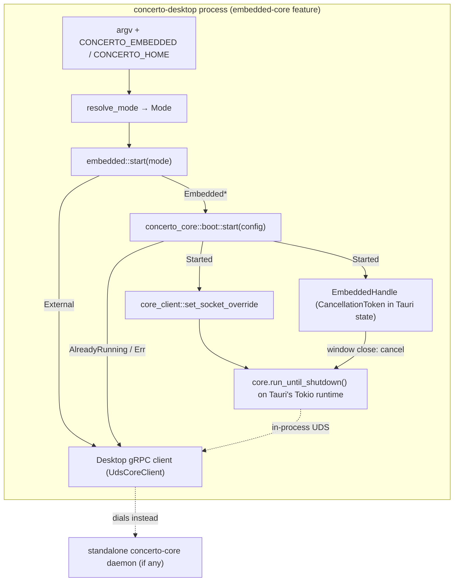
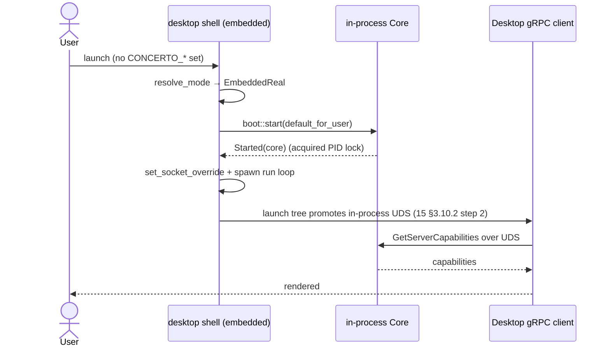
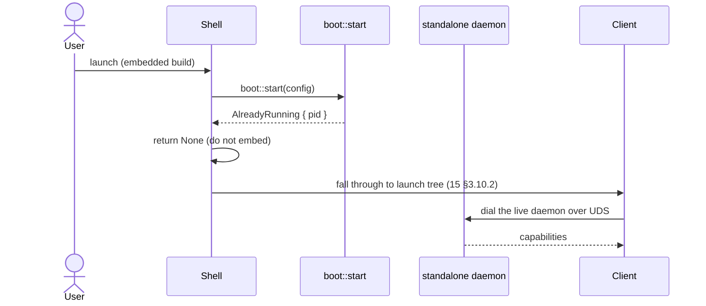

# 19 — Embedded-Core Mode

*Sub-system design doc. Inherits locked decisions from `00_Architecture_Overview.md` §5.3 (process types), §6.1 (Rust + Tokio), and `01_Core_Daemon_Runtime.md` §3.3 (PID single-instance guard). Embedded-Core is a **packaging mode** of the existing Core and Desktop sub-systems (01 + 15), not a new sub-system — it adds no new RPC surface, schema, or actor; it only changes where the Core process lives.*

---

## 1. Purpose & scope

Embedded-Core mode lets `concerto-core` boot **in-process inside the Desktop** (`concerto-desktop`) rather than as a separate OS daemon. It exists for one case: a **zero-daemon, single-user, local install** — the user launches the Desktop app and gets a fully working Core without launchd / systemd / a Windows Service ever installing a long-lived background process.

It is compiled behind the `embedded-core` Cargo feature on the `concerto-desktop` crate. The feature is off in the lean daemon-client build (which links **no** Core code) and on in the dev loop and in the standalone "Concerto Embedded" bundle.

It owns:

- **The launch-mode decision** — `EmbeddedReal` / `EmbeddedScratch` / `External` and how `resolve_mode` picks among them from the environment.
- **The in-process boot path** — building a `RuntimeConfig`, creating data/config dirs, calling Core's `boot::start`, installing the client socket override, and spawning Core's run-until-shutdown loop.
- **The coexistence guard** — using Core's PID single-instance lock to detect an already-running daemon and fall back to dialing it.
- **Teardown** — an `EmbeddedHandle` whose `CancellationToken` shuts Core down when the Desktop window closes.

It explicitly does **not** own: any of Core's business logic (that's 01–14, run unchanged in-process); the daemon-client transport selection / pairing flow (15 §3.2, §3.10); the agent-host binary resolution (`04 §3.9` / Task 106 — embedded mode only consumes it). Embedded mode is single-user and local only — there is **no** multi-user or remote-host embedded variant (see §3.5).

**Source vs. published builds** (per `18 §3.1`): the embedded variant is the *same MIT code* — it just links `concerto-core` (MIT) into `concerto-desktop` (MIT). It introduces no new binary, license, or operated service. The standalone "Concerto Embedded" bundle is functionally a Desktop + Core in one app, still all-MIT, self-buildable, with no license check or phone-home (`01 §1`).

---

## 2. Phase scope

| Phase | What ships |
|---|---|
| **V0.1** | (not in V0.1 — added manually after V0.1 as an undocumented divergence; this doc retrofits it). |
| **V1.0** | First-class, documented mode. `embedded-core` Cargo feature on `concerto-desktop`. `EmbeddedReal` / `EmbeddedScratch` / `External` modes via `resolve_mode`. In-process boot on Tauri's Tokio runtime. PID-lock coexistence guard + `AlreadyRunning` → dial-the-daemon fallback. Window-close teardown via `EmbeddedHandle`. Dev loop (`make dev-embedded` / `dev-embedded-scratch`), headless smoke gate (`make smoke-embedded`), standalone bundle (`make build-embedded`). |
| **V2.0** | (no embedded-specific V2.0 work planned. A dedicated Core runtime — see §3.4 — would be the most likely follow-up if Core's in-process workload grows; remote/multi-tenant remains daemon-only per §3.5.) |

---

## 3. Key design decisions (sub-system-internal)

### 3.1 Three launch modes, resolved from the environment

The shell resolves one of three modes at launch. The mode determines whether Core boots in-process and against which data root:

| Mode | Meaning | Data root |
|---|---|---|
| **`EmbeddedReal`** | Boot Core in-process against the real user data. | `~/concerto` (data) + `~/.concerto` (config), via `RuntimeConfig::default_for_user()`. |
| **`EmbeddedScratch { home }`** | Boot Core in-process against an isolated scratch root (throwaway / test). | `<home>` for data, `<home>/.concerto` for config (mirrors the smoke-gate convention). |
| **`External`** | Do **not** embed; dial an externally running daemon. | n/a — behaves like the lean daemon-client build. |

This keeps a single binary that can be a self-contained app (`EmbeddedReal`), an isolated test harness (`EmbeddedScratch`), or a thin client of a separate daemon (`External`) depending only on how it's launched.

### 3.2 `resolve_mode`: precedence and the deliberate fall-throughs

`resolve_mode(args, CONCERTO_EMBEDDED, CONCERTO_HOME)` applies this precedence (highest first):

1. **`--external` flag or `CONCERTO_EMBEDDED=0`** → `External`. Explicit opt-out wins over everything.
2. **A non-empty `CONCERTO_HOME`** → `EmbeddedScratch { home }`. An explicit scratch root implies scratch mode.
3. **`--embedded-scratch` flag *without* a `CONCERTO_HOME`** → falls through to `EmbeddedReal`. This is deliberate: rather than invent a surprise temp location, the caller is expected to also set `CONCERTO_HOME`. No error is raised — the flag alone is a no-op. (The `make dev-embedded-scratch` target supplies a `mktemp` `CONCERTO_HOME`, so the flag and the var always travel together in practice.)
4. **Otherwise (including `CONCERTO_EMBEDDED=1`)** → `EmbeddedReal`. Embedded-against-real-data is the default.

> Note the asymmetry, which is intentional: `CONCERTO_HOME` alone is sufficient to select scratch mode; `--embedded-scratch` alone is **not** (it needs the var). The data root is the load-bearing input.

### 3.3 PID-lock coexistence guard + `AlreadyRunning` fallback

Embedded Core does not get a special "am I allowed to run" check of its own — it reuses Core's existing **PID single-instance lock** (`01 §3.3`: an advisory lock on `<config_dir>/core.pid`). This is what makes embedded mode safe to ship alongside the standalone daemon:

- The shell creates the data/config dirs (Core's persistence + PID lock require them), then calls `boot::start(config)`.
- **`Started(core)`** — Core acquired the lock and booted. The shell installs the client socket override (so the Desktop's own gRPC client dials the in-process Core's UDS), spawns `core.run_until_shutdown()` on the current Tokio runtime, and returns an `EmbeddedHandle`.
- **`AlreadyRunning { pid }`** — a standalone daemon already holds the lock. The shell logs it and **does not embed**; it returns `None` so the launch flow falls through to dialing the live daemon (`15 §3.10.2`, step 1). The running daemon wins; embedded mode steps aside.
- **Boot error** — same `None` result: fall back to the normal daemon-client launch tree.

So the guard is "first to hold the PID lock owns the Core," and an embedded launch is strictly additive — it never races or fights an existing daemon. In real-data dev (`make dev-embedded`) the script even warns if `~/.concerto/core.pid` exists, suggesting `make stop-core` first so embedded-real boots in-process instead of silently dialing the daemon.

Teardown: the `EmbeddedHandle` carries Core's `shutdown` `CancellationToken`. The window-close path cancels it; Core's run loop stops and `Runtime::stop` drops the `PidFile`, so the PID lock vanishes (the smoke test asserts exactly this — the lock exists while Core runs, then disappears after cancel).

### 3.4 Shared Tokio runtime — known V1.0 tradeoff, with an upgrade path

**Decision:** embedded Core's run loop and supervised actors run on **Tauri's global Tokio runtime** (via `tokio::spawn` on the current runtime) — the same runtime that drives the IPC/command machinery — rather than on a dedicated, isolated runtime.

This is a deliberate V1.0 simplification, **not** a defect:

- For a single in-process Core serving one local user, one shared multi-threaded runtime is fine — the work is modest and co-scheduling it with the UI's IPC has no measurable cost at this scale.
- It avoids the complexity of standing up and lifecycling a second runtime inside the Tauri process and bridging handles across it.

**Upgrade path (when a dedicated runtime would be warranted):** if Core's in-process workload grows — many concurrent agent sessions, heavy git/persistence work starving the UI's IPC, or a need to bound Core's thread pool independently of Tauri's — embedded Core should move to its own `tokio::runtime::Runtime` with a dedicated thread pool, with `EmbeddedHandle` owning that runtime so teardown joins it cleanly. Until that pressure is real, the shared runtime stays. (The `embedded.rs` header records this tradeoff at the source.)

### 3.5 Relationship to split-host / remote — embedded is local-only

Embedded mode and split-host/remote mode (`15 §3.10`, `11`) are orthogonal, and the boundary is explicit:

- **Embedded is local-only.** It serves the Core to the *same* Desktop process it lives in, over the in-process UDS. There is no embedded-over-the-network mode and no multi-user embedded mode.
- **Remote always implies a reachable, separate Core.** A Desktop dialing a Core over Iroh (split-host) is by definition *not* embedding — that's `External` from the launch tree's perspective (the Core is another process, possibly on another machine).
- **But an embedded Core can still be paired *to*.** An embedded Core is a normal Core: it binds the same UDS and can run the same Iroh transport (`11`), so other devices (a phone, a second laptop) can pair to it and reach it over Iroh exactly as they would a daemon Core. "Embedded" describes how *this* Desktop hosts *its* Core, not a limit on who else may connect.

In short: embedded changes the **process topology on one machine** (`00 §5.3`), not the transport or identity model. Multi-tenant / remote-host (`01` V2.0) remains daemon-only — it is not an embedded concern.

### 3.6 Packaging — feature-flagged; the lean build links no Core

The `embedded-core` Cargo feature gates the entire mode:

```toml
# apps/desktop/src-tauri/Cargo.toml
[features]
embedded-core = ["dep:concerto-core", "dep:tokio-util"]

# both deps are optional and linked only when the feature is on
concerto-core = { path = "../../../crates/core", optional = true }
tokio-util    = { workspace = true, optional = true }   # the EmbeddedHandle's CancellationToken
```

- **Lean (default) build** — feature off. `concerto-core` and its (large) transitive dependency tree are **not** linked; the Desktop is a pure daemon client (`15`). This keeps the production daemon-client binary small and Core-free.
- **Embedded build** — feature on. Core is linked in; the binary can boot Core in-process.
- **Standalone "Concerto Embedded" bundle** — `make build-embedded` builds with the feature *and* a config overlay (`tauri.embedded.conf.json`) that sets a distinct `productName` ("Concerto Embedded") and `identifier` (`app.concerto.desktop.embedded`) so it installs **alongside** the normal app rather than replacing it. Unsigned by default (self-buildable).

License: still **all-MIT** (`18 §3.1`). Linking `concerto-core` (MIT) into `concerto-desktop` (MIT) introduces no new license boundary, no operated service, and no new entry in the OSS-vs-operated table.

---

## 4. Data model

Embedded mode holds **no new persistent state**. It reuses Core's existing on-disk layout under the resolved `RuntimeConfig`:

| Mode | `data_dir` | `config_dir` | PID lock |
|---|---|---|---|
| `EmbeddedReal` | `~/concerto` | `~/.concerto` | `~/.concerto/core.pid` |
| `EmbeddedScratch { home }` | `<home>` | `<home>/.concerto` | `<home>/.concerto/core.pid` |

The only in-memory state the mode adds is the `EmbeddedHandle { shutdown: CancellationToken }`, stored in Tauri state so the window-close path can tear Core down. It exists only when Core was actually booted in-process (i.e., not in `External` mode and not after an `AlreadyRunning` fallback).

---

## 5. Interfaces

Embedded mode exposes **no new gRPC surface** and no new Tauri commands — the Desktop's existing client (`15 §3.2`, §5) talks to the in-process Core over the same UDS it would use for a co-located daemon. The mode's internal Rust surface (in `apps/desktop/src-tauri/src/embedded.rs`, compiled under `embedded-core`):

```rust
pub enum Mode { EmbeddedReal, EmbeddedScratch { home: PathBuf }, External }

/// Resolve the launch mode from args + CONCERTO_EMBEDDED + CONCERTO_HOME (§3.2).
pub fn resolve_mode(args: &[String], env_embedded: Option<&str>, env_home: Option<&str>) -> Mode;

/// RuntimeConfig for a scratch home: <home> data, <home>/.concerto config.
pub fn scratch_config(home: &Path) -> RuntimeConfig;

/// Boot Core for the resolved mode. Installs the client socket override and
/// spawns the run-until-shutdown loop on success. Returns None for External,
/// for the AlreadyRunning fallback, or on boot error (§3.3).
pub async fn start(mode: Mode) -> Option<EmbeddedHandle>;

pub struct EmbeddedHandle { pub shutdown: CancellationToken }
```

The handoff into Core uses Core's own public boot API (`concerto_core::boot::{start, BootOutcome}` and `concerto_core::runtime::RuntimeConfig`); embedded mode is purely a caller of it.

---

## 6. Internal architecture



### 6.1 Boot sequence (embedded path)

1. Resolve the mode (`resolve_mode`). `External` → return `None`, fall to the daemon-client launch tree (`15 §3.10.2`, step 1).
2. Build the `RuntimeConfig` (`default_for_user()` for real, `scratch_config(home)` for scratch).
3. `create_dir_all` the data and config dirs (Core's persistence + PID lock need them).
4. `boot::start(config)`:
   - `Started(core)` → `set_socket_override(core.socket_path())`, `tokio::spawn(core.run_until_shutdown())`, return `Some(EmbeddedHandle { shutdown: core.shutdown_token() })`.
   - `AlreadyRunning { pid }` → log, return `None` (a daemon holds the lock; dial it).
   - `Err(e)` → log, return `None` (fall back to external).
5. On window close: cancel the handle's token; Core stops and releases its PID lock.

The shell then continues into the existing launch tree (`15 §3.10.2`): with an embedded Core booted, the in-process UDS is promoted exactly like a co-located daemon (step 2), so no auto-spawn (step 3) is needed.

---

## 7. Sequence diagrams — hot paths

### 7.1 Embedded-real launch with no daemon running (the common case)



### 7.2 Embedded launch when a daemon already holds the lock



---

## 8. Error handling & failure modes

| Failure | Detection | Response |
|---|---|---|
| Standalone daemon already running | `boot::start` → `AlreadyRunning { pid }` | Don't embed; fall through and dial the daemon (`15 §3.10.2`). Dev script also warns pre-launch if `core.pid` exists. |
| `RuntimeConfig::default_for_user()` fails (no `$HOME` etc.) | `Err` from config resolution | Log; return `None`; fall back to external launch. |
| Cannot create data/config dir | `create_dir_all` error | Log the dir + error; return `None`; fall back to external. |
| Core boot error | `boot::start` → `Err` | Log; return `None`; fall back to external (the Desktop is still usable as a daemon client). |
| `--embedded-scratch` without `CONCERTO_HOME` | (not an error) | Falls through to `EmbeddedReal` — no surprise temp location. |
| Window closed while Core runs | window-close handler | Cancel the `EmbeddedHandle` token; Core stops and releases the PID lock. |

The throughline: **every embedded failure degrades gracefully to the normal daemon-client launch tree.** Embedded mode never blocks the app from starting.

---

## 9. Dependencies on other sub-systems

| Sub-system | How |
|---|---|
| **01 Core Daemon Runtime** | Embeds the whole Core: supervision tree, `RuntimeConfig`, `boot::start`, and the PID single-instance lock (`01 §3.3`) used as the coexistence guard. |
| **15 Desktop Client** | The host process. Embedded mode adds step 0 to the launch tree (`15 §3.10.2`) and reuses the Desktop's gRPC client + socket override. |
| **04 Agent Supervisor** | The in-process Core spawns the `concerto-agent-host` helper the same way a daemon does; binary resolution is Task 106's domain (`CONCERTO_AGENT_HOST_BIN` → co-located → `target/<profile>` sibling), not embedded's. |
| **18 Distribution & Operations** | Feature-flagged packaging; still all-MIT, no new operated service (`18 §3.1`). |
| **11 Remote Transport** | Orthogonal — an embedded Core can still run Iroh and be paired *to* by other devices (§3.5). |

---

## 10. Testing strategy

| Layer | What | How |
|---|---|---|
| Unit | `resolve_mode` precedence (external / scratch / real / flag-without-home) | `cargo test` in `embedded.rs` |
| Unit | `scratch_config` splits `<home>` / `<home>/.concerto` | `cargo test` |
| Integration | In-process scratch boot + teardown (PID lock appears, then vanishes after cancel) | `embedded::tests::start_scratch_boots_and_shuts_down` (multi-thread tokio test) |
| Smoke (headless) | Build with `embedded-core`; Core `boot::start` round-trip; Desktop scratch boot + teardown | `scripts/smoke-embedded.sh` (`make smoke-embedded`) — no GUI launch |
| Operator (Phase-1 gate) | Read this doc against `make dev-embedded` / `make dev-embedded-scratch` / `--external` behavior on a Mac and confirm it matches | Manual Tier-3 sign-off |

`scripts/smoke-embedded.sh` is the headless gate: it builds the desktop binary with the feature, runs Core's `embedded_boot` round-trip test, then runs the Desktop's scratch boot+teardown test. The main CI smoke gate (`scripts/smoke.sh`) deliberately avoids the Tauri toolchain, so embedded mode has its own gate run locally / on demand.

**Dev loop.** `make dev-embedded` hot-reloads the frontend (Vite HMR), the `src-tauri` crate (Tauri's watcher), *and* `crates/core` + `crates/agent-host` (cargo-watch, which rebuilds the agent-host and restarts `tauri dev -f embedded-core` on a Core change). `make dev-embedded-scratch` is the same loop against a `mktemp` `CONCERTO_HOME` so it never touches `~/concerto`.

---

## 11. Open questions / deferred

| # | Question | Status |
|---|---|---|
| Q-1 | Dedicated Tokio runtime for embedded Core | **Deferred** — shared runtime is fine at V1.0 scale; revisit if Core's in-process workload grows (§3.4). |
| Q-2 | `--embedded-scratch` synthesizing its own temp `CONCERTO_HOME` | **Deferred by design** — the flag is a no-op without the var to avoid a surprise temp root (§3.2). The dev target supplies the var. |

---

*End of `19_Embedded_Core_Mode.md`. Packaging variant of `01_Core_Daemon_Runtime.md` (Core) hosted inside `15_Desktop_Client.md` (Desktop); see `00_Architecture_Overview.md` §5.3 for the process topology and `18_Distribution_and_Operations.md` §3.1 for the all-MIT boundary.*
